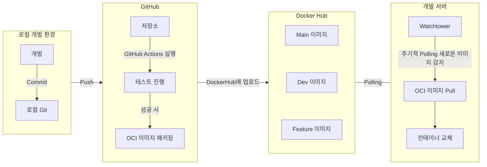

## 전체적인 CICD 파이프라인

개발 환경에서 GitHub Actions를 활용하여 손쉽게 CICD 파이프라인을 구축할 수 있다.

물론, self-hosted runner를 사용하면, 한번에 테스트와 배포를 진행할 수 있지만, 적당히 책임을 분산시켜서 운영해주는것이 좋다.

이 포스팅에서는 GitHub Actions를 활용하여 도커 이미지를 빌드하고, Docker Hub에 업로드한 후, Watchtower를 통해 개발 서버에 배포하는 방법을 설명한다.



## Docker Hub

도커 허브에 이미지를 업로드 하기 위해서 먼저 레포지토리를 생성해야 한다.

여기서는 [portfolio-server](https://hub.docker.com/r/cmsong111/portfolio-server)라는 이름으로 레포지토리를 생성했다.

## GitHub Actions

| 설정 위치 | Key | 설명 |example|
| --- | --- | --- |  --- |
|  Variable  | `DOCKER_USERNAME` | Docker Hub ID | `cmsong111` |
| Secrets  | `DOCKER_PASSWORD` | Docker Hub 토큰 | `dckr_pat_...` |

<script src="https://gist.github.com/cmsong111/ec85a7fe106ba6bbd98873f7d9351aba.js"></script>

## Dev Server

개발서버는 도커 환경의 온 프레미스 서버를 가정하고 작성했다.

```yaml
services:
  watchtower:
    image: containrrr/watchtower:latest
    container_name: watchtower
    restart: always
    volumes:
      - /var/run/docker.sock:/var/run/docker.sock
    environment:
      - WATCHTOWER_POLL_INTERVAL=30
      - WATCHTOWER_CLEANUP=true
```

```yaml
services:
  portfolio-server:
    image: cmsong111/portfolio-server:latest
    container_name: portfolio-server
    restart: always
    ports:
      - "8080:8080"
    environment:
      - SPRING_PROFILES_ACTIVE=dev
```

#### 새로운 이미지가 없을 떄
새로운 이미지가 없을 경우, 기존 컨테이너를 유지한다.
```zsh
time="2025-03-25T11:40:35+09:00" level=info msg="Session done" Failed=0 Scanned=11 Updated=1 notify=no
```

#### 새로운 이미지가 있을 때

새로운 이미지를 내려받은후, 해당 컨테이너를 삭제하고 새로운 컨테이너를 생성한다.

```zsh
time="2025-03-25T11:40:20+09:00" level=info msg="Found new portainer/portainer-ce:latest image (7f10a26bfdda)"
time="2025-03-25T11:40:33+09:00" level=info msg="Stopping /portainer (6e0de4c471ef) with SIGTERM"
time="2025-03-25T11:40:34+09:00" level=info msg="Creating /portainer"
time="2025-03-25T11:40:35+09:00" level=info msg="Removing image 60ce692bb8b5"
```


## Reference

