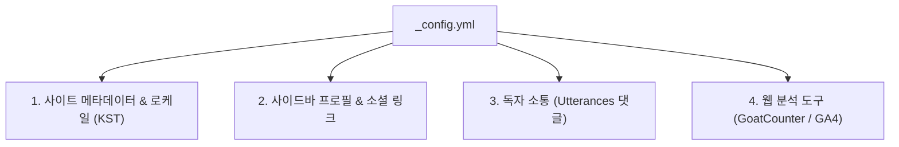

> Jekyll Chirpy 테마의 전체 동작과 브랜딩은 프로젝트 루트의 `_config.yml` 파일 하나로 제어됩니다. 블로그 개설 직후 반드시 진행해야 하는 사이트 기본 정보, 다국어/타임존, 댓글 위젯, 방문자 분석 도구 연동법을 정리합니다.

---

## 1. Chirpy 설정의 중심, `_config.yml`

Jekyll에서 `_config.yml`은 사이트 전역 변수(Global Variables)와 테마의 동작 옵션을 정의하는 가장 핵심적인 구성 파일입니다.

초기 스타터 템플릿의 `_config.yml`에는 수많은 주석과 옵션이 포함되어 있어 처음 접할 때 다소 막막할 수 있습니다. 

이번 글에서는 블로그를 온전히 '내 것'으로 만들기 위해 필요한 **4가지 핵심 영역(브랜딩, 다국어, 댓글, 통계)**에 집중하여 설정을 완성해 보겠습니다.



---

## 2. 블로그 기본 정보 및 다국어/타임존 설정

블로그의 제목과 소개 문구, 그리고 한국어 환경에 맞는 언어 코드 및 시간대를 지정합니다.

### 1) 다국어 및 한국 시간대 (KST) 지정
Chirpy는 다국어 사전(`_data/locales/`)을 내장하고 있어 `lang`을 변경하는 것만으로 버튼 텍스트, 날짜 표기, 읽기 시간 안내 등이 해당 언어로 자동 현지화됩니다:

```yaml
# _config.yml
lang: ko
timezone: Asia/Seoul
```

- `lang: ko`: 사이트의 기본 UI 언어를 한국어로 설정합니다.
- `timezone: Asia/Seoul`: 포스트 작성 일자(`date`)를 대한민국 표준시(KST, UTC+9) 기준으로 정확하게 계산합니다.

### 2) 사이트 브랜딩 정보
블로그의 타이틀과 한 줄 태그라인, 대표 설명을 정의합니다:

```yaml
# _config.yml
title: 남주의 커밋로그
tagline: 배운 것과 고민한 것을 기록하는 공간
description: >
  백엔드 엔지니어링, 아키텍처 고민, 그리고 오픈소스 블로그 운영 기록을 담는 기술 아카이브입니다.
url: "https://namju.kim" # 배포할 도메인 주소 (슬래시 제외)
```

---

## 3. 사이드바 프로필 및 소셜 링크 연동

Chirpy의 좌측 사이드바는 블로그의 첫인상을 결정짓는 중요한 요소입니다. 작성자 정보와 GitHub, LinkedIn 등 외부 채널을 연동합니다.

```yaml
# _config.yml
# 소셜 공유 및 메타데이터용 기본 작성자
author:
  name: 김남주
  twitter: # 트위터 핸들이 있다면 입력

# 사이드바 프로필 및 아바타 링크
social:
  name: 김남주
  email: cmsong111@naver.com
  links:
    - https://github.com/cmsong111       # 첫 번째 링크는 프로필 이름 클릭 시 이동할 URL
    - https://www.linkedin.com/in/kimnamju/
```

- 사이드바 아바타 이미지는 `_config.yml`의 `avatar: /assets/img/avatar.png` 설정을 통해 지정하거나, GitHub 프로필 이미지를 자동으로 연동할 수 있습니다.


위 설정을 적용하면 사이드바 하단에 GitHub 옥토캣 아이콘과 LinkedIn 아이콘이 활성화되며, 독자가 작성자의 다른 채널로 손쉽게 이동할 수 있게 됩니다.

---

## 4. 독자 소통을 위한 댓글 시스템 (Utterances 연동)

기술 블로그의 피드백과 질문을 주고받기 위해 댓글 시스템이 필수적입니다.

Chirpy는 Disqus, Giscus, Utterances 등 다양한 댓글 프로바이더를 기본 지원합니다. 이 중 **Utterances**는 다음과 같은 큰 장점이 있습니다:

- **가벼움과 무광고**: 불필요한 추적 스크립트나 광고가 일절 없습니다.
- **GitHub Issues 기반**: 댓글이 GitHub 저장소의 Issue로 등록되므로, 개발자에게 익숙한 마크다운과 알림 시스템을 그대로 활용할 수 있습니다.

### Step 1. Utterances GitHub App 설치
1. [Utterances GitHub App](https://github.com/apps/utterances) 페이지에 접속하여 `Install`을 클릭합니다.
2. 댓글이 저장될 블로그 저장소(Public 저장소여야 함)를 선택하여 권한을 승인합니다.

### Step 2. `_config.yml` 설정 추가
`comments` 블록의 provider를 `utterances`로 지정하고 저장소명을 입력합니다:

```yaml
# _config.yml
comments:
  provider: utterances # [disqus | giscus | utterances]
  utterances:
    repo: cmsong111/blog # [사용자ID/저장소명]
    issue_term: pathname # 게시글의 URL 경로를 Issue 제목으로 매핑
```

설정 후 게시글 하단으로 스크롤하면 GitHub 로그인 버튼과 함께 단정한 댓글 입력 창이 나타납니다.


---

## 5. 방문자 분석 및 통계 연동 (GoatCounter & GA4)

어떤 글이 독자들에게 가장 유익했는지, 유입 경로가 어떻게 되는지 파악하기 위해 웹 분석 도구를 연동합니다.

### 1) 프라이버시 친화적인 조회수 통계 (GoatCounter)
Chirpy는 쿠키 배너가 필요 없는 경량 웹 분석 서비스인 [GoatCounter](https://www.goatcounter.com/)를 기본 탑재하고 있습니다. 포스트 상단에 실시간 조회수(Pageviews)를 표시할 수 있는 유용한 도구입니다:

```yaml
# _config.yml
analytics:
  goatcounter:
    id: cmsong111 # GoatCounter 가입 시 생성한 계정 ID

pageviews:
  provider: goatcounter # 포스트 상단 조회수 표시 활성화
```

### 2) 상세 트래픽 분석 (Google Analytics 4)
보다 정밀한 사용자 유입 경로와 체류 시간을 확인하고 싶다면 구글 애널리틱스(GA4)를 함께 연동할 수 있습니다:

```yaml
# _config.yml
analytics:
  google:
    id: G-W5RVQ9DMZ7 # GA4 측정 ID
```

---

## 6. 마무리 및 다음 연재 안내

이로써 `_config.yml` 파일 하나로 다국어 지원, 브랜딩, 댓글 소통 창구, 방문자 통계까지 기술 블로그 운영에 필요한 기본 기능이 모두 완성되었습니다.

> 📌 **이후 연재 로드맵 안내**:
> - **목차(TOC) 커스터마이징**: 긴 글에서 목차가 접히지 않도록 고정하는 방법은 **[3편 포스트](/posts/chirpy-toc-always-open/)**에서 다룹니다.
> - **커스텀 도메인(내 도메인 연결) & SSL**: `username.github.io` 대신 나만의 도메인을 연결하는 방법은 **[6편 포스트](/posts/github-pages-custom-domain-https/)**에서 다룹니다.
> - **검색엔진(구글·네이버) 등록 & SEO 최적화**: 서치 콘솔 등록과 OpenGraph 소셜 카드는 **[7편 포스트](/posts/jekyll-seo-search-consoles-social-preview/)**에서 A부터 Z까지 상세히 다룹니다.
> - **구글 애드센스 광고 연동**: 블로그 수익화를 위한 애드센스 심사 및 배치는 **[8편 포스트](/posts/jekyll-chirpy-google-adsense-setup/)**에서 다룹니다.

다음 3편에서는 Chirpy 테마를 사용하면서 많은 분들이 답답해하는 **우측 목차(TOC) 자동 접힘 현상**을 SCSS 오버라이드로 해결한 트러블슈팅 경험을 공유하겠습니다.
