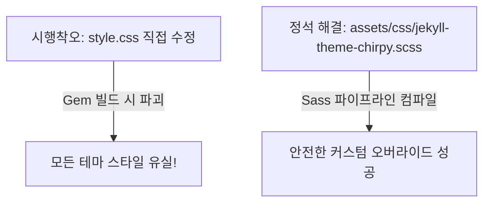

> 깊이 있는 기술 포스트를 읽을 때 우측 목차(TOC)는 글의 전체 지도 역할을 합니다. 스크롤을 내릴 때마다 목차가 자동으로 접혀 독서 흐름을 방해하던 Chirpy 기본 동작을 SCSS 스타일 오버라이드로 해결한 과정을 기록합니다.

---

## 1. 문제 상황: 스크롤할 때 접혀버리는 목차 (TOC)

Chirpy 테마는 본문 내의 `<h2>`, `<h3>` 헤더 태그를 자동으로 수집하여 화면 우측에 미려한 **목차(Table of Contents, TOC)** 패널을 제공합니다.

하지만 실제로 긴 글을 작성하고 읽다 보면 한 가지 아쉬운 점이 발생했습니다:

- 스크롤을 아래로 내리면 현재 읽고 있는 섹션을 제외한 나머지 목차 항목들이 **자동으로 접히면서(Collapse)** 가려집니다.
- 글의 다른 소제목으로 이동하거나 이전 맥락을 파악하려면 목차 영역에 마우스를 다시 올리거나 클릭해야 하는 번거로움이 있었습니다.

| 적용 전 (기본값) | 적용 후 (항상 펼침 고정) |
| :---: | :---: |
|  |  |
| *스크롤 시 현재 위치 외 다른 항목이 가려짐* | *글의 전체 구조가 한눈에 상시 노출됨* |

독자가 언제든지 글의 전체 맥락을 조망하고 원하는 섹션으로 즉시 점프할 수 있도록, **우측 목차를 항상 펼쳐진(Open) 상태로 고정**하기로 결정했습니다.

---

## 2. 원인 분석: Chirpy의 TOC 렌더링 메커니즘

브라우저 개발자 도구(F12)로 우측 TOC 영역을 정밀 분석해 보았습니다.

Chirpy는 [tocbot](https://tscanlin.github.io/tocbot/) 라이브러리를 기반으로 목차를 동적으로 제어합니다:

```html
<!-- Chirpy 우측 목차 DOM 구조 -->
<nav id="toc">
  <ul class="toc-list is-collapsible is-collapsed">
    <li class="toc-list-item">...</li>
  </ul>
</nav>
```

1. 스크롤 위치가 변경되면 활성화되지 않은 하위 리스트(`<ul class="toc-list">`)에 **`.is-collapsed`** 클래스가 동적으로 부여됩니다.
2. Chirpy의 기본 스타일시트는 `.is-collapsed` 클래스에 다음과 같은 CSS 규칙을 적용하고 있었습니다:

```css
/* Chirpy 테마 기본 스타일 */
.is-collapsed {
  max-height: 0;
  overflow: hidden;
  transition: all 0.2s ease-in-out;
}
```

결국 `.is-collapsed` 상태일 때 `max-height`를 `0`으로 제한하여 숨기는 것이 핵심 원인이었습니다.

따라서 이 클래스가 붙더라도 **`max-height: none !important;`** 속성을 주어 높이 제한을 해제하면 항상 전체 목록이 노출될 수 있음을 확인했습니다.

---

## 3. 해결 과정과 시행착오

단순한 CSS 속성 한 줄이지만, **Chirpy 테마가 Gem 기반으로 패키징되어 배포된다는 점** 때문에 적용 위치를 찾는 데 시행착오가 있었습니다.



### ❌ 시행착오: `style.css` 또는 `style.scss` 직접 생성
초기에 생성된 `_site/assets/css/style.css` 파일에 직접 코드를 추가하거나 임의의 CSS 파일을 생성해 보았습니다.

하지만 Jekyll이 사이트를 다시 빌드하는 순간 Chirpy의 원본 스타일 번들이 깨지거나, 배포 환경에서 덮어씌워져 모든 CSS가 유실되는 문제가 발생했습니다. Chirpy는 테마의 SCSS를 Sass 컴파일 파이프라인(`@use`)을 통해 하나로 묶기 때문입니다.

### ✅ 정석 해결: `assets/css/jekyll-theme-chirpy.scss` 오버라이드

Chirpy 공식 문서에서 권장하는 커스텀 CSS 엔트리포인트는 **`assets/css/jekyll-theme-chirpy.scss`**입니다.

이 파일에 코드를 작성하면 upstream 테마의 기본 스타일을 그대로 불러온 뒤, 내가 작성한 커스텀 스타일을 마지막에 병합하여 안전하게 오버라이드합니다.

#### 1) 파일 생성 및 기본 구조 확인
프로젝트 루트에 `assets/css/jekyll-theme-chirpy.scss` 파일을 생성하고 아래 기본 헤더를 유지합니다:

```scss
---
---

@use 'main

  .bundle

';

/* append your custom style below */
```

> ⚠️ **주의사항**: 파일 상단의 프론트매터 구분선(`---`)과 `@use 'main...'` 구문은 Jekyll Sass 컴파일러가 Chirpy 테마 코어 번들을 불러오는 필수 선언문이므로 절대 삭제하거나 수정해서는 안 됩니다.

#### 2) 목차 고정 CSS 추가
파일 최하단에 `.is-collapsed`의 높이 제한을 푸는 코드를 추가합니다:

```scss
// assets/css/jekyll-theme-chirpy.scss
/* 우측 목차(TOC) 항상 펼침 상태 유지 */
.is-collapsed {
  max-height: none !important;
}
```

---

## 4. 최종 검증 및 반응형 동작 확인

로컬 개발 서버(`bundle exec jekyll serve`)를 실행하여 동작을 확인했습니다.

1. **데스크톱 환경**: 
   - 긴 글을 읽으며 페이지 최하단까지 스크롤을 내려도, 우측 패널의 모든 `<h2>`, `<h3>` 목록이 시원하게 펼쳐진 상태를 유지합니다.
   - 현재 읽고 있는 위치는 강조 색상(Highlight)으로 정확하게 트래킹되어 가독성이 대폭 향상되었습니다.
2. **모바일/태블릿 환경**:
   - 화면 폭이 좁은 모바일에서는 우측 목차가 화면을 가리지 않고, 상단의 플로팅 TOC 버튼(`toc-solo-trigger`)을 눌렀을 때만 모달 팝업으로 나타나므로 레이아웃 간섭이 전혀 없음을 확인했습니다.

---

## 5. 마치며

테마의 오픈소스 코드를 무작정 뜯어고치지 않고, 테마가 공식 지원하는 **SCSS 확장 파이프라인(`jekyll-theme-chirpy.scss`)**을 통해 단 세 줄의 코드로 깔끔하게 독서 편의성을 개선할 수 있었습니다.

다음 4편에서는 본문에 외부 링크를 삽입할 때 Notion처럼 풍성한 북마크 카드를 렌더링해 주는 **`jekyll-linkpreview` 플러그인 도입기**와, 이 플러그인의 `<h2>` 태그가 우측 TOC를 심각하게 오염시켰던 버그를 Liquid 커스텀 템플릿으로 해결한 트러블슈팅 경험을 이어가겠습니다.
