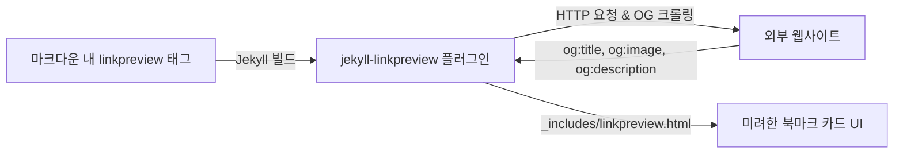

> 기술 글을 작성할 때 외부 공식 문서나 레퍼런스 링크를 자주 인용하게 됩니다. 노션(Notion)처럼 세련된 북마크 미리보기 카드를 구현하는 과정에서 발생한 Chirpy 목차(TOC) 오염 버그를 Liquid 커스텀 템플릿으로 깔끔하게 해결한 과정을 정리합니다.

---

## 1. 배경: 단순 텍스트 링크의 아쉬움

마크다운(Markdown)의 기본 하이퍼링크 문법(`[제목](URL)`)은 간편하지만, 독자 입장에서는 링크를 클릭하기 전까지 해당 사이트가 어떤 내용을 담고 있는지 직관적으로 파악하기 어렵습니다.

노션(Notion)의 **웹 북마크(Web Bookmark)** 기능처럼, 링크를 삽입했을 때 OpenGraph 메타데이터를 기반으로 **제목, 설명문, 대표 썸네일, 파비콘 도메인**이 포함된 카드 위젯으로 렌더링된다면 글의 전달력과 심미성을 크게 높일 수 있습니다.

```markdown
<!-- 일반 마크다운 링크: 정보가 제한적임 -->
[스프링 공식 레퍼런스 문서](https://docs.spring.io)

<!-- 노션 스타일 링크 프리뷰: 시각적 맥락을 풍부하게 제공 -->

```

이를 정적 블로그(Jekyll) 환경에서 구현하기 위해 **`jekyll-linkpreview`** 플러그인을 도입했습니다.

---

## 2. jekyll-linkpreview 플러그인 설치 및 구성

`jekyll-linkpreview`는 Jekyll 빌드 시점에 지정된 URL의 HTML을 크롤링하여 OpenGraph 메타 태그를 추출하고, 이를 HTML 카드 템플릿으로 렌더링해 주는 오픈소스 플러그인입니다.



### 1) Gemfile 의존성 추가
프로젝트 루트의 `Gemfile`의 `jekyll_plugins` 그룹에 플러그인을 추가합니다:

```ruby
# Gemfile
group :jekyll_plugins do
  gem 'jekyll-linkpreview', '~> 0.3.0'
end
```

터미널에서 번들러를 통해 설치를 완료합니다:
```bash
bundle install
```

### 2) `_config.yml` 플러그인 등록
Jekyll이 빌드 파이프라인에서 해당 플러그인을 인식하도록 `_config.yml`에 등록합니다:

```yaml
# _config.yml
plugins:
  - jekyll-linkpreview
```

---

## 3. 핵심 문제 발생: 우측 목차(TOC) 오염 사태

플러그인을 설정한 뒤 본문에 `` 태그를 추가하여 로컬에서 확인해 보았습니다.

카드는 화면에 잘 나타났지만, **우측 목차(TOC) 사이드바에서 치명적인 문제**가 발견되었습니다:


### 원인 정밀 분석
브라우저 개발자 도구로 `jekyll-linkpreview`의 기본 렌더링 HTML 소스 코드를 열어보았습니다:

```html
<!-- jekyll-linkpreview 기본 내장 템플릿의 DOM 구조 -->
<div class="jekyll-linkpreview-wrapper">
  <div class="jekyll-linkpreview-body">
    <!-- 원인: 카드 타이틀을 <h2> 헤딩 태그로 렌더링함! -->
    <h2 class="jekyll-linkpreview-title">
      <a href="https://github.com">GitHub: Let’s build from here</a>
    </h2>
    <div class="jekyll-linkpreview-description">...</div>
  </div>
</div>
```

- Chirpy 테마의 우측 목차 파서(`tocbot`)는 본문(`.content`) 내의 모든 **`<h2>`와 `<h3>` 태그를 글의 주요 소제목으로 간주**하고 사이드바 목차로 자동 등록합니다.
- 그런데 `jekyll-linkpreview`의 기본 템플릿이 카드의 링크 제목을 `<h2>` 태그로 작성하고 있었습니다.
- 결과적으로 본문에 외부 레퍼런스 링크를 2~3개만 넣어도, 글의 원래 목차가 외부 사이트의 이름들로 뒤덮여 목차로서의 기능을 완전히 상실하게 되는 현상이 발생한 것입니다.

---

## 4. 해결 방법: Liquid 커스텀 템플릿 오버라이드

다행히 `jekyll-linkpreview`는 사용자가 프로젝트의 `_includes/` 디렉토리에 동일한 이름의 템플릿 파일을 두면, 내장 템플릿 대신 사용자 정의 템플릿을 사용하는 **템플릿 오버라이드(Template Override)** 기능을 지원합니다.

### Step 1. `_includes/linkpreview.html` 템플릿 작성

`_includes/linkpreview.html` 파일을 생성하고, 문제가 되었던 `<h2>` 태그를 일반 **`<div class="jekyll-linkpreview-title">`** 태그로 교체합니다:

```html
<!-- _includes/linkpreview.html -->
<div class="jekyll-linkpreview-wrapper">
  <div class="jekyll-linkpreview-wrapper-inner">
    <div class="jekyll-linkpreview-content">
      <div class="jekyll-linkpreview-body">
        <!-- h2 대신 div로 교체하여 Chirpy TOC 수집 대상에서 제외 -->
        <div class="jekyll-linkpreview-title">
          <a href="{{ url }}" target="_blank" rel="noopener noreferrer">{{ title }}</a>
        </div>
        
          <div class="jekyll-linkpreview-description">{{ description }}</div>
        
        <div class="jekyll-linkpreview-footer">
          <a href="{{ url }}" target="_blank" rel="noopener noreferrer">{{ domain }}</a>
        </div>
      </div>
    </div>
  </div>
  
    <div class="jekyll-linkpreview-image" style="background-image: url('{{ image }}');"></div>
  
</div>
```

### Step 2. 반응형 CSS 스타일링 (`assets/css/linkpreview.css`)

카드가 다크 모드와 모바일 환경에서도 조화롭게 어우러지도록 `assets/css/linkpreview.css`를 생성하고 스타일을 구성합니다:

```css
/* assets/css/linkpreview.css */
.jekyll-linkpreview-wrapper {
  margin: 1.5rem 0;
  border: 1px solid var(--main-border-color, #e9ecef);
  border-radius: 8px;
  overflow: hidden;
  background-color: var(--card-bg, #ffffff);
  transition: transform 0.2s ease, box-shadow 0.2s ease;
}

.jekyll-linkpreview-wrapper:hover {
  transform: translateY(-2px);
  box-shadow: 0 4px 12px rgba(0, 0, 0, 0.08);
}

.jekyll-linkpreview-wrapper-inner {
  display: flex;
  justify-content: space-between;
}

.jekyll-linkpreview-title a {
  font-weight: 600;
  color: var(--text-color, #212529);
  text-decoration: none;
}

.jekyll-linkpreview-description {
  font-size: 0.875rem;
  color: var(--text-muted-color, #6c757d);
  display: -webkit-box;
  -webkit-line-clamp: 2;
  -webkit-box-orient: vertical;
  overflow: hidden;
}
```

---

## 5. 실전 팁: OpenGraph가 없는 사이트 대응 (`linkpreview_nog.html`)

운영 과정에서 마주칠 수 있는 또 하나의 엣지 케이스는 **OpenGraph 메타태그가 아예 없는 오래된 사이트**나 **프로토콜 상대 URL(`//cdn.example.com/...`)을 사용하는 이미지**를 크롤링할 때 발생하는 Jekyll 빌드 에러입니다.

이를 방지하기 위해 OpenGraph가 없는 경우를 위한 전용 템플릿인 **`_includes/linkpreview_nog.html`**도 함께 마련해 두면 어떤 외부 링크를 첨부하더라도 빌드가 안전하게 유지됩니다:

```html
<!-- _includes/linkpreview_nog.html -->
<div class="jekyll-linkpreview-wrapper">
  <div class="jekyll-linkpreview-wrapper-inner">
    <div class="jekyll-linkpreview-content">
      <div class="jekyll-linkpreview-body">
        <div class="jekyll-linkpreview-title">
          <a href="{{ url }}" target="_blank" rel="noopener noreferrer">{{ title }}</a>
        </div>
        <div class="jekyll-linkpreview-footer">
          <a href="{{ url }}" target="_blank" rel="noopener noreferrer">{{ domain }}</a>
        </div>
      </div>
    </div>
  </div>
</div>
```

---

## 6. 최종 검증 및 적용 결과

로컬 서버에서 다시 확인한 결과, 외부 링크 카드가 세련된 북마크 형태로 우아하게 렌더링되면서도 **우측 목차(TOC)에는 본문의 실제 목차만 깔끔하게 보존**되는 것을 확인했습니다.


```markdown
<!-- 실제 사용 예시 -->

```



---

## 7. 마치며

기본 제공되는 플러그인이라도 테마의 내장 기능(TOC 등)과 결합될 때 예상치 못한 마크업 충돌이 일어날 수 있습니다. 

단순히 플러그인 사용을 포기하는 대신, **Liquid 템플릿 오버라이드 메커니즘**을 활용하여 시각적 완성도와 테마 기능 무결성을 모두 지켜낼 수 있었습니다.

다음 포스트(5편)에서는 Chirpy 테마의 카테고리 페이지를 단순한 게시글 목록 나열에서 벗어나, 주제별 시리즈 배너와 상세 소개 박스가 담긴 **'시리즈 허브'로 커스터마이징**하는 방법을 다루어 보겠습니다.