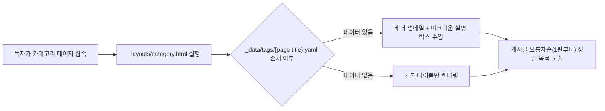

> Jekyll Chirpy 테마의 카테고리 페이지를 단순한 글 목록 나열에서 벗어나, 주제별 대표 배너 이미지와 상세 소개글이 포함된 '시리즈 허브'로 확장하는 방법을 다룹니다.

---

## 카테고리를 '시리즈 허브'로 확장하는 이유

Jekyll Chirpy 테마의 기본 카테고리 페이지는 폴더 아이콘과 글 개수, 그리고 게시글 목록만 심플하게 보여줍니다. 

하지만 블로그에 '원티드 프리온보딩 챌린지'나 '스프링 부트 실전 프로젝트'처럼 여러 편에 걸쳐 이어지는 연재 글을 발행하다 보면, 독자가 카테고리에 들어왔을 때 해당 시리즈의 기획 배경과 대표 썸네일, 관련 링크를 한눈에 볼 수 있는 **'시리즈 메인 허브'**가 필요해집니다.

Jekyll의 **Data Files(`_data/`)** 기능과 **Liquid 템플릿 커스터마이징**을 활용하면, 카테고리가 늘어날 때마다 HTML을 직접 수정할 필요 없이 YAML 설정 파일 하나만 추가하여 배너와 설명을 깔끔하게 렌더링할 수 있습니다.



---

## Step 1: 메타데이터 구조 설계 (`_data/tags/*.yaml`)

Jekyll은 `_data/` 폴더 내의 YAML, JSON 파일을 전역 `site.data` 변수로 자동 파싱합니다. 카테고리별 정보를 독립적으로 관리하기 위해 `_data/tags/` 폴더를 만들고, 카테고리 식별자(Slug)와 일치하는 YAML 파일을 작성합니다.


실제 블로그에 적용한 `_data/tags/wanted-be-challenge.yaml` 설정 예시입니다:

```yaml
# _data/tags/wanted-be-challenge.yaml
name: Wanted BE Challenge
link: "https://www.wanted.co.kr/events/pre_challenge_be_22"
thumbnail:
  path: "https://static.wanted.co.kr/images/events/4818/6f9f8e47.jpg"
  alt: "Wanted BE Challenge"
description: |
  ### 프리온보딩 BE 챌린지

  프리온보딩 BE 챌린지 사전과제를 진행하면서 작성한 게시글입니다.

  단순한 CRUD 개발이 아닌 요구사항에 맞춰 기능을 개발하고, 단위테스트부터 통합테스트까지 진행합니다.
```

- **`name`**: 카테고리 표시 이름
- **`link`**: 공식 홈페이지나 외부 안내 페이지 URL
- **`thumbnail`**: 배너 이미지 경로(`path`)와 대체 텍스트(`alt`)
- **`description`**: YAML의 파이프(`|`) 블록을 사용해 마크다운 헤더(`###`)와 본문 줄바꿈을 온전히 기술합니다.

---

## Step 2: 레이아웃 커스터마이징 (`_layouts/category.html`)

Chirpy 테마는 프로젝트 루트의 `_layouts/category.html` 파일을 통해 테마 기본 레이아웃을 오버라이딩할 수 있습니다. 

Liquid 문법을 사용해 `site.data.tags[page.title]` 데이터를 조회하고, 메타데이터가 존재하면 배너 박스를 상단에 주입합니다.


```html
<!-- _layouts/category.html -->
---
layout: page
# The Category layout
---



<div id="page-category">
  <h1 class="ps-lg-2">
    <i class="far fa-folder-open fa-fw text-muted"></i>
    {{ page.title }}
    <span class="lead text-muted ps-2">{{ page.posts | size }}</span>
  </h1>

  
  
    <div class="tag-info py-1 px-3">
      
        <div class="mt-3 mb-3">
          
        </div>
      
      
        <div class="tag-description">{{ tag.description | markdownify }}</div>
      
      
        <a href="{{ tag.link }}" target="_blank">Learn More</a>
      
    </div>
  

  <ul class="content ps-0">
    
    
      <li class="d-flex justify-content-between px-md-3">
        <a href="{{ post.url | relative_url }}">{{ post.title }}</a>
        <span class="dash flex-grow-1"></span>
        
      </li>
    
  </ul>
</div>
```


### 핵심 구현 포인트
1. **동적 매핑**: ``로 현재 카테고리명과 일치하는 YAML 데이터를 자동 매핑합니다. 메타데이터가 없으면 `tag`가 비어 기본 카테고리 화면으로 동작합니다.
2. **`markdownify` 필터**: `{{ tag.description | markdownify }}`를 통해 YAML에 적힌 마크다운 문법을 HTML로 깔끔하게 변환하여 렌더링합니다.
3. **오름차순 정렬 (`sort: "date"`)**: 시리즈 글은 독자가 1편부터 순서대로 학습해야 하므로, 기본 최신순 대신 과거 순서대로 정렬하도록 필터를 적용했습니다.

---

## Step 3: 스타일링 및 화면 결과 확인

배너 이미지가 모바일 화면을 벗어나지 않도록 간단한 반응형 스타일을 추가합니다:

```css
/* assets/css/style.scss */
.tag-info .preview-img {
  max-width: 100%;
  height: auto;
  border-radius: 8px;
  box-shadow: 0 4px 12px rgba(0, 0, 0, 0.08);
}

.tag-description {
  margin-top: 1rem;
  line-height: 1.6;
}
```

### 브라우저 렌더링 결과

로컬 서버를 실행하여 적용된 카테고리 화면을 확인해 보았습니다.


원티드 프리온보딩 BE 챌린지 페이지 상단에 대표 이벤트 배너와 마크다운 설명, 그리고 외부 링크가 미려하게 렌더링되었습니다.


설명 없이 썸네일과 링크만 정의한 Spring Boot 카테고리 역시 의도한 대로 깔끔하게 출력되는 것을 확인할 수 있습니다.

---

## 실무 팁 및 유의사항

> **YAML 파일명과 카테고리 Slug 일치**  
> `site.data.tags[page.title]`는 파일명을 키로 탐색합니다. 대소문자와 하이픈(`-`)이 카테고리 영문 Slug와 정확히 일치해야 데이터가 정상 바인딩됩니다.
{: .prompt-warning }

> **Liquid 태그 이스케이프 (`raw`)**  
> 마크다운 본문에 Liquid 코드를 예시로 작성할 때는 반드시 ``와 ``로 감싸야 빌드 시 파싱 오류를 방지할 수 있습니다.
{: .prompt-info }

---

## 정리

지금까지 Jekyll Chirpy 테마의 `_data/` 시스템과 `_layouts/category.html` 템플릿을 확장하여 주제별 시리즈 허브를 구축하는 방법을 살펴보았습니다.

- **관심사 분리**: 템플릿 코드 수정 없이 YAML 데이터만 추가하여 새 카테고리 배너 관리
- **풍부한 표현력**: `markdownify` 필터를 활용한 다채로운 서식 지원
- **사용자 경험 향상**: 시리즈물의 순차적 학습을 돕는 오름차순 정렬 적용

연재형 콘텐츠를 자주 다루신다면 카테고리 허브화를 통해 방문자의 탐색 만족도를 높여보시길 권장합니다.

### 참고 자료
- Jekyll 공식 문서: [Data Files](https://jekyllrb.com/docs/datafiles/)
- Jekyll 공식 문서: [Liquid Filters](https://jekyllrb.com/docs/liquid/filters/)
- Chirpy 공식 저장소: [jekyll-theme-chirpy](https://github.com/cotes2020/jekyll-theme-chirpy)
