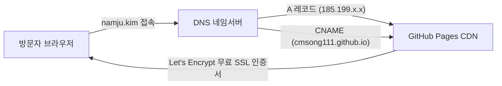

> 개발자 기술 블로그에 `github.io` 대신 독립 커스텀 도메인을 연결하여 퍼스널 브랜딩을 강화하고, 검색 엔진 최적화(SEO) 점수를 영구적으로 누적할 수 있는 커스텀 도메인 연결 및 Let's Encrypt HTTPS 보안 설정 가이드를 소개합니다.
{: .prompt-info }

## 왜 커스텀 도메인을 연결해야 할까?

GitHub Pages로 기술 블로그를 시작하면 기본적으로 `<username>.github.io` 형식의 도메인이 무료로 제공됩니다. 설정이 매우 간편해서 처음 블로그를 개설할 때는 아주 훌륭한 선택지이지만, 장기적인 관점에서 기술 블로그를 운영하다 보면 몇 가지 중요한 한계와 마주하게 됩니다.

첫째, **퍼스널 브랜딩의 차별화**입니다. `namju.kim`과 같은 고유한 독립 도메인은 블로그를 방문하는 동료 개발자나 채용 담당자에게 훨씬 전문적이고 정돈된 엔지니어 이미지를 전달합니다.

둘째, **플랫폼 종속성 탈피와 영속성**입니다. 훗날 정적 사이트 호스팅 플랫폼을 Vercel, Cloudflare Pages, 혹은 AWS S3/CloudFront 같은 자체 인프라로 이전하더라도 도메인은 그대로 유지할 수 있습니다.

셋째, **SEO(검색 엔진 최적화) 자산 누적**입니다. 플랫폼 기본 도메인을 사용하다가 나중에 도메인을 변경하면 그동안 축적된 구글 검색 순위와 백링크 점수가 단절될 위험이 있습니다. 처음부터 독자 도메인을 운영하면 모든 검색 지수를 온전히 내 자산으로 누적할 수 있습니다.



---

## 준비 사항

본 가이드를 따라 진행하기 전에 아래 준비물이 갖추어져 있는지 확인합니다.

- **구매 완료한 커스텀 도메인**: 가비아, 호스팅케이알, Cloudflare 등 도메인 등록 대행업체에서 구매한 독자 도메인 (예: `namju.kim`)
- **DNS 관리 콘솔 접근 권한**: 구매한 도메인의 DNS 레코드(A 레코드 및 CNAME)를 등록하고 수정할 수 있는 관리 화면
- **GitHub Pages 저장소**: Chirpy 테마가 배포되고 있는 본인의 GitHub Pages 저장소 (예: `cmsong111.github.io`)

---

## Step 1. 도메인 구매 및 DNS 레코드 설정

도메인을 준비했다면 사용자가 브라우저 주소창에 `namju.kim`을 입력했을 때 GitHub Pages 서버로 정상 연결되도록 DNS 레코드를 등록해야 합니다.

루트 도메인(Apex 도메인, 예: `namju.kim`)에는 GitHub Pages의 공식 고정 IP 주소 4개를 A 레코드로 등록하고, 서브도메인(`www.namju.kim`)에는 본인의 GitHub Pages 주소를 CNAME 레코드로 지정합니다.

### GitHub Pages 공식 A 레코드 IP (4개)
GitHub 공식 문서에서 안내하는 Pages 애니캐스트(Anycast) 고정 IP 주소 4개 목록입니다. 안정적인 트래픽 분산과 고가용성을 위해 4개 IP를 모두 등록하는 것이 원칙입니다.

- `185.199.108.153`
- `185.199.109.153`
- `185.199.110.153`
- `185.199.111.153`

### DNS 콘솔 등록 내역
도메인 업체의 DNS 관리 화면으로 이동하여 다음과 같이 레코드를 추가합니다:

| 레코드 타입 | 호스트 이름 (Name) | 값 / IP 주소 (Value) | TTL |
|:---:|:---:|:---:|:---:|
| **A** | `@` (또는 빈칸) | `185.199.108.153` | 3600 (기본값) |
| **A** | `@` (또는 빈칸) | `185.199.109.153` | 3600 (기본값) |
| **A** | `@` (또는 빈칸) | `185.199.110.153` | 3600 (기본값) |
| **A** | `@` (또는 빈칸) | `185.199.111.153` | 3600 (기본값) |
| **CNAME** | `www` | `cmsong111.github.io` | 3600 (기본값) |


> **팁 (Tip)**: 네임서버에 따라 Apex 도메인의 호스트 표기 방식이 다릅니다. Cloudflare나 가비아 등에서는 `@` 기호를 입력하거나 빈칸으로 두면 루트 도메인(`namju.kim`)으로 매핑됩니다.
{: .prompt-tip }

---

## Step 2. GitHub 저장소 Custom Domain 등록 및 CNAME 파일 원리

DNS 레코드 설정이 끝났다면, 이제 GitHub Pages가 `namju.kim`으로 들어오는 웹 요청을 해당 저장소와 연결하도록 설정할 차례입니다.

1. GitHub 블로그 저장소(`cmsong111.github.io`)의 **Settings** 탭으로 이동합니다.
2. 좌측 사이드바 메뉴에서 **Pages**를 선택합니다.
3. **Custom domain** 입력 필드에 구매한 도메인(`namju.kim`)을 입력하고 **Save** 버튼을 클릭합니다.


### CNAME 파일 자동 생성과 동작 원리
GitHub Pages 설정에서 도메인을 저장하면 저장소의 최상위 루트 경로에 `CNAME` 파일이 자동으로 생성되거나 커밋됩니다.

```text
# CNAME
namju.kim
```

이 `CNAME` 파일은 GitHub Pages CDN 라우터가 클라이언트의 HTTP 요청 헤더(`Host: namju.kim`)를 식별하여 올바른 저장소의 정적 웹 자원으로 매핑해주는 핵심 기준점 역할을 합니다. 만약 저장소를 다시 클론하거나 빌드 파이프라인을 재구성할 때 CNAME 파일이 유실되면 도메인 연결이 풀릴 수 있으므로 주의해야 합니다.

---

## Step 3. Let's Encrypt SSL 인증서 발급 및 Enforce HTTPS 활성화

현대 웹 표준 환경에서 HTTPS 보안 연결은 선택이 아닌 필수입니다. 암호화되지 않은 HTTP 사이트는 브라우저에서 '주의 요함' 경고를 띄워 방문자의 신뢰도를 떨어뜨릴 뿐만 아니라, Google 검색 랭킹 산정 시에도 불이익을 받게 됩니다.

GitHub Pages는 글로벌 비영리 인증기관인 **Let's Encrypt**와 직접 연동되어 커스텀 도메인에 대한 무료 SSL/TLS 인증서를 완전 자동으로 발급하고 주기적으로 갱신해줍니다.

### HTTPS 강제 적용(Enforce HTTPS) 절차
1. Custom domain을 저장하면 GitHub 백엔드가 해당 도메인의 DNS A 레코드 전파 상태를 검증합니다.
2. DNS 조회가 성공하면 **"TLS certificate is being provisioned. This may take up to 15 minutes."**라는 안내 메시지와 함께 인증서 프로비저닝 작업이 진행됩니다.
3. 인증서 발급이 완료되면 비활성화되어 있던 **Enforce HTTPS** 체크박스가 활성화됩니다.
4. **Enforce HTTPS** 체크박스를 클릭하여 모든 HTTP 접속 요청이 안전한 HTTPS로 301 영구 리다이렉트되도록 강제합니다.

> **주의 (Warning)**: DNS 레코드가 전 세계 네임서버로 전파되기 전에는 "DNS check in progress" 상태가 지속되며 `Enforce HTTPS` 체크박스가 비활성화될 수 있습니다. 네임서버 전파 상황에 따라 수 분에서 최대 수 시간까지 소요될 수 있으니 기다려주시면 정상 활성화됩니다.
{: .prompt-warning }

---

## Step 4. Jekyll 환경 설정 (_config.yml) 수정

도메인과 SSL 인증서 설정이 완료되었다면 마지막으로 블로그 내부 링크, OpenGraph 메타 태그, 사이트맵(`sitemap.xml`), RSS 피드가 새 도메인을 가리키도록 Jekyll 설정을 변경합니다.

저장소 루트의 `_config.yml` 파일을 열고 `url` 및 `baseurl` 항목을 다음과 같이 수정합니다.

```yaml
# _config.yml

# Fill in the protocol & hostname for your site.
# E.g. 'https://username.github.io', note that it does not end with a '/'.
url: "https://namju.kim"

# The subpath of your site, e.g. /blog
# 커스텀 도메인의 루트 경로를 사용하므로 baseurl은 빈 문자열("")로 설정합니다.
baseurl: ""
```

수정한 `_config.yml`을 Git에 커밋하고 원격 저장소에 푸시합니다:

```bash
git add _config.yml
git commit -m "chore: update site url to https://namju.kim"
git push origin main
```

Chirpy 테마에 구성된 GitHub Actions 워크플로가 새 커밋을 감지하여 정적 사이트를 자동으로 다시 빌드하고 배포합니다.

---

## 결과 확인 및 검증

모든 설정이 완료되었다면 터미널과 웹 브라우저에서 커스텀 도메인과 HTTPS가 정상 작동하는지 확인합니다.

### 1. DNS 전파 상태 조회 (dig / nslookup)
터미널 콘솔에서 `dig` 또는 `nslookup` 명령어를 실행하여 등록한 GitHub Pages IP 주소로 올바르게 확인되는지 검증합니다.

```bash
# Apex 도메인 A 레코드 조회
dig namju.kim +noall +answer

# 또는 nslookup 명령어로 확인
nslookup namju.kim
```

정상적으로 전파되었다면 사전에 등록했던 4개의 GitHub Pages IP 주소가 반환됩니다:

```text
; <<>> DiG 9.10.6 <<>> namju.kim +noall +answer
;; global options: +cmd
namju.kim.		3600	IN	A	185.199.108.153
namju.kim.		3600	IN	A	185.199.109.153
namju.kim.		3600	IN	A	185.199.110.153
namju.kim.		3600	IN	A	185.199.111.153
```

### 2. 브라우저 보안 연결(HTTPS) 및 SSL 인증서 확인
웹 브라우저를 열고 `https://namju.kim`으로 접속합니다. 주소창 좌측의 자물쇠 아이콘을 클릭하여 보안 연결 정보와 인증서 발급자를 확인합니다.


위 화면처럼 발급 기관이 **Let's Encrypt**로 정상 표시되고, 암호화된 HTTPS 연결이 온전하게 성립된 것을 확인할 수 있습니다.

---

## 정리 및 주의사항

지금까지 GitHub Pages 기본 도메인에서 독립 커스텀 도메인(`namju.kim`)으로 이전하고, 무료 Let's Encrypt SSL/HTTPS 보안 연결까지 완벽하게 적용하는 전 과정을 정리해보았습니다.

작업 과정에서 기억해두면 좋은 핵심 주의사항은 다음과 같습니다:

1. **DNS TTL 전파 시간 대기**: 도메인 레코드 변경 사항이 전 세계 DNS 서버에 반영되는 데는 TTL(Time To Live) 설정에 따라 다소 시간이 걸립니다. `Enforce HTTPS` 옵션이 바로 활성화되지 않더라도 여유를 갖고 기다리는 것이 좋습니다.
2. **www 서브도메인 리다이렉트**: Apex 도메인(`namju.kim`)과 `www.namju.kim` 중 주로 사용할 도메인을 GitHub Pages의 Custom domain에 등록해두면, GitHub Pages 라우터가 나머지 도메인으로 들어온 트래픽을 기본 도메인으로 자동 리다이렉트해줍니다.
3. **검색 엔진 재등록 및 사이트맵 제출**: 커스텀 도메인으로 변경한 이후에는 구글 서치 콘솔(Google Search Console)과 네이버 서치어드바이저에 새로운 도메인 주소로 속성을 추가하고 `sitemap.xml`을 다시 제출해야 검색 색인 누락 없이 유기적인 방문자 트래픽을 유지할 수 있습니다.

나만의 독자 도메인으로 브랜드 정체성을 확립하고, 더 지속 가능하고 전문적인 기술 블로그를 운영해보시길 추천합니다.
