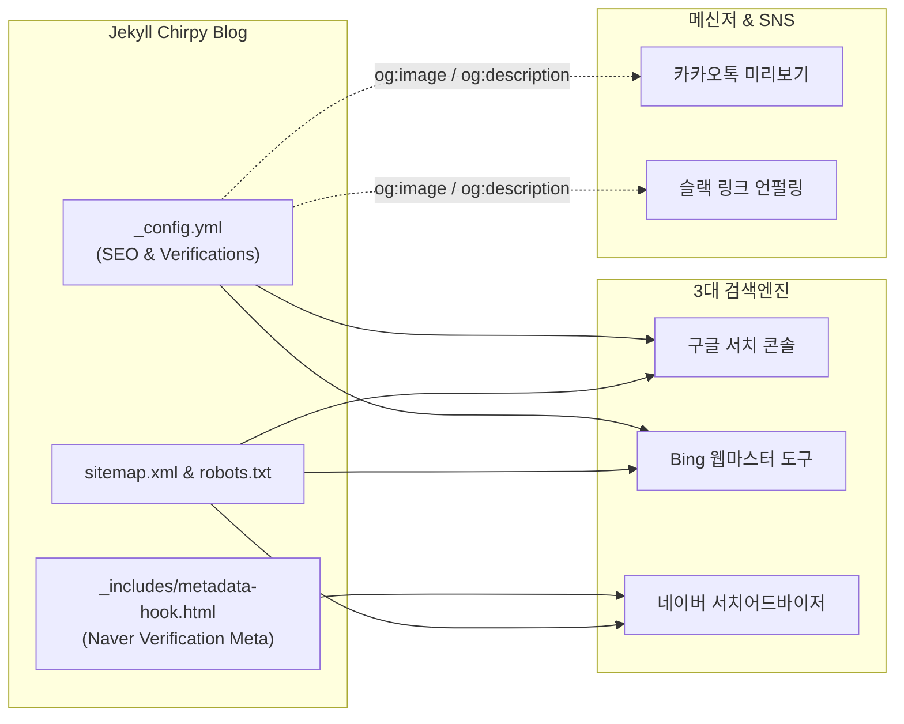

> 열심히 작성한 기술 포스트가 구글·네이버·Bing 검색 포털에 정상 색인되고, 카카오톡이나 슬랙 등 메신저에 공유될 때 매력적인 미리보기 카드로 100% 전달되도록 만드는 SEO 필수 세팅 가이드입니다.
{: .prompt-info }

기술 블로그에 아무리 깊이 있는 트러블슈팅과 튜토리얼을 작성해도, 검색 로봇이 내 글을 수집해 가지 않거나 메신저에 링크를 보냈을 때 썸네일과 설명 없이 주소만 덩그러니 남는다면 독자의 유입률은 크게 떨어질 수밖에 없습니다.

Jekyll(지킬)과 Chirpy 테마는 기본적으로 검색엔진 최적화(SEO)를 위한 훌륭한 뼈대를 갖추고 있지만, 국내외 주요 포털에 사이트 소유권을 확인하고 SNS용 OpenGraph(OG) 메타태그를 올바르게 구성하려면 몇 가지 필수 설정 작업이 필요합니다. 

이번 글에서는 **구글, 네이버, Bing 3대 검색엔진 등록부터 `_includes/metadata-hook.html`을 활용한 클린 메타태그 주입법, 사이트맵 제출, 그리고 SNS 공유 썸네일 카드 최적화**까지 한 번에 정리해 드립니다.



---

## 준비 사항

작업을 시작하기 전 아래 항목들이 준비되어 있는지 확인합니다.

1. **GitHub Pages 및 Jekyll 블로그 배포 완료**: 도메인(예: `namju.kim` 또는 `username.github.io`)으로 블로그 접근이 가능한 상태여야 합니다.
2. **포털 계정 준비**:
   - Google 계정 ([Google Search Console](https://search.google.com/search-console))
   - 네이버 계정 ([네이버 서치어드바이저](https://searchadvisor.naver.com/))
   - Microsoft 계정 ([Bing Webmaster Tools](https://www.bing.com/webmasters))

---

## Step 1: 구글 서치 콘솔 & Bing 웹마스터 도구 등록

Chirpy 테마는 구글과 Bing의 사이트 소유권 확인 태그를 `_config.yml`에서 기본 속성으로 지원합니다. 테마 코드를 수정할 필요 없이 설정 파일에 인증 키값만 넣어주면 됩니다.

### 1. 구글 서치 콘솔 인증 키 발급
1. [Google Search Console](https://search.google.com/search-console)에 접속하여 **속성 추가**를 누릅니다.
2. 속성 유형 선택 창에서 **URL 접두사**를 선택하고 본인의 블로그 전체 URL(예: `https://namju.kim`)을 입력합니다.
3. 소유권 확인 방법 중 **HTML 태그** 방식을 선택합니다.
4. 제공되는 메타태그 코드 `<meta name="google-site-verification" content="pWvXEtxit9..." />`에서 `content` 속성 내부의 문자열 값만 복사합니다.

### 2. Bing 웹마스터 도구 연동
Bing은 구글 서치 콘솔 계정을 연동하여 클릭 한 번으로 모든 사이트 소유권과 사이트맵을 가져올 수 있어 매우 편리합니다. 만약 수동 메타태그 방식을 쓴다면 마찬가지로 인증 코드 문자열을 복사합니다.

### 3. `_config.yml` 설정 반영
복사한 인증 코드를 블로그 루트의 `_config.yml` 내 `webmaster_verifications` 블록에 추가합니다.

```yaml
# _config.yml

# Webmaster Verification Settings
webmaster_verifications:
  google: pWvXEtxit9b2Jb1BhT5gZwCnk7c4LKniU5aq1ftSCqM # 구글 서치콘솔 content 값
  bing: 3FCE53F92232E6E585BBB5AA78FE69B2             # Bing 웹마스터 content 값
  alexa: # 필요 시 설정
  yandex:
  baidu:
```

저장 후 변경 사항을 커밋하고 배포하면 Chirpy가 빌드 시 자동으로 `<head>` 태그 내부에 해당 검증 메타태그를 주입합니다.

---

## Step 2: 네이버 서치어드바이저 등록과 metadata-hook 활용

국내 개발자 커뮤니티나 취업 시장에서는 네이버 검색을 통한 포스트 유입도 무시할 수 없습니다. 하지만 Chirpy 테마는 기본적으로 네이버 인증 메타태그 키를 `_config.yml`에서 제공하지 않습니다.

### 테마 코어를 건드리지 않는 클린 주입 (`metadata-hook.html`)
과거에는 `_includes/head.html`을 레포지토리로 직접 복사해 와서 코드를 수정하곤 했습니다. 하지만 이 방식은 이후 Chirpy 테마 젬(Gem)을 최신 버전으로 업그레이드할 때 파일 충돌이 발생하거나 최신 테마 기능이 누락되는 치명적인 단점이 있습니다.

Chirpy는 이러한 확장을 위해 `<head>` 태그가 닫히기 직전 사용자 정의 메타태그를 삽입할 수 있는 공식 확장 포인트인 **`_includes/metadata-hook.html`**을 제공합니다.

`_includes/metadata-hook.html` 파일을 생성하고 네이버 서치어드바이저에서 발급받은 사이트 소유 확인 메타태그를 추가합니다.

```html
<!-- _includes/metadata-hook.html -->
<!-- Custom metadata injected via Chirpy's official hook (included at the end of <head>) -->

<!-- Naver Search Advisor site verification -->
<meta name="naver-site-verification" content="858f23c87778195f1b40e45846a75a7f99cb6371">

<!-- 필요 시 구글 애드센스나 외부 폰트/스타일시트도 이곳에 클린하게 추가할 수 있습니다 -->
```

> `_includes/metadata-hook.html`에 작성된 내용은 Chirpy 테마의 레이아웃을 해치지 않고 모든 페이지의 `<head>` 영역에 안전하게 주입됩니다.
{: .prompt-tip }

배포 후 네이버 서치어드바이저 콘솔에서 **소유확인** 버튼을 클릭하면 인증이 완료됩니다.


---

## Step 3: sitemap.xml 제출과 robots.txt 점검

소유권 인증이 끝났다면 검색 로봇이 블로그의 전체 글을 빠짐없이 읽어갈 수 있도록 **사이트맵(sitemap.xml)**을 제출해야 합니다.

Chirpy 테마는 내부적으로 `jekyll-sitemap` 플러그인을 품고 있으므로, 배포 시 블로그 루트에 `sitemap.xml`과 `robots.txt`가 자동으로 생성됩니다.

### 1. `robots.txt` 수집 허용 상태 확인
간혹 설정 미숙으로 검색 로봇의 접근이 전면 차단(`Disallow: /`)되어 있는 경우가 있습니다. 브라우저에서 `https://본인도메인/robots.txt`에 접속하여 다음과 같이 모든 에이전트 수집이 허용되어 있는지 확인합니다.

```text
User-agent: *

Disallow: /norobots/

Sitemap: https://namju.kim/sitemap.xml
```


### 2. 3대 포털에 sitemap.xml 제출
각 검색엔진 콘솔의 사이트맵 메뉴로 이동하여 제출을 진행합니다:
- **구글 서치 콘솔**: 좌측 메뉴 `Sitemaps` ➔ 새 사이트맵 추가에 `sitemap.xml` 입력 후 제출
- **네이버 서치어드바이저**: `요청` ➔ `사이트맵 제출` ➔ `sitemap.xml` 입력 후 확인
- **Bing 웹마스터 도구**: `사이트맵` ➔ `사이트맵 제출` ➔ 전체 URL `https://본인도메인/sitemap.xml` 입력 후 제출

> 검색엔진에 따라 사이트맵 최초 크롤링 및 인덱싱까지 보통 2~3일에서 최대 1주일 정도 소요됩니다.
{: .prompt-info }

---

## Step 4: 카카오톡·슬랙 SNS 링크 미리보기(OpenGraph) 최적화

카카오톡, 슬랙, 페이스북, 트위터(X) 등 메신저나 SNS에 블로그 링크를 붙여넣었을 때 깔끔한 썸네일 카드(Rich Snippet)가 뜨지 않으면 클릭률이 현저히 떨어집니다.

이를 해결하려면 **OpenGraph(og:image, og:title, og:description)** 태그가 명확하게 출력되어야 합니다.

### 1. 전역 기본 썸네일 이미지 설정 (`_config.yml`)
특정 포스트에 별도 대표 이미지가 없을 때 블로그 전체를 대표할 기본 이미지를 `_config.yml`의 `social_preview_image`에 지정합니다.

```yaml
# _config.yml

# The URL of the site-wide social preview image used in SEO `og:image` meta tag.
social_preview_image: https://avatars.githubusercontent.com/cmsong111
```

### 2. 포스트별 고유 대표 썸네일 지정 (Front Matter)
각 포스트의 Front Matter에 `image` 블록을 선언하면, 해당 글 공유 시 글의 주제와 직결되는 고유 썸네일이 대형 카드로 렌더링됩니다.

```yaml
---
title: 기술 블로그 검색 노출 100% 공략: 네이버·구글·Bing 3대 포털 등록과 SNS 공유 카드 세팅
description: 지킬 블로그의 검색엔진 등록과 OpenGraph SEO 팁을 다룹니다.
date: 2025-03-25 12:00:00 +0900
image:
  path: /assets/images/2025-03-25/sns-opengraph-card-preview.png
  alt: SNS 링크 공유 OpenGraph 미리보기 카드 완성 화면
---
```

> **상대 경로 주의사항**: Chirpy의 `jekyll-seo-tag`는 `image.path`가 상대 경로일 때 `_config.yml`의 `url` 설정을 접두사로 붙여 절대 경로(`https://namju.kim/assets/...`)로 자동 변환합니다. 따라서 `_config.yml`의 `url` 값이 `https://0.0.0.0:4000`이나 빈 값으로 남아있지 않도록 실제 도메인 주소로 정확히 기재되어 있어야 합니다.
{: .prompt-warning }

---

## 결과 확인: 포털 색인 및 메타태그 검증

모든 설정을 마치고 배포한 뒤 정상 동작 여부를 검증합니다.

### 1. 메타태그 주입 확인
터미널에서 `curl` 명령어를 실행하거나 브라우저 소스 보기(Ctrl+U 또는 Cmd+Option+U)로 `<head>` 내부를 확인합니다.

```bash
curl -sL https://namju.kim | grep -E "verification|og:image"
```

출력 결과에 구글, Bing, 네이버 소유권 태그와 `og:image` 메타태그가 정확하게 노출되는지 확인합니다.

### 2. 메신저 공유 및 캐시 갱신 테스트
실제 카카오톡 '나에게 보내기' 또는 슬랙 비공개 채널에 포스트 링크를 전송해 봅니다.


만약 이전에 공유한 적이 있어 이미지가 갱신되지 않는다면 각 플랫폼의 디버거 도구를 통해 캐시를 초기화할 수 있습니다:
- **카카오톡**: [카카오 개발자 캐시 삭제 도구](https://developers.kakao.com/tool/clear/og)
- **페이스북/메타**: [Facebook 공유 디버거](https://developers.facebook.com/tools/debug/)

---

## 정리

지금까지 지킬 블로그를 구글, Bing, 네이버에 등록하고 OpenGraph 소셜 공유 카드를 세팅하는 과정을 살펴보았습니다.

- **`_config.yml`**: 구글과 Bing의 `webmaster_verifications` 및 전역 `social_preview_image` 관리
- **`_includes/metadata-hook.html`**: 테마 코어를 건드리지 않고 네이버 인증 메타태그를 클린하게 주입
- **`sitemap.xml` & `robots.txt`**: 크롤러 차단 여부 점검 후 3대 포털에 사이트맵 등록
- **Front Matter `image`**: 포스트별 맞춤형 OpenGraph 썸네일 카드 렌더링

기술 블로그의 검색 최적화는 한 번만 꼼꼼히 세팅해 두면 장기적으로 꾸준한 오가닉 트래픽(Organic Traffic)을 가져다주는 든든한 기술 자산이 됩니다. 새로 기술 포스트를 발행할 때마다 구글 서치 콘솔의 **'URL 검사' ➔ '색인 생성 요청'**을 함께 실행해 주시면 크롤링 주기를 한층 더 앞당길 수 있습니다.
