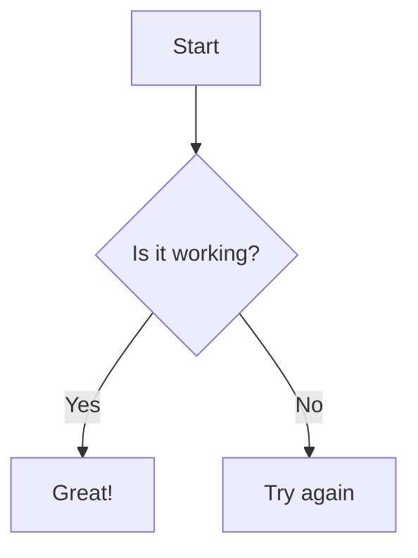

# This is a test post.

## This is a test post

###     This is a test post

## Python Code Block

```python
print("Hello, World!")
```

## Markdown Code Block





yyyy-mm-dd-My-New-Post.md

2023-10-01-My-New-Post.md