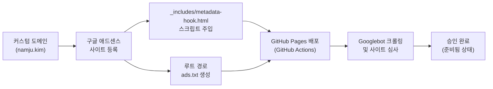

> 개발자 기술 블로그를 꾸준히 운영하게 해주는 작은 원동력 중 하나는 바로 소소한 광고 수익입니다. 이번 글에서는 GitHub Pages와 Jekyll Chirpy 테마 기반 블로그에 구글 애드센스(Google AdSense) 승인을 단번에 통과한 실전 노하우와 테마 원본 코드를 보존하는 metadata-hook 스크립트 주입, 그리고 ads.txt 크롤링 경고 해결법을 정리합니다.



## 준비 사항

애드센스 연동 및 승인 작업을 시작하기 전에 준비해야 할 사항은 다음과 같습니다.

- **구글 계정**: 구글 애드센스 가입 및 콘솔 대시보드 접근용 계정
- **커스텀 도메인**: 기본 서브도메인이 아닌 자체 보유 개인 도메인 (`https://namju.kim`)
- **Chirpy 테마 기반 블로그**: GitHub Pages와 Actions를 통해 자동 빌드 및 배포되는 환경
- **양질의 개발 포스트**: 심사 통과를 위해 직접 고민하고 해결한 기술 글 (최소 10편 이상 권장)

---

## 1단계: 커스텀 도메인(namju.kim)으로 애드센스 심사 신청하기

구글 애드센스에 사이트를 등록할 때 GitHub Pages 기본 도메인인 `*.github.io` 서브도메인 대신 독립적인 **커스텀 도메인(`namju.kim`)**을 사용하는 것을 권장합니다.

`github.io`는 공용 도메인(Public Suffix List)으로 분류되어 있어, 간혹 서브도메인 단위의 소유권 증명이나 루트 도메인 검증 과정에서 정책상의 제약이나 심사 지연이 발생할 수 있습니다. 반면, 개인 루트 도메인(`namju.kim`)을 연동해 두면 도메인 전체에 대한 완전한 소유권을 인정받아 심사 통과 확률이 높아지고, 추후 서브도메인 확장이나 호스팅 이전 시에도 애드센스 승인 상태를 온전히 유지할 수 있습니다.

[구글 애드센스 콘솔](https://adsense.google.com/)에 로그인한 뒤, 좌측 메뉴의 **[사이트] > [새 사이트 추가]** 버튼을 클릭하여 본인의 커스텀 도메인을 입력합니다.

사이트를 등록하면 본인 고유의 게시자 ID(Publisher ID, 예: `pub-9883771255224638`)가 포함된 비동기 자바스크립트 스크립트 코드가 발급됩니다.

---

## 2단계: Chirpy 공식 확장 훅(metadata-hook)에 애드센스 스크립트 주입

애드센스 스크립트는 모든 웹페이지의 `<head>` 태그 내부에 위치해야 합니다. 이때 Chirpy 테마를 사용하면서 흔히 하는 실수가 `_layouts/default.html`이나 `_includes/head.html` 같은 테마 내부 파일을 통째로 가져와 수정하는 것입니다. 테마 원본 코드를 직접 오버라이딩하면 이후 Chirpy 테마의 신규 버전이 릴리즈되었을 때 업그레이드 충돌이 발생하거나 유지보수가 어려워집니다.

Chirpy는 이러한 외부 라이브러리 및 커스텀 메타데이터 삽입을 위해 공식 확장 포인트인 `_includes/metadata-hook.html`을 기본 제공합니다. 이 파일에 코드를 작성하면 빌드 타임에 자동으로 `<head>` 태그의 가장 마지막 영역에 안전하게 주입됩니다.

프로젝트의 `_includes/metadata-hook.html` 파일에 발급받은 애드센스 스크립트를 추가합니다.

```html
<!-- _includes/metadata-hook.html -->
<!-- Custom metadata injected via Chirpy's official hook (included at the end of <head>) -->

<!-- Google AdSense -->
<script
  async
  src="https://pagead2.googlesyndication.com/pagead/js/adsbygoogle.js?client=ca-pub-9883771255224638"
  crossorigin="anonymous"
></script>
```

> `async` 속성을 부여하면 브라우저가 HTML을 파싱하는 흐름을 차단하지 않고 백그라운드에서 스크립트를 다운로드하므로, 블로그 초기 렌더링 속도와 코어 웹 바이탈(Core Web Vitals) 성능 점수를 유지할 수 있습니다.
{: .prompt-info }

코드 반영 후 배포가 완료되면, 브라우저에서 페이지 소스 보기(Ctrl+U 또는 Cmd+Option+U)를 열어 `<head>` 태그 내에 발급받은 `adsbygoogle.js` 스크립트가 온전히 주입되었는지 확인합니다.

```html
<!-- 실제 렌더링된 <head> 태그 확인 예시 -->
<head>
  <meta charset="utf-8">
  <!-- Google AdSense -->
  <script async src="https://pagead2.googlesyndication.com/pagead/js/adsbygoogle.js?client=ca-pub-9883771255224638" crossorigin="anonymous"></script>
</head>
```

---

## 3단계: 루트 경로 ads.txt 파일 생성 및 수익 손실 경고 사전 방지

애드센스를 연동할 때 많은 분들이 놓쳐서 "수익 손실 위험 - ads.txt 파일 문제를 해결해야 합니다"라는 경고 배너를 마주하게 되는 핵심 설정이 바로 **`ads.txt`**입니다.

`ads.txt`(Authorized Digital Sellers)는 해당 도메인의 광고 지면을 판매할 공인 권한이 있는 판매자임을 선언하는 IAB 표준 규격 파일입니다. 이 파일이 없거나 게시자 ID가 누락되면 광고주들이 해당 사이트의 인벤토리 구매를 기피하여 광고 송출이 중단되거나 단가가 급락할 수 있습니다.

Jekyll은 프로젝트 최상위 루트 디렉터리에 위치한 정적 파일을 빌드 시 그대로 배포 루트 경로로 복사합니다. 따라서 저장소 최상위 루트에 `ads.txt` 파일을 생성하고 아래와 같이 한 줄을 작성해 줍니다.

```text
# ads.txt
google.com, pub-9883771255224638, DIRECT, f08c47fec0942fa0
```

> 두 번째 필드에는 본인의 게시자 ID(`pub-xxxxxxxxxxxxxxxx`)를 입력하고, 마지막 필드의 `f08c47fec0942fa0`은 구글 애드센스 고유 인증 기관 식별자이므로 그대로 기재합니다.
{: .prompt-tip }

배포 후 브라우저 주소창에 `https://namju.kim/ads.txt`로 직접 접속하여 해당 텍스트가 정상적으로 노출되는지 검증합니다.


---

## 4단계: 정적 블로그 애드센스 단번에 승인받는 실전 팁

구글 애드센스 심사는 정적 블로그 운영자들에게 '애드고시'라고 불릴 만큼 승인 기준이 까다롭습니다. 특히 "가치 없는 콘텐츠(Low Value Content)"나 "사이트 탐색 불가" 사유로 거절당하는 경우가 많습니다. 제가 한 번에 승인을 통과하기 위해 철저히 점검했던 4가지 실전 팁을 정리합니다.

1. **양질의 개발 포스트 10편 이상 발행**: 단순 코드 조각이나 짧은 메모 수준의 글이 아니라, 직접 겪은 기술적 고민과 트러블슈팅 해결 과정이 담긴 1,500자 이상의 완결성 높은 글을 최소 10편 이상 미리 준비했습니다.
2. **명확한 카테고리 분류 및 빈 카테고리 제거**: 네비게이션 메뉴에 글이 0개이거나 1편만 존재하는 빈 카테고리가 있으면 사이트 완성도가 부족하다고 판단될 수 있습니다. 심사 기간에는 실제 글이 충분히 쌓인 카테고리만 깔끔하게 노출했습니다.
3. **깨진 링크(404 Not Found) 0건 유지**: 글 본문이나 메뉴의 내부 링크, 외부 링크 중 404 에러를 발생시키는 깨진 링크가 없도록 전수 확인했습니다. 크롤링 봇이 페이지를 탐색하는 데 장애가 없어야 합니다.
4. **소개(About) 페이지와 저자 정보 투명화**: 블로그 운영자가 누구인지, 어떤 분야를 다루는 개발자인지 명시한 About 페이지와 깃허브, 이메일 등의 프로필 정보를 충실하게 채워 신뢰도를 높였습니다.

---

## 결과 확인: 사이트 관리 '준비됨(Ready)' 상태 및 광고 송출

스크립트와 `ads.txt` 세팅을 마친 뒤 애드센스 대시보드에서 **[검토 요청]**을 제출했습니다.

보통 영업일 기준 2~3일, 길게는 1~2주 정도 소요되는데, 꼼꼼하게 사전 점검을 마친 덕분에 약 3일 만에 "사이트에 광고를 게재할 수 있습니다"라는 승인 안내 메일을 받을 수 있었습니다.

애드센스 사이트 관리 화면에서도 도메인 상태가 초록색 **준비됨(Ready)**으로 정상 전환된 것을 확인했습니다.


승인 완료 후 자동 광고를 활성화하면 아래와 같이 본문 콘텐츠 사이에 인아티클/디스플레이 광고가 자연스럽게 배치됩니다.


---

## 정리: 개발자 블로그 광고 배치 시 주의사항

애드센스 승인을 받고 나면 수익을 높이고 싶은 마음에 광고를 무리하게 배치하기 쉽습니다. 하지만 기술 블로그의 제1원칙은 언제나 **독자의 정보 습득과 코드 가독성**이어야 합니다.

개발 블로그의 주 방문자는 문제 해결을 위해 긴박하게 코드를 찾으러 온 동료 엔지니어들입니다. 화면 전체를 가리는 전면 광고(모달 오버레이)나 모바일 화면 상하단을 덮는 과도한 앵커 광고는 독자에게 큰 피로감을 주고 높은 이탈률로 이어집니다.

따라서 애드센스 **[자동 광고]** 설정 시 다음과 같은 원칙을 지키는 것이 좋습니다.

> **가독성을 지키는 광고 설정 팁**
> - 화면을 완전히 가리는 **전면 광고**는 비활성화하거나 빈도를 대폭 낮춥니다.
> - 모바일 화면을 가리는 **앵커 광고** 역시 필요한 경우에만 최소한으로 적용합니다.
> - 본문 글의 흐름을 끊지 않는 **인피드 광고**와 본문 최하단 **디스플레이 광고** 위주로 배치하여 깔끔한 열람 환경을 유지합니다.
{: .prompt-warning }

Chirpy 테마의 `metadata-hook` 기능을 활용하면 테마 업데이트 시에도 아무런 영향 없이 안정적으로 애드센스를 운영할 수 있습니다. 깔끔한 설정과 양질의 글로 승인을 얻고, 블로그를 꾸준히 가꾸어 나가는 보람을 느껴보시기를 바랍니다.
