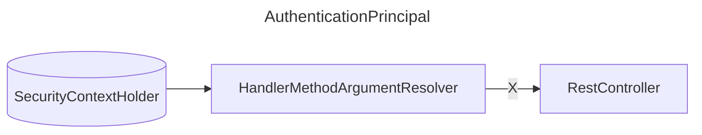

## 문제 설명

코틀린에서 JWT환경을 구성하고, `@AuthenticationPrincipal`을 사용하여 인증된 사용자 정보를 가져오려고 할 때 500 오류가 발생하는 경우가 있습니다.

JWT 필터에서 SecurityContextHolder에 인증정보를 저장하고, 컨트롤러에서 `@AuthenticationPrincipal`을 사용하여 인증된 사용자 정보를 가져오려고 할 때 다음과 같은 오류가 발생합니다.

개인적으로 개발의 편의를 위해서, 기본적으로 API를 모두 허용을 해두고, 필요한 API에 대해서만 권한을 설정하는 방식을 사용하고 있습니다.
그러다보니, 필터에서 403으로 반환하는게 아닌, 

```kotlin
/** 스프링 시큐리티 설정 */
@Configuration
@EnableMethodSecurity
class SecurityConfig(
    private val jwtProvider: JwtProvider,
) {
    @Bean
    fun securityFilterChain(http: HttpSecurity): SecurityFilterChain {
        return http
            .csrf { it.disable() }
            .headers { it.disable() }
            .sessionManagement { it.disable() }
            .authorizeHttpRequests { request ->
                request.anyRequest().permitAll()
            }
            .addFilterBefore(
                JwtTokenFilter(jwtProvider),
                BasicAuthenticationFilter::class.java,
            )
            .build()
    }
}
```

이곳 필터에서 403을 반환하는게 아닌, 메소드를 호출을 준비하는 과정에서 null-safety로 인해 500 오류가 발생합니다.
Java에서는 null이 들어가면 NPE가 발생하지만, 코틀린에서는 null이 들어가면서 메소드 호출 전부터 오류가 발생합니다.
따라서 다음과 같이 `@AuthenticationPrincipal`을 사용하여 인증된 사용자 정보를 가져오려고 하면 500 오류가 발생합니다.

```kotlin
@GetMapping
fun getNotifications(
    @AuthenticationPrincipal authenticatedUser: AuthenticatedUser,
): ResponseEntity<PagedModel<Notification>> {
    return ResponseEntity.ok(
      ...
    )
}
```




즉 HandlerMethodArgumentResolver에서 `@AuthenticationPrincipal`을 사용하여 인증된 사용자 정보를 가져오려고 할 때, SecurityContextHolder에 인증정보가 없어서 500 오류가 발생합니다.

## 해결 방법

`@AuthenticationPrincipal`을 사용하여 인증된 사용자 정보를 가져오려고 할 때, SecurityContextHolder에 인증정보가 없으면 예외를 발생시키도록 HandlerMethodArgumentResolver를 구현하여 해결할 수 있습니다.


```kotlin
class AuthenticationPrincipalArgumentResolver : HandlerMethodArgumentResolver {
    override fun supportsParameter(parameter: MethodParameter): Boolean {
        return parameter.hasParameterAnnotation(AuthenticationPrincipal::class.java)
    }

    override fun resolveArgument(
        parameter: MethodParameter,
        mavContainer: ModelAndViewContainer?,
        webRequest: NativeWebRequest,
        binderFactory: WebDataBinderFactory?,
    ): Any? {
        val auth = SecurityContextHolder.getContext().authentication
        if (auth == null || auth.principal == "anonymousUser") {
            throw UnauthorizedException("인증되지 않은 사용자입니다.")
        }
        return auth.principal
    }
}
```
