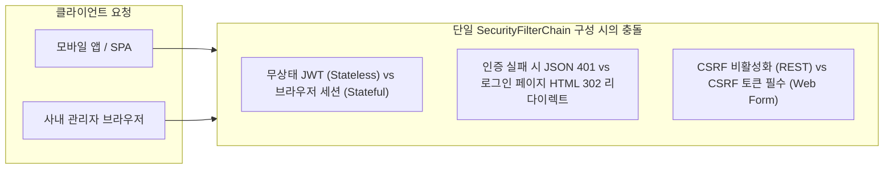
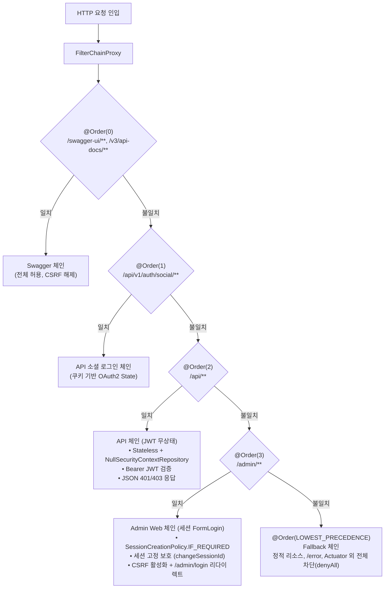

> 단일 스프링 부트 애플리케이션에서 무상태 REST API(JWT)와 사내 관리자 화면(세션 FormLogin)을 함께 운영할 때 발생하는 인증 및 세션 정책 충돌을 `@Order`와 `securityMatcher` 기반의 멀티 `SecurityFilterChain`으로 깔끔하게 격리하는 아키텍처 패턴을 소개합니다.
{: .prompt-info }

## 문제 상황: 하나의 스프링 앱에 API와 어드민이 공존할 때 발생하는 인증 충돌

모바일 앱이나 웹 프론트엔드를 위한 **REST API**와 사내 운영진을 위한 **백오피스 관리자 웹(Admin Web)**을 단일 스프링 부트 애플리케이션으로 함께 구축하는 경우가 많습니다.

하지만 스프링 시큐리티를 단일 `SecurityFilterChain`으로 구성하면 두 영역의 상반된 요구사항이 충돌합니다.



대표적인 충돌 지점은 세 가지입니다:

1. **세션 정책 충돌**: REST API는 완벽한 무상태(`STATELESS`)와 `Authorization: Bearer <token>` 헤더 인증을 요구하지만, 관리자 웹은 폼 로그인 후 브라우저 세션 쿠키(`IF_REQUIRED`)를 유지해야 합니다.
2. **인증 실패 처리 부조화**: 모바일 앱에서 토큰 없이 API를 요청했을 때 기대하는 응답은 정형화된 JSON 401 응답입니다. 하지만 단일 체인의 기본 예외 핸들러가 동작하면 관리자 로그인 화면(`/admin/login`)으로 `302 Redirection`되어 클라이언트 파싱 에러가 발생합니다.
3. **CSRF 보안 모델 상충**: 무상태 REST API는 자격 증명 쿠키를 전송하지 않아 CSRF를 비활성화하지만, 관리자 웹 폼은 세션 쿠키를 사용하므로 CSRF 보호가 반드시 활성화되어야 합니다.

이러한 문제를 해결하는 정석적인 방법이 스프링 시큐리티의 **멀티 SecurityFilterChain** 구조입니다.

---

## 아키텍처 설계: @Order와 securityMatcher로 분리하는 3대 보안 체인

스프링 시큐리티의 `FilterChainProxy`는 등록된 여러 `SecurityFilterChain` 빈들을 `@Order` 우선순위(낮은 숫자 우선)에 따라 순차 검사합니다. 그리고 요청 URL이 `securityMatcher` 조건에 일치하는 첫 번째 체인만 실행합니다.



체인 순서는 **범위가 좁고 구체적인 경로 매처를 상위에 배치**해야 합니다. 넓은 범위를 갖는 체인을 상단에 배치하면 하위 전용 체인들이 호출되지 않고 가로채입니다.

### 공통 보안 설정 및 Fallback 체인

전체 체인이 공유하는 `AuthenticationManager`와 최상위 Swagger 체인, 최하위 Fallback 체인을 정의합니다.

```kotlin
// src/main/kotlin/io/github/cmsong111/cotton_bat_server/security/SecurityConfig.kt
package io.github.cmsong111.cotton_bat_server.security

import io.github.cmsong111.cotton_bat_server.security.user.DomainUserDetailsService
import org.springframework.beans.factory.ObjectProvider
import org.springframework.boot.h2console.autoconfigure.H2ConsoleProperties
import org.springframework.boot.security.autoconfigure.web.servlet.PathRequest
import org.springframework.context.annotation.Bean
import org.springframework.context.annotation.Configuration
import org.springframework.core.Ordered
import org.springframework.core.annotation.Order
import org.springframework.security.authentication.AuthenticationManager
import org.springframework.security.authentication.ProviderManager
import org.springframework.security.authentication.dao.DaoAuthenticationProvider
import org.springframework.security.config.annotation.web.builders.HttpSecurity
import org.springframework.security.crypto.bcrypt.BCryptPasswordEncoder
import org.springframework.security.crypto.password.PasswordEncoder
import org.springframework.security.web.SecurityFilterChain

@Configuration
class SecurityConfig {

    @Bean
    fun passwordEncoder(): PasswordEncoder = BCryptPasswordEncoder()

    @Bean
    fun authenticationManager(
        userDetailsService: DomainUserDetailsService,
        passwordEncoder: PasswordEncoder,
    ): AuthenticationManager {
        val provider = DaoAuthenticationProvider(userDetailsService).apply {
            setPasswordEncoder(passwordEncoder)
        }
        return ProviderManager(provider)
    }

    @Bean
    @Order(0)
    fun swaggerFilterChain(http: HttpSecurity): SecurityFilterChain {
        http.securityMatcher("/swagger-ui/**", "/swagger-ui.html", "/v3/api-docs/**")
            .csrf { it.disable() }
            .authorizeHttpRequests { it.anyRequest().permitAll() }
        return http.build()
    }

    @Bean
    @Order(Ordered.LOWEST_PRECEDENCE)
    fun fallbackFilterChain(
        http: HttpSecurity,
        h2ConsoleProperties: ObjectProvider<H2ConsoleProperties>,
    ): SecurityFilterChain {
        val h2Console = h2ConsoleProperties.ifAvailable?.let { PathRequest.toH2Console() }
        http
            .authorizeHttpRequests {
                it.requestMatchers(PathRequest.toStaticResources().atCommonLocations()).permitAll()
                h2Console?.let { matcher -> it.requestMatchers(matcher).permitAll() }
                it.requestMatchers("/error", "/actuator/**").permitAll()
                it.anyRequest().denyAll()
            }
            .csrf { csrf -> h2Console?.let { csrf.ignoringRequestMatchers(it) } }
            .headers { headers -> headers.frameOptions { it.sameOrigin() } }
        return http.build()
    }
}
```

---

## API 체인 구현: BearerTokenAuthenticationFilter + NullSecurityContextRepository 완전 무상태 구성

REST API 체인의 핵심은 **'완전한 무상태성'**과 **'JSON 형식의 에러 응답'**입니다.

`SessionCreationPolicy.STATELESS`만 선언하면 스프링 시큐리티가 기존 세션의 컨텍스트를 조회할 여지가 남습니다. `NullSecurityContextRepository()`를 명시적으로 주입하여 컨텍스트의 세션 저장 및 조회를 원천 차단합니다.

```kotlin
// src/main/kotlin/io/github/cmsong111/cotton_bat_server/security/api/ApiSecurityConfig.kt
package io.github.cmsong111.cotton_bat_server.security.api

import io.github.cmsong111.cotton_bat_server.security.jwt.JwtProvider
import io.github.cmsong111.cotton_bat_server.user.domain.UserRole
import org.springframework.context.annotation.Bean
import org.springframework.context.annotation.Configuration
import org.springframework.core.annotation.Order
import org.springframework.http.HttpMethod
import org.springframework.security.config.annotation.web.builders.HttpSecurity
import org.springframework.security.config.http.SessionCreationPolicy
import org.springframework.security.oauth2.server.resource.authentication.JwtAuthenticationConverter
import org.springframework.security.oauth2.server.resource.authentication.JwtGrantedAuthoritiesConverter
import org.springframework.security.web.SecurityFilterChain
import org.springframework.security.web.context.NullSecurityContextRepository

@Configuration
class ApiSecurityConfig(
    private val apiSecurityHandlers: ApiSecurityHandlers,
) {

    @Bean
    @Order(2)
    fun apiFilterChain(http: HttpSecurity): SecurityFilterChain {
        http.securityMatcher("/api/**")
            .csrf { it.disable() }
            .sessionManagement { it.sessionCreationPolicy(SessionCreationPolicy.STATELESS) }
            .securityContext { it.securityContextRepository(NullSecurityContextRepository()) }
            .requestCache { it.disable() }
            .authorizeHttpRequests {
                it.requestMatchers(
                    HttpMethod.POST,
                    "/api/v1/auth/login",
                    "/api/v1/auth/join",
                    "/api/v1/auth/refresh",
                ).permitAll()
                it.requestMatchers("/api/v1/admin/**").hasRole(UserRole.ADMIN.name)
                it.anyRequest().authenticated()
            }
            .oauth2ResourceServer { resourceServer ->
                resourceServer.jwt { it.jwtAuthenticationConverter(jwtAuthenticationConverter()) }
                resourceServer.authenticationEntryPoint(apiSecurityHandlers)
                resourceServer.accessDeniedHandler(apiSecurityHandlers)
            }
            .exceptionHandling {
                it.authenticationEntryPoint(apiSecurityHandlers)
                it.accessDeniedHandler(apiSecurityHandlers)
            }
        return http.build()
    }

    private fun jwtAuthenticationConverter(): JwtAuthenticationConverter {
        val authoritiesConverter = JwtGrantedAuthoritiesConverter().apply {
            setAuthoritiesClaimName(JwtProvider.ROLES_CLAIM)
            setAuthorityPrefix(UserRole.ROLE_PREFIX)
        }
        return JwtAuthenticationConverter().apply {
            setJwtGrantedAuthoritiesConverter(authoritiesConverter)
        }
    }
}
```

### JSON 전용 예외 핸들러 구현

인증 실패(401) 및 권한 부족(403) 시 HTML 리다이렉트 대신 표준 JSON과 `WWW-Authenticate` 헤더를 반환하도록 `ApiSecurityHandlers`를 작성합니다.

```kotlin
// src/main/kotlin/io/github/cmsong111/cotton_bat_server/security/api/ApiSecurityHandlers.kt
package io.github.cmsong111.cotton_bat_server.security.api

import io.github.cmsong111.cotton_bat_server.auth.AuthErrorCode
import io.github.cmsong111.cotton_bat_server.common.ApiResponse
import io.github.cmsong111.cotton_bat_server.common.ErrorCode
import jakarta.servlet.http.HttpServletRequest
import jakarta.servlet.http.HttpServletResponse
import org.springframework.http.HttpHeaders
import org.springframework.http.MediaType
import org.springframework.security.access.AccessDeniedException
import org.springframework.security.core.AuthenticationException
import org.springframework.security.web.AuthenticationEntryPoint
import org.springframework.security.web.access.AccessDeniedHandler
import org.springframework.stereotype.Component
import tools.jackson.databind.json.JsonMapper

@Component
class ApiSecurityHandlers(
    private val jsonMapper: JsonMapper,
) : AuthenticationEntryPoint, AccessDeniedHandler {

    override fun commence(
        request: HttpServletRequest,
        response: HttpServletResponse,
        authException: AuthenticationException,
    ) {
        val errorCode = AuthErrorCode.UNAUTHORIZED
        response.setHeader(HttpHeaders.WWW_AUTHENTICATE, "Bearer")
        write(response, errorCode)
    }

    override fun handle(
        request: HttpServletRequest,
        response: HttpServletResponse,
        accessDeniedException: AccessDeniedException,
    ) {
        write(response, AuthErrorCode.ACCESS_DENIED)
    }

    private fun write(response: HttpServletResponse, errorCode: ErrorCode) {
        response.status = errorCode.status.value()
        response.contentType = MediaType.APPLICATION_JSON_VALUE
        response.characterEncoding = Charsets.UTF_8.name()
        jsonMapper.writeValue(response.outputStream, ApiResponse.error(errorCode))
    }
}
```

토큰 없이 API를 호출하면 로그인 페이지 리다이렉트 없이 즉시 JSON 401 응답을 수신합니다.


---

## 관리자 체인 구현: 세션 기반 FormLogin, CSRF 활성화, 커스텀 예외 핸들러

관리자 웹 체인은 운영진이 브라우저에서 안전하게 작업할 수 있도록 세션과 폼 로그인을 구성합니다.

- **세션 고정(Session Fixation) 방어**: 로그인 성공 시 `changeSessionId()`를 적용하여 세션 하이재킹을 방지합니다.
- **CSRF 토큰 활성화**: Thymeleaf의 `th:action` 폼을 통해 자동 주입되는 CSRF 토큰을 검증합니다.
- **예외 처리 분리**: 미인증 접근 시 `LoginUrlAuthenticationEntryPoint`를 통해 `/admin/login`으로 안내하고, 권한 부족 시 `/admin/403` 에러 페이지를 렌더링합니다.

```kotlin
// src/main/kotlin/io/github/cmsong111/cotton_bat_server/security/admin/AdminWebSecurityConfig.kt
package io.github.cmsong111.cotton_bat_server.security.admin

import io.github.cmsong111.cotton_bat_server.config.SessionConfig
import io.github.cmsong111.cotton_bat_server.user.domain.UserRole
import org.springframework.context.annotation.Bean
import org.springframework.context.annotation.Configuration
import org.springframework.core.annotation.Order
import org.springframework.security.config.annotation.web.builders.HttpSecurity
import org.springframework.security.config.http.SessionCreationPolicy
import org.springframework.security.web.SecurityFilterChain
import org.springframework.security.web.authentication.LoginUrlAuthenticationEntryPoint

@Configuration
class AdminWebSecurityConfig {

    @Bean
    @Order(3)
    fun adminWebFilterChain(http: HttpSecurity): SecurityFilterChain {
        http
            .securityMatcher("/admin/**")
            .authorizeHttpRequests {
                it.requestMatchers("/admin/login", "/admin/403").permitAll()
                it.anyRequest().hasRole(UserRole.ADMIN.name)
            }
            .formLogin {
                it.loginPage(LOGIN_PAGE)
                it.loginProcessingUrl(LOGIN_PAGE)
                it.defaultSuccessUrl("/admin/dashboard")
                it.failureUrl("$LOGIN_PAGE?error")
                it.permitAll()
            }
            .exceptionHandling {
                it.authenticationEntryPoint(LoginUrlAuthenticationEntryPoint(LOGIN_PAGE))
                it.accessDeniedPage("/admin/403")
            }
            .sessionManagement {
                it.sessionCreationPolicy(SessionCreationPolicy.IF_REQUIRED)
                it.sessionFixation { fixation -> fixation.changeSessionId() }
                it.invalidSessionUrl("$LOGIN_PAGE?expired")
            }
            .logout {
                it.logoutUrl("/admin/logout")
                it.logoutSuccessUrl("$LOGIN_PAGE?logout")
                it.invalidateHttpSession(true)
                it.clearAuthentication(true)
                it.deleteCookies(SessionConfig.SESSION_COOKIE_NAME)
            }
        return http.build()
    }

    companion object {
        const val LOGIN_PAGE = "/admin/login"
    }
}
```

관리자 로그인이 완료되면 브라우저에 `Set-Cookie: SESSION=...; HttpOnly; SameSite=Lax` 쿠키가 정상 발급되며 대시보드로 이동합니다.


---

## 결과 검증 및 MockMvc 테스트

체인이 의도대로 격리되었는지는 MockMvc 슬라이스 테스트로 명확히 입증할 수 있습니다.

### 1. API 체인 무상태 및 JSON 401 검증

API 체인은 유효한 Bearer JWT로 요청 시 세션 쿠키를 발급하지 않고(`Set-Cookie` 없음), 미인증 시 JSON 401을 반환해야 합니다.

```kotlin
// src/test/kotlin/io/github/cmsong111/cotton_bat_server/security/ApiSecurityTest.kt
package io.github.cmsong111.cotton_bat_server.security

import io.github.cmsong111.cotton_bat_server.support.IntegrationTestSupport
import org.junit.jupiter.api.DisplayName
import org.junit.jupiter.api.Test
import org.springframework.http.HttpHeaders
import org.springframework.test.web.servlet.get

@DisplayName("API 체인 (JWT, 무상태)")
class ApiSecurityTest : IntegrationTestSupport() {

    @Test
    fun `유효한 JWT로 인증되고 세션을 만들지 않는다`() {
        val user = createUser()

        mockMvc.get("/api/v1/users/me") {
            header(HttpHeaders.AUTHORIZATION, "Bearer ${accessTokenOf(user)}")
        }.andExpect {
            status { isOk() }
            jsonPath("$.data.id") { value(user.id.toString()) }
            header { doesNotExist(HttpHeaders.SET_COOKIE) }
            request { sessionAttributeDoesNotExist("SPRING_SECURITY_CONTEXT") }
        }
    }

    @Test
    fun `JWT가 없으면 로그인 리다이렉트 대신 JSON 401을 반환한다`() {
        mockMvc.get("/api/v1/users/me").andExpect {
            status { isUnauthorized() }
            content { contentTypeCompatibleWith("application/json") }
            jsonPath("$.success") { value(false) }
            jsonPath("$.code") { value("AUTH-000") }
            header { string(HttpHeaders.WWW_AUTHENTICATE, "Bearer") }
        }
    }
}
```

Swagger UI에서도 Authorization 헤더에 Bearer 토큰을 주입하면 기대한 대로 무상태 200 OK 응답이 정상 반환됩니다.


### 2. 관리자 체인 세션 고정 보호 및 리다이렉트 검증

관리자 체인은 미인증 시 `/admin/login`으로 302 리다이렉트되고, 로그인 시 세션 ID가 변경되어 세션 고정 공격을 방어합니다.

```kotlin
// src/test/kotlin/io/github/cmsong111/cotton_bat_server/security/AdminWebSecurityTest.kt
package io.github.cmsong111.cotton_bat_server.security

import io.github.cmsong111.cotton_bat_server.security.user.AuthUser
import io.github.cmsong111.cotton_bat_server.support.IntegrationTestSupport
import org.assertj.core.api.Assertions.assertThat
import org.junit.jupiter.api.DisplayName
import org.junit.jupiter.api.Test
import org.springframework.security.test.web.servlet.request.SecurityMockMvcRequestPostProcessors.csrf
import org.springframework.test.web.servlet.get
import org.springframework.test.web.servlet.post

@DisplayName("Admin Web 체인 (formLogin, 세션)")
class AdminWebSecurityTest : IntegrationTestSupport() {

    @Test
    fun `미인증 사용자는 로그인 페이지로 리다이렉트된다`() {
        mockMvc.get("/admin/dashboard").andExpect {
            status { is3xxRedirection() }
            redirectedUrl("/admin/login")
        }
    }

    @Test
    fun `로그인 성공 시 세션 ID가 바뀌고 인증 정보가 세션에 저장된다`() {
        val admin = createAdmin()
        val anonymousCookie = mockMvc.get("/admin/login").andReturn().sessionCookie()!!

        val result = mockMvc.post("/admin/login") {
            with(csrf())
            cookie(anonymousCookie)
            param("username", admin.email!!)
            param("password", PASSWORD)
        }.andExpect {
            status { is3xxRedirection() }
            redirectedUrl("/admin/dashboard")
        }.andReturn()

        val sessionCookie = result.sessionCookie()!!
        assertThat(sessionCookie.value).isNotEqualTo(anonymousCookie.value)
        assertThat(sessionCookie.isHttpOnly).isTrue()

        val principal = securityContextOf(sessionCookie)?.authentication?.principal
        assertThat(principal).isInstanceOf(AuthUser::class.java)
        assertThat((principal as AuthUser).id).isEqualTo(admin.id)
    }
}
```

---

## 정리 및 실무 권장 사항

단일 스프링 부트에서 이질적인 인증 모델을 공존시킬 때 기억해야 할 핵심 체크리스트입니다:

1. **`@Order` 우선순위의 엄격한 배치**: 구체적인 URL 패턴(`Swagger` ➔ `OAuth Callback` ➔ `/api/**` ➔ `/admin/**` ➔ `Fallback`) 순으로 배치해야 보안 필터 우회나 가로채기 사고를 예방할 수 있습니다.
2. **REST API 체인의 완전 무상태 봉인**: `SessionCreationPolicy.STATELESS` 선언뿐만 아니라 `NullSecurityContextRepository()`를 함께 지정하여 기존 세션 컨텍스트 조회를 차단하세요.
3. **체인별 맞춤 예외 핸들러 지정**: API 체인은 `ApiSecurityHandlers`로 정형화된 JSON과 `WWW-Authenticate` 헤더를 내려주고, 관리자 웹은 `LoginUrlAuthenticationEntryPoint`로 로그인 화면 이동을 분리하세요.
4. **명시적 Fallback 체인 구축**: 보안 설정이 누락된 신규 엔드포인트가 무방비로 노출되지 않도록 최하단 체인(`Ordered.LOWEST_PRECEDENCE`)에서 화이트리스트 외 요청을 `denyAll()`로 차단하는 방어적 설계를 권장합니다.
