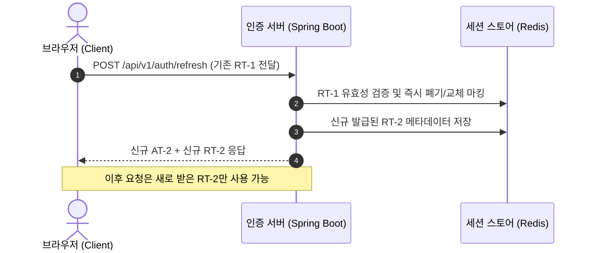
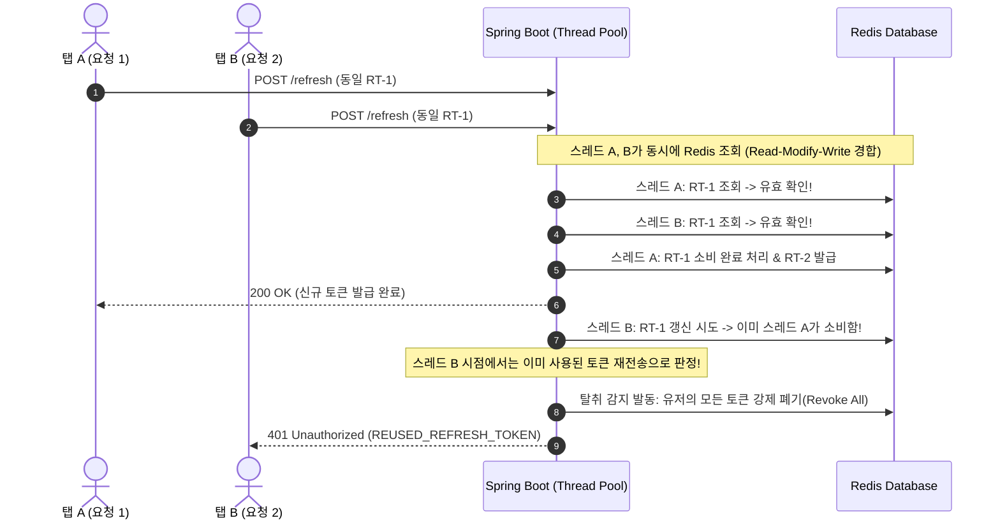

> Refresh Token Rotation(RTR) 환경에서 다중 탭이나 동시 API 호출로 인해 발생하는 토큰 갱신 경합(Race Condition) 문제를 분석하고, Redis Lua Script를 활용한 원자적 토큰 소비와 토큰 탈취 감지(Theft Detection) 로직으로 무중단 인증 안정성을 확보한 과정을 정리합니다.

---

## 1. 배경: 왜 단순 리프레시 토큰 대신 RTR을 도입했는가?

JWT(JSON Web Token) 기반 인증을 설계할 때 가장 흔히 마주치는 딜레마는 **Access Token의 만료 시간**과 **Refresh Token의 탈취 위험** 사이의 트레이드오프입니다. 

Access Token의 수명을 짧게(예: 15분~1시간) 유지하더라도, 리프레시 토큰이 14일이나 30일 동안 고정된 상태로 유지된다면 XSS 공격이나 네트워크 스니핑 등으로 리프레시 토큰이 한 번 유출되었을 때 공격자는 유효기간 내내 무제한으로 새 Access Token을 발급받을 수 있습니다. 서버가 모든 리프레시 토큰을 블랙리스트로 관리하지 않는 한, 탈취 사실을 인지하기조차 어렵습니다.

이 문제를 근본적으로 완화하기 위해 도입한 방식이 바로 **RTR(Refresh Token Rotation)**입니다.



RTR의 핵심 원칙은 **"리프레시 토큰은 단 1회만 사용 가능하며, 사용 즉시 새로운 리프레시 토큰으로 교체된다"**는 점입니다. 

또한 RFC 6749(OAuth 2.0 Threat Model)와 OAuth 2.0 Security Best Current Practice에 명시된 대로, **"이미 교체된 구(Old) 리프레시 토큰이 다시 인증 엔드포인트로 들어오면 토큰 탈취로 간주하고, 해당 사용자의 모든 세션을 즉시 강제 로그아웃(Revoke All)"**시키는 강력한 보안 정책을 함께 적용했습니다.

---

## 2. 문제 상황: 다중 탭 환경에서의 동시 요청 경합(Race Condition)과 원치 않는 로그아웃

로컬 단일 요청 환경에서는 아무런 문제가 없었으나, 실제 프론트엔드 연동 테스트 중 심각한 사용성 결함이 드러났습니다. 바로 **브라우저 다중 탭** 환경과 **페이지 진입 시 동시 다발적인 API 호출** 상황이었습니다.

대시보드 페이지에 진입할 때 사용자 프로필, 알림 목록, 최근 활동 내역 등 3~4개의 API가 동시에 비동기로 호출됩니다. 만약 이때 사용자의 Access Token이 만료된 상태라면, 여러 요청이 거의 같은 밀리초(ms) 단위로 `401 Unauthorized`를 반환받고 일제히 `/api/v1/auth/refresh`로 동일한 구 리프레시 토큰을 들고 쇄도합니다.



애플리케이션 계층에서 흔히 작성하는 `findById()` 후 비즈니스 로직 처리, 그리고 `save()`나 `delete()`를 호출하는 전형적인 Read-Modify-Write 패턴에서는 스레드 간 원자성이 보장되지 않습니다.

그 결과, 정상적인 사용자가 탭 두 개를 열어두었을 뿐인데 뒤늦게 처리된 스레드가 **"이미 사용된 토큰을 다시 보낸 공격자"**로 오인하여 탈취 감지 로직을 발동시키고, 유저의 모든 기기 세션을 한순간에 폭파해 버리는 치명적인 오탐(False Positive)이 발생했습니다.

---

## 3. 해결 방법 1: Redis 안에서 원자적으로 처리하는 토큰 소비(Lua Script / Atomic Op)

이 문제를 해결하기 위해 분산 락(Redisson)을 고려할 수도 있었지만, 토큰 갱신 엔드포인트는 호출 빈도가 잦고 응답 지연이 사용자 경험에 직결되는 지점입니다. 락 획득과 해제를 위한 추가 왕복 네트워크 비용 없이, **Redis 단일 실행 환경의 특성을 살려 한 번의 네트워크 왕복(1 RTT)으로 원자적 검증과 소비를 끝낼 수 있는 Redis Lua Script** 방식을 선택했습니다.

먼저 Redis에 저장되는 리프레시 토큰 엔티티의 메타데이터 구조입니다. 토큰 원문은 유출 방지를 위해 단방향 SHA-256 해시로 저장하며, 탈취 감지를 위해 사용 시각(`rotatedAt`)을 기록할 수 있도록 설계했습니다.

```kotlin
// src/main/kotlin/io/github/cmsong111/cotton_bat_server/auth/domain/RefreshToken.kt
package io.github.cmsong111.cotton_bat_server.auth.domain

import java.time.Instant
import org.springframework.data.annotation.Id
import org.springframework.data.redis.core.RedisHash
import org.springframework.data.redis.core.TimeToLive
import org.springframework.data.redis.core.index.Indexed

@RedisHash("refreshToken")
class RefreshToken(
    @Id
    val tokenHash: String,

    @Indexed
    val userId: String,

    val userAgent: String?,
    val clientIp: String,
    val createdAt: Instant = Instant.now(),
    var rotatedAt: Instant? = null,

    val tokenVersion: String = "",

    @TimeToLive
    var ttlSeconds: Long,
)
```

실제 Redis CLI에서 확인한 엔티티의 Hash 구조는 다음과 같습니다:


핵심은 토큰을 갱신할 때 즉시 `DEL`로 삭제하지 않고, **기존 TTL을 그대로 보존하면서 `rotatedAt` 타임스탬프 필드를 원자적으로 기록**하는 것입니다.

```kotlin
// src/main/kotlin/io/github/cmsong111/cotton_bat_server/auth/application/TokenService.kt
package io.github.cmsong111.cotton_bat_server.auth.application

import io.github.cmsong111.cotton_bat_server.auth.AuthErrorCode
import io.github.cmsong111.cotton_bat_server.auth.domain.RefreshToken
import io.github.cmsong111.cotton_bat_server.auth.domain.RefreshTokenRepository
import io.github.cmsong111.cotton_bat_server.auth.dto.response.TokenResponse
import io.github.cmsong111.cotton_bat_server.common.BusinessException
import io.github.cmsong111.cotton_bat_server.security.jwt.JwtProperties
import io.github.cmsong111.cotton_bat_server.security.jwt.JwtProvider
import io.github.cmsong111.cotton_bat_server.security.user.AuthUser
import io.github.cmsong111.cotton_bat_server.user.domain.UserRepository
import java.security.MessageDigest
import java.time.Instant
import java.util.Base64
import java.util.UUID
import org.springframework.data.redis.core.StringRedisTemplate
import org.springframework.data.redis.core.script.DefaultRedisScript
import org.springframework.stereotype.Service
import org.springframework.transaction.annotation.Transactional

@Service
class TokenService(
    private val jwtProvider: JwtProvider,
    private val jwtProperties: JwtProperties,
    private val refreshTokenRepository: RefreshTokenRepository,
    private val userRepository: UserRepository,
    private val redis: StringRedisTemplate,
    private val tokenVersions: TokenVersionStore,
) {

    @Transactional(readOnly = true)
    fun rotate(refreshToken: String): TokenResponse {
        val tokenHash = hash(refreshToken)
        val stored = refreshTokenRepository.findById(tokenHash).orElse(null)
            ?: throw BusinessException(AuthErrorCode.INVALID_REFRESH_TOKEN)

        if (stored.tokenVersion != tokenVersions.current(stored.userId)) {
            throw BusinessException(AuthErrorCode.INVALID_REFRESH_TOKEN)
        }

        // Lua Script로 원자적 검증과 rotatedAt 마킹을 단일 연산으로 수행
        when (redis.execute(ROTATE_SCRIPT, listOf("refreshToken:$tokenHash"), Instant.now().toString())) {
            1L -> Unit // 첫 번째 소비 요청 성공
            2L -> {
                // 이미 교체된 토큰이 다시 유입됨 -> 탈취 감지 발동
                revokeAll(stored.userId)
                throw BusinessException(AuthErrorCode.REUSED_REFRESH_TOKEN)
            }
            else -> throw BusinessException(AuthErrorCode.INVALID_REFRESH_TOKEN)
        }

        val user = userRepository.findById(UUID.fromString(stored.userId)).orElse(null)
            ?: throw BusinessException(AuthErrorCode.INVALID_REFRESH_TOKEN)

        if (stored.tokenVersion != tokenVersions.forIssue(stored.userId)) {
            throw BusinessException(AuthErrorCode.INVALID_REFRESH_TOKEN)
        }

        val tokens = issue(AuthUser.from(user), stored.tokenVersion)
        if (stored.tokenVersion != tokenVersions.current(stored.userId)) {
            revoke(tokens.refreshToken)
            throw BusinessException(AuthErrorCode.INVALID_REFRESH_TOKEN)
        }
        return tokens
    }

    private fun hash(token: String): String {
        val digest = MessageDigest.getInstance("SHA-256").digest(token.toByteArray())
        return Base64.getUrlEncoder().withoutPadding().encodeToString(digest)
    }

    companion object {
        private val ROTATE_SCRIPT = DefaultRedisScript(
            """
            if redis.call('EXISTS', KEYS[1]) == 0 then return 0 end
            if redis.call('HEXISTS', KEYS[1], 'rotatedAt') == 1 then return 2 end
            redis.call('HSET', KEYS[1], 'rotatedAt', ARGV[1])
            return 1
            """.trimIndent(),
            Long::class.javaObjectType,
        )
    }
}
```

이 Lua 스크립트가 반환하는 세 가지 코드의 의미는 다음과 같습니다:
- **`0`**: 해당 키가 Redis에 존재하지 않음 (만료되었거나 유효하지 않은 토큰).
- **`1`**: 정상적인 최초 갱신 요청. 원자적으로 `rotatedAt` 필드를 기록하고 성공 처리.
- **`2`**: 이미 `rotatedAt`이 기록된 토큰. 즉, 과거에 이미 한 번 교체되었던 토큰이 다시 제출됨.

Redis의 단일 스레드 명령어 실행 특성상, 100개의 요청이 동시에 도착하더라도 **오직 가장 먼저 도착한 단 하나의 요청만 `1L`을 반환받고**, 나머지 99개의 요청은 정확하게 `2L`을 반환받게 됩니다.

---

## 4. 해결 방법 2: 이미 사용된 토큰 재전송 시 탈취로 간주하고 전체 기기 강제 로그아웃

Lua 스크립트 실행 결과가 `2L`이라는 것은, 이미 새로운 리프레시 토큰이 정상 발급되어 나갔음에도 불구하고 과거의 토큰이 다시 사용되었다는 명백한 증거입니다.

이는 정상적인 사용자 흐름에서는 결코 일어날 수 없으며, **공격자가 패킷을 가로채 복제해 두었던 옛 토큰을 제출했거나, 반대로 공격자가 먼저 갱신을 낚아채 간 후 진짜 사용자가 뒤늦게 접속을 시도한 상황**에 해당합니다.

따라서 보안을 위해 해당 사용자의 모든 기기 세션을 일괄 무효화합니다:

```kotlin
// src/main/kotlin/io/github/cmsong111/cotton_bat_server/auth/application/TokenService.kt (계속)
fun revokeAll(userId: String) {
    tokenVersions.revoke(userId)
    refreshTokenRepository.deleteAll(refreshTokenRepository.findAllByUserId(userId))
}
```

```kotlin
// src/main/kotlin/io/github/cmsong111/cotton_bat_server/auth/application/TokenVersionStore.kt
package io.github.cmsong111.cotton_bat_server.auth.application

import io.github.cmsong111.cotton_bat_server.security.jwt.JwtProperties
import java.util.UUID
import org.springframework.data.redis.core.StringRedisTemplate
import org.springframework.stereotype.Component

@Component
class TokenVersionStore(
    private val redis: StringRedisTemplate,
    properties: JwtProperties,
) {
    private val ttl = maxOf(properties.refreshTokenTtl, properties.accessTokenTtl) + properties.clockSkew

    fun current(userId: String): String = redis.opsForValue().get(key(userId)) ?: ""

    fun forIssue(userId: String): String = redis.opsForValue().getAndExpire(key(userId), ttl) ?: ""

    fun revoke(userId: String) {
        redis.opsForValue().set(key(userId), UUID.randomUUID().toString(), ttl)
    }

    private fun key(userId: String): String = "token:version:$userId"
}
```

`revokeAll`이 호출되면:
1. `TokenVersionStore`에 저장된 유저의 `token:version:<userId>` 값이 새로운 UUID로 갱신됩니다. 기존 Access Token의 payload에 담긴 `tokenVersion`과 불일치하게 되므로, 남아있는 모든 Access Token도 즉각 무효화됩니다.
2. Redis에 저장되어 있던 해당 사용자의 모든 리프레시 토큰 엔티티가 일괄 삭제됩니다.
3. 클라이언트에는 `401 Unauthorized`와 함께 `AUTH-006 (REUSED_REFRESH_TOKEN)` 에러 코드를 반환합니다.


---

## 5. 프론트엔드 연동 팁 (BroadcastChannel / 단일 갱신 Mutex)

백엔드에서 Lua 스크립트로 데이터 무결성을 보장하더라도, 프론트엔드가 아무런 대비 없이 동시 요청을 보내면 실패한 요청들은 `REUSED_REFRESH_TOKEN` 에러를 맞닥뜨리게 됩니다.

따라서 클라이언트 계층에서도 **동시 갱신 요청 자체를 직렬화(Serialization)**하는 2중 안전장치가 필요합니다.

### 1) 단일 탭 내 Axios Interceptor Promise Mutex
동일 탭 안에서 3~4개의 API가 동시에 401을 반환받을 때는, 첫 번째 요청만 리프레시 API를 호출하고 나머지 요청들은 그 Promise를 공유하여 대기하도록 만듭니다:

```typescript
// frontend/src/api/client.ts
let refreshPromise: Promise<string> | null = null;

apiClient.interceptors.response.use(
  (response) => response,
  async (error) => {
    const originalRequest = error.config;
    if (error.response?.status === 401 && !originalRequest._retry) {
      originalRequest._retry = true;

      if (!refreshPromise) {
        refreshPromise = requestNewTokens().finally(() => {
          refreshPromise = null;
        });
      }

      const newAccessToken = await refreshPromise;
      originalRequest.headers.Authorization = `Bearer ${newAccessToken}`;
      return apiClient(originalRequest);
    }
    return Promise.reject(error);
  }
);
```

### 2) 다중 탭 간 동기화 (`BroadcastChannel`)
브라우저 탭 간에는 메모리가 공유되지 않으므로 최신 웹 표준인 `BroadcastChannel` API를 사용해 토큰 갱신 이벤트를 전파합니다:

```typescript
// frontend/src/auth/tabSync.ts
const authChannel = new BroadcastChannel('auth_channel');

authChannel.onmessage = (event) => {
  if (event.data.type === 'TOKEN_ROTATED') {
    // 다른 탭에서 이미 토큰을 교체했으므로 새 토큰을 로컬에 반영
    setStoredAccessToken(event.data.accessToken);
  }
};

export function notifyTokenRotated(accessToken: string) {
  authChannel.postMessage({ type: 'TOKEN_ROTATED', accessToken });
}
```

이 두 가지를 적용하면 브라우저 레벨에서 불필요한 동시 갱신 요청이 사전에 차단되며, 네트워크 지연으로 인해 드물게 서버까지 쇄도하더라도 백엔드의 Lua 스크립트가 완벽하게 안전망 역할을 수행합니다.

---

## 6. 결과 검증 및 동시성 테스트

구현한 로직이 실제 고부하 동시성 상황에서도 단 하나의 요청만 성공시키는지 검증하기 위해, `CountDownLatch`와 스레드 풀을 활용한 통합 테스트를 작성했습니다.

```kotlin
// src/test/kotlin/io/github/cmsong111/cotton_bat_server/auth/RefreshTokenConcurrencyTest.kt
package io.github.cmsong111.cotton_bat_server.auth

import io.github.cmsong111.cotton_bat_server.auth.application.TokenService
import io.github.cmsong111.cotton_bat_server.auth.dto.response.TokenResponse
import io.github.cmsong111.cotton_bat_server.common.BusinessException
import io.github.cmsong111.cotton_bat_server.security.user.AuthUser
import io.github.cmsong111.cotton_bat_server.support.IntegrationTestSupport
import java.util.concurrent.CountDownLatch
import java.util.concurrent.Executors
import java.util.concurrent.TimeUnit
import org.assertj.core.api.Assertions.assertThat
import org.junit.jupiter.api.Test
import org.springframework.beans.factory.annotation.Autowired

class RefreshTokenConcurrencyTest : IntegrationTestSupport() {
    @Autowired
    private lateinit var tokenService: TokenService

    @Test
    fun `같은 리프레시 토큰을 동시에 교체해도 최대 한 요청만 성공한다`() {
        val user = createUser()
        Executors.newFixedThreadPool(8).use { executor ->
            repeat(10) {
                val first = tokenService.issue(AuthUser.from(user)).refreshToken
                val ready = CountDownLatch(8)
                val start = CountDownLatch(1)
                val futures = (1..8).map {
                    executor.submit<Result<TokenResponse>> {
                        ready.countDown()
                        check(start.await(5, TimeUnit.SECONDS))
                        runCatching { tokenService.rotate(first) }
                    }
                }
                check(ready.await(5, TimeUnit.SECONDS))
                start.countDown() // 8개 스레드가 동시에 rotate 호출 시작

                val results = futures.map { it.get(10, TimeUnit.SECONDS) }
                
                // 오직 1개 이하의 요청만 성공해야 함
                assertThat(results.count { it.isSuccess }).isLessThanOrEqualTo(1)
                assertThat(results.mapNotNull { it.exceptionOrNull() }).allMatch { it is BusinessException }
                tokenService.revokeAll(user.id.toString())
            }
        }
    }
}
```

8개의 스레드가 완벽히 동일한 타이밍에 1개의 리프레시 토큰으로 갱신을 경합하도록 설계하고 10회 반복 실행했습니다.


테스트 결과, 모든 반복 회차에서 정확히 1개의 스레드만 갱신에 성공하고 나머지 스레드는 원자적으로 차단되었으며 테스트 스위트 전체가 깔끔하게 통과되었습니다.

---

## 7. 정리

보안을 강화하기 위해 도입한 Refresh Token Rotation(RTR)은 필연적으로 **분산 환경과 다중 클라이언트의 동시성 문제**를 동반합니다. 

단순히 DB나 캐시 엔티티를 조회하고 수정하는 방식으로는 동시 요청 경합을 제어할 수 없으며, 사용자 세션이 통째로 날아가는 치명적인 부작용을 낳게 됩니다.

이번 트러블슈팅을 통해 도출한 핵심 원칙은 다음과 같습니다:

1. **상태 변경의 원자화**: 분산 락의 무거운 오버헤드 대신 **Redis Lua Script**를 활용하여 토큰 유효성 검증과 소비 마킹을 1 RTT 내에 원자적으로 끝냈습니다.
2. **탈취 감지와 즉각적 대응**: 사용 완료된 토큰의 재사용 시도를 명확히 포착하여, OAuth 2.0 보안 표준에 부합하도록 해당 사용자의 모든 활성 토큰을 무효화했습니다.
3. **프론트엔드 계층의 직렬화**: 단일 탭 내 Promise Mutex와 다중 탭 간 `BroadcastChannel`을 결합하여 불필요한 경쟁 요청 자체를 최소화했습니다.

RTR 기반의 안전한 인증 시스템을 구축하고자 하시는 분들께 본 글의 원자적 처리 및 동시성 제어 방식이 실질적인 도움이 되기를 바랍니다.
