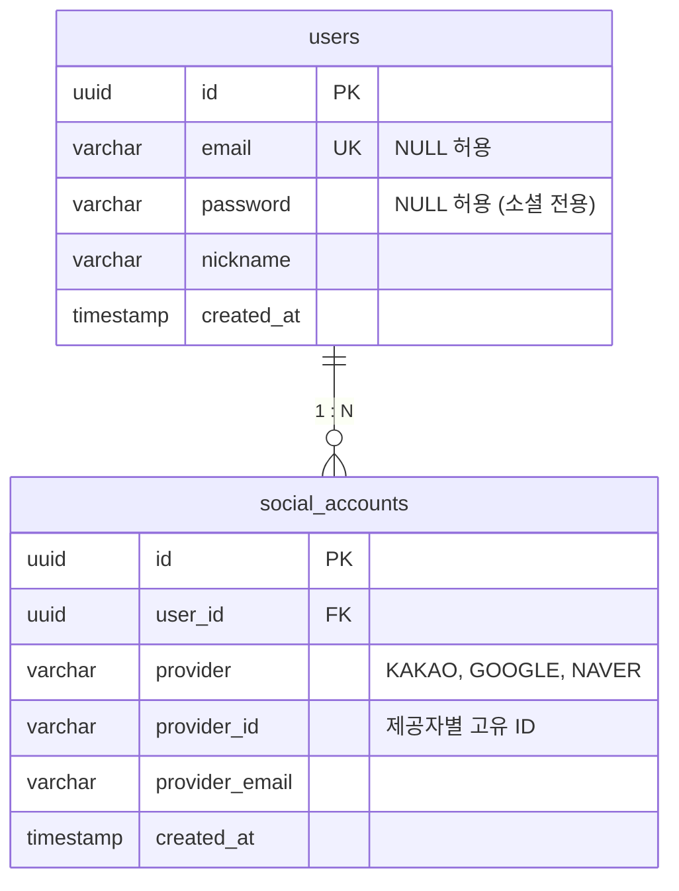
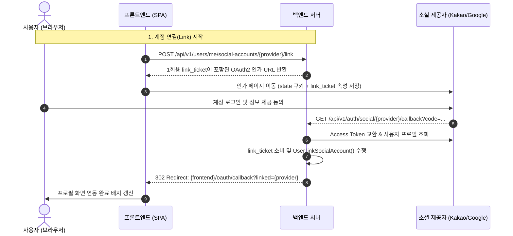

> 소셜 로그인 구현 시 흔히 범하는 `User` 엔티티 내 단일 소셜 ID 매핑의 한계를 극복하기 위해 `User`와 `SocialAccount`를 1:N 관계로 모델링하고, 무상태 API 환경과 세션 기반 관리자 콘솔의 OAuth2 보안 진입점을 깔끔하게 분리 설계한 실무 경험을 공유합니다.

---

## 1. 기획 요구사항: 1개 계정에 여러 소셜 로그인 연결 및 해제

초기 서비스 개발 시에는 카카오 로그인 하나만 빠르게 붙여 출시하는 경우가 많습니다. 이때 가장 흔히 선택하는 손쉬운 방식이 `User` 테이블에 `oauth_provider`와 `oauth_id` 컬럼을 직접 추가하는 형태입니다.

하지만 서비스가 성장하며 구글, 네이버, 애플 등 다양한 소셜 제공자(IdP)를 추가해야 할 때 문제가 발생합니다. 컬럼을 무작정 늘리면(`kakao_id`, `google_id`, `naver_id`) 제공자가 추가될 때마다 DDL 마이그레이션이 필요하고 도메인 응집도가 떨어집니다.

실무 서비스에서 요구되는 핵심 기획 규칙은 다음과 같습니다:

1. **다중 연동(1:N)**: 1명의 회원이 카카오, 구글, 네이버 계정을 동시에 연동해 두고 어떤 계정으로 로그인해도 동일한 내 계정으로 진입할 수 있어야 합니다.
2. **타인 계정 중복 연동 방지**: 이미 다른 사용자가 연동해 둔 소셜 계정은 내 계정에 연결할 수 없습니다.
3. **최소 1개 로그인 수단 보장**: 자체 비밀번호가 없는 소셜 가입 사용자가 유일한 소셜 연동마저 해제해 버리면 계정에 다시는 로그인할 수 없으므로, 마지막 로그인 수단 해제는 차단해야 합니다.
4. **계정 탈취(Account Takeover) 방지**: 이메일 주소가 같다는 이유만으로 기존 계정에 소셜을 자동으로 연결해선 안 됩니다. 이메일 소유권 검증 절차 없이 자동 병합하면 타인이 소셜 계정을 악용해 기존 계정을 탈취할 수 있습니다.

---

## 2. 도메인 모델링: `User`와 `SocialAccount`의 1:N 분리

위 요구사항을 충족하기 위해 `User`와 `SocialAccount`를 독립된 엔티티로 분리하고 1:N 양방향 관계로 구성합니다.



### 복합 유니크 제약 조건 (Unique Constraints)

데이터 정합성을 위해 `social_accounts` 테이블에는 두 가지 복합 유니크 제약을 반드시 설정해야 합니다:

- `uk_social_account_provider_id (provider, provider_id)`: 특정 플랫폼의 소셜 고유 ID는 전체 시스템에서 단 1명의 사용자에게만 귀속됩니다.
- `uk_social_account_user_provider (user_id, provider)`: 한 사용자가 동일한 제공자(예: 카카오 계정 2개)를 중복해서 연결할 수 없습니다.

```kotlin
// src/main/kotlin/io/github/cmsong111/cotton_bat_server/user/domain/SocialAccount.kt
package io.github.cmsong111.cotton_bat_server.user.domain

import io.github.cmsong111.cotton_bat_server.common.BaseEntity
import jakarta.persistence.Column
import jakarta.persistence.Entity
import jakarta.persistence.EnumType
import jakarta.persistence.Enumerated
import jakarta.persistence.FetchType
import jakarta.persistence.GeneratedValue
import jakarta.persistence.Id
import jakarta.persistence.JoinColumn
import jakarta.persistence.ManyToOne
import jakarta.persistence.Table
import jakarta.persistence.UniqueConstraint
import java.util.UUID
import org.hibernate.annotations.UuidGenerator

@Entity
@Table(
    name = "social_accounts",
    uniqueConstraints = [
        UniqueConstraint(name = "uk_social_account_provider_id", columnNames = ["provider", "provider_id"]),
        UniqueConstraint(name = "uk_social_account_user_provider", columnNames = ["user_id", "provider"]),
    ]
)
class SocialAccount(
    @Id
    @GeneratedValue
    @UuidGenerator(style = UuidGenerator.Style.VERSION_7)
    @Column(columnDefinition = "UUID", updatable = false)
    var id: UUID? = null,

    @ManyToOne(fetch = FetchType.LAZY, optional = false)
    @JoinColumn(name = "user_id", nullable = false)
    val user: User,

    @Enumerated(EnumType.STRING)
    @Column(nullable = false)
    val provider: Provider,

    @Column(name = "provider_id", nullable = false)
    val providerId: String,

    @Column(nullable = true)
    var providerEmail: String? = null,
) : BaseEntity()
```

### `User` 애그리게이트 루트 내 연동/해제 캡슐화

소셜 계정의 연결과 해제, 마지막 로그인 수단 보호 비즈니스 로직은 `User` 도메인 엔티티 내에 직접 캡슐화합니다.

```kotlin
// src/main/kotlin/io/github/cmsong111/cotton_bat_server/user/domain/User.kt
package io.github.cmsong111.cotton_bat_server.user.domain

import io.github.cmsong111.cotton_bat_server.common.BaseEntity
import io.github.cmsong111.cotton_bat_server.common.BusinessException
import jakarta.persistence.CascadeType
import jakarta.persistence.Column
import jakarta.persistence.Entity
import jakarta.persistence.GeneratedValue
import jakarta.persistence.Id
import jakarta.persistence.OneToMany
import jakarta.persistence.Table
import java.time.Instant
import java.util.UUID
import org.hibernate.annotations.UuidGenerator

@Entity
@Table(name = "users")
class User(
    @Id
    @GeneratedValue
    @UuidGenerator(style = UuidGenerator.Style.VERSION_7)
    @Column(columnDefinition = "UUID", updatable = false)
    var id: UUID? = null,

    @Column(unique = true, nullable = true)
    var email: String? = null,

    @Column(nullable = true)
    var password: String? = null,

    @Column(nullable = false)
    var nickname: String,

    @OneToMany(mappedBy = "user", cascade = [CascadeType.ALL], orphanRemoval = true)
    val socialAccounts: MutableSet<SocialAccount> = mutableSetOf(),
) : BaseEntity() {

    fun linkSocialAccount(provider: Provider, providerId: String, providerEmail: String?): SocialAccount {
        if (socialAccounts.any { it.provider == provider }) {
            throw BusinessException(SocialErrorCode.PROVIDER_ALREADY_LINKED)
        }
        val account = SocialAccount(
            user = this,
            provider = provider,
            providerId = providerId,
            providerEmail = providerEmail,
        )
        socialAccounts.add(account)
        return account
    }

    fun unlinkSocialAccount(provider: Provider) {
        val account = socialAccounts.find { it.provider == provider }
            ?: throw BusinessException(SocialErrorCode.SOCIAL_ACCOUNT_NOT_FOUND)

        // 비밀번호가 없는 소셜 전용 유저의 경우 마지막 남은 1개 수단 해제 거부
        if (password == null && socialAccounts.size == 1) {
            throw BusinessException(SocialErrorCode.LAST_LOGIN_METHOD)
        }
        socialAccounts.remove(account)
    }

    override fun onDelete(at: Instant) {
        socialAccounts.clear()
        email = email?.let { deletedEmail(it, at) }
    }
}
```

---

## 3. 소셜 인가 코드 교환 및 계정 연결(Link) 워크플로우

소셜 플로우는 크게 **로그인(Sign In)**과 이미 로그인된 상태에서 수행하는 **계정 연결(Link)**로 나뉩니다.



계정 연결 요청 시 백엔드는 유효시간 60초의 1회용 `link_ticket`을 발급합니다.
`LinkTicketAuthorizationRequestResolver`가 이를 가로채어 `OAuth2AuthorizationRequest`의 내부 속성에 안전하게 보관합니다. 콜백 성공 시 해당 티켓을 검증/소비하여 현재 로그인된 사용자의 식별자를 안전하게 복원하고 연동합니다.

---

## 4. 진입점 분리: 일반 사용자(SPA/JWT) vs 관리자(Thymeleaf/Session)

소셜 로그인을 구현할 때 가장 큰 설계 고민 중 하나는 **일반 사용자와 사내 관리자의 보안 요구사항이 완전히 다르다**는 점입니다.

- **일반 사용자(API)**: REST API 및 SPA(React/Next.js) 환경으로 서버는 완전한 무상태(Stateless)를 유지해야 하며, 인증 수단은 JWT(Access/Refresh Token)입니다.
- **관리자 콘솔(Admin Web)**: 사내 백오피스(Thymeleaf) 환경으로 보안을 위해 Spring Session(Redis 기반 `HttpSession`)과 CSRF 토큰 검증, 세션 고정 보호(Session Fixation Protection)가 필수입니다.
- **가입 정책 차이**: 일반 사용자는 소셜 최초 로그인 시 자동 회원가입(`allowSignUp = true`)이 되어야 하지만, 관리자는 등록되지 않은 외부인이 소셜 계정으로 로그인한다고 관리자로 승격되면 안 되므로 사전 연동된 계정만 허용(`allowSignUp = false`)해야 합니다.

### 스프링 시큐리티 필터 체인 분리

스프링 시큐리티에서 두 진입점을 독립된 `SecurityFilterChain` 빈으로 분리합니다.

```kotlin
// src/main/kotlin/io/github/cmsong111/cotton_bat_server/security/api/ApiSecurityConfig.kt
@Configuration
class ApiSecurityConfig(
    private val apiSecurityHandlers: ApiSecurityHandlers,
    @Value("\${app.frontend.url}") private val frontendUrl: String,
) {
    @Bean
    @Order(1)
    fun apiSocialLoginFilterChain(
        http: HttpSecurity,
        clientRegistrationRepository: ClientRegistrationRepository,
        authorizationRequestRepository: CookieOAuth2AuthorizationRequestRepository,
        socialOAuth2UserService: SocialOAuth2UserService,
        apiSocialLoginHandler: ApiSocialLoginHandler,
    ): SecurityFilterChain {
        http
            .securityMatcher(
                OrRequestMatcher(
                    PathPatternRequestMatcher.withDefaults().matcher(HttpMethod.GET, "/api/v1/auth/social/{provider}"),
                    PathPatternRequestMatcher.withDefaults().matcher(HttpMethod.GET, "/api/v1/auth/social/{provider}/callback"),
                )
            )
            .csrf { it.disable() }
            .sessionManagement { it.sessionCreationPolicy(SessionCreationPolicy.STATELESS) }
            .securityContext { it.securityContextRepository(NullSecurityContextRepository()) }
            .oauth2Login { oauth2 ->
                oauth2.authorizationEndpoint {
                    it.baseUri("/api/v1/auth/social")
                    it.authorizationRequestRepository(authorizationRequestRepository)
                    it.authorizationRequestResolver(
                        ApiSocialLoginHandler.LinkTicketAuthorizationRequestResolver(clientRegistrationRepository, "/api/v1/auth/social")
                    )
                }
                oauth2.redirectionEndpoint { it.baseUri("/api/v1/auth/social/*/callback") }
                oauth2.userInfoEndpoint { it.userService(socialOAuth2UserService) }
                oauth2.successHandler(apiSocialLoginHandler)
                oauth2.failureHandler(apiSocialLoginHandler)
            }
        return http.build()
    }
}
```

```kotlin
// src/main/kotlin/io/github/cmsong111/cotton_bat_server/security/admin/AdminWebSecurityConfig.kt
@Configuration
class AdminWebSecurityConfig {
    @Bean
    @Order(3)
    fun adminWebFilterChain(
        http: HttpSecurity,
        clientRegistrationRepository: ClientRegistrationRepository,
        socialOAuth2UserService: SocialOAuth2UserService,
        adminSocialLoginHandler: AdminSocialLoginHandler,
    ): SecurityFilterChain {
        http
            .securityMatcher("/admin/**")
            .authorizeHttpRequests {
                it.requestMatchers("/admin/login", "/admin/403").permitAll()
                it.anyRequest().hasRole(UserRole.ADMIN.name)
            }
            .formLogin {
                it.loginPage("/admin/login")
                it.defaultSuccessUrl("/admin/dashboard")
            }
            .oauth2Login { oauth2 ->
                oauth2.loginPage("/admin/login")
                oauth2.authorizationEndpoint {
                    it.baseUri("/admin/oauth2/authorization")
                    it.authorizationRequestResolver(
                        AdminSocialLoginHandler.AdminAuthorizationRequestResolver(
                            clientRegistrationRepository,
                            "/admin/oauth2/authorization",
                            "/admin/login/oauth2/code",
                        )
                    )
                }
                oauth2.redirectionEndpoint { it.baseUri("/admin/login/oauth2/code/*") }
                oauth2.userInfoEndpoint { it.userService(socialOAuth2UserService) }
                oauth2.successHandler(adminSocialLoginHandler)
                oauth2.failureHandler(adminSocialLoginHandler)
            }
            .sessionManagement {
                it.sessionCreationPolicy(SessionCreationPolicy.IF_REQUIRED)
                it.sessionFixation { fixation -> fixation.changeSessionId() }
            }
        return http.build()
    }
}
```

### 쿠키 기반 State 저장소 (`CookieOAuth2AuthorizationRequestRepository`)

API 체인은 서버 세션을 일체 생성하지 않으므로(`STATELESS`), 스프링 시큐리티의 기본 동작인 세션 기반 `HttpSessionOAuth2AuthorizationRequestRepository`를 사용할 수 없습니다.

OAuth2 인가 요청(`state`, `code_verifier` 등)을 HMAC 서명된 HttpOnly 쿠키(`SameSite=Lax`, 짧은 TTL)에 직렬화하여 클라이언트에 보관함으로써 무상태성을 온전히 유지하고 로그인 CSRF를 방지합니다.

### 1회용 코드 기반 토큰 교환

`ApiSocialLoginHandler`는 브라우저 리다이렉트 URL 파라미터에 JWT 토큰을 직접 노출하지 않습니다. 브라우저 히스토리나 리퍼러 헤더를 통한 토큰 탈취를 방지하기 위해 1회용 인가 코드(`code`)를 발급하고, 프론트엔드가 이를 백엔드에 `POST /api/v1/auth/social/token`으로 제출해 JWT를 수령하도록 설계했습니다.

```kotlin
// src/main/kotlin/io/github/cmsong111/cotton_bat_server/auth/social/ApiSocialLoginHandler.kt
@Component
class ApiSocialLoginHandler(
    private val socialAccountService: SocialAccountService,
    private val oneTimeCodeStore: OneTimeCodeStore,
    @Value("\${app.frontend.url}") private val frontendUrl: String,
    @Value("\${app.frontend.callback-path}") private val callbackPath: String,
) : AuthenticationSuccessHandler {

    override fun onAuthenticationSuccess(
        request: HttpServletRequest,
        response: HttpServletResponse,
        authentication: Authentication
    ) {
        val principal = authentication.principal as SocialPrincipal
        val authorizationRequest = request.getAttribute(
            CookieOAuth2AuthorizationRequestRepository.REMOVED_REQUEST_ATTRIBUTE
        ) as? OAuth2AuthorizationRequest
        val linkTicket = authorizationRequest?.getAttribute<String>(LINK_TICKET_PARAMETER)

        val params = try {
            if (linkTicket != null) {
                val userId = oneTimeCodeStore.consume(OneTimeCodeStore.Purpose.SOCIAL_LINK, linkTicket)
                    ?: throw BusinessException(SocialErrorCode.INVALID_LINK_TICKET)
                socialAccountService.link(userId, principal)
                mapOf("linked" to principal.provider.registrationId)
            } else {
                val user = socialAccountService.login(principal, allowSignUp = true)
                mapOf("code" to oneTimeCodeStore.issue(OneTimeCodeStore.Purpose.SOCIAL_LOGIN, user.id!!))
            }
        } catch (e: BusinessException) {
            mapOf("error" to (e.errorCode as Enum<*>).name)
        }

        val builder = UriComponentsBuilder.fromUriString("$frontendUrl$callbackPath")
        params.forEach { (key, value) -> builder.queryParam(key, value) }
        DefaultRedirectStrategy().sendRedirect(request, response, builder.encode().build().toUriString())
    }

    companion object {
        const val LINK_TICKET_PARAMETER = "link_ticket"
    }
}
```

```kotlin
// src/main/kotlin/io/github/cmsong111/cotton_bat_server/auth/social/AdminSocialLoginHandler.kt
@Component
class AdminSocialLoginHandler(
    private val socialAccountService: SocialAccountService,
    private val userRepository: UserRepository,
) : AuthenticationSuccessHandler {
    private val securityContextRepository: SecurityContextRepository = HttpSessionSecurityContextRepository()

    override fun onAuthenticationSuccess(
        request: HttpServletRequest,
        response: HttpServletResponse,
        authentication: Authentication
    ) {
        val principal = authentication.principal as SocialPrincipal

        try {
            // 관리자는 등록된 계정만 허용 (미연동 시 예외 발생)
            val user = socialAccountService.login(principal, allowSignUp = false)
            val authUser = AuthUser.from(user).also { it.eraseCredentials() }

            val context = SecurityContextHolder.createEmptyContext()
            context.authentication = UsernamePasswordAuthenticationToken.authenticated(authUser, null, authUser.authorities)
            SecurityContextHolder.setContext(context)
            securityContextRepository.saveContext(context, request, response)

            DefaultRedirectStrategy().sendRedirect(request, response, "/admin/dashboard")
        } catch (e: BusinessException) {
            val context = SecurityContextHolder.createEmptyContext()
            SecurityContextHolder.setContext(context)
            securityContextRepository.saveContext(context, request, response)
            DefaultRedirectStrategy().sendRedirect(request, response, "/admin/login?error=${(e.errorCode as Enum<*>).name}")
        }
    }
}
```

---

## 5. 탈퇴 시 외래키/연관 관계 정리 및 주의점

회원 탈퇴(Soft Delete) 시 소셜 계정과 이메일 컬럼의 처리는 특별한 주의가 필요합니다.

> 탈퇴 회원의 `SocialAccount`를 DB에 그대로 남겨두면, 해당 소셜 계정으로 재가입을 시도할 때 `uk_social_account_provider_id` 복합 유니크 제약 조건 충돌이 발생합니다.
{: .prompt-warning }

따라서 탈퇴 시점에는 다음 조치를 취해야 합니다:

1. **소셜 계정 물리 삭제(Hard Delete)**:
   - `user.socialAccounts.clear()`를 호출하고 `@OneToMany(orphanRemoval = true)` 설정을 통해 연결된 모든 `SocialAccount` 레코드를 즉시 삭제합니다. 이를 통해 사용자가 탈퇴 후 동일한 카카오/구글 계정으로 다시 서비스를 가입할 수 있습니다.
2. **이메일 유니크 제약 회피**:
   - `User.email` 컬럼의 고유 제약 조건을 해제하기 위해 `이메일@deleted_yyyyMMdd-HHmmss` 형태로 접미사를 부여하여 소프트 딜리트 상태로 변경합니다.

---

## 6. 결과 확인 및 테스트

구현된 시스템의 동작을 확인해 보겠습니다.

### 사용자 프로필 다중 연동 화면

사용자 프로필 페이지에서 카카오, 구글 계정이 정상 연동되어 있고, 네이버 계정을 신규 추가할 수 있는 상태를 확인할 수 있습니다.


### 1회용 코드 교환 및 JWT 발급 검증

소셜 로그인이 완료되어 발급된 1회용 코드(`slc_...`)를 `POST /api/v1/auth/social/token`으로 전달하여 최종 JWT 토큰을 발급받는 과정입니다.


### 보안 아키텍처 흐름 비교

아래 인포그래픽은 일반 사용자의 무상태 API 흐름과 사내 관리자의 세션 기반 흐름이 어떻게 격리되어 안전하게 동작하는지를 한눈에 보여줍니다.


---

## 7. 정리

하나의 사용자 계정에 여러 소셜 제공자를 연동하고 관리자/일반 사용자 진입점을 분리하면서 얻은 핵심 교훈은 다음과 같습니다:

1. **도메인 확장성**: `User`와 `SocialAccount`를 1:N으로 분리하고 복합 유니크 제약(`provider`, `provider_id`)을 구성함으로써 추후 새로운 소셜 제공자가 추가되더라도 스키마 변경 없이 손쉽게 대응할 수 있습니다.
2. **보안적 무결성**: 자동 계정 병합을 금지하고 명시적인 1회용 `link_ticket` 워크플로우를 강제하여 계정 탈취 위험을 원천 차단했습니다.
3. **아키텍처 관심사 격리**: 단일 스프링 부트 애플리케이션 내에서도 `SecurityFilterChain` 분리를 통해 SPA용 무상태 JWT 인증 체계와 백오피스용 세션 인증 체계를 안전하게 공존시킬 수 있었습니다.
