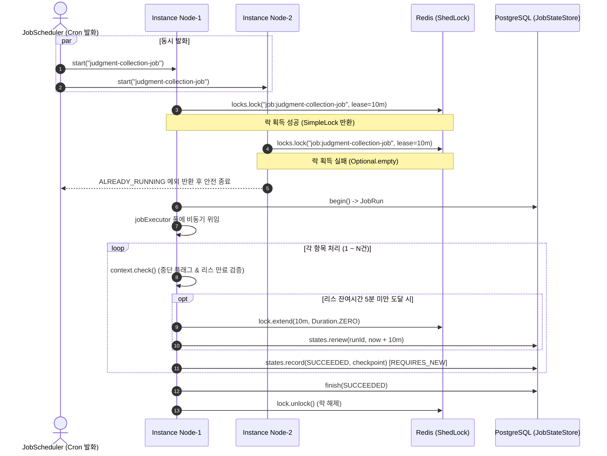

> 대규모 프레임워크인 Spring Batch의 무거운 메타데이터 테이블과 트랜잭션 제약 대신, Redis ShedLock의 분산 락과 PostgreSQL 기반의 리스(Lease/Heartbeat)를 결합하여 다중 인스턴스 환경에서도 안전하게 동작하는 경량 분산 작업 실행기(Job Runner)를 구축했습니다. 이 글에서는 선점 락과 심장박동 연장의 이중 안전장치, 작업 스레드 풀 격리, 체크포인트 기반의 이어 실행 및 안전한 중단(CANCELLED) 메커니즘을 실제 코드와 함께 소개합니다.

---

## 배경: 왜 Spring Batch 대신 직접 경량 Job Runner를 구현했는가?

백엔드 애플리케이션을 운영하다 보면 매일 정해진 시각이나 관리자의 수동 요청에 따라 수백~수천 건의 외부 API를 호출하고 데이터를 수집·가공하는 정기 배치 작업이 필연적으로 발생합니다. 최근 진행한 판결문 데이터 수집 및 AI 요약 시스템(`cotton-bat-server`)에서도 선고 법원 판결문 수집(`judgment-collection-job`)과 신규 사건 탐색(`judgment-discovery-job`) 같은 일배치 작업이 필요했습니다.

처음에는 배치 분야의 표준 프레임워크인 Spring Batch 도입을 검토했습니다. 하지만 실제 아키텍처를 설계하는 과정에서 다음과 같은 현실적인 고민들이 생겼습니다:

1. **과도한 메타데이터 테이블**: Spring Batch를 구동하려면 `BATCH_JOB_EXECUTION`, `BATCH_STEP_EXECUTION` 등 9개 이상의 전용 테이블을 DB에 유지보수해야 합니다. 단순 수집 배치 몇 개를 위해 감당하기에는 스키마가 너무 무거웠습니다.
2. **다중 인스턴스 분산 락 부재**: Spring Boot 애플리케이션이 다중 인스턴스(Kubernetes Pod 또는 다중 서버 노드)로 배포될 때, 동일한 시각에 스케줄러가 발화하면 Spring Batch 자체만으로는 중복 실행을 막아주지 못합니다. 결국 Quartz Scheduler 클러스터링이나 ShedLock 같은 외부 분산 락을 따로 결합해야 했습니다.
3. **긴 트랜잭션과 DB 커넥션 고갈 위험**: 외부 법원 사이트 스크래핑이나 LLM API 호출은 네트워크 지연(I/O Latency)이 큽니다. 청크(Chunk) 단위 트랜잭션이 외부 통신과 묶이면 DB 커넥션을 수초~수십 초 동안 점유하게 되어 커넥션 풀 고갈을 유발할 수 있습니다.
4. **관리자 제어와 가시성**: 사내 운영 콘솔(`/admin/jobs`)에서 cron 표현식을 실시간으로 변경하고, 실행 중인 작업을 안전한 지점에서 즉시 중단(Graceful Cancel)하며, 진행률(Progress %)과 오류 로그를 실시간으로 모니터링하기에는 프레임워크 추상화가 오히려 장벽이 되었습니다.

이러한 문제를 해결하기 위해, **"작업 락은 가벼운 Redis ShedLock으로 빠르게 선점하고, 실행 라이프사이클과 심장박동(Lease), 체크포인트는 PostgreSQL의 짧은 독립 트랜잭션(`REQUIRES_NEW`)으로 관리하는 경량 Job Runner"**를 직접 구현하기로 결정했습니다.


_그림 1. 완성된 관리자 작업 현황 대시보드 화면 (`/admin/jobs`). 등록된 배치 목록, 실시간 진행률, 수동 제어(이어 실행/처음부터)를 지원합니다._

---

## 핵심 아키텍처: Redis ShedLock + DB Lease의 이중 안전장치

분산 환경에서 장시간 실행되는 배치 작업의 가장 큰 위험은 **"동일 작업의 중복 실행"**과 **"죽은 작업(Zombie Job)에 의한 무한 블로킹"**입니다. 

Redis 분산 락(ShedLock) 하나만 사용할 경우, 락 유효 시간(TTL)을 길게 잡으면 노드가 비정상 종료(OOM, Pod 강제 축출)되었을 때 락이 풀리지 않아 후속 배치가 블로킹됩니다. 반대로 TTL을 짧게 잡으면 배치가 미처 끝나기 전에 락이 만료되어 다른 노드가 작업을 중복 시작해버립니다.

따라서 저희는 **Redis ShedLock(초기 선점)**과 **DB Lease Heartbeat(심장박동 연장 및 펜싱)**의 이중 안전장치를 구축했습니다.



### 이중 보호 원리
1. **초기 선점 (Redis ShedLock)**: 작업 시작 시점에 Redis `SET key value NX PX` 기반의 ShedLock을 통해 10분의 임차 시간(`leaseDuration`)으로 선점합니다. 이미 다른 노드가 작업 중이면 즉시 `ALREADY_RUNNING` 예외를 발생시키고 실행을 건너뜁니다.
2. **DB Lease 기록**: 선점에 성공한 노드는 DB `job_runs` 테이블에 `lease_until = now + 10분`을 기록합니다.
3. **심장박동 갱신 (Heartbeat Renewal)**: 작업 루프에서 항목을 처리할 때마다 `context.check()`를 호출합니다. 만약 남은 리스 시간이 절반(5분) 이하로 내려가면, Redis 락을 10분 연장하고 DB의 `lease_until`도 함께 갱신합니다.
4. **장애 격리 및 펜싱 (Fencing)**: 만약 인스턴스가 OOM 등으로 정지되어 심장박동을 갱신하지 못하면, 10초 주기 스케줄러가 `recoverExpired()`를 통해 해당 작업을 `FAILED`로 마킹합니다. 지연된 구버전 스레드가 뒤늦게 깨어나 DB에 쓰려 해도 `lease_until` 검증에 걸려 `JobStopped` 예외가 발생하므로 데이터 오염이 원천 차단됩니다.

> Redis 락이 모종의 이유로 소실되더라도, DB 테이블에 활성 리스(`lease_until > now`)가 남아있다면 다른 인스턴스는 절대 새로운 실행을 시작할 수 없습니다.
{: .prompt-info }

---

## `JobDefinition`과 `JobRunner`: 작업 명세와 비동기 풀 격리

### 1. 작업 인터페이스 정의

각 배치 작업은 Spring Bean으로 등록될 수 있도록 심플한 `JobDefinition` 인터페이스를 구현합니다.

```kotlin
// src/main/kotlin/io/github/cmsong111/cotton_bat_server/job/application/JobDefinition.kt
package io.github.cmsong111.cotton_bat_server.job.application

import java.time.Duration

/**
 * 배치 작업 명세 인터페이스.
 * 각 작업은 한 항목의 외부 호출 제한 시간을 leaseDuration보다 짧게 두고 항목 사이에 context를 갱신합니다.
 */
interface JobDefinition {
    val name: String
    val description: String
    val defaultCron: String
    val leaseDuration: Duration get() = Duration.ofMinutes(10)
    fun execute(context: JobContext)
}
```

### 2. 스레드 풀 격리 설정

웹 요청을 처리하는 Tomcat 스레드가 무거운 배치 작업에 의해 차단되지 않도록, 전용 `ThreadPoolTaskExecutor`를 별도 Bean으로 분리했습니다.

```kotlin
// src/main/kotlin/io/github/cmsong111/cotton_bat_server/job/JobConfig.kt
package io.github.cmsong111.cotton_bat_server.job

import net.javacrumbs.shedlock.provider.redis.spring.RedisLockProvider
import org.springframework.beans.factory.annotation.Value
import org.springframework.context.annotation.Bean
import org.springframework.context.annotation.Configuration
import org.springframework.data.redis.connection.RedisConnectionFactory
import org.springframework.scheduling.annotation.EnableScheduling
import org.springframework.scheduling.concurrent.ThreadPoolTaskExecutor

@Configuration
@EnableScheduling
class JobConfig {
    @Bean
    fun jobLockProvider(
        factory: RedisConnectionFactory, 
        @Value("\${spring.profiles.active:default}") environment: String
    ) = RedisLockProvider.Builder(factory)
        .environment("cotton-bat:$environment")
        .safeUpdate(true)
        .build()

    @Bean
    fun jobExecutor() = ThreadPoolTaskExecutor().apply {
        corePoolSize = 2
        maxPoolSize = 2
        queueCapacity = 0 // 작업 큐잉 없이 즉시 포화 감지
        setThreadNamePrefix("cotton-job-")
        setWaitForTasksToCompleteOnShutdown(true)
        setAwaitTerminationSeconds(30)
    }
}
```

> `queueCapacity = 0`으로 설정하면 배치 작업이 큐에서 대기하다가 의도치 않은 시간에 뒤늦게 실행되는 사고를 방지할 수 있습니다. 풀이 가득 차면 `TaskRejectedException`이 발생하고, Runner는 즉시 `CAPACITY_EXCEEDED` 오류로 안전하게 방어합니다.
{: .prompt-tip }

### 3. `JobRunner`의 선점 및 비동기 디스패칭

`JobRunner`는 작업의 등록, Redis 락 선점, DB 시작 기록, 그리고 백그라운드 스레드 풀 위임을 담당합니다.

```kotlin
// src/main/kotlin/io/github/cmsong111/cotton_bat_server/job/application/JobRunner.kt
package io.github.cmsong111.cotton_bat_server.job.application

import io.github.cmsong111.cotton_bat_server.common.BusinessException
import io.github.cmsong111.cotton_bat_server.job.domain.*
import java.time.Duration
import java.time.Instant
import java.util.UUID
import net.javacrumbs.shedlock.core.LockConfiguration
import net.javacrumbs.shedlock.provider.redis.spring.RedisLockProvider
import org.slf4j.LoggerFactory
import org.springframework.beans.factory.ObjectProvider
import org.springframework.beans.factory.annotation.Qualifier
import org.springframework.core.task.TaskExecutor
import org.springframework.core.task.TaskRejectedException
import org.springframework.stereotype.Service

@Service
class JobRunner(
    definitions: ObjectProvider<JobDefinition>,
    private val states: JobStateStore,
    private val locks: RedisLockProvider,
    @Qualifier("jobExecutor") private val executor: TaskExecutor,
) {
    val definitions: List<JobDefinition> = definitions.orderedStream().toList().also { jobs ->
        require(jobs.map { it.name }.distinct().size == jobs.size) { "작업 이름이 중복됩니다." }
    }
    private val instance = "${System.getenv("HOSTNAME") ?: "local"}-${UUID.randomUUID().toString().take(8)}"
    private val logger = LoggerFactory.getLogger(javaClass)

    fun definition(name: String): JobDefinition = definitions.find { it.name == name }
        ?: throw BusinessException(JobErrorCode.NOT_FOUND)

    fun start(name: String, trigger: JobTrigger = JobTrigger.MANUAL, mode: JobStartMode = JobStartMode.RESUME): Long? {
        val job = definition(name)
        val setting = states.register(job)
        if (trigger == JobTrigger.SCHEDULED && (!setting.enabled || setting.nextScheduledAt?.isAfter(Instant.now()) != false)) {
            return null
        }
        val started = Instant.now()
        // 1. Redis ShedLock 선점 (중복 실행 즉시 차단)
        val lock = locks.lock(LockConfiguration(started, "job:${job.name}", job.leaseDuration, Duration.ZERO))
            .orElseThrow { BusinessException(JobErrorCode.ALREADY_RUNNING) }

        // 2. DB JobRun 레코드 생성 (리스 시각 설정)
        val run = try {
            states.begin(job, trigger, mode, instance)
        } catch (e: Exception) {
            lock.unlock()
            throw e
        }
        if (run == null) {
            lock.unlock()
            return null
        }

        val leaseUntil = started.plus(job.leaseDuration)
        val context = JobContext(run.id, run.checkpoint, states, lock, job.leaseDuration, leaseUntil)

        // 3. 작업 스레드 풀에 비동기 실행 위임
        try {
            states.renew(run.id, leaseUntil)
            executor.execute {
                try {
                    context.check()
                    states.activate(run.id)
                    job.execute(context)
                    context.check()
                    states.finish(run.id)
                } catch (e: Exception) {
                    states.finish(run.id, e.message ?: e.javaClass.simpleName)
                    logger.warn("작업 {} 실행 {} 종료: {}", name, run.id, e.javaClass.simpleName)
                } finally {
                    runCatching { context.unlock() }.onFailure { logger.warn("작업 {} 락 해제 실패", name, it) }
                }
            }
        } catch (e: Exception) {
            states.finish(run.id, "작업 실행을 시작하지 못했습니다: ${e.javaClass.simpleName}")
            context.unlock()
            if (e is TaskRejectedException) throw BusinessException(JobErrorCode.CAPACITY_EXCEEDED)
            throw e
        }
        return run.id
    }
}
```

---

## 동적 스케줄링과 수동 실행 제어

스케줄링을 서버 소스 코드의 `@Scheduled(cron = "0 0 4 * * *")` 어노테이션에 하드코딩해 두면, 실행 주기를 변경할 때마다 매번 재배포를 거쳐야 합니다. 이를 방지하기 위해 `job_settings` 테이블을 두고 10초 간격으로 폴링하는 방식을 채택했습니다.

```kotlin
// src/main/kotlin/io/github/cmsong111/cotton_bat_server/job/application/JobScheduler.kt
package io.github.cmsong111.cotton_bat_server.job.application

import io.github.cmsong111.cotton_bat_server.common.BusinessException
import io.github.cmsong111.cotton_bat_server.job.domain.JobErrorCode
import io.github.cmsong111.cotton_bat_server.job.domain.JobTrigger
import org.slf4j.LoggerFactory
import org.springframework.beans.factory.annotation.Value
import org.springframework.scheduling.annotation.Scheduled
import org.springframework.stereotype.Component

@Component
class JobScheduler(
    private val runner: JobRunner,
    private val states: JobStateStore,
    @Value("\${app.jobs.scheduling-enabled:true}") private val schedulingEnabled: Boolean,
) {
    private val logger = LoggerFactory.getLogger(javaClass)

    @Scheduled(fixedDelayString = "\${app.jobs.poll-delay:10000}", initialDelayString = "\${app.jobs.poll-delay:10000}")
    fun poll() {
        // 비정상 종료된 만료 작업 자동 회수
        states.recoverExpired()
        if (!schedulingEnabled) return

        runner.definitions.forEach { job ->
            try {
                runner.start(job.name, JobTrigger.SCHEDULED)
            } catch (e: BusinessException) {
                if (e.errorCode != JobErrorCode.ALREADY_RUNNING && e.errorCode != JobErrorCode.CAPACITY_EXCEEDED) {
                    logger.warn("작업 {} 스케줄 확인 실패: {}", job.name, e.errorCode.code)
                }
            } catch (e: Exception) {
                logger.error("작업 {} 스케줄 확인 실패", job.name, e)
            }
        }
    }
}
```

### 우아한 중단 (Graceful Cancellation)

강제로 `Thread.interrupt()`를 호출하거나 프로세스를 죽이면 진행 중이던 외부 API 응답과 DB 반영이 어정쩡한 상태로 깨질 위험이 있습니다. 

저희 시스템에서는 운영자가 관리자 화면에서 `중단 요청` 버튼을 누르면 DB `JobRun.cancelRequested = true` 플래그만 세팅합니다. 그리고 실행 루프 내의 `context.check()`가 다음 항목으로 넘어가기 전 안전한 경계에서 이를 확인하고 `JobStopped` 예외를 던지며 종료합니다:

```kotlin
// JobStateStore.kt 중 일부
private fun validate(run: JobRun) {
    if (run.cancelRequested) throw JobStopped("관리자가 중단을 요청했습니다.")
    if (run.status != JobStatus.RUNNING || !run.leaseUntil.isAfter(Instant.now())) {
        throw JobStopped("실행이 종료됐거나 리스가 만료되었습니다.")
    }
}
```

이렇게 하면 **직전 항목까지의 DB 커밋과 체크포인트는 100% 안전하게 보존**되며, 작업 상태만 `CANCELLED`로 깔끔하게 정리됩니다.

---

## 실행 이력 추적: `JobRun` 테이블과 체크포인트 기반 재시도

수천 건의 데이터를 처리하다가 1건에서 파싱 오류가 났다고 전체 배치를 롤백할 수는 없습니다. `JobContext`는 항목별 트랜잭션을 분리하고, 실패한 항목만 오류 테이블에 격리합니다.

```kotlin
// src/main/kotlin/io/github/cmsong111/cotton_bat_server/job/application/JobContext.kt
package io.github.cmsong111.cotton_bat_server.job.application

import io.github.cmsong111.cotton_bat_server.job.domain.JobItemResult
import java.time.Duration
import java.time.Instant
import net.javacrumbs.shedlock.core.SimpleLock

class JobContext internal constructor(
    val runId: Long,
    val checkpoint: String?,
    private val states: JobStateStore,
    private var lock: SimpleLock,
    private val leaseDuration: Duration,
    private var leaseUntil: Instant,
) {
    fun check() {
        if (Thread.currentThread().isInterrupted) throw JobStopped("실행 스레드가 중단되었습니다.")
        if (!leaseUntil.isAfter(Instant.now())) throw JobStopped("실행 리스가 만료되었습니다.")
        // 리스 만료 5분 전 심장박동 연장
        if (Instant.now().plus(leaseDuration.dividedBy(2)).isAfter(leaseUntil)) {
            val renewedAt = Instant.now()
            lock = lock.extend(leaseDuration, Duration.ZERO).orElseThrow { JobStopped("분산 락 소유권을 잃었습니다.") }
            leaseUntil = renewedAt.plus(leaseDuration)
            states.renew(runId, leaseUntil)
        }
        states.check(runId)
    }

    fun total(count: Long) { check(); states.total(runId, count) }

    fun process(itemKey: String, checkpoint: String? = null, action: () -> Unit): Boolean {
        check()
        return try {
            states.record(runId, JobItemResult.SUCCEEDED, checkpoint, action)
            true
        } catch (e: JobStopped) {
            throw e
        } catch (e: Exception) {
            failure(itemKey, e.message ?: e.javaClass.simpleName)
            false
        }
    }

    fun skip(checkpoint: String? = null) { check(); states.record(runId, JobItemResult.SKIPPED, checkpoint) }
    fun failure(itemKey: String, message: String) { check(); states.recordError(runId, itemKey, message) }
    internal fun unlock() = lock.unlock()
}
```

실제 데이터베이스에 저장되는 `job_runs` 테이블 구조는 다음과 같습니다:


_그림 2. DataGrip을 통해 조회한 PostgreSQL `job_runs` 테이블 이력. 실행 상태, 처리 건수, 실패 건수, 인스턴스 ID, 체크포인트가 투명하게 기록됩니다._

운영자는 작업 실행 모드를 두 가지로 선택할 수 있습니다:
- **이어 실행 (`JobStartMode.RESUME`)**: 마지막으로 성공 확정된 `checkpoint` 문자열(예: `court:2026-11-08:p742`)을 읽어와 그 이후 항목부터 재개합니다. 외부 API 호출 요금과 중복 수집을 방지할 수 있습니다.
- **처음부터 실행 (`JobStartMode.RESTART`)**: 기존 체크포인트를 초기화(`null`)하고 1번 데이터부터 완전히 새로 적재합니다.

---

## 결과 확인 및 동시 실행 방지 테스트

분산 락이 실제로 다중 노드 환경에서 중복 실행을 확실히 막아주는지 통합 테스트를 통해 검증했습니다. 

아래 테스트 코드는 서로 다른 2개의 `JobRunner` 인스턴스를 생성하고, 8개 스레드 풀에서 동일한 배치 작업을 찰나의 순간에 동시에 호출하는 시나리오입니다:

```kotlin
// src/test/kotlin/io/github/cmsong111/cotton_bat_server/job/JobRunnerTest.kt
@Test
fun `독립적인 두 실행기의 동시 수동 요청도 한 번만 실행한다`() {
    val ready = CountDownLatch(1)
    val release = CountDownLatch(1)
    val counter = AtomicInteger()
    fixture.action = { counter.incrementAndGet(); ready.countDown(); check(release.await(5, TimeUnit.SECONDS)) }
    val second = anotherRunner()
    
    val ids = try {
        Executors.newFixedThreadPool(8).use { pool ->
            val start = CountDownLatch(1)
            val requests = (0..7).map { index ->
                pool.submit<Result<Long?>> {
                    check(start.await(5, TimeUnit.SECONDS))
                    runCatching { (if (index % 2 == 0) runner else second).start(fixture.name) }
                }
            }
            start.countDown()
            check(ready.await(5, TimeUnit.SECONDS))
            val results = requests.map { it.get(5, TimeUnit.SECONDS) }
            
            // 8개의 동시 요청 중 정확히 1개만 성공
            assertThat(results.count { it.isSuccess }).isEqualTo(1)
            // 나머지 7개는 ALREADY_RUNNING 예외로 안전하게 튕겨냄
            results.mapNotNull { it.exceptionOrNull() }.forEach {
                assertThat(it).isInstanceOf(BusinessException::class.java)
                assertThat((it as BusinessException).errorCode).isEqualTo(JobErrorCode.ALREADY_RUNNING)
            }
            results.mapNotNull { it.getOrNull() }
        }
    } finally { release.countDown() }
    
    completed(ids.single())
    assertThat(counter.get()).isEqualTo(1) // 실제 배치 본문은 단 1회만 수행됨
}
```


_그림 3. 다중 인스턴스 동시 발화 테스트 콘솔 로그. Node-1이 Redis ShedLock을 선점하고, Node-2는 `ALREADY_RUNNING`으로 작업을 안전하게 스킵합니다._

터미널 실행 로그를 보면 Node-1이 `job:judgment-collection-job` 락을 획득함과 동시에, 뒤이어 진입한 Node-2는 `Not executing, lock is held by another instance`를 반환받으며 중복 실행 없이 안전하게 스킵되는 것을 확인할 수 있습니다.

---

## 정리

Spring Batch를 걷어내고 **Redis ShedLock + DB Lease 기반의 경량 실행기**를 도입함으로써 다음과 같은 실질적인 성과를 얻을 수 있었습니다:

1. **간결한 아키텍처**: 9개 이상의 Spring Batch 메타데이터 테이블 대신, 단 3개의 엔티티(`JobSetting`, `JobRun`, `JobRunError`)만으로 배치의 전체 라이프사이클을 완벽히 제어할 수 있었습니다.
2. **다중 인스턴스 무결성**: Redis 분산 락(빠른 선점)과 PostgreSQL 리스(심장박동 연장 및 좀비 프로세스 펜싱)를 조합하여, 인스턴스가 몇 개로 스케일 아웃되든 단 1개의 노드만 안전하게 작업을 수행합니다.
3. **운영 편의성 극대화**: 웹 관리자 대시보드에서 무중단 cron 변경, 실시간 진행률(%) 확인, 실패 항목 개별 조회, 안전한 중단(CANCELLED) 및 이어 실행(RESUME)을 손쉽게 조작할 수 있게 되었습니다.
4. **커넥션 풀 보호**: 청크 트랜잭션 대신 아이템 단위 `REQUIRES_NEW` 트랜잭션을 적용하여, 네트워크 지연이 심한 외부 API 호출 중에도 DB 커넥션을 붙잡고 있지 않도록 격리했습니다.

엔터프라이즈급의 복잡한 멀티 스텝 체이닝이나 대규모 파티셔닝이 필수적인 도메인이 아니라면, 이처럼 분산 락과 짧은 트랜잭션을 기반으로 한 경량 Job Runner 구조를 적극 추천합니다.
