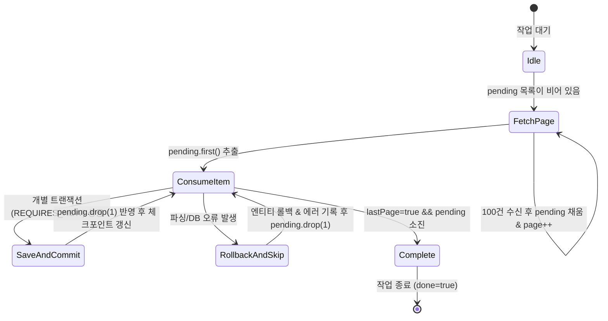
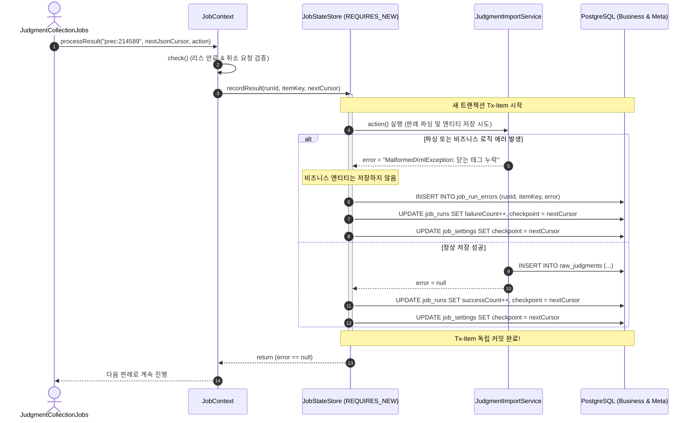

> 수만 건의 외부 공공 API를 순차 수집할 때 네트워크 지연이나 무중단 배포로 작업이 중단되어도, 처음부터 다시 수집하지 않고 직전 성공 지점부터 안전하게 이어 달리는 JSON 체크포인트 상태 머신 패턴을 구축했습니다. 개별 항목의 비즈니스 롤백이 전체 배치의 체크포인트와 오류 이력 저장을 방해하지 않도록 독립 트랜잭션(`REQUIRES_NEW`)으로 격리한 실무 아키텍처를 소개합니다.

---

## 문제 상황: 수만 건의 외부 API 배치 수집이 겪는 현실적인 장애

대법원 및 근로복지공단과 같은 사법·공공 포털에서 판결문 원문 수만 건을 가져오는 수집 배치(`judgment-full`, 약 5만 건 이상)를 운영하다 보면, 인메모리 루프나 단순한 청크 기반 배치로는 해결하기 어려운 현실적인 장벽에 부딪히게 됩니다:

1. **외부 서버의 간헐적 장애와 네트워크 타임아웃**:
   수만 건을 수집하려면 수 시간이 소요됩니다. 9,990번째 판례 본문을 요청할 때 공공기관 서버에서 504 Gateway Timeout이나 502 Bad Gateway가 발생하면 어떻게 될까요? 작업이 통째로 실패하고 다음 날 새벽 1번째 판례부터 다시 수집해야 한다면, 막대한 네트워크 대역폭과 외부 API 쿼터가 낭비됩니다.
2. **무중단 배포(Rolling Update)와 Pod 축출**:
   쿠버네티스 환경이나 CI/CD 파이프라인에서 수시로 신규 버전 애플리케이션이 배포됩니다. 긴 시간 실행 중인 배치가 SIGTERM 신호를 받고 종료될 때, 지금까지 처리한 수천 건의 진행 위치가 유실되면 안 됩니다.
3. **단일 항목 오류가 전체 배치를 폭파시키는 트랜잭션 오염**:
   외부 데이터 제공처에서 특정 판례 원문의 XML/JSON 규격이 깨져 있거나 DB 유니크 제약 조건을 위반할 수 있습니다. 이때 해당 1건의 엔티티 저장 실패가 스프링의 `@Transactional` 경계를 타고 올라가 전체 배치 트랜잭션을 롤백시켜 버리거나, 에러 로그조차 DB에 남기지 못하고 스레드가 비정상 종료되는 현상이 발생합니다.
4. **페이지네이션과 부분 소비의 딜레마**:
   Open API는 일반적으로 100건 단위의 페이지네이션(`page=42`)을 제공합니다. 42페이지의 100건 중 35건을 처리한 시점에 장애가 났다면, 단순 페이지 번호만 저장했을 경우 재시작 시 이미 저장된 35건을 중복 조회하여 파싱하게 됩니다.

이러한 문제를 해결하기 위해, 저희는 **JSON 기반의 세밀한 커서(Cursor) 상태 머신**과 **항목 단위 독립 트랜잭션 격리(`JobContext.processResult`)**를 결합한 체크포인트 이어 달리기(Resume) 패턴을 설계했습니다.


_그림 1. 완성된 관리자 대시보드 (`/admin/jobs`). 150건 처리 후 안전하게 중단된 작업의 JSON 체크포인트(page=42, 68건 대기)가 보존되어 있으며, [이어 실행] 버튼을 통해 즉시 재개할 수 있습니다._

---

## 1. 체크포인트 상태 머신: JSON 기반 커서 모델링

단순히 마지막으로 성공한 DB auto-increment ID나 페이지 번호 하나만 저장하는 방식은 외부 API 수집에 적합하지 않습니다. 1페이지당 100개의 일련번호가 내려오고, 각 일련번호마다 별도의 본문 상세 API를 다시 호출해야 하기 때문입니다.

따라서 현재 처리 중인 페이지 번호뿐만 아니라, **해당 페이지 안에서 아직 본문을 가져오지 못한 미처리 일련번호 목록(`pending`)**을 함께 직렬화하는 상태 객체를 정의했습니다.

### 체크포인트 커서 데이터 클래스

```kotlin
// src/main/kotlin/io/github/cmsong111/cotton_bat_server/judgment/application/JudgmentCollectionJobs.kt
package io.github.cmsong111.cotton_bat_server.judgment.application

import java.time.LocalDate

/**
 * 수집 범위 및 페이지 내 남은 일련번호(pending)를 영속화하여
 * 작업 중단 후에도 중복 호출 없이 동일 목록을 이어서 처리하는 커서 상태 모델입니다.
 */
data class JudgmentCollectionCursor(
    val kind: String,                      // 수집 구분 ("full", "incremental", "labor")
    val from: String,                      // 수집 시작일 (YYYY-MM-DD)
    val to: String,                        // 수집 종료일 (YYYY-MM-DD)
    val page: Int = 1,                     // 현재 탐색 중인 외부 API 페이지 번호
    val pending: List<Long> = emptyList(), // 현재 페이지에서 아직 본문을 수집하지 않은 판례 일련번호 목록
    val lastPage: Boolean = false,         // 외부 목록 API의 마지막 페이지 도달 여부
    val done: Boolean = false,             // 전체 수집 기간의 모든 판례 수집 완료 여부
    val listing: List<JudgmentListing> = emptyList() // 목록 API에서 수신한 메타데이터 (선고일자, 법원명 등)
)
```

이 커서 모델의 동작 원리는 다음과 같습니다:

1. **페이지 진입**: `pending`이 비어 있으면 외부 목록 API(`client.list(cursor.page, 100)`)를 호출하여 100개의 판례 일련번호를 `pending`에 채우고 `page`를 1 증가시킵니다.
2. **항목 소비**: `pending.first()`를 꺼내 본문 상세 API를 호출하고 비즈니스 엔티티를 저장합니다.
3. **커서 전진**: 성공하거나 격리 실패한 항목을 `pending.drop(1)`로 제거한 새로운 불변 커서를 생성하고, 이를 DB에 JSON 문자열로 즉시 커밋합니다.
4. **완료 상태 전이**: 마지막 페이지(`lastPage == true`)이면서 `pending`의 크기가 1개인 마지막 항목을 처리하면 `done = true`로 상태를 마킹합니다.



---

## 2. 체크포인트의 이중 영속화: 글로벌 커서 vs 실행 단위 스냅샷

배치 상태를 저장할 때 흔히 저지르는 실수는 현재 실행 중인 작업 테이블(`job_runs`)에만 상태를 기록하는 것입니다. 만약 작업이 비정상 종료되거나 새 작업이 발화할 때, 이전 작업 기록을 뒤져서 최신 체크포인트를 찾아야 한다면 쿼리가 복잡해지고 동시성 경합이 발생하기 쉽습니다.

저희는 **전역 설정 테이블(`job_settings`)**과 **실행 이력 테이블(`job_runs`)**에 체크포인트를 이중으로 기록하는 설계를 적용했습니다.

```kotlin
// src/main/kotlin/io/github/cmsong111/cotton_bat_server/job/domain/JobSetting.kt
package io.github.cmsong111.cotton_bat_server.job.domain

import io.github.cmsong111.cotton_bat_server.common.BaseEntity
import jakarta.persistence.*
import org.hibernate.Length

@Entity
@Table(name = "job_settings")
class JobSetting(
    @Column(nullable = false, unique = true, updatable = false)
    val name: String,
    @Column(nullable = false)
    var cron: String,
    var enabled: Boolean = false,
    @Column(length = Length.LONG32)
    var checkpoint: String? = null, // 전역 최신 커서 (Single Source of Truth)
) : BaseEntity() {
    @Id @GeneratedValue(strategy = GenerationType.IDENTITY)
    val id: Long = 0
}
```

```kotlin
// src/main/kotlin/io/github/cmsong111/cotton_bat_server/job/domain/JobRun.kt
package io.github.cmsong111.cotton_bat_server.job.domain

import io.github.cmsong111.cotton_bat_server.common.BaseEntity
import jakarta.persistence.*
import java.time.Instant
import org.hibernate.Length

@Entity
@Table(name = "job_runs")
class JobRun(
    @Column(name = "job_name", nullable = false, updatable = false)
    val jobName: String,
    @Enumerated(EnumType.STRING)
    val trigger: JobTrigger,
    @Enumerated(EnumType.STRING)
    val startMode: JobStartMode, // RESUME vs RESTART
    val instanceId: String,
    var leaseUntil: Instant,
    @Column(length = Length.LONG32)
    var checkpoint: String? = null, // 해당 실행 회차의 최종 진행 지점 스냅샷
) : BaseEntity() {
    @Id @GeneratedValue(strategy = GenerationType.IDENTITY)
    val id: Long = 0
    @Enumerated(EnumType.STRING)
    var status: JobStatus = JobStatus.RUNNING
    var processedCount: Long = 0
    var successCount: Long = 0
    var failureCount: Long = 0
}
```

- **`job_settings.checkpoint`**: 언제든 다음 배치가 시작할 때 읽어야 하는 전역 유일의 진행 위치입니다. 서버가 재부팅되거나 롤링 배포가 일어나도 영구적으로 보존됩니다.
- **`job_runs.checkpoint`**: 해당 실행 회차(#1084)가 종료되거나 중단된 순간의 스냅샷입니다. 사후 감사(Audit), 진행률 모니터링, 실패 지점 분석에 활용됩니다.


_그림 2. PostgreSQL `psql` 콘솔 조회 결과. `job_settings`에는 다음 배치가 이어받을 전역 JSON 커서가, `job_runs`에는 회차별 실행 스냅샷이 안전하게 분리 기록되어 있습니다._

---

## 3. 핵심 트랜잭션 아키텍처: 개별 항목 롤백과 체크포인트 격리

체크포인트 기반 배치에서 가장 까다로운 요구사항은 다음과 같습니다:

> **"비즈니스 엔티티(예: 판례 원문 데이터) 저장이 실패하면 해당 엔티티는 롤백되어야 하지만, 작업 실행기의 실패 카운트(`failureCount++`), 에러 요약 저장(`job_run_errors`), 그리고 체크포인트 전진은 반드시 DB에 커밋되어야 한다."**

만약 하나의 거대한 `@Transactional` 안에 비즈니스 저장과 배치 상태 저장이 묶여 있다면, 비즈니스 로직에서 예외가 터지는 순간 체크포인트와 에러 로그까지 전부 롤백되어 작업이 원점으로 되돌아갑니다.

이를 해결하기 위해 `JobContext`와 `JobStateStore`는 **`Propagation.REQUIRES_NEW`**를 활용하여 항목별 독립 트랜잭션을 엄격히 분리했습니다.

### 1. `JobContext.processResult`의 롤백 격리 메커니즘

```kotlin
// src/main/kotlin/io/github/cmsong111/cotton_bat_server/job/application/JobContext.kt
package io.github.cmsong111.cotton_bat_server.job.application

import io.github.cmsong111.cotton_bat_server.job.domain.JobItemResult
import java.time.Duration
import java.time.Instant
import net.javacrumbs.shedlock.core.SimpleLock

class JobContext internal constructor(
    val runId: Long,
    val checkpoint: String?,
    private val states: JobStateStore,
    private var lock: SimpleLock,
    private val leaseDuration: Duration,
    private var leaseUntil: Instant,
) {
    /**
     * 실행 스레드의 취소 요청 및 분산 리스 유효성을 검증합니다.
     * 외부 HTTP 호출 직전/직후에 호출하여 불필요한 작업을 즉시 중단합니다.
     */
    fun check() {
        if (Thread.currentThread().isInterrupted) throw JobStopped("실행 스레드가 중단되었습니다.")
        if (!leaseUntil.isAfter(Instant.now())) throw JobStopped("실행 리스가 만료되었습니다.")
        states.check(runId)
    }

    /**
     * 개별 항목의 비즈니스 저장 액션을 실행하고, 오류 메시지 유무에 따라 체크포인트를 확정합니다.
     * 비즈니스 예외 발생 시 엔티티 저장은 롤백되며, 오류 이력과 체크포인트는 독립 저장됩니다.
     */
    fun processResult(itemKey: String, checkpoint: String, action: () -> String?): Boolean {
        check()
        return try {
            states.recordResult(runId, itemKey, checkpoint, action)
        } catch (e: JobStopped) {
            throw e
        } catch (e: Exception) {
            val message = "항목 저장 실패: ${e.javaClass.simpleName}. 진행 위치를 보존합니다."
            failure(itemKey, message)
            throw IllegalStateException(message, e)
        }
    }

    fun checkpoint(value: String) { check(); states.checkpoint(runId, value) }
    fun failure(itemKey: String, message: String) { check(); states.recordError(runId, itemKey, message) }
    fun total(count: Long) { check(); states.total(runId, count) }
    internal fun unlock() = lock.unlock()
}
```

### 2. `JobStateStore.recordResult`: 독립 트랜잭션 커밋

```kotlin
// src/main/kotlin/io/github/cmsong111/cotton_bat_server/job/application/JobStateStore.kt
package io.github.cmsong111.cotton_bat_server.job.application

import io.github.cmsong111.cotton_bat_server.common.BusinessException
import io.github.cmsong111.cotton_bat_server.job.domain.*
import org.springframework.stereotype.Service
import org.springframework.transaction.annotation.Propagation
import org.springframework.transaction.annotation.Transactional

@Service
class JobStateStore(
    private val settings: JobSettingRepository,
    private val runs: JobRunRepository,
    private val errors: JobRunErrorRepository,
) {
    /**
     * 개별 항목의 저장 결과와 체크포인트를 짧은 독립 트랜잭션으로 커밋합니다.
     * 외부 API 조회가 끝난 뒤 순수 DB 쓰기 작업에만 트랜잭션을 적용하여 커넥션 점유를 최소화합니다.
     */
    @Transactional(propagation = Propagation.REQUIRES_NEW)
    fun recordResult(id: Long, itemKey: String, checkpoint: String, action: () -> String?): Boolean {
        val original = runs.findById(id).orElseThrow { BusinessException(JobErrorCode.NOT_FOUND) }
        val setting = settings.lockByName(original.jobName) ?: throw BusinessException(JobErrorCode.NOT_FOUND)
        val run = guarded(id)

        // 1. 실제 비즈니스 엔티티 저장 실행 (오류 발생 시 에러 문자열 반환)
        val error = action()

        // 2. 관리자 취소 요청 또는 리스 만료 검증 (중단된 스레드의 덮어쓰기 방어)
        validate(run)

        // 3. 통계 카운터 갱신
        run.processedCount++
        if (error == null) {
            run.successCount++
        } else {
            run.failureCount++
            run.errorSummary = error.take(1000)
            // 실패 항목 테이블에 영구 기록
            errors.save(JobRunError(id, itemKey.take(255), error.take(1000)))
        }

        // 4. 전역 설정과 실행 이력에 새로운 JSON 체크포인트 동시 반영
        saveCheckpoint(setting, run, checkpoint)
        return error == null
    }

    private fun saveCheckpoint(setting: JobSetting, run: JobRun, checkpoint: String) {
        require(checkpoint.length <= 10000) { "체크포인트 문자열은 10,000자를 초과할 수 없습니다." }
        setting.checkpoint = checkpoint
        run.checkpoint = checkpoint
    }

    private fun guarded(id: Long): JobRun =
        (runs.lockById(id) ?: throw BusinessException(JobErrorCode.NOT_FOUND)).also(::validate)

    private fun validate(run: JobRun) {
        if (run.cancelRequested) throw JobStopped("관리자가 중단을 요청했습니다.")
        if (run.status != JobStatus.RUNNING) throw JobStopped("실행이 이미 종료되었습니다.")
    }
}
```



이 패턴의 결정적인 장점은 **"외부 API로부터 잘못된 데이터가 내려오더라도, 해당 1건만 실패 이력에 기록되고 커서는 다음 번호로 정상 전진한다"**는 점입니다. 따라서 문제 있는 데이터 1건 때문에 전체 배치가 죽거나, 다음 스케줄러 실행 때 동일한 에러를 무한 반복하는 대참사가 완전히 차단됩니다.


_그림 3. 실제 스프링 부트 배치 실행 콘솔. 판례 `prec:214589` 처리 중 XML 파싱 에러가 발생하자 해당 엔티티 저장은 롤백되고, 에러 이력 저장과 체크포인트 전진(`pending.drop(1)`)이 원자적으로 수행되어 전체 배치는 멈춤 없이 100건을 완수합니다._

---

## 4. 실제 배치 작업 루프 구현: `collect()` 메서드

이제 `JobContext`의 체크포인트를 활용하여 실제로 외부 데이터를 수집하는 배치 로직을 살펴보겠습니다.

```kotlin
// src/main/kotlin/io/github/cmsong111/cotton_bat_server/judgment/application/JudgmentCollectionJobs.kt
package io.github.cmsong111.cotton_bat_server.judgment.application

import io.github.cmsong111.cotton_bat_server.job.application.JobContext
import io.github.cmsong111.cotton_bat_server.job.application.JobStateStore
import tools.jackson.databind.json.JsonMapper
import java.time.LocalDate

class JudgmentCollectionJobs(
    private val client: LawPrecedentClient,
    private val importer: JudgmentImportService,
    private val properties: JudgmentCollectionProperties,
    private val mapper: JsonMapper,
) {
    fun collect(context: JobContext, kind: String) {
        val today = LocalDate.now(JobStateStore.ZONE)
        val source = SOURCES.getValue(kind)

        // 1. 컨텍스트에 전달된 이전 체크포인트 복원
        val previous = context.checkpoint?.let { decode(it, JudgmentCollectionCursor::class.java) }
        val start = when (kind) {
            "full" -> properties.fullFrom
            "labor" -> LocalDate.of(1, 1, 1)
            else -> today.minusDays(properties.incrementalDays - 1L)
        }

        // 이전 체크포인트가 완료되었거나 없으면 시작일부터 새로 생성
        var cursor = previous?.takeUnless { it.done && kind == "incremental" }
            ?: JudgmentCollectionCursor(kind, start.toString(), today.toString())

        context.checkpoint(mapper.writeValueAsString(cursor))
        if (cursor.done) return

        var processed = 0
        // 1회 배치 실행당 최대 처리 건수(예: 100건) 제한
        while (processed < properties.maxItemsPerRun) {
            context.check()

            // 2. 현재 페이지의 대기 목록(pending)이 소진되면 다음 페이지 API 호출
            if (cursor.pending.isEmpty()) {
                val page = client.list(cursor.page, 100, LocalDate.parse(cursor.from), LocalDate.parse(cursor.to), source)
                if (page.items.isEmpty()) {
                    context.checkpoint(mapper.writeValueAsString(cursor.copy(done = true)))
                    context.total(processed.toLong())
                    return
                }

                cursor = cursor.copy(
                    page = cursor.page + 1,
                    pending = page.items.map { it.precSerial },
                    lastPage = page.page * 100L >= page.totalCount,
                    listing = page.items.map(JudgmentListing::from)
                )

                // JSON 크기가 9,500자를 넘으면 메타데이터 목록을 비워 DB 컬럼 한도 방어
                if (mapper.writeValueAsString(cursor).length > 9500) {
                    cursor = cursor.copy(listing = emptyList())
                }
                context.checkpoint(mapper.writeValueAsString(cursor))
            }

            // 3. pending 목록의 첫 번째 판례 일련번호 추출
            val serial = cursor.pending.first()

            // 4. 판례 본문 외부 API 호출 (네트워크 장애 시 위치 보존 후 중단)
            val detail = client.detail(serial, context)
                ?: throw LawPrecedentException("판례 본문 호출 실패로 수집을 멈춥니다. 이어 실행으로 재시도해 주세요.")

            val listing = cursor.listing.firstOrNull()?.takeIf { it.precSerial == serial }
            val nextCursor = cursor.copy(
                pending = cursor.pending.drop(1),
                listing = cursor.listing.drop(1),
                done = cursor.lastPage && cursor.pending.size == 1
            )

            // 5. 개별 항목 원자적 커밋 및 체크포인트 전진
            context.processResult("prec:$serial", mapper.writeValueAsString(nextCursor)) {
                importer.collect(serial, detail.rawJson, listing = listing, dataSourceName = source).error
            }

            cursor = nextCursor
            processed++
            if (cursor.done) break
        }

        context.total(processed.toLong())
    }

    private fun <T> decode(value: String, type: Class<T>): T = try {
        mapper.readValue(value, type)
    } catch (e: Exception) {
        throw IllegalStateException("체크포인트 형식을 해석할 수 없습니다. 처음부터 실행해 주세요.", e)
    }

    companion object {
        val SOURCES = mapOf("full" to "대법원", "incremental" to "대법원", "labor" to "근로복지공단산재판례")
    }
}
```

### 긴 메타데이터에 대한 크기 방어 (Defensive Truncation)

외부 목록 API 응답에서 사건명이나 법원명 메타데이터가 비정상적으로 길 경우, 100건의 `listing` 배열이 PostgreSQL 컬럼 한도(`VARCHAR(10000)`)를 초과할 위험이 있습니다.

위 코드의 라인 48~51을 보면:
```kotlin
if (mapper.writeValueAsString(cursor).length > 9500) {
    cursor = cursor.copy(listing = emptyList())
}
```
체크포인트 JSON 문자열이 9,500바이트를 초과하면 부가 정보인 `listing`을 비우고 필수적인 식별자인 `pending` 일련번호만 남기도록 안전장치를 두었습니다. 이렇게 하면 DB 쓰기 오류로 배치가 중단되는 사태를 사전에 예방할 수 있습니다.

---

## 5. 관리자 수동 제어: `RESUME` vs `RESTART` 상태 머신

사내 관리자 화면에서는 상황에 따라 두 가지 방식으로 배치를 수동 트리거할 수 있습니다:

1. **이어 실행 (`JobStartMode.RESUME`)**:
   - `JobSetting.checkpoint`가 존재하는 경우 해당 JSON 문자열을 그대로 새 `JobRun`에 주입합니다.
   - 네트워크 단절이나 정기 점검 후 이어서 실행할 때 사용하며, 불필요한 외부 API 비용이 전혀 발생하지 않습니다.
2. **처음부터 실행 (`JobStartMode.RESTART`)**:
   - `JobSetting.checkpoint`를 즉시 `null`로 초기화하고 1페이지부터 전체 수집을 재개합니다.
   - 데이터 스키마 전면 개편이나 전체 데이터 재동기화가 필요할 때 사용합니다.

```kotlin
// src/main/kotlin/io/github/cmsong111/cotton_bat_server/job/application/JobStateStore.kt
@Transactional(propagation = Propagation.REQUIRES_NEW)
fun begin(job: JobDefinition, trigger: JobTrigger, mode: JobStartMode, instance: String): JobRun? {
    val setting = settings.lockByName(job.name) ?: throw BusinessException(JobErrorCode.NOT_FOUND)
    val now = Instant.now()

    // ... 기존 활성 리스 및 실행 중 작업 검증 ...

    // RESTART 모드인 경우 이전 체크포인트를 무시하고 null로 시작
    val initialCheckpoint = if (mode == JobStartMode.RESTART) null else setting.checkpoint

    return runs.saveAndFlush(
        JobRun(job.name, trigger, mode, instance, now.plus(job.leaseDuration), initialCheckpoint)
    )
}

@Transactional(propagation = Propagation.REQUIRES_NEW)
fun activate(id: Long) {
    val run = runs.findById(id).orElseThrow { BusinessException(JobErrorCode.NOT_FOUND) }
    val setting = settings.lockByName(run.jobName) ?: throw BusinessException(JobErrorCode.NOT_FOUND)
    
    // RESTART 모드로 실제 작업이 시작되면 설정 테이블의 체크포인트도 null로 확정
    if (run.startMode == JobStartMode.RESTART) {
        setting.checkpoint = null
    }
}
```

### 안전한 중단(Graceful Cancellation)의 원리

배치가 도는 도중 관리자가 [중단 요청] 버튼을 누르면 즉시 스레드를 `kill`하지 않습니다. 대신 DB의 `JobRun.cancelRequested`를 `true`로 변경합니다.

작업 루프에서 현재 처리 중인 판례의 DB 저장이 끝나고 다음 항목으로 넘어가기 전 `context.check()`를 호출할 때, `cancelRequested` 플래그가 확인되면 `JobStopped` 예외가 발생합니다.

결과적으로 **현재 항목의 DB 저장은 안전하게 완료되고, 체크포인트도 해당 지점까지 완벽히 커밋된 상태에서 작업이 종료(`JobStatus.CANCELLED`)**됩니다. 데이터 정합성이 훼손될 틈이 전혀 없습니다.

---

## 6. 정리 및 실무 권장사항

Spring Batch의 거대한 청크 트랜잭션 프레임워크 없이도, Kotlin과 스프링의 기본 기능(`@Transactional(propagation = REQUIRES_NEW)`, Jackson, PostgreSQL)만으로 견고한 체크포인트 상태 머신을 완성할 수 있었습니다.

실무에서 이 패턴을 적용할 때 다음 원칙을 반드시 기억하시기 바랍니다:

1. **외부 I/O와 DB 트랜잭션의 엄격한 분리**:
   외부 HTTP 호출(`client.detail(...)`)은 절대 `@Transactional` 안에서 수행하지 마세요. 외부 호출이 끝난 뒤 순수 DB 쓰기 단계(`action()`)에만 짧은 독립 트랜잭션을 적용해야 커넥션 풀 고갈을 방지할 수 있습니다.
2. **비즈니스 저장 로직의 멱등성(Idempotency) 보장**:
   체크포인트를 통해 중복 실행을 최소화하더라도, 분산 환경에서는 동일 데이터가 재전송될 가능성이 언제나 존재합니다. DB 저장 로직은 항상 `ON CONFLICT DO UPDATE` 또는 유니크 인덱스 기반의 멱등한 저장을 보장해야 합니다.
3. **체크포인트 크기 모니터링**:
   커서 객체에 과도한 비즈니스 데이터를 담지 마세요. 식별자(ID 목록, 페이지 번호) 위주로 가볍게 유지하고, 예외적으로 긴 메타데이터는 안전하게 잘라내는 방어 로직을 마련해야 합니다.

대규모 외부 데이터 수집 배치를 설계하고 계신다면, 무거운 프레임워크 도입에 앞서 작고 단단한 **JSON 체크포인트 상태 머신과 트랜잭션 격리 패턴**을 적극 검토해 보시길 권장합니다.
