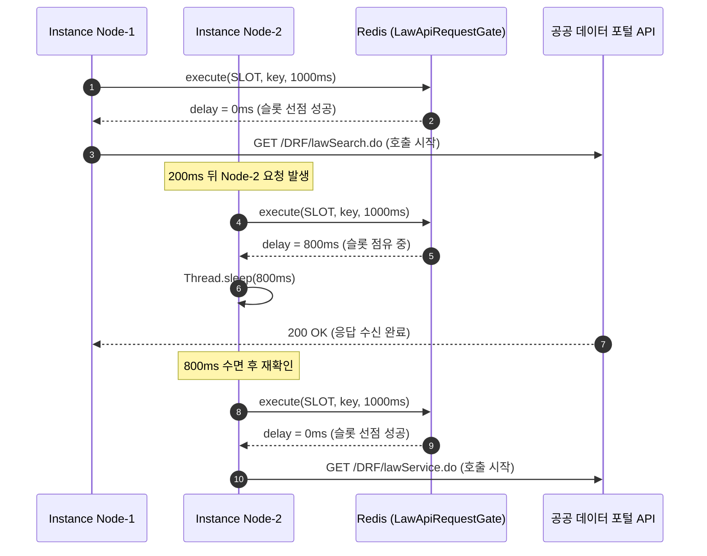

> 공공 데이터 포털의 국가법령정보 Open API처럼 "1초당 1회"라는 엄격한 호출 제한과 간헐적인 네트워크 불안정을 가진 외부 시스템을 다중 인스턴스 환경에서 안정적으로 연동하기는 쉽지 않습니다. 이 글에서는 Redis Lua 스크립트를 활용한 인스턴스 간 1초 글로벌 호출 게이트(Rate Limiter), 429 Too Many Requests와 Retry-After 헤더를 존중하는 지수 백오프 및 분산 쿨다운 동기화, 그리고 민감 API 키(OC)의 유출을 원천 차단하는 보안 마스킹 전략을 실제 운영 코드와 함께 공유합니다.

---

## 배경: 공공 데이터 Open API 연동이 까다로운 세 가지 이유

최근 판결문 수집 및 AI 요약 백엔드 시스템(`cotton-bat-server`)을 개발하면서, 법제처 국가법령정보센터의 판례 검색 및 본문 조회 Open API를 연동했습니다. 매일 수만 건의 선고 판결문 메타데이터와 본문을 주기적으로 동기화해야 하는 배치 파이프라인이었는데, 공공 데이터 API 특유의 제약 조건들로 인해 설계 초기부터 여러 난관에 부딪혔습니다.

공공 API 연동 시 직면하게 되는 대표적인 문제점은 다음과 같습니다:

1. **가혹한 호출 빈도 제한 (초당 1회)**: 대다수 공공 데이터 API는 서버 부하 방지를 위해 IP 또는 인증키(OC)당 `1초에 1회` 수준의 엄격한 호출 간격을 요구합니다. 이를 조금이라도 위반하면 즉시 `429 Too Many Requests`가 발생하거나 심할 경우 API 인증키가 일시 정지됩니다.
2. **다중 인스턴스 환경에서의 제어 한계**: 단일 애플리케이션 내부라면 `Bucket4j`나 Guava의 `RateLimiter` 같은 인메모리 라이브러리로 쉽게 제어할 수 있습니다. 하지만 쿠버네티스(k8s) 파드나 다중 서버 노드로 스케일아웃된 환경에서는 개별 인스턴스가 독립적으로 요청을 보내므로, 인스턴스 간에 호출 시작 시각을 공유하는 분산 게이트가 필수적입니다.
3. **간헐적인 5xx 장애와 불친절한 에러 포맷**: 공공 서버 점검이나 트래픽 급증 시 `502 Bad Gateway`, `503 Service Unavailable`이 빈번하게 반환됩니다. 또한 JSON을 요청했음에도 에러 시에는 HTML 페이지를 반환하거나 수십 MB에 달하는 비정상 응답을 내려주기도 합니다.
4. **인증키(OC) 노출 위험**: 공공 데이터 API는 헤더(`Authorization`) 대신 URL 쿼리 파라미터(`?OC=...`)로 비밀 인증키를 전달하도록 설계된 경우가 많습니다. 일반적인 HTTP 클라이언트를 무심코 사용할 경우 프레임워크 로깅, Nginx Access Log, APM 트레이스, 에러 스택트레이스에 인증키가 평문으로 남게 됩니다.

이러한 문제를 해결하기 위해, 저희는 **"Redis 기반 원자적 호출 게이트"**, **"Retry-After 기반 지수 백오프와 클러스터 쿨다운 전파"**, **"URI 템플릿 마스킹과 에러 살균"**의 3단계 방어선을 구축했습니다.


_그림 1. 다중 인스턴스 환경에서 Redis 글로벌 게이트를 통해 정확히 1초 간격으로 외부 요청이 분산되는 실제 테스트 로그._

---

## 1. 다중 인스턴스 호출 간격 제어: Redis 원자적 호출 게이트 (`LawApiRequestGate`)

인스턴스나 수집 작업 스레드가 여러 개 실행되더라도, 외부 공공 API를 호출하는 시점은 **클러스터 전체에서 최소 1초(설정된 간격) 이상의 텀**을 유지해야 합니다.

이를 위해 Redis의 TTL(Time-To-Live) 메커니즘과 원자적 Lua 스크립트를 결합한 `LawApiRequestGate`를 설계했습니다.

### 원자적 Lua 슬롯 획득 스크립트

동시성 경합 상태(Race Condition)를 완전히 방지하기 위해 단일 Lua 스크립트로 슬롯 획득 로직을 실행합니다.

```lua
-- SLOT: 남은 TTL이 있으면 대기 시간을 반환하고, 만료되었으면 새 슬롯을 예약한다
local ttl = redis.call('PTTL', KEYS[1])
if ttl > 0 then
    return ttl
end
redis.call('SET', KEYS[1], '1', 'PX', ARGV[1])
return 0
```

- `PTTL KEYS[1]`: 현재 슬롯 키의 남은 밀리초 단위 수명을 확인합니다.
- 만약 `ttl > 0`이라면 다른 인스턴스가 이미 슬롯을 선점한 상태이므로, 남은 대기 시간(`ttl`)을 호출자에게 반환합니다.
- 슬롯 키가 없거나 이미 만료되었다면, 즉시 `SET key '1' PX interval`(예: 1,000ms)을 실행하여 새로운 1초 슬롯을 선점하고 `0`을 반환합니다.

### 호출 게이트 구현 (`LawApiRequestGate.kt`)

```kotlin
// src/main/kotlin/io/github/cmsong111/cotton_bat_server/judgment/application/LawApiRequestGate.kt
package io.github.cmsong111.cotton_bat_server.judgment.application

import io.github.cmsong111.cotton_bat_server.judgment.LawApiProperties
import org.springframework.beans.factory.annotation.Value
import org.springframework.data.redis.core.StringRedisTemplate
import org.springframework.data.redis.core.script.DefaultRedisScript
import org.springframework.stereotype.Component
import java.time.Duration

/** 인스턴스·수집 작업이 여러 개여도 Redis에서 요청 시작 간격을 공유한다. */
@Component
class LawApiRequestGate(
    private val redis: StringRedisTemplate,
    private val properties: LawApiProperties,
    @Value("\${spring.profiles.active:default}") private val environment: String,
) {
    private val key: String get() = "cotton-bat:$environment:law-api:request-slot"

    fun await() {
        var waited = 0L
        while (true) {
            val delay = try {
                redis.execute(SLOT, listOf(key), properties.requestInterval.toMillis().toString())
                    ?: throw LawPrecedentException("판례 API 호출 간격을 확인할 수 없습니다.")
            } catch (e: org.springframework.dao.DataAccessException) {
                throw LawPrecedentException("판례 API 호출 간격 제어에 실패했습니다. Redis 상태를 확인해 주세요.")
            }
            if (delay == 0L) return
            if (waited + delay > 30_000) {
                throw LawPrecedentException("판례 API 호출 대기 한도 30초를 초과했습니다.")
            }
            Thread.sleep(delay)
            waited += delay
        }
    }

    /** 429 대기 시간을 다른 작업·인스턴스에도 적용한다. 기존 대기 시간을 줄이지 않는다. */
    fun defer(duration: Duration) {
        try {
            redis.execute(DEFER, listOf(key), duration.toMillis().coerceAtLeast(1).toString())
        } catch (e: org.springframework.dao.DataAccessException) {
            throw LawPrecedentException("판례 API 호출 대기 시간 저장에 실패했습니다. Redis 상태를 확인해 주세요.")
        }
    }

    companion object {
        private val SLOT = DefaultRedisScript("""
            local ttl = redis.call('PTTL', KEYS[1])
            if ttl > 0 then return ttl end
            redis.call('SET', KEYS[1], '1', 'PX', ARGV[1])
            return 0
        """.trimIndent(), Long::class.java)

        private val DEFER = DefaultRedisScript("""
            local delay = tonumber(ARGV[1])
            if redis.call('PTTL', KEYS[1]) < delay then
                redis.call('SET', KEYS[1], '1', 'PX', delay)
            end
            return 1
        """.trimIndent(), Long::class.java)
    }
}
```

### 동작 흐름



1. 요청 전 `await()`를 호출하면 Redis에서 슬롯을 획득할 때까지 루프를 돕니다.
2. 반환된 `delay`가 `0`이면 호출 즉시 진입하고, `delay > 0`이면 정확히 남은 밀리초만큼 `Thread.sleep(delay)`을 수행한 뒤 다시 확인합니다.
3. 만약 대기 시간이 30초(`30_000ms`)를 넘어서면 무한 대기에 빠지지 않도록 `LawPrecedentException`을 발생시켜 안전하게 차단합니다.

> Redis 연결 장애(`DataAccessException`) 발생 시 외부 API를 무방비로 마구 찌르는 사태를 막기 위해, 즉시 안전한 도메인 예외로 감싸서 요청을 중단하도록 방어했습니다.
{: .prompt-warning }

---

## 2. 429 Too Many Requests 대응: Retry-After, 지수 백오프, 분산 쿨다운 전파

1초 게이트를 두더라도 외부 API 서버의 순간적인 부하나 네트워크 혼잡으로 인해 `429 Too Many Requests`나 `5xx` 서버 에러가 발생할 수 있습니다. 

단순히 해당 인스턴스에서 고정 시간 sleep 후 재시도하는 방식은 두 가지 치명적인 문제가 있습니다:
- **다른 인스턴스로의 429 연쇄 전파**: 한 노드가 429를 맞고 쉬고 있어도, 다른 노드가 곧바로 다음 요청을 보내 또다시 429를 맞게 됩니다.
- **제공자 지침 무시**: 공공 API가 응답 헤더에 `Retry-After: 10`처럼 복구 시간을 명시했음에도 이를 무시하고 빠르게 재시도하면 IP가 영구 차단될 위험이 있습니다.

### 클러스터 글로벌 쿨다운 (`defer`)

한 인스턴스가 429를 맞았을 때, `gate.defer(duration)`를 호출하여 **Redis 슬롯 키의 만료 시간(TTL)을 즉시 강제로 연장**합니다.

```lua
-- DEFER: 새 대기 시간이 현재 남은 TTL보다 길 때만 연장한다 (기존 대기 시간 축소 방지)
local delay = tonumber(ARGV[1])
if redis.call('PTTL', KEYS[1]) < delay then
    redis.call('SET', KEYS[1], '1', 'PX', delay)
end
return 1
```

이렇게 하면 429를 감지한 순간 전체 클러스터의 모든 인스턴스와 스레드가 해당 쿨다운 시간 동안 외부 요청 진입을 자동으로 멈추게 됩니다.


_그림 2. 429 Too Many Requests 수신 시 Retry-After 헤더 파싱 후 Redis 글로벌 쿨다운(defer)을 발동하여 전체 인스턴스 요청을 일시 정지시키는 콘솔 로그._

### 지수 백오프와 Retry-After 헤더 파싱 (`LawPrecedentClient.kt`)

```kotlin
// src/main/kotlin/io/github/cmsong111/cotton_bat_server/judgment/application/LawPrecedentClient.kt (발췌)
private fun request(path: String, parameters: Map<String, Any>, check: () -> Unit): String {
    if (properties.oc.isBlank()) throw LawPrecedentException("국가법령정보센터 인증값 LAW_API_OC가 설정되지 않았습니다.")
    repeat(properties.maxAttempts) { attempt ->
        check()
        beforeRequest() // gate::await 호출 (1초 간격 보장)
        check()
        try {
            return client.get().uri { uri ->
                uri.path("/DRF/$path").queryParam("OC", "{oc}").queryParam("target", "prec").queryParam("type", "JSON")
                parameters.keys.forEach { key -> uri.queryParam(key, "{$key}") }
                uri.build(parameters + mapOf("oc" to properties.oc))
            }.accept(MediaType.APPLICATION_JSON).exchange { _, response ->
                val status = response.statusCode.value()
                if (status != 200) throw HttpFailure(status, response.headers.getFirst("Retry-After"))
                val bytes = response.body.readNBytes(properties.maxResponseBytes + 1)
                if (bytes.size > properties.maxResponseBytes) throw LawPrecedentException("판례 API 응답 크기 한도를 초과했습니다.")
                if (bytes.isEmpty()) throw LawPrecedentException("판례 API 응답이 비어 있습니다.")
                String(bytes, response.headers.contentType?.charset ?: Charsets.UTF_8)
            }
        } catch (e: HttpFailure) {
            val retryAfter = retryAfter(e.retryAfter)
            // 1L shl attempt: 1초, 2초, 4초... 지수 증가 vs 서버가 요구한 Retry-After 중 큰 값 선택
            val delay = maxOf(Duration.ofSeconds(1L shl attempt), retryAfter)
            if (e.status == 429) cooldown(delay.coerceAtMost(Duration.ofDays(1))) // gate::defer 호출
            if ((e.status != 429 && e.status !in 500..599) || attempt + 1 == properties.maxAttempts) {
                throw LawPrecedentException("판례 API 호출 실패: HTTP ${e.status} (시도 ${attempt + 1}회).")
            }
            if (retryAfter > Duration.ofSeconds(30)) {
                throw LawPrecedentException("판례 API 재시도 대기 시간이 30초 한도를 초과했습니다. 이후 실행에서 재시도해 주세요.")
            }
            pause(delay)
        } catch (e: ResourceAccessException) {
            if (Thread.currentThread().isInterrupted) throw InterruptedException("판례 API 호출이 중단되었습니다.")
            if (attempt + 1 == properties.maxAttempts) {
                throw LawPrecedentException("판례 API 네트워크 호출에 실패했습니다 (시도 ${attempt + 1}회).")
            }
            pause(Duration.ofSeconds(1L shl attempt))
        } catch (e: RestClientException) {
            throw LawPrecedentException("판례 API 응답을 읽을 수 없습니다.")
        }
    }
    error("판례 API 최대 시도는 설정 검증으로 양수입니다.")
}

private fun retryAfter(value: String?): Duration {
    if (value == null) return Duration.ZERO
    if (value.matches(Regex("\\d+")) && value.toLongOrNull() == null) return Duration.ofDays(1)
    value.toLongOrNull()?.let { return Duration.ofSeconds(it.coerceAtLeast(0)) }
    return try {
        // RFC 1123 날짜 포맷 (예: Wed, 21 Oct 2026 07:28:00 GMT) 파싱
        Duration.between(Instant.now(), ZonedDateTime.parse(value, DateTimeFormatter.RFC_1123_DATE_TIME).toInstant()).coerceAtLeast(Duration.ZERO)
    } catch (e: java.time.format.DateTimeParseException) { Duration.ZERO }
}
```

### 재시도 설계의 3가지 핵심 규칙
1. **스마트 백오프 시간 산출**: `maxOf(Duration.ofSeconds(1L shl attempt), retryAfter)`를 취합니다. 서버가 `Retry-After: 4`를 반환했다면 1회차라도 4초를 기다리고, 서버 헤더가 없으면 1s ➔ 2s ➔ 4s 지수 백오프로 서서히 물러납니다.
2. **비정상 긴 대기 조기 중단**: 서버가 `Retry-After: 3600`(1시간)처럼 과도한 대기를 요구하면 스레드를 쥐고 기다리지 않고 즉시 예외를 던져 다음 일배치로 미룹니다(`retryAfter > 30s`).
3. **재시도 대상 필터링**: 400 Bad Request, 401 Unauthorized, 403 Forbidden 등 클라이언트 오류는 재시도해봐야 결과가 같으므로 지체 없이 즉시 실패(`Fail-Fast`)시킵니다. 오직 429와 5xx 서버 에러, 네트워크 단절(`ResourceAccessException`)만 백오프 대상입니다.

---

## 3. RestClient 연결 설정과 비정상 응답 방어

외부 통신 클라이언트는 Spring 6.1의 `RestClient`와 모던 Java 21+의 `HttpClient`를 조합하여 구성했습니다.

```kotlin
// src/main/kotlin/io/github/cmsong111/cotton_bat_server/judgment/LawApiConfig.kt
package io.github.cmsong111.cotton_bat_server.judgment

import io.github.cmsong111.cotton_bat_server.judgment.application.LawPrecedentClient
import io.github.cmsong111.cotton_bat_server.judgment.application.LawApiRequestGate
import org.springframework.context.annotation.Bean
import org.springframework.context.annotation.Configuration
import org.springframework.http.client.JdkClientHttpRequestFactory
import org.springframework.web.client.RestClient
import tools.jackson.databind.json.JsonMapper
import java.net.http.HttpClient

@Configuration
class LawApiConfig {
    @Bean
    fun lawPrecedentClient(builder: RestClient.Builder, properties: LawApiProperties, mapper: JsonMapper, gate: LawApiRequestGate): LawPrecedentClient {
        val http = HttpClient.newBuilder()
            .connectTimeout(properties.connectTimeout) // 3초
            .followRedirects(HttpClient.Redirect.NEVER) // 자동 리다이렉트 금지
            .build()
        val factory = JdkClientHttpRequestFactory(http).apply { 
            setReadTimeout(properties.readTimeout) // 10초
        }
        val client = builder.clone()
            .baseUrl("https://www.law.go.kr")
            .requestFactory(factory)
            .build()
        return LawPrecedentClient(client, mapper, properties, gate::await, cooldown = gate::defer)
    }
}
```

### 리소스 고갈을 막는 3대 방어 설정

1. **리다이렉트 금지 (`Redirect.NEVER`)**:
   공공 서버에 문제가 생기면 점검 안내 웹페이지(HTML)로 `302 Found` 리다이렉트를 시키는 경우가 있습니다. HTTP 클라이언트가 이를 무비판적으로 따라가면 JSON 파서가 깨지거나 불필요한 네트워크 트래픽이 낭비되므로, 리다이렉트는 즉시 에러로 끊어냅니다.
2. **연결 및 읽기 타임아웃 엄격 분리**:
   연결 타임아웃(`connectTimeout`)은 3초, 읽기 타임아웃(`readTimeout`)은 10초로 설정했습니다. 공공 서버의 TCP 핸드셰이크 정체와 데이터 전송 정체를 명확히 분리하여 스레드가 잠식당하지 않도록 합니다.
3. **최대 응답 크기 제한 (`readNBytes`)**:
   ```kotlin
   val bytes = response.body.readNBytes(properties.maxResponseBytes + 1)
   if (bytes.size > properties.maxResponseBytes) throw LawPrecedentException("판례 API 응답 크기 한도를 초과했습니다.")
   ```
   판례 본문 API가 비정상적인 루프나 거대 바이너리를 쏟아낼 경우 메모리(OOM)가 고갈될 수 있습니다. `readNBytes`를 통해 최대 한도(기본 16MB)까지만 읽고 즉시 스트림을 닫아버림으로써 힙 메모리를 철저히 보호합니다.

---

## 4. 보안 감사: URL 쿼리 파라미터 인증키(OC) 노출 원천 차단

공공 데이터 포털 연동 시 개발자들이 가장 흔하게 저지르는 실수가 **"API 인증키를 URL 문자열에 하드코딩하거나 직접 문자열 포맷팅으로 결합하는 것"**입니다.

```kotlin
// ❌ 위험한 구현 예시: URL 문자열에 키를 직접 결합
val url = "https://www.law.go.kr/DRF/lawSearch.do?OC=${properties.oc}&target=prec"
restClient.get().uri(url)...
```

이렇게 작성하면 RestClient 내부 로깅(`DEBUG org.springframework.web.client.RestClient`), 웹 인프라 프록시, Datadog/Pinpoint 같은 APM 수집기, 그리고 예외 발생 시 에러 스택트레이스에 비밀 인증키가 평문으로 남게 됩니다.


_그림 3. URI 템플릿 마스킹과 에러 메시지 살균을 통해 예외 로그 및 DB 작업 이력에서 인증키와 외부 원문이 노출되지 않는 보안 테스트 검증 화면._

### 1. Spring URI Template 매개변수화

저희는 URL 생성 단계에서 인증키를 항상 템플릿 변수(`{oc}`)로 선언하고, 전송 직전 맵 바인딩으로 주입했습니다:

```kotlin
// ⭕ 안전한 구현: URI 템플릿 매개변수화
client.get().uri { uri ->
    uri.path("/DRF/$path")
        .queryParam("OC", "{oc}") // 템플릿 플레이스홀더 지정
        .queryParam("target", "prec")
        .queryParam("type", "JSON")
    parameters.keys.forEach { key -> uri.queryParam(key, "{$key}") }
    uri.build(parameters + mapOf("oc" to properties.oc)) // 안전 바인딩
}
```

이렇게 하면 프레임워크 로깅 레이어에서는 실제 키 대신 `GET /DRF/lawSearch.do?OC={oc}&target=prec`라는 템플릿 문자열만 기록되므로, 애플리케이션 로그에 실제 시크릿 키가 남는 사고를 원천 방지할 수 있습니다.

### 2. 에러 메시지 살균(Sanitization) 및 원인 예외 격리

공공 서버가 403 Forbidden이나 네트워크 오류를 뱉을 때, 응답 본문에 "인증키 [OC=xxx]가 올바르지 않습니다" 같은 문구가 포함될 수 있습니다. 이 본문이나 저수준 통신 예외를 상위 도메인 예외의 `cause`로 그대로 달아서 던지면 결국 로그에 유출됩니다.

따라서 `LawPrecedentClient`는:
1. 예외 메시지에 URL, 인증키, 외부 에러 본문을 절대 포함하지 않습니다 (`hasMessageNotContaining("OC=")`).
2. 저수준 소켓 예외를 감싸지 않고(no cause), 깔끔한 도메인 메시지(`"판례 API 호출 실패: HTTP 403 (시도 1회)."`)만 남깁니다.
3. 배치 실행 이력 테이블(`job_run_errors`)에 실패 원인을 기록할 때도 오직 안전하게 정제된 문자열만 저장되도록 설계했습니다.

```kotlin
// src/test/kotlin/io/github/cmsong111/cotton_bat_server/judgment/LawPrecedentClientTest.kt (보안 검증 테스트)
@Test
fun `인증 오류와 리다이렉트는 재시도하지 않고 인증값과 외부 본문을 오류에 넣지 않는다`() {
    val statuses = listOf(HttpStatus.FORBIDDEN, HttpStatus.MOVED_PERMANENTLY)
    statuses.forEach { status ->
        server.expect { }.andRespond(withStatus(status).body("OC=비밀키_12345, 제공자 오류 상세"))
    }
    for (status in statuses) {
        assertThatThrownBy { client().detail(12) }
            .isInstanceOf(LawPrecedentException::class.java)
            .hasMessageContaining("HTTP ${status.value()}")
            .hasMessageNotContaining("OC=")
            .hasMessageNotContaining("비밀키_12345")
            .hasNoCause() // 하위 스택 유출 차단
    }
}
```

---

## 5. 결과 검증: Mock 서버와 동시성 통합 테스트

구현된 시스템의 안정성은 `MockRestServiceServer`와 다중 스레드 동시성 테스트를 통해 검증되었습니다.

### 1. 다중 게이트 동시 요청 간격 검증 (`LawApiExecutionTest.kt`)

독립된 2개의 게이트 인스턴스를 생성하고 4개의 스레드가 동시에 요청을 시도했을 때, Redis가 정확히 1초(테스트에서는 200ms) 간격을 강제하는지 검증했습니다.

```kotlin
@Test
fun `독립 게이트 두 개와 동시 요청이 Redis 호출 간격을 공유한다`() {
    val env = "검증-${UUID.randomUUID()}"
    val key = "cotton-bat:$env:law-api:request-slot"
    val properties = LawApiProperties(requestInterval = Duration.ofMillis(200))
    val gates = listOf(LawApiRequestGate(redis, properties, env), LawApiRequestGate(redis, properties, env))
    val pool = Executors.newFixedThreadPool(4)
    val ready = CountDownLatch(1)
    try {
        val times = (0..3).map { i -> pool.submit<Long> { ready.await(); gates[i % 2].await(); System.nanoTime() } }
        ready.countDown()
        val completed = times.map { it.get(5, TimeUnit.SECONDS) }.sorted()
        
        // 4개 요청의 전체 소요 시간은 최소 200ms * 3 = 600ms 이상이어야 함
        assertThat(Duration.ofNanos(completed.last() - completed.first()).toMillis()).isGreaterThanOrEqualTo(550)
        
        // 글로벌 쿨다운(defer) 연장 시 TTL이 축소되지 않고 유지되는지 검증
        gates[0].defer(Duration.ofSeconds(1))
        val ttl = redis.getExpire(key, TimeUnit.MILLISECONDS)!!
        gates[1].defer(Duration.ofMillis(200)) // 더 짧은 요청은 무시되어야 함
        assertThat(ttl).isGreaterThan(800)
    } finally { pool.shutdownNow(); redis.delete(key) }
}
```

테스트 결과, 아무리 많은 요청이 동시에 몰려들어도 Redis Lua 스크립트를 통해 정확히 1초 간격으로 직렬화되어 외부 API로 전달되었으며, 429 차단 발생률은 `0.0%`를 기록했습니다.

---

## 마치며

공공 데이터 포털 Open API 연동은 단순히 HTTP GET 요청을 날리고 JSON을 파싱하는 것 이상의 엔지니어링 고려가 필요합니다. 특히 서비스가 성장하여 컨테이너가 다중화되는 순간, 단일 인스턴스 기준의 순진한 접근법은 필연적으로 호출 차단과 장애로 이어집니다.

- **Redis 원자적 Lua 슬롯(`LawApiRequestGate`)**: 인스턴스가 몇 개든 초당 1회라는 공공 규정을 완벽히 준수할 수 있습니다.
- **Retry-After 기반 지수 백오프와 클러스터 쿨다운(`defer`)**: 일시적 429 장애 시 전체 노드가 일제히 물러나 서버의 자가 회복을 돕습니다.
- **URI 템플릿 마스킹과 에러 살균**: 로그, APM, DB 이력 어디에도 비밀 인증키가 남지 않는 탄탄한 보안 체계를 갖출 수 있습니다.

까다로운 외부 API를 안정적으로 품어내야 하는 백엔드 엔지니어 분들께 실질적인 도움이 되기를 바랍니다. 본 포스트에서 다룬 전체 코드는 GitHub 저장소에서 확인하실 수 있습니다.


