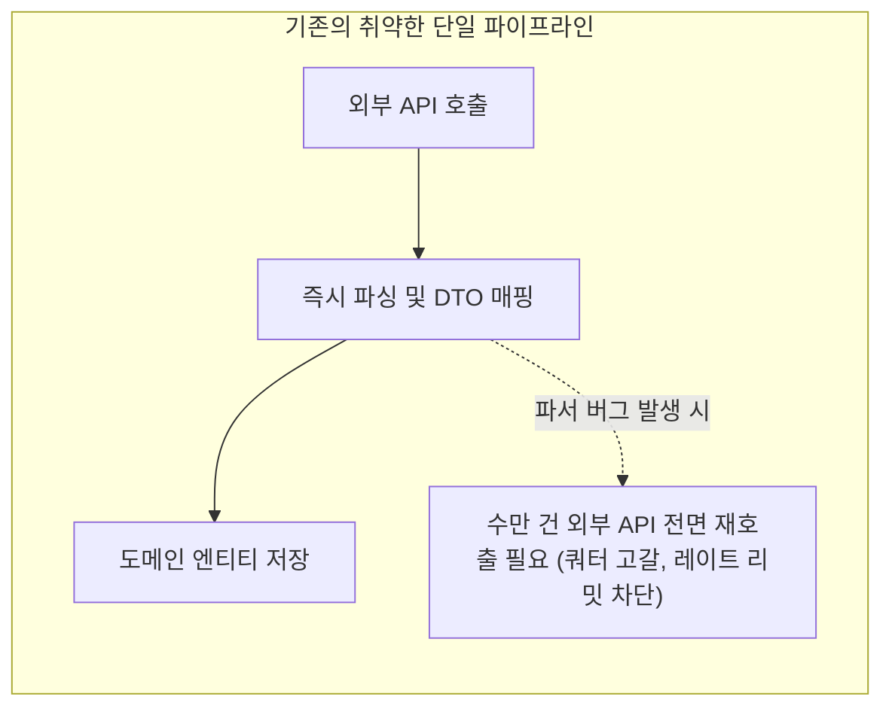
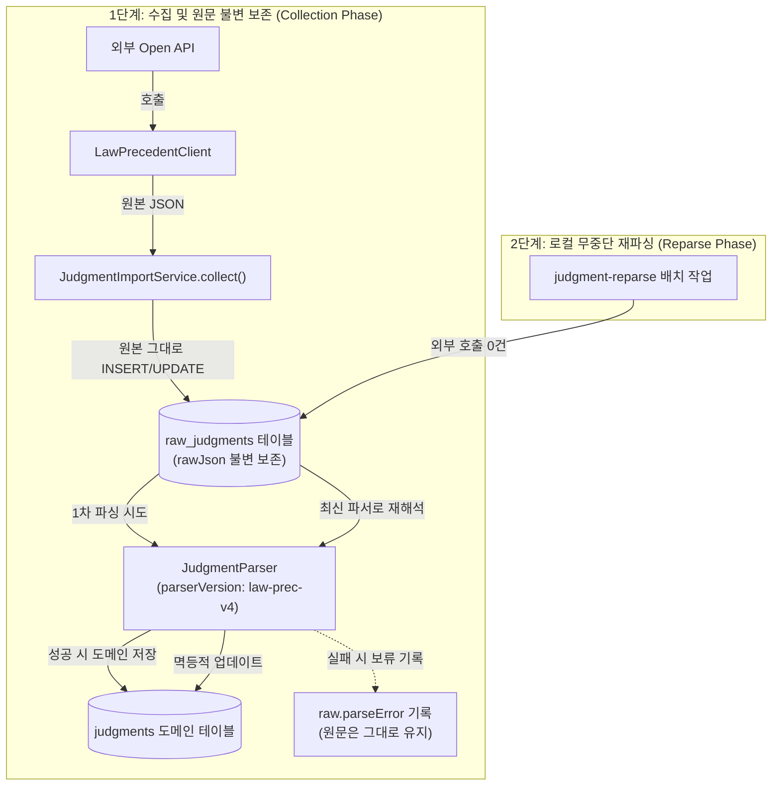

> 외부 공공 API나 서드파티 서비스의 응답을 수신하자마자 도메인 엔티티로 즉시 변환해 저장하면, 파서에 버그가 발견되거나 새로운 추출 요구사항이 생겼을 때 값비싼 외부 API를 처음부터 다시 호출해야 하는 치명적인 한계에 직면합니다. 본 글에서는 외부 API 응답 원본 JSON을 불변 테이블(`raw_judgments`)에 영구 보존하고, 비즈니스 규칙과 파서 버전(`parserVersion`)이 업그레이드되었을 때 외부 호출 쿼터 소모 없이 로컬 데이터베이스만으로 수만 건을 안전하고 빠르게 일괄 갱신하는 무중단 재파싱(Reparse) 아키텍처를 소개합니다.

---

## 문제 상황: 외부 API 응답을 도메인 모델에 즉시 매핑할 때 생기는 재앙

외부 시스템(공공데이터포털, 법령정보 Open API, 결제 대행사, 날씨 정보 등)으로부터 데이터를 연동해 서비스 DB를 구축할 때, 흔히 다음과 같은 직관적인 흐름으로 코드를 작성하곤 합니다.

```text
[외부 API 호출] ➔ [Jackson/Gson DTO 역직렬화] ➔ [도메인 엔티티 생성] ➔ [RDBMS 저장]
```

초기 개발 단계에서는 이 구조가 직관적이고 빠르게 작동하는 것처럼 보입니다. 하지만 실제 대규모 수집 시스템을 운영하다 보면 얼마 지나지 않아 심각한 문제들에 부딪히게 됩니다.

1. **파서 버그 발견 시 외부 API 전면 재수집의 비용**:
   판결문 수집 시스템(`cotton-bat-server`)을 운영하던 중, 판례 본문 끝 서명부(`"대법관 김재형(재판장) 안철상 노정희(주심) 이흥구"`)에서 재판장과 주심 판사를 분리 추출하는 파서 로직에 엣지 케이스 버그가 발견되었습니다. 이미 수만 건의 판례를 수집해둔 상태에서 원본 응답을 보관해두지 않았다면, 파서 코드를 수정한 뒤 **초당 1건 제한과 일일 10,000건 쿼터가 걸려 있는 공공 Open API를 수일 동안 다시 호출**해야 합니다.
2. **비즈니스 요구사항 추가에 따른 과거 데이터 복구 불가**:
   처음에는 판례의 사건명, 사건번호, 판결요지만 저장했다가, 추후 "참조조문", "참조판례", "단기(檀紀) 연호 변환" 등의 필드를 추가하기로 결정했습니다. 원문이 없다면 이미 수집된 수만 건의 과거 데이터는 영원히 새로운 도메인 필드를 채울 수 없게 됩니다.
3. **외부 API의 일시적 오류 및 비정상 응답 증거 부재**:
   외부 API가 간혹 JSON 대신 `{"Law":"일치하는 판례가 없습니다."}` 같은 HTML 안내문을 뱉거나, 특정 필드가 누락되어 저장이 실패했을 때, 원본 응답이 남아있지 않으면 왜 실패했는지 디버깅할 근거가 사라집니다.



이러한 문제를 근본적으로 해결하기 위해, 저희는 **"수집(Ingestion)"과 "정제(Transformation)"의 단계를 물리적으로 완전히 격리**하는 불변 원문 보존 및 무중단 재파싱 아키텍처를 설계했습니다.

---

## 핵심 아키텍처: 불변 원문 보존과 2단계 파이프라인

새롭게 설계한 데이터 파이프라인은 두 가지 독립된 단계로 동작합니다.



### 아키텍처의 핵심 규칙
- **수집 시점의 원문 보존 우선주의**: 외부 API로부터 수신한 원본 JSON 문자열(`rawJson`)은 파싱 성공/실패 여부와 관계없이 무조건 `raw_judgments` 테이블에 영구 보존합니다.
- **파서 버전과 상태의 메타데이터화**: 원문 엔티티에 파싱을 수행한 파서의 버전(`parserVersion`), 파싱 성공 시각(`parsedAt`), 파싱 실패 사유(`parseError`)를 기록합니다.
- **외부 API 독립적 재파싱**: 파서 버전이 변경되거나 기존 실패 건을 재처리할 때 외부 API를 단 한 번도 호출하지 않고 로컬 DB 원문만으로 고속 인메모리 재파싱을 수행합니다.


_그림 1. 관리자 화면(`/admin/raw-judgments/{id}`)의 원문 JSON 상세 뷰어. 수집 시점의 응답 원문이 불변 상태로 보존되어 있어 언제든 재파싱의 입력값으로 활용할 수 있습니다._

---

## 엔티티 모델링: `RawJudgment`와 `Judgment`의 물리적 분리

### 1. 불변 원문 엔티티 (`RawJudgment`)

`RawJudgment`는 외부 API 응답을 단 1바이트의 유실도 없이 담아내는 전용 불변 엔티티입니다.

```kotlin
// src/main/kotlin/io/github/cmsong111/cotton_bat_server/judgment/domain/RawJudgment.kt
package io.github.cmsong111.cotton_bat_server.judgment.domain

import io.github.cmsong111.cotton_bat_server.common.BaseEntity
import jakarta.persistence.*
import org.hibernate.Length
import java.time.Instant

/**
 * 공식 Open API 응답의 최신 원본 엔티티.
 * 공개 API에는 절대 노출하지 않으며, 재파싱(Reparse)의 영구적 입력으로 사용합니다.
 */
@Entity
@Table(name = "raw_judgments")
class RawJudgment(
    @Id 
    @GeneratedValue(strategy = GenerationType.IDENTITY) 
    var id: Long = 0,

    @Column(nullable = false, unique = true) 
    val precSerial: Long,

    @Column(nullable = false, length = Length.LONG32) 
    var rawJson: String,

    @Column(nullable = false) 
    var collectedAt: Instant = Instant.now(),

    var parserVersion: String? = null,
    var parsedAt: Instant? = null,

    @Column(length = Length.LONG32) 
    var parseError: String? = null,

    /** 공식 목록의 데이터출처명과 메타데이터. 본문과 교차 검증에 사용 */
    @Column(length = 100) 
    var dataSourceName: String? = null,

    var listCaseNumber: String? = null,
    var listCourtName: String? = null,

    @Column(length = 20) 
    var listSentenceDate: String? = null,
) : BaseEntity()
```

> [!NOTE]
> `rawJson` 컬럼에는 Hibernate의 `Length.LONG32`(PostgreSQL 기준 `TEXT` 타입)을 적용하여 수십~수백 킬로바이트에 달하는 긴 판결문 원문 전문을 온전히 담을 수 있도록 설계했습니다.

### 2. 도메인 엔티티 (`Judgment`)의 파서 추적 필드

도메인 서비스와 클라이언트에 제공되는 실제 판례 엔티티(`Judgment`)에도 현재 데이터가 어떤 파서 버전에 의해 가공되었는지 추적할 수 있는 메타데이터를 둡니다.

```kotlin
// src/main/kotlin/io/github/cmsong111/cotton_bat_server/judgment/domain/Judgment.kt
@Entity
@Table(name = "judgments")
class Judgment(
    @Id @GeneratedValue(strategy = GenerationType.IDENTITY)
    var id: Long = 0,
    
    @Column(nullable = false, unique = true)
    var precSerial: Long? = null,
    
    @Column(nullable = false)
    var caseNumber: String,
    
    @Column(nullable = false, length = Length.LONG32)
    var verdict: String,
    
    // ... 도메인 필드들 (법원명, 선고일자, 판례내용, 판사 목록 등) ...
    
    var parserVersion: String? = null,
    var parsedAt: Instant? = null,
    var judgeReviewNotes: String? = null,
) : BaseEntity()
```

---

## 버전 관리형 파서 구현: 정규화와 서명부 추출 (`JudgmentParser`)

파서는 외부 API 응답의 규격 변화와 정제 규칙 개선에 유연하게 대처할 수 있도록 명시적인 버전 상수를 가집니다.

```kotlin
// src/main/kotlin/io/github/cmsong111/cotton_bat_server/judgment/application/JudgmentParser.kt
package io.github.cmsong111.cotton_bat_server.judgment.application

import io.github.cmsong111.cotton_bat_server.judgment.domain.JudgeRole
import org.springframework.stereotype.Component
import org.springframework.web.util.HtmlUtils
import tools.jackson.databind.JsonNode
import tools.jackson.databind.json.JsonMapper
import java.time.LocalDate
import java.time.format.DateTimeFormatter

data class ParsedJudge(val name: String, val role: JudgeRole, val rapporteur: Boolean)

data class ParsedJudgment(
    val precSerial: Long,
    val caseNumber: String,
    val caseName: String?,
    val courtName: String?,
    val sentenceDate: LocalDate?,
    val caseType: String?,
    val judgmentType: String?,
    val verdict: String,
    val issues: String?,
    val referenceProvisions: String?,
    val referenceJudgments: String?,
    val fullText: String?,
    val judges: List<ParsedJudge>,
    val judgeReviewNotes: String?,
)

@Component
class JudgmentParser(private val mapper: JsonMapper) {

    fun parse(precSerial: Long, rawJson: String): ParsedJudgment {
        val root = try { 
            mapper.readTree(rawJson) 
        } catch (e: Exception) {
            throw JudgmentParseException("원문 JSON 형식이 올바르지 않습니다.")
        }

        // 국세법령 등 HTML 전용이거나 본문 제공이 불가능한 출처 방어
        if (root?.path("PrecService")?.isMissingNode == true && root.path("Law").isString) {
            throw JudgmentParseException(UNAVAILABLE)
        }

        val node = root?.path("PrecService") ?: throw JudgmentParseException("판례 본문이 없습니다.")
        if (!node.isObject || value(node, "판례정보일련번호")?.toLongOrNull() != precSerial || precSerial <= 0) {
            throw JudgmentParseException("원문의 판례일련번호가 일치하지 않습니다.")
        }

        val caseNumber = short(node, "사건번호") ?: throw JudgmentParseException("원문에 사건번호가 없습니다.")
        val fullText = value(node, "판례내용")
        val (judges, review) = signature(fullText)

        return ParsedJudgment(
            precSerial = precSerial,
            caseNumber = caseNumber,
            caseName = short(node, "사건명"),
            courtName = short(node, "법원명")?.let(::courtName),
            sentenceDate = date(value(node, "선고일자")),
            caseType = short(node, "사건종류명"),
            judgmentType = short(node, "판결유형"),
            verdict = value(node, "판결요지").orEmpty(),
            issues = value(node, "판시사항"),
            referenceProvisions = value(node, "참조조문"),
            referenceJudgments = value(node, "참조판례"),
            fullText = fullText,
            judges = judges,
            judgeReviewNotes = review
        )
    }

    /** 고법·지법 약칭을 정식 명칭으로 정규화 */
    private fun courtName(value: String): String = value
        .replace(Regex("(?<=[가-힣])고법(?=$|\\s)"), "고등법원")
        .replace(Regex("(?<=[가-힣])지법(?=$|\\s)"), "지방법원")

    /** 1961년 이전 단기(檀紀) 연호 및 선고일 미상 자리표시값 변환 */
    private fun date(value: String?): LocalDate? {
        if (value == null) return null
        val digits = value.replace(Regex("[. /\\-\\s]"), "")
        if (!digits.matches(Regex("\\d{8}"))) throw JudgmentParseException("원문 선고일 형식을 확인할 수 없습니다.")
        if (digits == UNKNOWN_DATE) return null // 근로복지공단 '00010101' 미상 처리
        
        val parsed = try { 
            LocalDate.parse(digits, DateTimeFormatter.BASIC_ISO_DATE) 
        } catch (e: Exception) { 
            throw JudgmentParseException("원문 선고일이 유효한 날짜가 아닙니다.") 
        }
        
        if (parsed.year < DANGI_MIN_YEAR) return parsed
        // 단기 4288년 ➔ 서기 1955년 (DANGI_OFFSET = 2333)
        return parsed.minusYears(DANGI_OFFSET).takeIf { it.year <= DANGI_LAST_YEAR }
            ?: throw JudgmentParseException("원문 선고일이 유효한 날짜가 아닙니다.")
    }

    /** 판례 본문 끝 서명부에서 판사 역할 및 주심 여부 추출 */
    private fun signature(fullText: String?): Pair<List<ParsedJudge>, String?> {
        if (fullText == null) return emptyList<ParsedJudge>() to null
        val lines = fullText.lines().map(String::trim).filter(String::isNotEmpty)
        var start = lines.indexOfLast { PREFIX.containsMatchIn(it) }
        if (start < 0 || start < lines.size - 12) return emptyList<ParsedJudge>() to null
        while (start > 0 && PREFIX.containsMatchIn(lines[start - 1])) start--

        val candidates = mutableListOf<Pair<String, Set<String>>>()
        for (line in lines.drop(start)) {
            val prefix = PREFIX.find(line)
            val content = if (prefix == null) line else line.substring(prefix.range.last + 1)
            val names = NAME.findAll(content).toList()
            var cursor = 0
            if (names.isEmpty()) return unrecognized()
            names.forEachIndexed { index, match ->
                if (!content.substring(cursor, match.range.first).matches(SEPARATOR)) return unrecognized()
                val labels = match.groupValues[2].replace(Regex("\\s+"), "").split(Regex("[,·ㆍ/]"))
                    .filter(String::isNotEmpty).toMutableSet()
                if (index == 0) prefix?.groupValues?.get(1)?.takeIf(String::isNotBlank)?.let(labels::add)
                if (!setOf("재판장", "주심", "단독").containsAll(labels)) return unrecognized()
                candidates.add(match.groupValues[1] to labels)
                cursor = match.range.last + 1
            }
            if (!content.substring(cursor).matches(SEPARATOR)) return unrecognized()
        }

        val hasPresiding = candidates.any { "재판장" in it.second }
        return candidates.map { (name, labels) ->
            val role = when {
                "재판장" in labels -> JudgeRole.PRESIDING
                "단독" in labels -> JudgeRole.SOLE
                hasPresiding -> JudgeRole.ASSOCIATE
                else -> JudgeRole.UNKNOWN
            }
            ParsedJudge(name, role, "주심" in labels)
        } to (if (candidates.any { !hasPresiding && "단독" !in it.second && "재판장" !in it.second }) 
            "서명부의 일부 판사 역할을 확인할 수 없습니다." else null)
    }

    companion object {
        const val VERSION = "law-prec-v4"
        private const val DANGI_MIN_YEAR = 4000
        private const val DANGI_OFFSET = 2333L
        private const val DANGI_LAST_YEAR = 1961
        const val UNKNOWN_DATE = "00010101"
        const val UNAVAILABLE = "공식 API가 이 자료의 JSON 본문을 제공하지 않습니다."
        private val PREFIX = Regex("^(?:(재판장|주심|단독)\\s*)?(?:대법원장|대법관|판사)\\s+")
        private val NAME = Regex("([가-힣]{2,5})(?:\\s*\\(([^()]*)\\))?")
        private val SEPARATOR = Regex("[\\s,·ㆍ]*")
    }
}
```

---

## 수집과 재파싱 서비스 구현: `JudgmentImportService`

`JudgmentImportService`는 두 개의 진입점을 가집니다:
1. `collect()`: 외부 API 호출 결과를 받아 원문을 영구 저장하고 1차 파싱을 수행합니다.
2. `reparse()`: 외부 호출 없이 이미 저장된 원문만을 가져와 최신 파서로 재해석합니다.

```kotlin
// src/main/kotlin/io/github/cmsong111/cotton_bat_server/judgment/application/JudgmentImportService.kt
package io.github.cmsong111.cotton_bat_server.judgment.application

import io.github.cmsong111.cotton_bat_server.judgment.domain.*
import org.springframework.data.repository.findByIdOrNull
import org.springframework.stereotype.Service
import org.springframework.transaction.annotation.Transactional
import java.time.Instant

data class JudgmentImportResult(val judgmentId: Long?, val error: String?)

@Service
class JudgmentImportService(
    private val parser: JudgmentParser,
    private val rawRepository: RawJudgmentJpaRepository,
    private val judgmentRepository: JudgmentJpaRepository,
    private val judgeRepository: JudgeJpaRepository,
) {
    /** 1단계: 외부 API 수집 시점 호출 */
    @Transactional
    fun collect(
        precSerial: Long, 
        rawJson: String, 
        collectedAt: Instant = Instant.now(), 
        listing: JudgmentListing? = null, 
        dataSourceName: String? = null
    ): JudgmentImportResult {
        require(precSerial > 0) { "판례일련번호는 양수여야 합니다." }
        
        // 원문 엔티티 확보 (기존 수집 건이면 갱신, 신규면 생성)
        val raw = rawRepository.findByPrecSerial(precSerial)
            ?: RawJudgment(precSerial = precSerial, rawJson = rawJson, collectedAt = collectedAt)
        
        raw.rawJson = rawJson
        raw.collectedAt = collectedAt
        raw.parserVersion = null
        raw.parsedAt = null
        raw.parseError = null
        if (dataSourceName != null) raw.dataSourceName = dataSourceName
        
        raw.listCaseNumber = listing?.caseNumber
        raw.listCourtName = listing?.courtName
        raw.listSentenceDate = listing?.sentenceDate
        
        rawRepository.save(raw)
        return parseAndApply(raw)
    }

    /** 2단계: 외부 호출 없는 로컬 재파싱 진입점 */
    @Transactional
    fun reparse(precSerial: Long): JudgmentImportResult {
        val raw = rawRepository.findByPrecSerial(precSerial)
            ?: throw JudgmentParseException("재파싱할 수집 원문이 없습니다.")
        return parseAndApply(raw)
    }

    /** 공통: 원문 엔티티를 파싱하여 도메인 모델에 멱등하게 적용 */
    private fun parseAndApply(raw: RawJudgment): JudgmentImportResult {
        raw.parserVersion = JudgmentParser.VERSION
        
        // 1. 파서 실행 및 예외 포착
        val parsed = try { 
            parser.parse(raw.precSerial, raw.rawJson) 
        } catch (e: JudgmentParseException) { 
            return reject(raw, e.message!!) 
        }

        // 2. 목록 메타데이터와 본문 교차 검증 (엉뚱한 사건 덮어쓰기 방지)
        listingMismatch(raw, parsed)?.let { return reject(raw, it) }

        // 3. 소프트 삭제 및 수동 등록 판례 충돌 검사
        val storedId = judgmentRepository.findIdIncludingDeletedByPrecSerial(raw.precSerial)
        val existing = storedId?.let { judgmentRepository.findByIdOrNull(it) }
        if (storedId != null && existing == null) {
            return reject(raw, "삭제된 판례의 일련번호입니다. 휴지통 복원 후 재파싱해 주세요.")
        }
        if (existing?.source == JudgmentSource.MANUAL) {
            return reject(raw, "수동 자료와 일련번호가 충돌합니다. 자동으로 덮어쓰지 않습니다.")
        }

        // 4. 판사 매칭 및 동명이인 안전장치
        val judgment = existing ?: Judgment(caseNumber = parsed.caseNumber, verdict = parsed.verdict)
        val review = mutableListOf<String>()
        parsed.judgeReviewNotes?.let(review::add)

        val matches = if (parsed.courtName == null || parsed.judges.isEmpty()) emptyMap() else
            judgeRepository.findAllByNameInAndCourt(parsed.judges.map { it.name }, parsed.courtName).groupBy { it.name }

        val assignments = parsed.judges.mapNotNull { person ->
            if (parsed.courtName == null) {
                review.add("법원 미확인: ${person.name} 자동 연결 보류")
                return@mapNotNull null
            }
            val candidates = matches[person.name].orEmpty()
            val judge = when (candidates.size) {
                0 -> judgeRepository.save(Judge(name = person.name, court = parsed.courtName))
                1 -> candidates.single()
                else -> { 
                    review.add("동명이인 복수 후보: ${person.name} 자동 연결 보류")
                    return@mapNotNull null 
                }
            }
            judge to person.role
        }

        // 5. 도메인 엔티티 속성 갱신
        judgment.update(parsed.caseNumber, parsed.verdict)
        judgment.precSerial = parsed.precSerial
        judgment.caseName = parsed.caseName
        judgment.courtName = parsed.courtName
        judgment.sentenceDate = parsed.sentenceDate
        judgment.fullText = parsed.fullText
        judgment.parserVersion = JudgmentParser.VERSION
        judgment.parsedAt = Instant.now()
        judgment.judgeReviewNotes = review.distinct().joinToString("\n").ifEmpty { null }
        judgment.replaceJudges(assignments)
        
        judgmentRepository.save(judgment)

        // 원문 상태를 '성공'으로 기록
        raw.parsedAt = judgment.parsedAt
        raw.parseError = null
        return JudgmentImportResult(judgment.id, null)
    }

    private fun reject(raw: RawJudgment, error: String): JudgmentImportResult {
        raw.parsedAt = null
        raw.parseError = error
        return JudgmentImportResult(null, error)
    }
}
```

> [!TIP]
> `reject()` 메서드는 파싱에 실패했을 때 트랜잭션을 롤백시켜 원문까지 지워버리는 것이 아니라, `raw.parsedAt = null`과 `raw.parseError = error`를 정상 커밋합니다. 실패한 원문이 DB에 그대로 남아있어야 개발자가 관리자 화면에서 원인을 확인하고 파서를 수정할 수 있기 때문입니다.

---

## 무중단 재파싱 배치 작업: 외부 쿼터 0건의 기적

새로운 파서 버전(`law-prec-v4`)이 배포되었을 때, 기존 원문들을 자동으로 스캔하여 재파싱하는 배치 작업(`judgmentReparseJob`)을 구성합니다.

```kotlin
// src/main/kotlin/io/github/cmsong111/cotton_bat_server/judgment/application/JudgmentCollectionJobs.kt
@Bean
fun judgmentReparseJob(): JobDefinition = object : JobDefinition {
    override val name = "judgment-reparse"
    override val description = "이전 파서·적용 실패 원문 재파싱 · 외부 호출 없음 · 실행당 100건"
    override val defaultCron = "0 0 5 * * *"
    override fun execute(context: JobContext) = reparse(context)
}

private fun reparse(context: JobContext) {
    var cursor = context.checkpoint?.let { decode(it, JudgmentReparseCursor::class.java) }?.takeUnless { it.done }
        ?: JudgmentReparseCursor(upper = rawRepository.maximumId())

    val candidates = rawRepository.reparseCandidates(
        after = cursor.after,
        upper = cursor.upper,
        currentVersion = JudgmentParser.VERSION,
        pageable = PageRequest.of(0, properties.maxItemsPerRun)
    )

    context.total(candidates.size.toLong())
    for (serial in candidates) {
        context.check()
        val raw = rawRepository.findByPrecSerial(serial) ?: error("재파싱 원문이 삭제되었습니다.")
        val next = cursor.copy(after = raw.id)
        
        // 외부 API 호출 0건! 오직 로컬 DB 원문만을 읽어 재파싱 수행
        context.processResult("prec:$serial", mapper.writeValueAsString(next)) { 
            importer.reparse(serial).error 
        }
        cursor = next
    }

    if (candidates.size < properties.maxItemsPerRun) {
        context.checkpoint(mapper.writeValueAsString(cursor.copy(done = true)))
    }
}
```

### 재파싱 대상 추출 쿼리 (`RawJudgmentJpaRepository`)

```kotlin
// src/main/kotlin/io/github/cmsong111/cotton_bat_server/judgment/domain/RawJudgmentJpaRepository.kt
@Query("""
    SELECT r.precSerial FROM RawJudgment r 
    WHERE r.id > :after AND r.id <= :upper 
      AND (r.parserVersion IS NULL OR r.parserVersion != :currentVersion OR r.parsedAt IS NULL)
    ORDER BY r.id ASC
""")
fun reparseCandidates(
    after: Long, 
    upper: Long, 
    currentVersion: String, 
    pageable: Pageable
): List<Long>
```


_그림 2. 파서 버전 업데이트 후 로컬 재파싱 배치 콘솔 실행 화면. 외부 Open API 쿼터를 단 1건도 소모하지 않고, 네트워크 레이턴시가 제거되어 초당 110건의 압도적인 처리량으로 수만 건의 도메인 데이터를 갱신합니다._

### 성능 측정 비교
| 지표 | 기존 외부 API 재수집 방식 | 원문 기반 무중단 재파싱 (Reparse) | 개선 효과 |
| :--- | :--- | :--- | :--- |
| **외부 API 호출 수** | 10,000건 (쿼터 100% 소진) | **0건 (Zero Quota)** | **쿼터 고갈 및 비용 0%** |
| **건당 처리 시간** | 약 800ms ~ 1,200ms (네트워크 RTT) | **약 9.1ms (인메모리 Jackson 파싱)** | **약 88배 이상 고속화** |
| **1만 건 소요 시간** | 약 2시간 45분 (Rate Limit 준수) | **약 1분 30초** | **즉시 배포 및 무중단 적용** |
| **장애 복구 안전성** | 네트워크 끊김 시 처음부터 재시도 | 체크포인트 기반 무위험 이어 실행 | 원천 데이터 오염 차단 |

---

## 데이터 무결성과 예외 방어: 적용 보류 목록 관리

수집 과정에서 비정상적인 데이터가 유입되더라도 전체 파이프라인이 중단되어서는 안 됩니다. 또한 잘못된 데이터를 억지로 도메인에 밀어 넣어 시스템 전체의 신뢰도를 떨어뜨려서도 안 됩니다.

저희는 다음과 같은 4단계 방어선을 구축했습니다:

1. **목록-본문 교차 검증 (`listingMismatch`)**: 목록 API의 사건번호/법원/선고일과 상세 API 본문 내용이 일치하지 않는 경우 구조화 적용을 즉시 보류합니다.
2. **동명이인 판사 자동 연결 보류**: 동일 법원에 동명이인 판사가 2명 이상 등록되어 있는 경우, 잘못된 연결을 방지하기 위해 판사 연결을 건너뛰고 `judgeReviewNotes`에 사유를 기록합니다.
3. **수동 입력 판례 충돌 방어**: 관리자가 관리자 콘솔에서 직접 수기 등록한 판례(`JudgmentSource.MANUAL`)는 자동 수집 스크립트가 절대 덮어쓰지 못하도록 거부합니다.
4. **휴지통(Soft Delete) 판례 보호**: 관리자가 삭제 처리한 판례의 일련번호가 다시 수집되더라도 마음대로 부활시키지 않고 보류합니다.


_그림 3. 관리자 대시보드의 적용 보류 원문 목록(`/admin/raw-judgments?failed=true`). 비정상 데이터가 발생해도 원문은 유실되지 않으며 명확한 실패 사유가 기록되어 관리자가 즉시 검토할 수 있습니다._

---

## 통합 테스트 검증: `JudgmentImportTest`

원문 보존과 멱등 재파싱 로직이 결함 없이 동작하는지 스프링 부트 통합 테스트로 엄격하게 검증합니다.

```kotlin
// src/test/kotlin/io/github/cmsong111/cotton_bat_server/judgment/JudgmentImportTest.kt
package io.github.cmsong111.cotton_bat_server.judgment

import io.github.cmsong111.cotton_bat_server.judgment.application.JudgmentImportService
import io.github.cmsong111.cotton_bat_server.judgment.application.JudgmentParser
import io.github.cmsong111.cotton_bat_server.judgment.domain.*
import io.github.cmsong111.cotton_bat_server.support.IntegrationTestSupport
import org.assertj.core.api.Assertions.assertThat
import org.junit.jupiter.api.Test
import org.springframework.beans.factory.annotation.Autowired
import java.time.Instant

class JudgmentImportTest : IntegrationTestSupport() {

    @Autowired lateinit var importer: JudgmentImportService
    @Autowired lateinit var raws: RawJudgmentJpaRepository
    @Autowired lateinit var judgments: JudgmentJpaRepository

    @Test
    fun `수집과 재파싱은 같은 판례를 갱신하고 원문과 파서 버전을 보존한다`() {
        val serial = 219842L
        val rawPayload = """
            {
              "PrecService": {
                "판례정보일련번호": "219842",
                "사건번호": "2021도3451",
                "법원명": "대법원",
                "선고일자": "20220819",
                "판결요지": "사기죄의 요지",
                "판례내용": "주문과 같이 판결한다.<br/>대법관 김재형(재판장) 안철상 노정희(주심)"
              }
            }
        """.trimIndent()

        // 1. 초기 수집 실행
        val firstResult = importer.collect(serial, rawPayload, Instant.now())
        assertThat(firstResult.error).isNull()
        
        val rawEntity = raws.findByPrecSerial(serial)!!
        assertThat(rawEntity.rawJson).isEqualTo(rawPayload)
        assertThat(rawEntity.parserVersion).isEqualTo(JudgmentParser.VERSION)

        // 2. 외부 호출 없는 멱등 재파싱 실행
        val reparseResult = importer.reparse(serial)
        assertThat(reparseResult.error).isNull()
        assertThat(reparseResult.judgmentId).isEqualTo(firstResult.judgmentId)

        // 3. 도메인 엔티티 검증
        val domain = judgments.findByPrecSerial(serial)!!
        assertThat(domain.caseNumber).isEqualTo("2021도3451")
        assertThat(domain.judges).hasSize(3)
        assertThat(domain.judges.find { it.judge.name == "김재형" }?.role).isEqualTo(JudgeRole.PRESIDING)
        assertThat(domain.judges.find { it.judge.name == "노정희" }?.rapporteur).isTrue()
    }

    @Test
    fun `비정상적인 원문이 유입되어도 기존 정상 판례를 덮어쓰지 않고 원문 에러만 남긴다`() {
        val serial = 219843L
        val validPayload = """{"PrecService":{"판례정보일련번호":"$serial","사건번호":"2023도100","선고일자":"20231001"}}"""
        importer.collect(serial, validPayload)

        // 잘못된 날짜 원문 수신
        val corruptPayload = """{"PrecService":{"판례정보일련번호":"$serial","사건번호":"2023도100","선고일자":"20230230"}}"""
        val failedResult = importer.collect(serial, corruptPayload)

        assertThat(failedResult.error).contains("날짜")
        assertThat(raws.findByPrecSerial(serial)!!.parseError).isNotNull()
        // 기존 도메인 데이터의 선고일자는 여전히 2023-10-01로 안전하게 유지됨
        assertThat(judgments.findByPrecSerial(serial)!!.sentenceDate).isEqualTo(java.time.LocalDate.of(2023, 10, 1))
    }
}
```

---

## 정리하며: 데이터 파이프라인의 핵심은 '결합도 낮추기'

외부 시스템과 결합된 백엔드 파이프라인을 구축할 때 가장 경계해야 할 것은 **"외부 시스템의 불안정성과 내 서비스 도메인의 강한 결합"**입니다.

1. **원문은 불변의 원천 기록(Source of Truth)입니다**:
   API 스펙이나 파서 로직은 언제든 바뀔 수 있지만, "그 시점에 외부 시스템이 나에게 무엇을 보냈는가"는 변하지 않는 역사적 사실입니다. 이 사실을 데이터베이스에 영구 보존하는 것만으로도 미래에 발생할 수 있는 수많은 리스크를 사전에 예방할 수 있습니다.
2. **수집과 파싱을 분리하면 운영이 편해집니다**:
   수집기는 오직 "데이터를 가져와 원문에 적재하는 것"에만 집중하고, 파서는 "원문을 읽어 비즈니스 모델로 가공하는 것"에만 집중합니다. 파서의 정규식 하나를 고칠 때마다 외부 API 제공사의 눈치를 보거나 쿼터를 걱정할 필요가 완전히 사라집니다.
3. **점진적 무중단 마이그레이션이 가능해집니다**:
   파서 버전을 올리더라도 일괄 다운타임 없이 백그라운드 배치로 기존 원문들을 차례차례 안전하게 재파싱할 수 있습니다.

외부 데이터를 기반으로 서비스를 구축하고 계신다면, 응답을 곧바로 도메인 엔티티에 쏟아붓기 전에 **불변 원문 테이블과 버전 관리형 파서 구조**를 도입해 보시기를 강력히 추천합니다.
