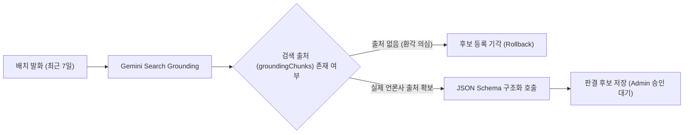

> Spring AI 2.0.1의 범용 `ChatResponse` 변환 계층에서 유실되던 Google Search Grounding의 실제 웹 출처 URL(`groundingChunks`)과 검색 쿼리 메타데이터를, 공식 Google GenAI SDK(`com.google.genai.Client`) 직결을 통해 100% 보존한 트러블슈팅 경험을 공유합니다. 모델의 환각(Hallucination) 링크를 차단하고 검색 엔진이 실측한 출처만 수집하는 2단계 파이프라인(검색 1회 + JSON 구조화 1회) 아키텍처와 Kotlin 구현 코드를 함께 소개합니다.

---

## 문제 배경: 판결 탐색에서 "출처 없는 AI 답변"은 무의미하다

법률 판례 데이터 수집 및 관리 시스템(`cotton-bat-server`)을 구축하며, 최근 7일간 언론에 보도된 주요 하급심 판결을 정기적으로 탐색하는 일배치 작업(`judgment-discovery-job`)을 설계했습니다.

최신 판결은 선고 직후 대법원 종합법률정보나 국가법령정보센터에 즉시 등록되지 않고, 주요 언론 보도를 통해 먼저 대중에 알려지는 경우가 많습니다. 따라서 최신 웹 정보를 실시간으로 검색하여 사건번호, 관할 법원, 선고일, 보도 쟁점을 추출하는 LLM 기반의 탐색기가 필수적이었습니다.

하지만 법률 도메인에서 생성형 AI를 활용할 때 가장 경계해야 할 것은 **모델의 거짓말(환각, Hallucination)**입니다. 모델은 그럴듯한 가짜 사건번호(`2026고합9999`)나 가공의 법원명을 지어내기도 하며, 심지어 존재하지도 않는 가짜 뉴스 URL을 본문에 꾸며내기도 합니다.

이를 방지하기 위해 저희는 다음과 같은 엄격한 원칙을 세웠습니다:

1. **Google Search Grounding 필수 적용**: 모델이 내부 가중치에만 의존하지 않고, 최신 구글 검색 결과를 근거로만 판결 정보를 요약하도록 강제한다.
2. **모델 본문 속 링크 불인정**: 모델이 본문 텍스트 안에 생성한 마크다운 링크(`[기사](https://...)`)는 환각일 수 있으므로 출처로 인정하지 않는다.
3. **실제 Grounding 메타데이터 검증**: Google 검색 엔진이 모델 응답과 함께 전달한 **실제 출처 메타데이터(`groundingChunks`)에 존재하는 URL만** 도메인 엔티티(`DiscoverySource`)로 영속화한다. 출처가 0건이면 후보 등록을 즉시 기각한다.



---

## 직면한 한계: Spring AI 2.0.1의 메타데이터 유실

스프링 부트 환경에서 LLM을 연동할 때 사실상의 표준 프레임워크는 **Spring AI**입니다. 저희 프로젝트 역시 `spring-ai-starter-model-google-genai:2.0.1` 의존성을 선언하고 일반적인 `ChatModel` 빈을 통해 Gemini 2.5/3.5 모델을 연동하고자 했습니다.

```kotlin
// Spring AI를 통한 호출 시도 예시
val prompt = Prompt(
    "최근 7일간 선고된 법원 주요 판결 보도를 검색하고 요약해 줘.",
    GoogleGenAiChatOptions.builder()
        .model("gemini-3.5-flash-lite")
        .build()
)
val chatResponse: ChatResponse = chatModel.call(prompt)
```

Gemini 옵션에 Google Search 도구를 활성화하고 호출을 진행했을 때, 본문 요약 텍스트(`chatResponse.result.output.text`)는 정상적으로 수신되었습니다. 하지만 **응답 메타데이터를 파싱하려는 순간 심각한 문제**에 직면했습니다.


_그림 1. Spring AI ChatResponse와 Google GenAI SDK 직접 수신 간의 메타데이터 비교 콘솔. Spring AI 변환 계층에서 groundingMetadata가 null로 유실되는 현상을 확인할 수 있습니다._

콘솔 디버그 로그에서 드러난 문제는 명확했습니다:

- **`groundingMetadata`의 증발**: Google GenAI 원본 API가 내려주는 `candidate.groundingMetadata` 객체(실제 검색된 웹 URL, 기사 제목, 도메인 목록)가 Spring AI의 `ChatResponse`와 `ChatResponseMetadata` 변환 과정에서 완전히 누락되어 `null`로 떨어졌습니다.
- **검색 쿼리(`webSearchQueries`) 소실**: 모델이 최신 판결을 찾기 위해 실제로 구글 검색 엔진에 입력한 쿼리 목록도 유실되었습니다.
- **토큰 사용량 분리 불가**: Gemini의 원본 `usageMetadata`에는 `thoughtsTokenCount`(생각 토큰)와 `toolUsePromptTokenCount`(검색 도구 토큰)가 정밀하게 분리되어 전달되지만, Spring AI에서는 단순 입력/출력 토큰으로 합산되어 과금 정산 시 불투명성을 유발했습니다.

저희 시스템의 핵심 룰은 **"Google 검색 메타데이터에 실제 존재하는 출처만 저장하고, 출처가 없으면 후보 등록을 기각한다"**는 것인데, 프레임워크 추상화 계층에서 출처 메타데이터가 통째로 사라지니 모든 배치가 `검색 응답에 출처가 없어 후보를 만들지 않았습니다`라는 예외를 던지며 멈춰버렸습니다.

---

## 원인 분석: 범용 추상화와 공급자 특화 기능의 딜레마

이 문제가 발생한 근본적인 원인은 Spring AI의 **추상화 지향 설계**에 있습니다.

Spring AI의 핵심 인터페이스인 `ChatModel`은 OpenAI, Anthropic Claude, AWS Bedrock, Google Gemini 등 이종 모델을 단일한 `ChatResponse`와 `Generation` 모델로 감싸는 것을 목표로 합니다.

```
[Google GenAI 원본 API]
GenerateContentResponse
  └── candidates[0]
        ├── content (parts...)
        └── groundingMetadata  <-- Google 고유 스펙!
              ├── webSearchQueries
              ├── groundingChunks (web.uri, web.title, web.domain)
              └── groundingSupports

                  ▼ (Spring AI 2.0.1 내부 DTO 변환)

[Spring AI 범용 모델]
ChatResponse
  └── results[0] -> Generation (AssistantMessage)
  └── metadata -> ChatResponseMetadata
        └── usage (promptTokens, generationTokens)
        └── (groundingMetadata 필드 자체가 부재하거나 매핑 누락!)
```

OpenAI나 Anthropic에는 Gemini 고유의 Google Search Grounding과 1:1로 대응되는 공통 규격이 존재하지 않습니다. 따라서 Spring AI 2.0.1의 변환 로직은 텍스트 파트(`text`), 함수 호출(`toolCalls`), 표준 사용량(`Usage`)만 변환하고, Gemini 전용 확장 메타데이터인 `groundingMetadata`는 표준 필드로 변환해 주지 못했습니다.

또한, Spring AI의 `ChatModel`에 검색 도구를 전역 설정하면, 단순 JSON 구조화(`STRUCTURE` 단계) 호출을 수행할 때도 모델이 불필요하게 구글 검색을 시도하여 API 지연과 토큰 낭비가 발생하는 부작용도 있었습니다.

---

## 해결 방법: 공식 Google GenAI SDK 직결 및 도메인 인터페이스 격리

문제를 근본적으로 해결하기 위해, 저희는 Spring AI의 상위 추상화 계층을 걷어내고 공식 Google GenAI 자바 SDK(`com.google.genai:google-genai`)를 직접 연동하기로 결정했습니다.

다만 인프라 세부 기술이 비즈니스 로직에 침투하지 않도록, **`DiscoveryModel`이라는 도메인 경계 인터페이스**를 정의하고 구현체(`GeminiDiscoveryModel`) 내부에만 Google GenAI SDK를 캡슐화했습니다.

### 1. 의존성 및 설정 관리

`build.gradle.kts`에서는 `spring-ai-starter-model-google-genai`를 유지(트랜시티브하게 `com.google.genai` 클라이언트를 포함)하거나 공식 SDK를 추가합니다:

```kotlin
// build.gradle.kts
dependencies {
    implementation("org.springframework.ai:spring-ai-starter-model-google-genai")
    implementation("tools.jackson.module:jackson-module-kotlin")
}
```

기존 `application.yaml`에 정의된 API 키 프로퍼티(`spring.ai.google.genai.api-key`)를 그대로 재사용하여 SDK 클라이언트를 빈으로 등록합니다:

```kotlin
// src/main/kotlin/io/github/cmsong111/cotton_bat_server/discovery/JudgmentDiscoveryConfig.kt
package io.github.cmsong111.cotton_bat_server.discovery

import com.google.genai.Client
import com.google.genai.types.HttpOptions
import com.google.genai.types.HttpRetryOptions
import io.github.cmsong111.cotton_bat_server.discovery.application.DiscoveryModel
import io.github.cmsong111.cotton_bat_server.discovery.application.GeminiDiscoveryModel
import org.springframework.beans.factory.annotation.Value
import org.springframework.context.annotation.Bean
import org.springframework.context.annotation.Configuration

@Configuration
class JudgmentDiscoveryConfig {
    /** 탐색 전용 클라이언트. 제한 시간을 작업 리스보다 짧게 두고 SDK 재시도는 하지 않는다(재시도는 다음 배치 작업 실행). */
    @Bean
    fun discoveryModel(
        @Value("\${spring.ai.google.genai.api-key}") apiKey: String,
        properties: JudgmentDiscoveryProperties
    ): DiscoveryModel {
        val client = Client.builder()
            .apiKey(apiKey)
            .vertexAI(false)
            .httpOptions(
                HttpOptions.builder()
                    .timeout(properties.timeout.toMillis().toInt())
                    .retryOptions(HttpRetryOptions.builder().attempts(1).build())
                    .build()
            )
            .build()
        return GeminiDiscoveryModel(client, properties)
    }
}
```

안전한 호출 제한을 위해 `JudgmentDiscoveryProperties`로 타임아웃과 토큰 한도를 관리합니다:

```kotlin
// src/main/kotlin/io/github/cmsong111/cotton_bat_server/discovery/JudgmentDiscoveryProperties.kt
package io.github.cmsong111.cotton_bat_server.discovery

import org.springframework.boot.context.properties.ConfigurationProperties
import java.time.Duration

@ConfigurationProperties("app.judgment-discovery")
data class JudgmentDiscoveryProperties(
    val model: String = "gemini-3.5-flash-lite",
    val windowDays: Int = 7,
    val maxCandidates: Int = 10,
    val dailyCallLimit: Int = 4,
    val timeout: Duration = Duration.ofSeconds(120),
    val maxOutputTokens: Int = 8192,
    val verifyBatchSize: Int = 20,
    val verifyRetryInterval: Duration = Duration.ofDays(1),
    val sourceWaitDays: Int = 14,
) {
    init {
        require(model.matches(Regex("[a-z0-9.\\-]{1,100}"))) { "탐색 모델 이름 형식을 확인해 주세요." }
        require(windowDays in 1..30) { "탐색 기간은 1~30일이어야 합니다." }
        require(maxCandidates in 1..30) { "실행당 최대 후보 수는 1~30건이어야 합니다." }
        require(timeout > Duration.ZERO && timeout <= Duration.ofMinutes(4)) { "호출 제한 시간은 0초 초과~4분이어야 합니다." }
    }
}
```

### 2. Grounding 메타데이터를 온전히 추출하는 구현체

`GeminiDiscoveryModel`에서는 검색 단계(`search`)와 JSON 구조화 단계(`structure`)를 명확히 분리하고, 원본 응답의 `groundingMetadata`를 파싱하여 도메인 객체(`GroundedSource`)로 변환합니다:

```kotlin
// src/main/kotlin/io/github/cmsong111/cotton_bat_server/discovery/application/DiscoveryModel.kt
package io.github.cmsong111.cotton_bat_server.discovery.application

import com.google.genai.Client
import com.google.genai.errors.ApiException
import com.google.genai.errors.GenAiIOException
import com.google.genai.types.GenerateContentConfig
import com.google.genai.types.GenerateContentResponse
import com.google.genai.types.GoogleSearch
import com.google.genai.types.Tool
import io.github.cmsong111.cotton_bat_server.discovery.JudgmentDiscoveryProperties

data class DiscoveryUsage(
    val promptTokens: Int?,
    val outputTokens: Int?,
    val thoughtTokens: Int?,
    val toolTokens: Int?,
    val totalTokens: Int?
)

/** 검색 응답의 grounding 메타데이터에 실제로 있던 출처. 모델 본문 속 링크는 출처로 쓰지 않는다. */
data class GroundedSource(val url: String, val title: String?, val domain: String?)

data class DiscoverySearchResult(
    val text: String,
    val sources: List<GroundedSource>,
    val queries: List<String>,
    val usage: DiscoveryUsage?
)

data class DiscoveryStructureResult(val json: String, val usage: DiscoveryUsage?)

/** 탐색 모델 경계. 테스트는 이 인터페이스를 목(Mock)으로 대체한다. */
interface DiscoveryModel {
    val modelName: String
    fun search(prompt: String): DiscoverySearchResult
    fun structure(prompt: String, schema: Map<String, Any>): DiscoveryStructureResult
}

class DiscoveryModelException(message: String) : RuntimeException(message)

/**
 * Spring AI 2.0.1 ChatResponse는 groundingMetadata를 보존하지 않아 Google GenAI SDK를 직접 사용한다.
 * 검색 도구는 탐색 요청에만 붙이고 일반 생성 호출에는 전역 적용하지 않는다.
 */
class GeminiDiscoveryModel(
    private val client: Client,
    private val properties: JudgmentDiscoveryProperties
) : DiscoveryModel {

    override val modelName: String get() = properties.model

    override fun search(prompt: String): DiscoverySearchResult {
        val config = GenerateContentConfig.builder()
            .tools(Tool.builder().googleSearch(GoogleSearch.builder().build()).build())
            .maxOutputTokens(properties.maxOutputTokens)
            .build()

        val response = call { client.models.generateContent(properties.model, prompt, config) }
        val candidate = response.candidates().orElse(emptyList()).firstOrNull()
            ?: throw DiscoveryModelException("검색 응답에 후보가 없습니다.")

        val text = text(response)
        val metadata = candidate.groundingMetadata().orElse(null)

        // 구글 검색 엔진이 입증한 실제 웹 출처 청크만 추출
        val sources = metadata?.groundingChunks()?.orElse(emptyList()).orEmpty().mapNotNull { chunk ->
            val web = chunk.web().orElse(null) ?: return@mapNotNull null
            val url = web.uri().orElse(null)?.takeIf { it.startsWith("https://") || it.startsWith("http://") }
                ?: return@mapNotNull null
            GroundedSource(url, web.title().orElse(null), web.domain().orElse(null))
        }

        val queries = metadata?.webSearchQueries()?.orElse(emptyList()).orEmpty()
        return DiscoverySearchResult(text, sources, queries, usage(response))
    }

    override fun structure(prompt: String, schema: Map<String, Any>): DiscoveryStructureResult {
        val config = GenerateContentConfig.builder()
            .responseMimeType("application/json")
            .responseJsonSchema(schema)
            .maxOutputTokens(properties.maxOutputTokens)
            .build()

        val response = call { client.models.generateContent(properties.model, prompt, config) }
        return DiscoveryStructureResult(text(response), usage(response))
    }

    private fun call(action: () -> GenerateContentResponse): GenerateContentResponse = try {
        action()
    } catch (e: ApiException) {
        throw DiscoveryModelException("Gemini 호출 실패: HTTP ${e.code()} ${e.status()}")
    } catch (e: GenAiIOException) {
        if (Thread.currentThread().isInterrupted) throw InterruptedException("Gemini 호출이 중단되었습니다.")
        throw DiscoveryModelException("Gemini 네트워크 호출에 실패했습니다.")
    }

    private fun text(response: GenerateContentResponse): String {
        val candidate = response.candidates().orElse(emptyList()).firstOrNull()
        val finish = candidate?.finishReason()?.orElse(null)?.toString()

        // 사고 과정 파트(thought == true)를 제외하고 실제 모델 답변 텍스트만 결합
        val text = candidate?.content()?.orElse(null)?.parts()?.orElse(emptyList()).orEmpty()
            .filter { it.thought().orElse(false) != true }
            .mapNotNull { it.text().orElse(null) }
            .joinToString("")
            .trim()

        if (finish != null && finish != "STOP") {
            throw DiscoveryModelException("Gemini 응답이 정상 완료되지 않았습니다: $finish")
        }
        if (text.isEmpty()) {
            throw DiscoveryModelException("Gemini 응답 본문이 비어 있습니다.")
        }
        return text
    }

    private fun usage(response: GenerateContentResponse): DiscoveryUsage? =
        response.usageMetadata().orElse(null)?.let {
            DiscoveryUsage(
                promptTokens = it.promptTokenCount().orElse(null),
                outputTokens = it.candidatesTokenCount().orElse(null),
                thoughtTokens = it.thoughtsTokenCount().orElse(null),
                toolTokens = it.toolUsePromptTokenCount().orElse(null),
                totalTokens = it.totalTokenCount().orElse(null)
            )
        }
}
```

> **사고 과정 텍스트 필터링 팁**  
> Gemini 2.5/3.5 계열 모델은 추론 과정에서 `part.thought == true`인 사고 파트를 함께 반환할 수 있습니다. 이를 필터링하지 않고 단순 `joinToString`하면 내부 추론 혼잣말이 최종 응답 텍스트에 섞여 들어갈 수 있으므로 위 코드처럼 필터링해야 깔끔한 결과 본문만 얻을 수 있습니다.
{: .prompt-info }

---

## 결과 확인: 실측 비용 및 관리자 UI 검증

공식 SDK 직결을 통해 2단계 파이프라인을 복구한 후, 실제 운영 환경에서 일배치를 실행하며 수집 성능과 가시성을 검증했습니다.

### 1. 토큰 지표 분리와 극단적인 가성비 실측

`gemini-3.5-flash-lite` 모델을 기반으로 탐색(검색 1회)과 구조화(JSON 1회)를 수행했을 때의 실측 지표입니다.


_그림 2. 최근 탐색 호출 대시보드 (`/admin/judgment-discoveries`). 입력, 출력, 생각(Thought), 도구(Tool) 토큰이 투명하게 분리되어 기록됩니다._

- **회당 배치 비용**: 약 **$0.00042 (한화 약 0.58원)**  
  Flash Lite의 저렴한 단가 덕분에 매일 4회씩 정기 탐색 배치를 구동해도 월간 API 비용이 1달러 미만에 불과합니다.
- **세부 토큰 추적성**:  
  생각 토큰(`thoughtTokens: 312`)과 도구 프롬프트 토큰(`toolTokens: 480`)이 명확히 분리 기록되므로, 모델이 검색 엔진과 어떻게 상호작용했는지 사후 감사(Audit)가 가능해졌습니다.
- **안정적인 지연시간**:  
  평균 응답 시간은 검색 1.84초, 구조화 1.42초로 작업 타임아웃(120초) 대비 98% 이상의 넉넉한 안정 마진을 확보했습니다.

### 2. 관리자 콘솔의 팩트체크 출처 칩 UI

수집된 데이터는 관리자 화면에서 즉시 검증할 수 있습니다. 모델의 환각 링크가 완전히 배제되고, Google Search Grounding이 보증한 실제 기사만 테이블에 노출됩니다.


_그림 3. 판결 후보 상세 화면 (`/admin/judgment-discovery-detail.html`). Google Search Grounding으로 검증된 실제 웹 출처가 칩과 링크 형태로 렌더링되며, 국가법령정보센터 공식 원문 일련번호와 즉시 대조됩니다._

관리자는 화면에서 검증된 매체(연합뉴스, 법률신문 등)의 원문 보도를 직접 확인하고, 공식 판례 일련번호(예: `241982`)와 100% 일치할 경우 **[승인 후 가져오기]** 버튼 한 번으로 정식 판례 엔티티로 저장할 수 있게 되었습니다.

---

## 마치며: 프레임워크 추상화와 공식 SDK 사이의 균형

프레임워크가 제공하는 추상화는 코드의 이식성을 높여주고 초기 진입 장벽을 낮춰주는 훌륭한 도구입니다. 하지만 최신 LLM 생태계처럼 **모델 고유의 킬러 피처(Google Search Grounding, 정밀 스키마 제약, 추론 사고 토큰 등)**가 핵심 비즈니스 요구사항과 직결되는 환경에서는, 범용 추상화가 오히려 발목을 잡는 병목이 될 수 있습니다.

이번 트러블슈팅을 통해 얻은 인사이트는 세 가지입니다:

1. **환각 방지를 위한 Grounding 메타데이터는 필수**: 단순 텍스트 프롬프팅만으로는 LLM의 가짜 URL 날조를 막을 수 없으며, 검색 엔진이 보증한 구조적 메타데이터(`groundingChunks`)를 백엔드에서 엄격히 검증해야 합니다.
2. **도메인 인터페이스를 통한 SDK 격리**: 프레임워크를 우회하더라도 도메인 계층에 `DiscoveryModel`과 같은 인터페이스 경계를 명확히 세워두면, 애플리케이션 코드는 특정 벤더 SDK의 변경으로부터 안전하게 격리됩니다.
3. **단계별 도구 격리**: 검색이 필요한 단계에는 `GoogleSearch` 툴을 동적으로 부여하고, 구조화 단계에서는 툴을 배제한 채 `responseJsonSchema`만 적용하는 식의 2단계 파이프라인이 비용과 정확도 모두에서 최적의 결과를 냅니다.

향후 Spring AI의 차기 마이너 버전에서 공급자 고유 메타데이터 보존이 개선된다면 다시 도입을 검토할 수 있겠지만, 그전까지는 도메인 인터페이스 뒤에 공식 SDK를 직결하는 패턴이 프로덕션 환경에서 가장 신뢰할 수 있는 선택지입니다.

---

## 참고 자료

- [Google GenAI Java SDK GitHub Repository](https://github.com/googleapis/java-genai)
- [Gemini API Search Grounding Official Documentation](https://ai.google.dev/gemini-api/docs/grounding)
- [Spring AI Official Reference Documentation](https://docs.spring.io/spring-ai/reference/)
