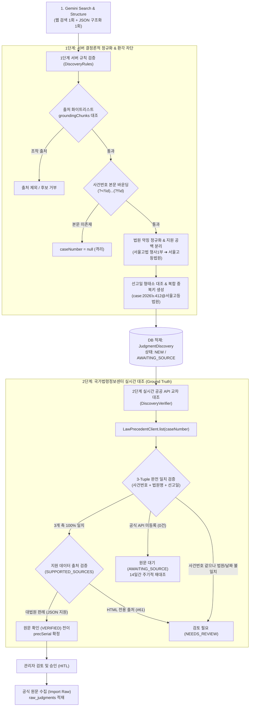
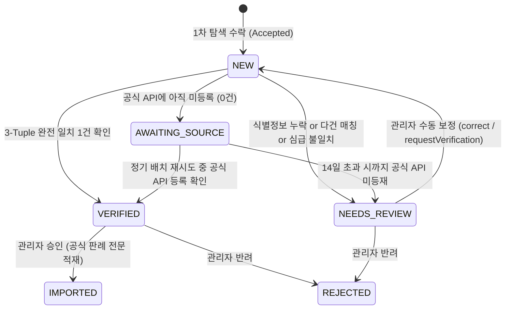

> LLM(거대 언어 모델)에 웹 검색(Google Search Grounding)을 결합하여 최신 판결 뉴스를 자동으로 수집할 때, 가장 위험한 함정은 "모델이 웹에서 찾았으니 사실일 것"이라는 맹신입니다. 모델은 종종 존재하지 않는 가상의 사건번호를 창작하거나, 언론사가 제각각 표기한 법원 약칭('서울고법 형사1부')을 혼동하며, 본문에 언급조차 없는 외부 링크를 출처로 날조합니다. 특히 법률 도메인에서 이러한 환각 데이터가 검증 없이 발행되면 치명적인 정보 왜곡 사고로 이어집니다.  
> 이 글에서는 **"LLM은 발견(Discovery)의 도구로만 제한하고, 진실의 확인(Ground Truth)은 결정론적 서버 규칙과 공공 Open API 실시간 교차 대조에 맡기는 2단계 검증 파이프라인"**의 설계와 실제 구현 코드를 공유합니다.

---

## 문제 상황: "LLM이 웹 검색으로 찾았으니 사실일까?" 환각의 실체

최근 진행 중인 판결문 데이터 플랫폼 프로젝트(`cotton-bat-server`)에서는 매일 아침 주요 언론사에 보도된 주요 형사 판결을 자동으로 탐색하여 운영자에게 후보로 추천해 주는 `judgment-discovery` 배치 작업을 구축했습니다. Gemini 모델에 Google Search 도구를 붙여 최신 뉴스를 검색하고, 보도 내용에서 사건 개요와 사건번호, 법원명, 선고일자 등을 구조화된 JSON으로 추출하는 방식이었습니다.

하지만 초기 프로토타입을 테스트하면서 곧바로 심각한 환각(Hallucination)과 데이터 불일치 문제들을 마주하게 되었습니다:

1. **가상 사건번호의 창작**: 기사 본문에 "사건번호는 확인되지 않았다"라고 적혀 있음에도, 모델이 그럴듯한 형식의 사건번호(예: `2026고합9999`)를 무단으로 생성하여 반환했습니다.
2. **법원 명칭의 약칭 및 임의 변형**: 언론사마다 `서울고법 형사1부`, `수원지법 안산지원 2단독`, `대법원 3부` 등 재판부와 약칭을 섞어 쓰는데, 모델이 이를 그대로 추출하거나 없는 법원명으로 왜곡했습니다.
3. **보도일과 선고일의 혼동**: 기사가 보도된 날짜(예: 2026년 11월 21일)를 실제 재판이 열린 판결 선고일(2026년 11월 20일)로 오인하거나, 과거에 선고된 재조명 사건을 최신 선고로 둔갑시켰습니다.
4. **출처(URL) 날조**: 검색 결과 메타데이터에 존재하지 않는 임의의 블로그나 웹사이트 주소를 마치 보도 기사 출처인 것처럼 생성했습니다.

```
[LLM 환각 데이터 유입 시의 치명적 결과]
가짜 사건번호 적재 ➔ 실존하지 않는 판결문이 공공 서비스에 노출 ➔ 사법 정보 신뢰도 붕괴
```

판결문과 같은 법률 정보 서비스에서 허위 판례가 한 건이라도 등록되면 서비스 전체의 신뢰도가 무너집니다. 따라서 저희는 **"모델이 생성한 텍스트는 절대 신뢰하지 않는 관측치(Observation)일 뿐"**이라는 원칙을 세우고, 2단계의 엄격한 Ground Truth 검증 체계를 설계했습니다.

---

## 2단계 Ground Truth 검증 아키텍처

저희가 설계한 검증 파이프라인의 핵심은 **"1단계 서버 사이드 결정론적 정규화 규칙"**과 **"2단계 국가법령정보센터 공공 Open API 실시간 3-Tuple 대조"**입니다.



### 핵심 검증 원칙
1. **비파괴 원칙**: 뉴스 기사 요약이나 언론사 수치로 공식 판례 데이터를 절대 대체하지 않습니다. 언론사 데이터는 신규 사건을 인지하는 '탐색 단서(Candidate)'로만 취급합니다.
2. **3-Tuple 완전 일치**: 국가법령정보센터 공식 판례 목록에서 **사건번호**, **법원명**, **선고일자**의 3개 식별자가 모두 일치하는 단 1건만 `원문 확인(VERIFIED)`으로 판정합니다. 유사도 점수나 형태소 임베딩 매칭은 허용하지 않습니다.
3. **출처 적격성 검증**: 공공 API에 등록되어 있더라도 JSON 전문 API를 제공하지 않는 특수 출처(예: 국세법령정보시스템 HTML 전용)는 자동으로 검토 대상으로 격리합니다.

---

## 1단계: LLM 추출 단계의 안전장치와 서버 사이드 정규화 (`DiscoveryRules`)

1단계 검증은 LLM이 반환한 JSON 노드를 DB에 넣기 직전에 수행하는 순수 Kotlin 기반의 규칙 검증기입니다.

### 1. 출처 화이트리스트와 본문 바운딩 검증

LLM이 웹 검색을 수행하면 Gemini의 응답에는 실제로 검색된 웹페이지 메타데이터인 `groundingChunks`가 함께 포함됩니다. 저희는 모델 본문 속 링크를 믿지 않고, 오직 `search.sources`에 명시된 인덱스(`S1`, `S2`...)와 일치하는 출처만 유효한 보도 출처로 인정합니다.

또한, 추출된 사건번호와 선고일자가 뉴스 기사 본문에 실제로 존재하는지 **숫자 경계 정규식(Lookaround Regex)**으로 엄격히 바운딩 검증합니다.

```kotlin
// src/main/kotlin/io/github/cmsong111/cotton_bat_server/discovery/application/DiscoveryRules.kt
package io.github.cmsong111.cotton_bat_server.discovery.application

import io.github.cmsong111.cotton_bat_server.discovery.domain.DiscoveryInstance
import io.github.cmsong111.cotton_bat_server.discovery.domain.DiscoveryRecency
import java.net.URI
import java.time.LocalDate
import java.time.format.DateTimeParseException
import tools.jackson.databind.JsonNode

object DiscoveryRules {
    private val CASE_NUMBER = Regex("^\\d{2,4}[가-힣]{1,4}\\d{1,7}$")
    private val SOURCE_ID = Regex("^S(\\d{1,3})$")

    fun check(node: JsonNode, search: DiscoverySearchResult, from: LocalDate, to: LocalDate): CandidateCheck {
        val title = text(node, "title")?.take(200) ?: return CandidateCheck.Rejected("(제목 없음)", "후보 제목이 없습니다.")
        if (text(node, "stage") == "PRE_JUDGMENT") return CandidateCheck.PreJudgment(title)
        if (text(node, "stage") != "JUDGMENT") return CandidateCheck.Rejected(title, "판결 단계 값이 올바르지 않습니다.")
        val summary = text(node, "issueSummary")?.take(2000) ?: return CandidateCheck.Rejected(title, "쟁점 요약이 없습니다.")
        
        val notes = mutableListOf<String>()

        // 1. 출처 화이트리스트 검증: Google Search grounding 메타데이터에 있는 인덱스만 수용
        val sources = node.path("sources").takeIf { it.isArray }?.toList().orEmpty().mapNotNull { item ->
            val index = SOURCE_ID.matchEntire(text(item, "id").orEmpty())?.groupValues?.get(1)?.toInt()
            val source = index?.let { search.sources.getOrNull(it - 1) }
            if (source == null) { 
                notes += "검색 응답에 없는 출처를 제외했습니다."
                return@mapNotNull null 
            }
            SourceInput(source, domain(source), date(text(item, "reportedDate"))?.takeIf { it <= to })
        }.distinctBy { it.source.url }

        if (sources.isEmpty()) return CandidateCheck.Rejected(title, "검색 응답에 있는 출처가 없는 후보입니다.")

        val body = compact(search.text)

        // 2. 사건번호 정규식 및 기사 본문 바운딩 매칭 검증
        val caseNumber = text(node, "caseNumber")?.let(::compact)?.let { value ->
            if (CASE_NUMBER.matches(value) && bounded(value, search.text)) value 
            else { 
                notes += "검색 결과에서 확인되지 않은 사건번호($value)를 제외했습니다."
                null 
            }
        }

        // 3. 법원명 공식 명칭 정규화 및 본문 매칭
        val courtName = text(node, "courtName")?.take(100)?.let { value ->
            court(value, body) ?: run { 
                notes += "검색 결과에서 확인되지 않은 법원($value)을 제외했습니다."
                null 
            }
        }

        // 4. 선고일 언급 여부 형태소 바운딩 검증
        val sentenceDate = text(node, "sentenceDate")?.let { value ->
            date(value)?.takeIf { it <= to && mentioned(it, search.text) } ?: run { 
                notes += "검색 결과에서 확인되지 않은 선고일($value)을 제외했습니다."
                null 
            }
        }

        val modelInstance = runCatching { DiscoveryInstance.valueOf(text(node, "instance").orEmpty()) }.getOrDefault(DiscoveryInstance.UNKNOWN)
        val recency = when {
            sentenceDate == null -> DiscoveryRecency.UNKNOWN
            sentenceDate < from -> DiscoveryRecency.RESURFACED
            else -> DiscoveryRecency.RECENT_SENTENCE
        }

        return CandidateCheck.Accepted(
            CandidateInput(
                title = title,
                issueSummary = summary,
                issueEvidence = text(node, "issueEvidence")?.take(2000),
                caseNumber = caseNumber,
                courtName = courtName,
                sentenceDate = sentenceDate,
                instance = instanceOf(caseNumber) ?: modelInstance,
                recency = recency,
                sources = sources,
                notes = notes.distinct()
            )
        )
    }

    /**
     * 법원명을 대한민국 법원조직법상 공식 명칭으로 정규화한다.
     * 재판부(형사1부 등)는 떼고 고법·지법 약칭은 풀어 쓰며, 지원 공백(수원지방법원 안산지원)을 맞춘다.
     */
    fun court(value: String, compactBody: String): String? {
        val expanded = compact(value).replace("고법", "고등법원").replace("지법", "지방법원")
        val name = Regex("^(.*(?:법원|지원))").find(expanded)?.groupValues?.get(1) ?: return null
        val abbreviated = name.replace("고등법원", "고법").replace("지방법원", "지법")
        val branch = Regex("([가-힣]+지원)$").find(name)?.groupValues?.get(1)?.takeIf { name.contains("법원") }
            ?.let { it.substring(maxOf(0, it.lastIndexOf("법원") + 2)) }
        if (name !in compactBody && abbreviated !in compactBody && (branch == null || branch !in compactBody)) return null
        return name.replace(Regex("법원(?=[가-힣]+지원$)"), "법원 ").take(100)
    }

    /** 사건번호의 사건부호가 심급을 명확히 정의하면 모델의 추정값보다 우선한다. */
    fun instanceOf(caseNumber: String?): DiscoveryInstance? {
        val code = caseNumber?.let { Regex("^\\d+([가-힣]+)\\d+$").matchEntire(it)?.groupValues?.get(1) } ?: return null
        return when {
            code == "도" || code == "모" -> DiscoveryInstance.SUPREME
            code == "노" || code == "로" -> DiscoveryInstance.APPEAL
            code.startsWith("고") || code == "초기" -> DiscoveryInstance.FIRST
            else -> null
        }
    }

    /**
     * 글자 사이 공백은 허용하되 앞뒤가 숫자가 아닌 경계에서만 일치로 본다.
     * 예: 2026고합1 ⊄ 2026고합123, 2026.3.1 ⊄ 2026.3.15
     */
    private fun bounded(value: String, text: String) =
        Regex("(?<!\\d)" + value.map { Regex.escape(it.toString()) }.joinToString("\\s*") + "(?!\\d)").containsMatchIn(text)

    fun mentioned(date: LocalDate, text: String): Boolean {
        val y = date.year; val m = date.monthValue; val d = date.dayOfMonth
        val forms = listOf(
            "${m}월${d}일", "$y.$m.$d", "%d.%02d.%02d".format(y, m, d),
            "%d-%02d-%02d".format(y, m, d), "%d%02d%02d".format(y, m, d), "${y}년${m}월${d}일"
        )
        return forms.any { bounded(it, text) }
    }
}
```

> **단어 경계 정규식(`(?<!\d)...(?!\d)`)의 중요성**  
> 단순 `String.contains("2026고합1")`로 검사하면 기사에 적힌 `2026고합123` 사건번호에도 매칭되어 심각한 환각 오인식이 발생합니다. 또한 공백을 무턱대고 먼저 지우면 `"10월 8일 2026고합1"`처럼 날짜 숫자와 사건번호가 붙어버려 경계가 훼손됩니다. 따라서 공백을 허용하는 Lookaround 정규식으로 원문에서 직접 경계를 확인해야 합니다.
{: .prompt-warning }


_그림 1. 1단계 서버 정규화 단위 테스트 실행 로그. 기사 본문에 없는 가짜 사건번호는 자동으로 `caseNumber = null` 처리되고, 언론사의 법원 약칭('서울고법 형사1부')은 '서울고등법원'으로 완벽히 정규화됩니다._

---

## 2단계: 국가법령정보센터 Open API 실시간 교차 대조 (`DiscoveryVerifier`)

1단계 정규화를 통과한 후보는 일단 DB에 `NEW` 또는 `AWAITING_SOURCE` 상태로 저장됩니다. 그 후 30분 주기로 실행되는 검증 작업(`judgment-discovery-verify`)이 대한민국 **국가법령정보센터 판례 Open API**를 호출하여 실시간으로 교차 대조를 수행합니다.

### 1. 키워드 유사도 매칭의 배제와 3-Tuple 완전 일치 원칙

자연어 처리 기반 검색에서는 흔히 코사인 유사도나 BM25 같은 키워드 유사도로 유사 판례를 찾으려 합니다. 하지만 법률 도메인에서는 **"유사한 판례"를 찾는 것이 아니라 "바로 그 사건"을 찾아야 합니다.** 같은 피고인의 같은 혐의라도 1심, 항소심, 대법원(상고심)의 판결이 완전히 다르기 때문입니다.

따라서 `DiscoveryVerifier`는 오직 **(사건번호, 법원명, 선고일자)** 3가지 식별자가 공식 API 결과와 정확히 1:1로 일치하는 경우에만 `Verified`를 발급합니다.

```kotlin
// src/main/kotlin/io/github/cmsong111/cotton_bat_server/discovery/application/DiscoveryVerifier.kt
package io.github.cmsong111.cotton_bat_server.discovery.application

import io.github.cmsong111.cotton_bat_server.judgment.application.LawPrecedentClient
import io.github.cmsong111.cotton_bat_server.judgment.dto.LawPrecedentSummary
import java.time.LocalDate
import java.time.format.DateTimeFormatter
import org.springframework.stereotype.Component

@Component
class DiscoveryVerifier(private val client: LawPrecedentClient) {

    fun verify(target: VerificationTarget, check: () -> Unit = {}): VerificationOutcome {
        val caseNumber = target.caseNumber
            ?: return VerificationOutcome.Review("사건번호 미확인: 보도에서 사건번호·법원·선고일을 확인해 보정해 주세요.")

        // nb(사건번호) 파라미터는 부분 일치 검색이므로 결과가 여러 페이지일 수 있음
        val items = mutableListOf<LawPrecedentSummary>()
        var page = 1
        while (true) {
            val result = client.list(page, 100, caseNumber = caseNumber, check = check)
            items += result.items
            if (result.items.isEmpty() || page.toLong() * 100 >= result.totalCount) break
            if (page == MAX_PAGES) {
                if (items.none { compact(it.caseNumber) == caseNumber }) {
                    return VerificationOutcome.Review(
                        "공식 목록에서 사건번호 $caseNumber 검색 결과가 ${result.totalCount}건으로 많아 " +
                        "${MAX_PAGES * 100}건 안에서 일치 자료를 찾지 못했습니다. 법원 공개 자료로 확인해 주세요."
                    )
                }
                break
            }
            page++
        }
        return evaluate(target, items)
    }

    fun evaluate(target: VerificationTarget, items: List<LawPrecedentSummary>): VerificationOutcome {
        // 1. 공백 제거 후 사건번호 정확 일치 필터링
        val exact = items.filter { compact(it.caseNumber) == target.caseNumber }
        if (exact.isEmpty()) {
            return VerificationOutcome.Awaiting("공식 목록에 사건번호 ${target.caseNumber} 자료가 아직 없습니다.")
        }

        if (target.courtName == null || target.sentenceDate == null) {
            return VerificationOutcome.Review("법원·선고일 미확인. 공식 목록 후보: ${describe(exact)}")
        }

        // 2. 3-Tuple (사건번호 + 법원명 + 선고일자) 완전 일치 대조
        val matches = exact.filter { 
            compact(it.courtName) == compact(target.courtName) && date(it.sentenceDate) == target.sentenceDate 
        }

        return when (matches.size) {
            0 -> VerificationOutcome.Review("사건번호는 같지만 법원·선고일이 다른 공식 자료만 있습니다. 심급·법원을 확인해 주세요: ${describe(exact)}")
            1 -> matches.single().let {
                // 3. JSON 전문 API를 제공하는 지원 출처인지 검증
                if (it.dataSourceName != null && it.dataSourceName !in SUPPORTED_SOURCES) {
                    VerificationOutcome.Review("JSON 본문을 제공하지 않는 출처(${it.dataSourceName})입니다. 공식 API 본문이 없어 가져오지 않습니다(#61).")
                } else {
                    VerificationOutcome.Verified(it.precSerial, it.dataSourceName)
                }
            }
            else -> VerificationOutcome.Review("사건번호·법원·선고일이 같은 공식 자료가 여러 건입니다: ${describe(matches)}")
        }
    }

    private fun describe(items: List<LawPrecedentSummary>) = items.take(5).joinToString(", ") {
        "일련번호 ${it.precSerial} (${it.courtName ?: "법원 미상"}, ${it.sentenceDate ?: "선고일 미상"})"
    } + if (items.size > 5) " 외 ${items.size - 5}건" else ""

    private fun compact(value: String?) = value?.replace(Regex("\\s+"), "")

    private fun date(value: String?): LocalDate? = value?.replace(Regex("\\D"), "")?.takeIf { it.length == 8 }
        ?.let { runCatching { LocalDate.parse(it, DateTimeFormatter.BASIC_ISO_DATE) }.getOrNull() }

    companion object {
        /** JSON 본문을 안정적으로 제공하는 공식 출처만 허용한다. */
        val SUPPORTED_SOURCES = setOf("대법원", "근로복지공단산재판례")
        const val MAX_PAGES = 5
    }
}
```


_그림 2. 뉴스 기사 추출 데이터와 국가법령정보센터 Open API 실시간 응답의 교차 대조 화면. 사건번호(`2026노412`), 법원명(`서울고등법원`), 선고일자(`2026-11-20`) 3개 축이 모두 일치할 때만 원문 일련번호(`precSerial: 249812`)가 확정됩니다._

---

## 상태 머신 라이프사이클과 휴먼 인 더 루프(HITL) 안전망

뉴스 보도는 재판 당일 바로 발행되지만, 법원이나 국가법령정보센터 전산망에 공식 판례 전문이 등재되기까지는 보통 며칠에서 길게는 1~2주의 시차가 발생합니다.

따라서 공공 API에 아직 데이터가 없다고 해서 이를 "존재하지 않는 가짜 판결"로 성급하게 단정하고 버려서는 안 됩니다. 저희는 유연한 상태 머신과 최대 14일의 대기/재시도 기간을 두었습니다.

### 1. `JudgmentDiscovery` 상태 머신



```kotlin
// src/main/kotlin/io/github/cmsong111/cotton_bat_server/discovery/domain/JudgmentDiscovery.kt
package io.github.cmsong111.cotton_bat_server.discovery.domain

enum class DiscoveryStatus(val label: String) {
    NEW("확인 대기"), 
    NEEDS_REVIEW("검토 필요"), 
    AWAITING_SOURCE("원문 대기"), 
    VERIFIED("원문 확인"), 
    IMPORTED("가져옴"), 
    REJECTED("반려")
}

// ...
fun applyVerification(id: Long, outcome: VerificationOutcome, now: Instant = Instant.now()) {
    val discovery = find(id)
    if (discovery.status == DiscoveryStatus.IMPORTED || !discovery.open) return

    when (outcome) {
        is VerificationOutcome.Verified -> {
            // 중복 판례 검증
            val other = discoveries.existsByPrecSerialAndStatusAndIdNot(outcome.precSerial, DiscoveryStatus.IMPORTED, id) ||
                        discoveries.existsByPrecSerialAndStatusAndIdNot(outcome.precSerial, DiscoveryStatus.VERIFIED, id)
            if (other) {
                discovery.needsReview("다른 후보와 같은 공식 판례(일련번호 ${outcome.precSerial})입니다. 중복 후보를 반려해 주세요.", now)
            } else {
                discovery.verified(outcome.precSerial, judgments.findByPrecSerial(outcome.precSerial)?.id, now)
                discovery.officialDataSourceName = outcome.dataSourceName
            }
        }
        is VerificationOutcome.Review -> discovery.needsReview(outcome.reason, now)
        is VerificationOutcome.Awaiting -> {
            val deadline = discovery.firstDiscoveredAt.plus(Duration.ofDays(properties.sourceWaitDays.toLong()))
            if (now.isAfter(deadline)) {
                discovery.needsReview(
                    "${properties.sourceWaitDays}일 동안 공식 원문을 확인하지 못했습니다. " +
                    "원문 부재로 확정하지 않으며 법원 공개 자료를 검토해 주세요. (${outcome.reason})", now
                )
            } else {
                discovery.awaitSource(outcome.reason, now.plus(properties.verifyRetryInterval), now)
            }
        }
    }
}
```

1. **`AWAITING_SOURCE` 재시도 메커니즘**: 공공 API에 아직 올라오지 않은 신규 판결은 1시간 주기로 `nextVerifyAt`을 설정하여 자동으로 재조회합니다.
2. **14일 만료 시 `NEEDS_REVIEW` 전이**: 14일이 지나도 올라오지 않는 판결은 영구 삭제하지 않고 `검토 필요`로 격리하여, 운영자가 법원 열람실이나 판결서 인터넷 열람 서비스로 직접 확인할 수 있게 유도합니다.
3. **관리자 수동 보정(`correct`)**: 기사에 오타가 있거나 모델이 날짜를 잘못 읽었을 경우, 운영자가 관리자 콘솔에서 올바른 사건번호/법원명을 입력하면 상태가 즉시 `NEW`로 초기화되어 공공 API 대조를 처음부터 다시 시작합니다.


_그림 3. 관리자 콘솔의 판결 후보 상세 화면 (`/admin/discoveries/104`). 공공 Open API 3-Tuple 대조가 성공하여 `원문 확인 (VERIFIED)` 상태로 전이되었으며, 운영자가 `[공식 원문 가져오기]` 버튼을 누르면 신뢰할 수 있는 공식 JSON 전문이 수집 아카이브에 적재됩니다._

---

## 실전 테스트 코드로 환각 방어 입증하기

이와 같은 2단계 검증 파이프라인이 환각을 완벽히 격리하는지 검증하기 위해 작성된 단위/통합 테스트 코드입니다.

```kotlin
// src/test/kotlin/io/github/cmsong111/cotton_bat_server/discovery/DiscoveryRulesTest.kt
package io.github.cmsong111.cotton_bat_server.discovery

import io.github.cmsong111.cotton_bat_server.discovery.application.DiscoveryRules
import io.github.cmsong111.cotton_bat_server.discovery.domain.DiscoveryInstance
import org.assertj.core.api.Assertions.assertThat
import org.junit.jupiter.api.Test
import java.time.LocalDate

class DiscoveryRulesTest {

    @Test
    fun `기사 본문 숫자 경계에서 정확히 일치하는 날짜만 선고일로 인정한다`() {
        val date = LocalDate.of(2026, 10, 2)
        // 정상적인 기사 표기 패턴
        listOf("지난 10월 2일 선고", "2026. 10. 2. 선고", "2026.10.02 선고", "2026-10-02", "2026년 10월 2일").forEach {
            assertThat(DiscoveryRules.mentioned(date, it)).describedAs(it).isTrue()
        }

        // 숫자 경계가 다른 환각 케이스 방어
        assertThat(DiscoveryRules.mentioned(date, "10월 20일 선고")).isFalse()
        assertThat(DiscoveryRules.mentioned(LocalDate.of(2026, 3, 1), "2026.3.15 선고")).isFalse()
        assertThat(DiscoveryRules.mentioned(LocalDate.of(2026, 1, 2), "11월 2일 선고")).isFalse()
    }

    @Test
    fun `언론사의 다양한 법원 약칭을 공식 명칭으로 정규화하고 본문 존재를 확인한다`() {
        val body = "서울고법형사1부는10일…수원지법안산지원은…대법원2부는".replace(" ", "")

        // 재판부 제거 및 고법 -> 고등법원 확장
        assertThat(DiscoveryRules.court("서울고법 형사1부", body)).isEqualTo("서울고등법원")
        assertThat(DiscoveryRules.court("서울고등법원", body)).isEqualTo("서울고등법원")

        // 지원 명칭의 공백 표준화
        assertThat(DiscoveryRules.court("수원지방법원 안산지원 형사2단독", body)).isEqualTo("수원지방법원 안산지원")
        assertThat(DiscoveryRules.court("대법원 2부", body)).isEqualTo("대법원")

        // 기사 본문에 없는 법원은 환각으로 판정하여 null 반환
        assertThat(DiscoveryRules.court("부산지방법원", body)).isNull()
        assertThat(DiscoveryRules.court("형사1부", body)).isNull()
    }

    @Test
    fun `사건번호의 사건부호로 심급을 자동 판별한다`() {
        assertThat(DiscoveryRules.instanceOf("2026고합123")).isEqualTo(DiscoveryInstance.FIRST)
        assertThat(DiscoveryRules.instanceOf("2026노45")).isEqualTo(DiscoveryInstance.APPEAL)
        assertThat(DiscoveryRules.instanceOf("2026도678")).isEqualTo(DiscoveryInstance.SUPREME)
    }
}
```

---

## 마치며: LLM 실무 도입에서 얻은 교훈

LLM과 생성형 AI 기술은 방대한 웹 문서에서 비정형 데이터를 읽어오고 요약하는 **탐색(Discovery) 영역**에서는 놀라운 생산성을 발휘합니다. 하지만 이 모델에게 데이터의 최종 판정과 저장까지 맡기는 순간, 미묘하고 그럴듯한 환각(Hallucination)이 시스템 내부를 오염시키기 시작합니다.

이번 검증 파이프라인을 구축하며 얻은 실무적 결론은 다음과 같습니다:

1. **LLM은 단서(Discovery)를 찾고, 확증(Verification)은 결정론적 시스템이 담당한다**: LLM은 기사에서 사건번호와 법원명을 찾아내는 1차 작업자일 뿐입니다. 데이터베이스의 식별 키로 쓸 수 있는지는 전통적인 정규식과 바운딩 규칙으로만 검증해야 합니다.
2. **Ground Truth와의 직접 교차 대조 없는 생성 데이터는 서비스에 올리지 않는다**: 공공 API나 원천 DB와의 1:1 대조가 완료되지 않은 데이터는 절대 공개 테이블(`judgments`)에 바로 넣지 말고, 후보 테이블(`judgment_discoveries`)에 격리해야 합니다.
3. **휴먼 인 더 루프(HITL)는 실패가 아닌 시스템의 필수 안전망이다**: 모호한 케이스, 심급 불일치, 전산 등록 시차를 억지로 코드로 해결하려다 보면 더 큰 예외가 발생합니다. 의심스러운 1%를 관리자 콘솔로 격리하고 수동 보정 인터페이스를 제공하는 것이 가장 완벽한 엔터프라이즈 아키텍처입니다.

Spring Boot 환경에서 외부 LLM API와 공공 데이터를 결합하는 실무 프로젝트를 고민하고 계신 분들께 이 아키텍처가 실질적인 도움이 되기를 바랍니다.
