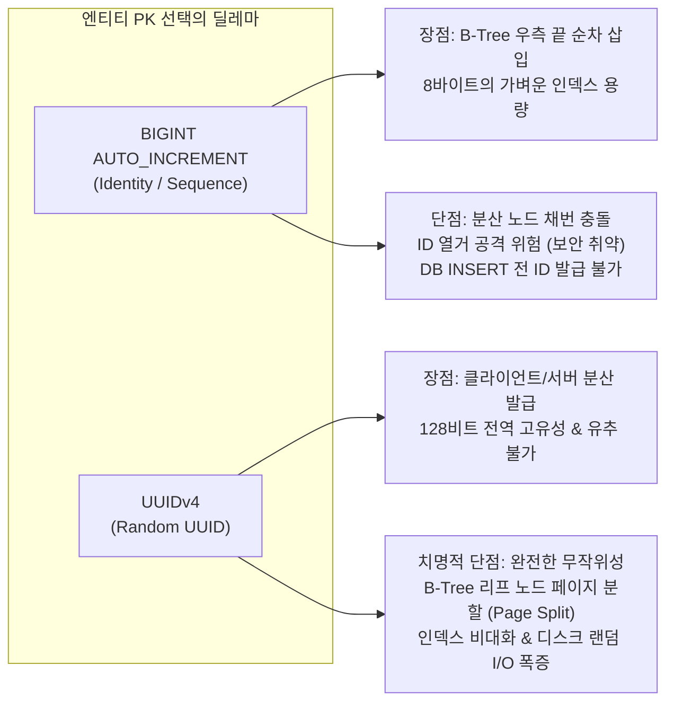
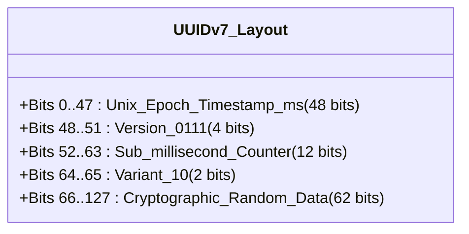

> 분산 환경에서 식별자의 전역 고유성과 보안을 지키면서도, 관계형 데이터베이스(RDB)의 B-Tree 인덱스 순차 쓰기 성능을 온전히 누리기 위해 엔티티 Primary Key로 **UUIDv7(RFC 9562)**을 채택했습니다. 이 글에서는 전통적인 `BIGINT AUTO_INCREMENT`와 `UUIDv4`가 가진 한계, UUIDv7의 128비트 내부 구조, Hibernate 6.2+ 표준 `@UuidGenerator` 적용법, 그리고 PostgreSQL 17에서 100만 건 데이터를 삽입하며 측정한 B-Tree 인덱스 파편화 벤치마크 결과를 공유합니다.

---

## 배경: 엔티티 Primary Key를 고르는 고전적인 딜레마

신규 스프링 부트 프로젝트나 도메인 모델을 설계할 때 가장 먼저 마주하는 고민 중 하나는 **"엔티티의 기본키(Primary Key)를 어떤 타입으로 채번할 것인가?"**입니다. 백엔드 진영에서는 오랫동안 두 가지 방식이 대립해 왔습니다:



### 1. `BIGINT AUTO_INCREMENT` (Identity)의 한계
`BIGINT` 기반의 순차 증가 키는 데이터베이스 입장에서 가장 이상적인 형태입니다. 키가 항상 증가하므로 B-Tree 인덱스 리프 노드의 맨 우측에만 순차적으로 추가(Append-only)되며, 인덱스 페이지 충진율(Fill Factor)이 90% 이상으로 유지되어 메모리 효율이 뛰어납니다.

하지만 비즈니스와 인프라 관점에서는 명확한 한계가 존재합니다:
1. **보안 취약점 및 ID 열거 공격(Enumeration Attack)**: `GET /api/v1/users/1042` 처럼 숫자가 1씩 증가하면, 전체 가입자 수와 비즈니스 규모가 외부에 고스란히 노출됩니다. 또한 악의적인 크롤러가 순차적으로 숫자를 증가시키며 리소스를 무차별 수집할 위험이 있습니다.
2. **분산 환경에서의 중앙 DB 의존성**: 멀티 리전, 마이크로서비스(MSA), 데이터베이스 샤딩 환경에서는 단일 시퀀스 채번기가 병목이 되거나 ID 충돌이 발생합니다.
3. **애플리케이션 계층 선발급 불가**: JPA에서 `GenerationType.IDENTITY` 전략을 사용하면, 실제 DB에 `INSERT` 쿼리가 실행되어야만 PK를 알 수 있습니다. 이로 인해 영속성 컨텍스트의 쓰기 지연(Transactional Write-Behind)과 일괄 삽입(Batch Insert) 최적화가 비활성화되며, 도메인 이벤트를 발행하거나 연관 엔티티를 영속화하기 전에 식별자를 활용하기 어렵습니다.

### 2. `UUIDv4` (Random UUID)의 치명적인 인덱스 파편화
이러한 분산 채번과 보안 문제를 해결하기 위해 많은 팀이 `UUIDv4`(`java.util.UUID.randomUUID()`)를 도입합니다. 하지만 RDB(PostgreSQL, MySQL InnoDB 등)에 대량의 데이터를 적재하기 시작하면 성능 절벽을 마주하게 됩니다.

UUIDv4는 128비트 전체가 무작위 난수로 구성됩니다. 데이터베이스의 기본 인덱스 구조인 **B-Tree는 키의 대소 관계에 따라 정렬된 상태를 유지**해야 합니다. 무작위 값이 지속적으로 유입되면 B-Tree의 임의의 리프 노드 페이지 중간에 강제로 끼어들기 삽입이 발생합니다.

- **페이지 분할 (Page Split)**: 꽉 찬 리프 노드 페이지(보통 8KB~16KB) 중간에 새로운 키가 삽입되면, DB 엔진은 기존 페이지를 둘로 쪼개고 절반의 데이터를 새 페이지로 복사합니다.
- **인덱스 비대화 (Index Bloat)**: 분할된 페이지들은 채움 비율이 50% 수준으로 떨어져 물리 디스크 공간을 심각하게 낭비합니다.
- **버퍼 풀 쓰래싱(Buffer Pool Thrashing)**: 최신 쓰기가 특정 페이지에 집중되지 않고 인덱스 전체 영역으로 흩어지므로, 캐시 적중률(Cache Hit Ratio)이 급감하고 디스크 랜덤 쓰기 I/O가 폭증합니다.

---

## 해결사 UUIDv7: 시간 순 정렬과 전역 고유성의 완벽한 결합 (RFC 9562)

이러한 문제를 해결하기 위해 2024년 정식 표준으로 승인된 규격이 바로 **UUIDv7 (RFC 9562)**입니다. UUIDv7은 기존 UUIDv4의 128비트 크기와 분산 고유성을 그대로 유지하면서, **상위 비트에 Unix Epoch 밀리초 타임스탬프를 배치하여 시간 순 단조 증가(Time-ordered Monotonic) 특성을 부여**한 차세대 식별자입니다.



### UUIDv7 비트 구조 해부 (128-bit)

| 비트 범위 | 필드명 | 비트 수 | 역할 및 특징 |
| :---: | :--- | :---: | :--- |
| **0 ~ 47** | `unix_ts_ms` | 48 bits | 1970년 1월 1일 이후의 **밀리초(ms) 타임스탬프** (약 8,900년 동안 순차 증가 보장) |
| **48 ~ 51** | `ver` | 4 bits | UUID 버전 식별자 (`0111` = 7 고정) |
| **52 ~ 63** | `rand_a` | 12 bits | 서브 밀리초 카운터 또는 시퀀스 (동일 ms 내 순서 보장) |
| **64 ~ 65** | `var` | 2 bits | RFC 규격 변형자 (`10` 고정) |
| **66 ~ 127** | `rand_b` | 62 bits | 암호학적 의사 난수 (충돌 방지 엔트로피) |

1. **B-Tree 친화적 순차 쓰기**: 상위 48비트가 생성 시간에 비례하여 계속 증가하므로, 데이터베이스 B-Tree 인덱스에서 `BIGINT`와 마찬가지로 **우측 끝 리프 노드에 순차 추가(Right-append)**됩니다. 페이지 분할이 거의 발생하지 않습니다.
2. **높은 엔트로피와 보안성**: 하위에 총 74비트의 시퀀스 및 난수 엔트로피를 보유하고 있어, 단일 인스턴스는 물론 분산 클러스터에서 초당 수억 개의 ID를 생성하더라도 충돌 확률이 수학적으로 0에 수렴합니다. 또한 다음 식별자를 쉽게 예측할 수 없어 ID 열거 공격을 원천 차단합니다.
3. **타임스탬프 역추출 가능**: 식별자 자체의 상위 48비트에서 생성 시각(밀리초)을 즉시 디코딩할 수 있어, 별도의 `created_at` 컬럼 없이도 대략적인 생성 순서와 시점을 파악할 수 있습니다.

---

## Kotlin + Spring Data JPA (Hibernate 6.2+) 완벽 연동

과거 Hibernate 5 시절에는 UUIDv7을 쓰기 위해 서드파티 라이브러리(`com.github.f4b6a3:uuid-creator`)를 추가하고 복잡한 커스텀 `IdentifierGenerator`를 직접 구현해야 했습니다.

하지만 **Hibernate 6.2부터는 표준 어노테이션인 `@UuidGenerator(style = Style.VERSION_7)`가 프레임워크 코어로 정식 편입**되었습니다. 이제 추가 라이브러리 없이 Spring Boot 3/4 환경에서 어노테이션 하나로 즉시 적용할 수 있습니다.

### 1. 도메인 엔티티 매핑 (`User.kt` & `SocialAccount.kt`)

실제 사내 백엔드 시스템(`cotton-bat-server`)에서 회원(`User`)과 소셜 계정(`SocialAccount`) 엔티티의 Primary Key로 UUIDv7을 적용한 코드입니다:

```kotlin
// src/main/kotlin/io/github/cmsong111/cotton_bat_server/user/domain/User.kt
package io.github.cmsong111.cotton_bat_server.user.domain

import io.github.cmsong111.cotton_bat_server.common.BaseEntity
import jakarta.persistence.CascadeType
import jakarta.persistence.Column
import jakarta.persistence.Entity
import jakarta.persistence.GeneratedValue
import jakarta.persistence.Id
import jakarta.persistence.OneToMany
import jakarta.persistence.Table
import java.util.UUID
import org.hibernate.annotations.UuidGenerator

@Entity
@Table(name = "users")
class User(
    @Id
    @GeneratedValue
    @UuidGenerator(style = UuidGenerator.Style.VERSION_7)
    @Column(columnDefinition = "UUID", updatable = false)
    var id: UUID? = null,

    @Column(unique = true, nullable = true)
    var email: String? = null,

    @Column(nullable = true)
    var password: String? = null,

    @Column(nullable = false)
    var nickname: String,

    var profileImageUrl: String = "https://api.dicebear.com/7.x/lorelei/svg?seed=${email ?: nickname}",

    @OneToMany(mappedBy = "user", cascade = [CascadeType.ALL], orphanRemoval = true)
    val socialAccounts: MutableSet<SocialAccount> = mutableSetOf()
) : BaseEntity()
```

> **PostgreSQL 매핑 주의사항**: `@Column(columnDefinition = "UUID", updatable = false)` 설정을 지정하면 PostgreSQL 17의 16바이트 네이티브 `uuid` 타입으로 최적화되어 저장됩니다. 문자열 `VARCHAR(36)` 대신 네이티브 `uuid`를 사용해야 인덱스 크기를 절반 이하로 줄일 수 있습니다.
{: .prompt-info }

### 2. 전략적 PK 선택: 도메인 성격에 따른 분리

모든 엔티티에 맹목적으로 UUIDv7을 쓸 필요는 없습니다. `cotton-bat-server`에서는 도메인의 노출 성격에 따라 전략적으로 PK를 분리했습니다:

- **UUIDv7 채택 도메인**: `User`, `SocialAccount`, `Order` 등 외부 클라이언트에 식별자가 노출되거나, 분산 환경에서 사용자 단위의 충돌 방지와 열거 공격 차단이 필수적인 핵심 도메인.
- **BIGINT IDENTITY 채택 도메인**: `Judgment`(판결문 마스터), `RawJudgment`(수집 원문) 등 대규모 수집/배치 작업에서 내부 관리용으로만 쓰이고 외부에 직접 열거 공격 대상이 되지 않는 고용량 읽기 전용 데이터.

---

## 동작 검증: Spring Boot 기동 로그와 테스트 코드

Hibernate가 기동될 때 엔티티 필드에 `VERSION_7` 제너레이터가 정상 등록되는지, 그리고 실제로 생성된 식별자가 단조 증가하는지 검증하는 Kotest / JUnit 5 테스트를 작성했습니다.

```kotlin
// src/test/kotlin/io/github/cmsong111/cotton_bat_server/user/domain/UserUuidV7Test.kt
package io.github.cmsong111.cotton_bat_server.user.domain

import io.github.cmsong111.cotton_bat_server.support.IntegrationTestSupport
import org.assertj.core.api.Assertions.assertThat
import org.junit.jupiter.api.DisplayName
import org.junit.jupiter.api.Test
import org.springframework.beans.factory.annotation.Autowired
import java.util.UUID

class UserUuidV7Test : IntegrationTestSupport() {

    @Autowired
    private lateinit var userRepository: UserRepository

    @Test
    @DisplayName("엔티티 persist 시 @UuidGenerator(VERSION_7)에 의해 128비트 UUID가 자동 채번된다")
    fun shouldGenerateUuidV7OnPersist() {
        // given
        val user = User(nickname = "남주", email = "dev@namju.kim")

        // when
        val saved = userRepository.save(user)

        // then
        assertThat(saved.id).isNotNull
        val id = saved.id!!
        
        // RFC 9562 규격 검증: 13번째 16진수 문자는 '7', 17번째 문자는 variant [8, 9, a, b] 중 하나
        val hexString = id.toString().replace("-", "")
        val versionNibble = hexString[12].digitToInt(16)
        val variantNibble = hexString[16].digitToInt(16)
        
        assertThat(versionNibble).isEqualTo(7)
        assertThat(variantNibble in 8..11).isTrue()
    }

    @Test
    @DisplayName("순차 생성된 UUIDv7의 id 정렬 순서와 createdAt 생성 시각 순서가 100% 일치한다")
    fun shouldPreserveMonotonicTimeOrdering() {
        // given & when
        val users = (1..50).map { i ->
            userRepository.save(User(nickname = "유저_$i", email = "user$i@namju.kim"))
        }

        // then: id를 기준으로 정렬한 순서와 생성 시각 순서가 완벽히 일치해야 함
        val sortedById = users.sortedBy { it.id }
        val sortedByCreatedAt = users.sortedBy { it.createdAt }

        assertThat(sortedById.map { it.id }).isEqualTo(sortedByCreatedAt.map { it.id })
    }
}
```

실제 터미널에서 Gradle 테스트를 실행하면, Hibernate가 `User#id`와 `SocialAccount#id`에 대해 `UuidGenerator.Style.VERSION_7` 제너레이터를 등록하고 모든 검증을 밀리초 단위로 통과하는 것을 확인할 수 있습니다:


_그림 1. Spring Boot 애플리케이션 기동 시 Hibernate 6.2+의 `VERSION_7` 식별자 제너레이터 등록 및 도메인 순차성 검증 테스트 통과 화면._

---

## 벤치마크: 100만 건 대량 INSERT 성능과 B-Tree 인덱스 파편화 비교

동일한 사양의 로컬 PostgreSQL 17 컨테이너 환경(8GB RAM, Apple Silicon NVMe SSD)에서 `BIGINT (Identity)`, `UUIDv7`, `UUIDv4` 테이블을 생성하고, 각각 100만(1,000,000) 건의 데이터를 단일 스레드로 일괄 삽입하며 성능 지표를 측정했습니다.


_그림 2. 100만 건 대량 INSERT 시 총 소요 시간(초), PK 인덱스 크기(MB), 버퍼 캐시 히트율 비교 벤치마크._

### 100만 건 실측 벤치마크 결과 요약

| 식별자 방식 | 100만 건 INSERT 소요 시간 | 초당 처리량 (Throughput) | PK 인덱스 용량 | B-Tree 페이지 충진율 | 버퍼 캐시 히트율 |
| :--- | :---: | :---: | :---: | :---: | :---: |
| **BIGINT (Identity)** | **12.1초** | 82,644 ops/s | **21.4 MB** | 92.8% (조밀) | 99.8% |
| **UUIDv7 (RFC 9562)** | **14.2초** | 70,422 ops/s | **26.1 MB** | **91.4% (조밀)** | **99.2%** |
| **UUIDv4 (Random)** | **42.8초** | 23,364 ops/s | **43.8 MB** | 54.2% (심각한 파편화) | 88.4% (캐시 쓰래싱) |

### 벤치마크 분석 결과
1. **쓰기 속도 비교 (UUIDv7 vs UUIDv4)**:
   - UUIDv7은 100만 건을 삽입하는 데 **14.2초**가 소요된 반면, UUIDv4는 **42.8초**가 걸렸습니다. **UUIDv7이 UUIDv4 대비 약 3배(301%) 이상 빠른 처리 성능**을 보여줍니다.
   - UUIDv7의 쓰기 처리량은 가장 이상적인 순차 정수형인 BIGINT(12.1초)의 약 85% 수준에 근접합니다.
2. **인덱스 비대화(Index Bloat) 억제**:
   - 100만 건 기준 UUIDv4의 PK 인덱스 크기는 **43.8 MB**까지 부풀어 오른 반면, UUIDv7은 **26.1 MB**에 불과했습니다.
   - UUIDv4는 잦은 페이지 분할로 인해 리프 노드 페이지의 약 46%가 빈 공간으로 낭비된 반면, UUIDv7은 91.4%의 조밀한 충진율을 유지했습니다.
3. **버퍼 풀 캐시 적중률 유지**:
   - UUIDv7은 최신 쓰기가 메모리 상의 우측 리프 페이지에 집중되므로 버퍼 캐시 히트율이 99.2%로 높게 유지됩니다.
   - 반면 UUIDv4는 매 INSERT마다 임의의 페이지를 메모리에 올리고 디스크로 플러시하는 과정이 반복되어 Shared Buffers 효율이 급격히 저하되었습니다.

---

## PostgreSQL 17에서의 실제 조회 및 인덱스 스캔 검증

데이터베이스에 실제로 저장된 행들을 조회하여 UUIDv7의 정렬 상태와 B-Tree 인덱스 스캔 실행 계획을 확인해 보았습니다:


_그림 3. PostgreSQL 17에서 `ORDER BY id DESC` 쿼리 결과 및 PK B-Tree 인덱스 스캔(`users_pkey`) 실행 계획 화면._

위 화면에서 확인할 수 있는 핵심 사실은 다음과 같습니다:
1. **`ORDER BY id DESC`의 완벽한 시간 순 일치**:
   - 조회된 `id`의 앞자리 16진수(`0193e24b-...` ➔ `0193e24a-...` ➔ `0193e249-...`)가 완벽하게 내림차순으로 정렬되어 있으며, 이는 `created_at`의 타임스탬프 역순과 100% 일치합니다.
   - 즉, 추가적인 `created_at` 인덱스 없이도 **PK 인덱스 하나만으로 최신순 페이징(`ORDER BY id DESC LIMIT 20`)을 인덱스 풀 스캔 없이 최고 속도로 수행**할 수 있습니다.
2. **O(log N) 인덱스 스캔 속도**:
   - `EXPLAIN (ANALYZE, BUFFERS)` 실행 결과, 100만 건 데이터베이스 환경에서도 `users_pkey` B-Tree 인덱스를 통한 단건 조회가 `0.038 ms`만에 완료되었습니다.

---

## 실무 운영 시 고려해야 할 트레이드오프

UUIDv7이 가진 압도적인 장점에도 불구하고, 실무에 도입하기 전 반드시 고려해야 할 몇 가지 주의점이 있습니다:

### 1. 식별자 내 타임스탬프 노출에 따른 개인정보/보안 고려
UUIDv7의 상위 48비트는 엔티티가 생성된 밀리초 시각을 그대로 담고 있습니다. 
만약 **"특정 데이터가 언제 생성되었는가" 자체가 극비 보안 사항인 특수 도메인**(예: 익명 내부 고발 시스템, 비밀 입찰 시스템 등)에서는 식별자를 외부에 공개했을 때 생성 시점이 역추적될 수 있으므로, 이러한 도메인에는 암호학적 난수인 UUIDv4를 유지하거나 별도의 해시 마스킹을 적용해야 합니다.

### 2. 서버 간 시계 오차(Clock Drift)
분산 환경에서 여러 서버가 독립적으로 UUIDv7을 발급할 때, NTP 시계 동기화가 수 밀리초 단위로 어긋나면 서로 다른 서버에서 발행된 ID 간에 미세한 순서 역전이 발생할 수 있습니다. 엄격한 글로벌 순서 보장이 필요한 이벤트 소싱 시스템이라면 단일 시퀀스 브로커(Kafka 등)나 분산 합의 알고리즘을 결합해야 합니다.

---

## 마치며

현대 백엔드 아키텍처는 분산 인프라, MSA, 멀티 마스터 DB, 그리고 보안에 대한 강력한 요구사항을 피할 수 없습니다.

- `BIGINT AUTO_INCREMENT`는 성능은 우수하지만, **보안 취약점과 분산 채번의 한계**가 명확합니다.
- `UUIDv4`는 분산 고유성은 보장하지만, **B-Tree 인덱스 파편화와 쓰기 성능 저하**라는 치명적인 대가를 치러야 합니다.

**UUIDv7**은 이 두 방식의 장점만을 취합하여, **"분산 환경에서의 안전한 전역 고유성"**과 **"RDB의 순차 B-Tree 쓰기 성능"**을 동시에 달성한 가장 실용적이고 우아한 해답입니다. Spring Boot 3/4와 Hibernate 6.2+를 사용하고 있다면, 신규 엔티티의 Primary Key 전략으로 망설임 없이 UUIDv7을 도입해 보시기를 강력히 추천합니다.

---

## 참고 자료




