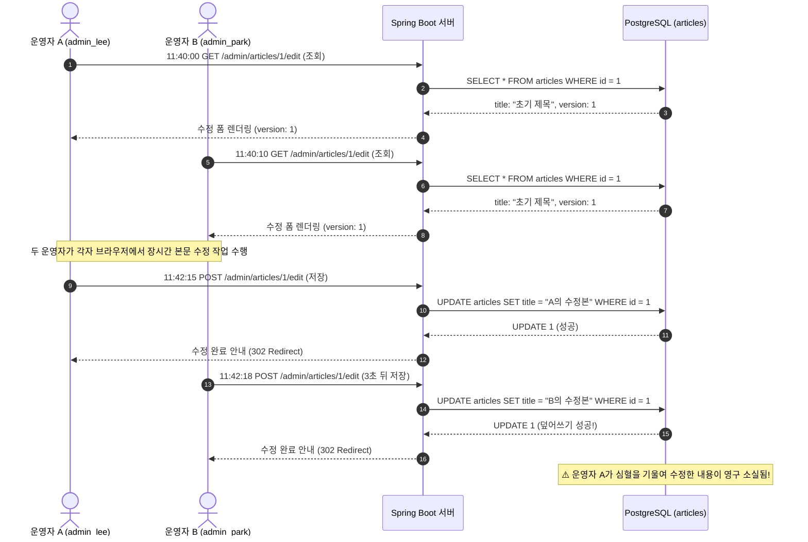
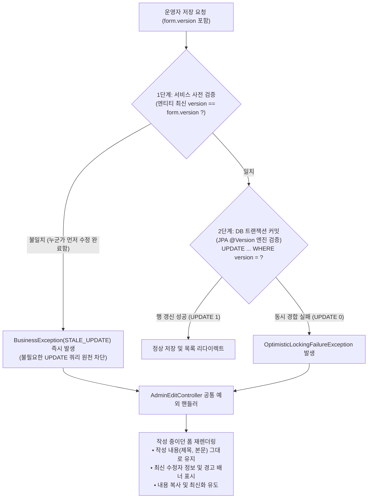

> 다수의 운영자가 동시에 동일한 데이터를 수정할 때 발생하는 갱신 손실(Lost Update)을 방지하기 위해, JPA `@Version` 낙관적 락(Optimistic Lock)과 폼 히든 필드를 결합하고 충돌 발생 시 작성 중이던 데이터를 보존하며 복구를 유도하는 실전 관리자 시스템 구축 경험을 소개합니다.
{: .prompt-info }

---

## 문제 상황: 백오피스 관리자 화면의 갱신 손실(Lost Update)과 Last Write Wins

사내 백오피스 어드민 시스템을 구축할 때 개발자들이 가장 간과하기 쉬운 동시성 이슈 중 하나가 바로 **갱신 손실(Lost Update, 두 번째 갱신 분실 문제)**입니다.

관리자 웹 화면에서 여러 운영자가 동일한 게시글이나 판례 마스터 데이터를 수정할 때, 별도의 동시성 제어 장치가 없다면 **'마지막에 저장한 사람의 데이터가 앞선 사람의 수정을 덮어쓰는(Last Write Wins)'** 치명적인 데이터 유실이 발생합니다.



운영자 A가 11시 40분에 폼을 열어 2분 동안 정성스레 본문 오탈자를 고치고 판례 요지를 정리해 11시 42분 15초에 저장했습니다. 하지만 운영자 B 역시 11시 40분 10초에 동일한 폼을 열어두고 다른 문장을 수정한 뒤 불과 3초 뒤인 11시 42분 18초에 [저장]을 눌렀습니다.

이때 데이터베이스는 아무런 의심 없이 운영자 B의 요청을 그대로 반영합니다. 결과적으로 **운영자 A의 수정 사항은 흔적도 없이 사라지고**, 사내에서는 "내가 분명히 저장했는데 왜 예전 내용으로 되돌아갔느냐"는 혼선이 빚어집니다.

### 왜 비관적 락(Pessimistic Lock)은 웹 어드민 폼의 해답이 아닌가?

이 문제를 데이터베이스 비관적 락(`SELECT ... FOR UPDATE`)으로 해결하려고 하면 더 큰 문제가 발생합니다.

- **긴 휴식 시간(User Think Time)**: 사용자가 폼 화면을 열어놓고 회의에 참석하거나 커피를 마시러 갈 수 있습니다.
- **DB 커넥션 풀 고갈**: 웹 브라우저의 폼 오픈 상태를 트랜잭션으로 유지하면 커넥션 풀이 순식간에 마르고 전체 서버 장애로 이어집니다.
- **불필요한 대기**: 동시 수정 충돌은 빈번하게 일어나는 이벤트가 아니므로, 모든 조회마다 배타 락을 거는 것은 성능상 큰 낭비입니다.

따라서 웹 환경에서는 충돌이 자주 발생하지 않는다고 가정하고, 커밋 시점에 충돌 여부를 감지하는 **낙관적 락(Optimistic Lock)** 방식이 가장 이상적인 해결책입니다.

---

## 해결 설계: 2단계 충돌 검증과 사용자 친화적 복구 UX

저희 팀은 `cotton-bat-server`의 관리자 수정 시스템을 설계하며 **2단계 안전망**을 구축했습니다.



1. **1단계 서비스 레벨 사전 검증 (Fail-Fast)**: 
   운영자가 폼을 열었을 당시의 버전(`form.version`)과 저장 시점에 DB에서 조회한 엔티티의 최신 `version`을 대조합니다. 이미 다른 운영자가 저장을 마쳐 버전이 올라가 있다면, 불필요한 UPDATE 쿼리를 날릴 필요도 없이 즉시 `BusinessException(AdminErrorCode.STALE_UPDATE)`을 던집니다.
2. **2단계 데이터베이스 레벨 원자적 검증 (JPA @Version)**:
   두 요청이 1단계 검사를 완전히 같은 밀리초에 통과하더라도, JPA는 UPDATE 시 `WHERE id = ? AND version = ?` 조건을 강제합니다. 먼저 커밋된 트랜잭션만 `version = version + 1`을 수행하고, 나중에 커밋된 쪽은 영향받은 행(Row Count)이 0건이 되어 `OptimisticLockingFailureException`을 던집니다.
3. **충돌 처리 UX**:
   충돌이 발생했다고 해서 500 에러 페이지로 이동해 버리면 운영자가 작성하던 본문이 날아가 더 큰 분노를 유발합니다. 기존 입력값을 `BindingResult` 모델에 그대로 보존한 채 폼을 다시 렌더링하고, 상단에 명확한 충돌 안내 배너를 띄워 내용을 복사한 뒤 새로고침하도록 안내합니다.

---

## 1. 도메인 엔티티 구현: BaseEntity에 `@Version` 적용하기

공통 감사(Audit) 정보를 관리하는 상위 클래스에 JPA `@Version` 필드를 정의합니다. Kotlin 환경에서는 JPA 스펙을 만족하면서도 가변성을 보장할 수 있도록 프로퍼티를 구성해야 합니다.

```kotlin
// src/main/kotlin/io/github/cmsong111/cotton_bat_server/common/BaseEntity.kt
package io.github.cmsong111.cotton_bat_server.common

import jakarta.persistence.Column
import jakarta.persistence.EntityListeners
import jakarta.persistence.MappedSuperclass
import jakarta.persistence.Version
import java.time.Instant
import org.hibernate.annotations.ColumnDefault
import org.hibernate.annotations.SQLRestriction
import org.springframework.data.annotation.CreatedBy
import org.springframework.data.annotation.CreatedDate
import org.springframework.data.annotation.LastModifiedBy
import org.springframework.data.annotation.LastModifiedDate
import org.springframework.data.jpa.domain.support.AuditingEntityListener

/**
 * 공통 감사(audit) 컬럼과 낙관적 락 버전 컬럼.
 */
@MappedSuperclass
@SQLRestriction("deleted_at IS NULL")
@EntityListeners(AuditingEntityListener::class)
abstract class BaseEntity(
    @CreatedDate
    @Column(updatable = false)
    var createdAt: Instant = Instant.now(),

    @LastModifiedDate
    var updatedAt: Instant = Instant.now(),

    @CreatedBy
    @Column(updatable = false)
    var createdUser: String? = null,

    @LastModifiedBy
    var updatedUser: String? = null,

    var deletedAt: Instant? = null,

    /**
     * 낙관적 잠금 버전. 수정 폼은 이 값을 hidden 필드로 들고 있다가 저장 시 비교해,
     * 다른 사람이 먼저 수정했으면 덮어쓰지 않습니다.
     */
    @Version
    @ColumnDefault("0")
    var version: Long = 0,
) {
    val isDeleted: Boolean get() = deletedAt != null

    fun delete(at: Instant = Instant.now()) {
        onDelete(at)
        deletedAt = at
    }

    protected open fun onDelete(at: Instant) {}
}
```

> Kotlin에서 `@Version` 프로퍼티는 엔티티 수정 시점에 JPA(Hibernate)가 직접 값을 증가시켜야 하므로 `val`이 아닌 `var version: Long = 0`으로 선언해야 합니다. 신규 생성 시에는 기본값 0이 할당됩니다.
{: .prompt-info }

---

## 2. 폼 DTO 및 Thymeleaf 템플릿 연동

### 폼 DTO: 버전 정보 수납

수정 폼이 열릴 때 엔티티의 현재 버전을 보관할 수 있도록 DTO에 `version` 필드를 추가합니다.

```kotlin
// src/main/kotlin/io/github/cmsong111/cotton_bat_server/admin/dto/AdminArticleForm.kt
package io.github.cmsong111.cotton_bat_server.admin.dto

import io.github.cmsong111.cotton_bat_server.article.domain.Article
import jakarta.validation.constraints.NotBlank
import jakarta.validation.constraints.Size

/**
 * 게시글 등록/수정 폼.
 */
class AdminArticleForm {
    /** 폼을 열 때의 엔티티 버전. 저장 시 현재 버전과 다르면 수정을 거부합니다. */
    var version: Long? = null

    @field:NotBlank(message = "제목을 입력해 주세요.")
    @field:Size(max = 255, message = "제목은 255자 이하로 입력해 주세요.")
    var title: String = ""

    @field:NotBlank(message = "본문을 입력해 주세요.")
    var content: String = ""

    var tags: String = ""

    /** 등록할 때만 사용합니다. */
    var judgmentId: Long? = null

    fun tagList(): List<String> = tags.split(",").map { it.trim() }.filter { it.isNotEmpty() }.distinct()

    companion object {
        fun from(article: Article): AdminArticleForm = AdminArticleForm().apply {
            version = article.version
            title = article.title
            content = article.content
            tags = article.tags.joinToString(", ")
        }
    }
}
```

### Thymeleaf 템플릿: 히든 필드와 글로벌 오류 배너

HTML 폼에는 `version` 값을 담는 `<input type="hidden">`을 배치하고, 스프링 `BindingResult`의 글로벌 에러(`globalErrors`)를 렌더링하는 알림 영역을 상단에 둡니다.

```html
<!-- src/main/resources/templates/admin/article-edit.html -->
<!DOCTYPE html>
<html xmlns:th="http://www.thymeleaf.org" lang="ko">
<head th:replace="~{admin/fragments :: head(${id == null} ? '게시글 등록' : '게시글 수정')}"></head>
<body>
<div class="shell">
    <aside th:replace="~{admin/fragments :: sidebar('articles')}"></aside>
    <main class="content">
        <header class="page-header">
            <h1 th:text="${id == null} ? '게시글 등록' : '게시글 수정'">게시글 수정</h1>
            <span class="count mono" th:if="${id != null}" th:text="|#${id}|">#1</span>
        </header>

        <form class="form-panel" th:action="${id == null} ? @{/admin/articles/new} : @{/admin/articles/{id}/edit(id=${id})}" th:object="${form}" method="post" novalidate>
            <!-- 동시 수정 충돌 또는 도메인 검증 실패 시 상단 경고 배너 노출 -->
            <div th:each="err : ${#fields.globalErrors()}" class="message error" role="alert" th:text="${err}">오류</div>

            <!-- 낙관적 락 버전 히든 필드: 폼을 조회했던 시점의 버전을 서버로 전송 -->
            <input type="hidden" th:field="*{version}" th:if="${id != null}">

            <table class="kv" th:if="${article != null}">
                <tr>
                    <th>원본 판례</th>
                    <td class="mono" th:text="${article.caseNumber}">2024도1234</td>
                </tr>
                <tr>
                    <th>작성자</th>
                    <td th:text="${article.authorNickname} ?: '시스템'">작성자</td>
                </tr>
                <!-- 최초 등록 및 최근 수정 감사 정보 표시 -->
                <th:block th:replace="~{admin/fragments :: auditRows(${audit})}"></th:block>
            </table>

            <div class="form-group">
                <label for="title">제목</label>
                <input type="text" id="title" th:field="*{title}" th:errorclass="invalid" required maxlength="255">
                <div class="field-error" th:if="${#fields.hasErrors('title')}" th:errors="*{title}">오류</div>
            </div>

            <div class="form-group">
                <label for="content">본문</label>
                <textarea id="content" th:field="*{content}" th:errorclass="invalid" class="tall" required></textarea>
                <div class="field-error" th:if="${#fields.hasErrors('content')}" th:errors="*{content}">오류</div>
            </div>

            <div class="actions">
                <button type="submit" class="button primary">저장</button>
                <a th:href="@{/admin/articles}" class="button text">취소</a>
            </div>
        </form>
    </main>
</div>
</body>
</html>
```

---

## 3. 서비스 계층 구현: 1단계 버전 검증과 컬렉션 강제 증분

### 사전 버전 검증 (`checkVersion`)

서비스 계층에서는 엔티티 조회 직후 폼의 버전과 일치하는지 확인하는 확장 함수를 적용합니다.

```kotlin
// src/main/kotlin/io/github/cmsong111/cotton_bat_server/admin/application/AdminEditService.kt
package io.github.cmsong111.cotton_bat_server.admin.application

import io.github.cmsong111.cotton_bat_server.admin.dto.AdminArticleForm
import io.github.cmsong111.cotton_bat_server.article.domain.Article
import io.github.cmsong111.cotton_bat_server.article.domain.ArticleJpaRepository
import io.github.cmsong111.cotton_bat_server.common.BaseEntity
import io.github.cmsong111.cotton_bat_server.common.BusinessException
import jakarta.persistence.EntityManager
import jakarta.persistence.LockModeType
import org.springframework.data.repository.findByIdOrNull
import org.springframework.http.HttpStatus
import org.springframework.stereotype.Service
import org.springframework.transaction.annotation.Transactional
import org.springframework.web.server.ResponseStatusException

@Service
@Transactional(readOnly = true)
class AdminEditService(
    private val articleRepository: ArticleJpaRepository,
    private val entityManager: EntityManager,
) {
    @Transactional
    fun updateArticle(id: Long, form: AdminArticleForm) {
        findArticle(id).checkVersion(form.version).update(
            title = form.title.trim(),
            content = form.content.trim(),
            tags = form.tagList(),
        )
    }

    /**
     * 폼을 연 뒤 다른 사람이 먼저 수정했는지 1단계로 검사합니다.
     * 완전히 동시에 저장하는 극단적 타이밍은 커밋 시점에 JPA @Version이 막아냅니다.
     */
    private fun <T : BaseEntity> T.checkVersion(formVersion: Long?): T = apply {
        if (formVersion != version) {
            throw BusinessException(AdminErrorCode.STALE_UPDATE)
        }
    }

    private fun findArticle(id: Long): Article =
        articleRepository.findByIdOrNull(id) ?: throw ResponseStatusException(HttpStatus.NOT_FOUND, "존재하지 않는 게시글입니다.")
}
```

에러 코드는 다음과 같이 정의되어 있습니다:

```kotlin
// src/main/kotlin/io/github/cmsong111/cotton_bat_server/admin/application/AdminErrorCode.kt
enum class AdminErrorCode(
    override val status: HttpStatus,
    override val message: String,
    override val code: String
) : ErrorCode {
    STALE_UPDATE(HttpStatus.CONFLICT, "다른 관리자가 먼저 수정했습니다. 새로고침해서 최신 내용을 확인한 뒤 다시 저장해 주세요.", "ADMIN-002"),
    DATA_CONFLICT(HttpStatus.CONFLICT, "중복되거나 다른 자료와 충돌합니다. 최신 목록과 휴지통을 확인해 주세요.", "ADMIN-006"),
}
```

### 💡 실무 팁: 자식 컬렉션만 변경될 때의 버전 강제 증분 (OPTIMISTIC_FORCE_INCREMENT)

연관관계 매핑(`1:N`)에서 자식 엔티티나 조인 테이블만 수정되는 경우, 부모 엔티티의 컬럼 자체는 변경되지 않아 부모의 `@Version`이 증가하지 않는 함정이 있습니다.

예를 들어 판례(`Judgment`)에 참여하는 판사 명단(`judges`)만 교체했을 때, 부모 행의 UPDATE가 발생하지 않으면 다른 운영자가 판례 기본 정보를 수정할 때 버전 충돌을 감지하지 못합니다. 

이때는 JPA의 `LockModeType.OPTIMISTIC_FORCE_INCREMENT`를 사용하여 트랜잭션 종료 시 부모 엔티티의 버전을 강제로 증가시켜야 합니다.

```kotlin
@Transactional
fun updateJudgment(id: Long, form: AdminJudgmentForm) {
    val judgment = findJudgment(id).checkVersion(form.version)
    val assignments = resolveAssignments(form)
    
    applyJudgmentForm(judgment, form)
    judgment.replaceJudges(assignments) // 자식 컬렉션 교체
    
    // 참여 판사만 바뀌면 judgments 본체 행이 변경되지 않아 버전이 오르지 않으므로 강제로 올린다
    entityManager.lock(judgment, LockModeType.OPTIMISTIC_FORCE_INCREMENT)
}
```

---

## 4. 컨트롤러 예외 처리: 충돌 UX 완성하기

컨트롤러에서는 1단계 비즈니스 예외(`BusinessException`)와 2단계 JPA 예외(`OptimisticLockingFailureException`)를 일괄 포착하여 폼의 `BindingResult`에 에러 메시지를 주입합니다.

```kotlin
// src/main/kotlin/io/github/cmsong111/cotton_bat_server/admin/presentation/AdminEditController.kt
package io.github.cmsong111.cotton_bat_server.admin.presentation

import io.github.cmsong111.cotton_bat_server.admin.application.AdminEditService
import io.github.cmsong111.cotton_bat_server.admin.application.AdminErrorCode
import io.github.cmsong111.cotton_bat_server.admin.dto.AdminArticleForm
import io.github.cmsong111.cotton_bat_server.common.BusinessException
import jakarta.validation.Valid
import org.springframework.dao.DataIntegrityViolationException
import org.springframework.dao.OptimisticLockingFailureException
import org.springframework.stereotype.Controller
import org.springframework.ui.Model
import org.springframework.validation.BindingResult
import org.springframework.web.bind.annotation.PathVariable
import org.springframework.web.bind.annotation.PostMapping
import org.springframework.web.bind.annotation.RequestMapping
import org.springframework.web.servlet.mvc.support.RedirectAttributes

@Controller
@RequestMapping("/admin")
class AdminEditController(
    private val adminEditService: AdminEditService,
) {
    @PostMapping("/articles/{id}/edit")
    fun updateArticle(
        @PathVariable id: Long,
        @Valid form: AdminArticleForm,
        bindingResult: BindingResult,
        model: Model,
        redirect: RedirectAttributes,
    ): String = save(
        bindingResult = bindingResult,
        redirect = redirect,
        listPath = "/admin/articles",
        message = "게시글을 수정했습니다.",
        save = { adminEditService.updateArticle(id, form) },
        formView = { articleView(id, model) },
    )

    /**
     * 검증 오류가 없으면 [save]를 실행하고 [listPath]로 리다이렉트합니다.
     * 충돌이나 오류 발생 시 에러 화면으로 이동하지 않고 [formView]로 폼을 다시 보여줍니다.
     */
    private fun save(
        bindingResult: BindingResult,
        redirect: RedirectAttributes,
        listPath: String,
        message: String,
        save: () -> Unit,
        formView: () -> String,
    ): String {
        if (bindingResult.hasErrors()) return formView()

        try {
            save()
        } catch (e: BusinessException) {
            // 1단계: 서비스의 사전 버전 불일치 감지
            bindingResult.reject(e.errorCode.code, e.errorCode.message)
            return formView()
        } catch (e: OptimisticLockingFailureException) {
            // 2단계: 완전히 같은 순간 두 요청이 커밋 경합을 벌인 경우 (DB 레벨 @Version 감지)
            bindingResult.reject(AdminErrorCode.STALE_UPDATE.code, AdminErrorCode.STALE_UPDATE.message)
            return formView()
        } catch (e: DataIntegrityViolationException) {
            // 사전 검증 뒤 동시에 유니크 제약이 충돌한 경우
            bindingResult.reject(AdminErrorCode.DATA_CONFLICT.code, AdminErrorCode.DATA_CONFLICT.message)
            return formView()
        }

        redirect.addFlashAttribute("message", message)
        return "redirect:$listPath"
    }
}
```

---

## 5. 결과 검증: 시뮬레이션 및 데이터베이스/로그 확인

### 1) 관리자 충돌 안내 알림 UI

운영자 A가 수정을 마친 후, 3초 뒤 구버전 폼을 제출한 운영자 B의 브라우저 화면입니다.


_그림 1. 동시 수정 충돌 발생 시 관리자 화면. 에러 페이지 대신 운영자 B가 작성 중이던 본문을 그대로 유지하며 상단에 명확한 재시도 및 새로고침 안내 배너를 제공합니다._

상단 알림 배너를 통해 다른 관리자가 먼저 수정했다는 사실(`ADMIN-002`)과 최근 수정자(`admin_lee`) 정보를 즉시 확인할 수 있습니다. 운영자는 자신이 공들여 작성한 본문 내용을 클립보드에 복사해 둔 뒤 안전하게 최신 버전을 불러올 수 있습니다.

### 2) 데이터베이스 `version` 컬럼 증가 확인

PostgreSQL 콘솔에서 선행 수정이 커밋된 직후의 레코드 상태와 Hibernate가 실행한 쿼리 로그를 확인한 결과입니다.


_그림 2. PostgreSQL 콘솔 실행 결과. 선행 요청에 의해 version 컬럼이 1에서 2로 자동 증가했으며, 후속 요청의 WHERE version = 1 조건 쿼리는 영향받은 행이 0건(UPDATE 0)으로 떨어집니다._

Hibernate는 엔티티 수정 시 아래 형태의 SQL을 발생시킵니다:

```sql
UPDATE articles
   SET title = ?, content = ?, version = 2, updated_at = ?, updated_user = ?
 WHERE id = 1 AND version = 1;
```

운영자 A의 요청은 `version = 1` 조건을 만족하므로 `UPDATE 1`로 성공하고 버전이 2로 올라갑니다. 반면 뒤늦은 운영자 B의 요청은 이미 DB의 버전이 2로 바뀌어 있으므로 조건에 맞는 행을 찾지 못해 `UPDATE 0`을 반환합니다.

### 3) 백엔드 서버 콘솔 로그 대조

Spring Boot 서버의 실행 로그에서도 충돌 감지와 핸들러 매핑 흐름이 일목요연하게 나타납니다.


_그림 3. Spring Boot 실행 로그. Hibernate의 StaleObjectStateException이 Spring의 ObjectOptimisticLockingFailureException으로 변환되고, 컨트롤러에서 글로벌 에러로 포착되어 폼 뷰로 복귀합니다._

0건의 행이 갱신되는 순간 Hibernate 엔진이 `StaleObjectStateException`을 던지고, Spring의 `JpaTransactionManager`가 이를 `ObjectOptimisticLockingFailureException`으로 번역합니다. 컨트롤러의 공통 `save()` 헬퍼가 이 예외를 안전하게 낚아채어 뷰 렌더링으로 연결합니다.

---

## 마치며

데이터베이스 락은 단순히 '데이터의 무결성을 지키는 기술'에 그치지 않고, 시스템을 실제로 조작하는 **사람의 사용자 경험(UX)**과 직결됩니다.

| 제어 방식 | 장점 | 단점 | 실무 권장 시나리오 |
| :--- | :--- | :--- | :--- |
| **비관적 락 (Pessimistic Lock)** | 충돌 시 즉시 롤백 및 동시성 완전 보장 | DB 커넥션 점유 및 트랜잭션 대기 병목 | 결제 차감, 재고 소진, 실시간 티켓팅 |
| **낙관적 락 (Optimistic Lock)** | 커넥션 낭비 없음, 높은 읽기 성능 유지 | 충돌 발생 시 수동 재시도 및 롤백 처리 필요 | **백오피스 관리자 화면**, 게시판, 블로그 포스트 |

JPA `@Version`과 폼 히든 필드를 결합하면 데이터베이스 커넥션 낭비 없이 갱신 손실(Lost Update)을 완벽히 차단할 수 있습니다. 여기에 더해 충돌 시 작성 중이던 폼 데이터를 날려버리지 않는 세심한 컨트롤러 예외 처리를 곁들인다면, 운영자의 생산성과 데이터 안전성을 모두 챙길 수 있습니다.

---

### 참고 자료

- 
- 
