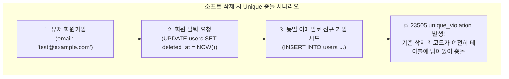
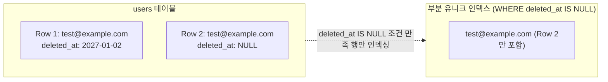
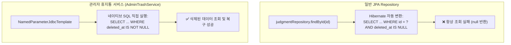

> 데이터의 이력을 보존하고 실수를 방지하기 위해 JPA 환경에서 소프트 삭제(Soft Delete)를 도입할 때 마주치는 Unique 제약 조건 충돌과 `@SQLRestriction` 조회 제약의 한계를 분석하고, PostgreSQL 부분 인덱스(Partial Unique Index)와 네이티브 SQL 기반 관리자 휴지통(Trash Bin) 패턴으로 이를 우아하게 해결한 실전 아키텍처를 소개합니다.
{: .prompt-info }

## 문제 상황: 소프트 삭제(Soft Delete)와 Unique 제약 조건의 충돌

서비스를 운영하다 보면 데이터를 물리적으로 완전히 삭제(`DELETE FROM ...`)하기보다, 삭제 시각(`deleted_at`)을 기록하여 비활성화하는 **소프트 삭제(Soft Delete)** 방식을 자주 채택합니다. 유저의 실수나 운영상 착오로 데이터가 유실되는 위험을 막고, 데이터 무결성과 감사(Audit) 이력을 유지하기 위해서입니다.

하지만 소프트 삭제를 적용하는 순간 RDBMS의 가장 기본적인 무결성 장치인 **Unique 제약 조건(Unique Constraint)**과 정면으로 충돌하게 됩니다.



### 왜 표준 Unique 제약 조건은 소프트 삭제와 충돌하는가?

관계형 데이터베이스의 표준 `UNIQUE` 인덱스는 레코드의 논리적 삭제 여부(`deleted_at IS NOT NULL`)를 인지하지 못합니다. 테이블에 물리적으로 행(Row)이 남아 있는 한, 인덱스는 해당 컬럼 값의 중복을 무조건 차단합니다.

대표적인 충돌 사례는 다음과 같습니다:

1. **회원 탈퇴 후 동일 이메일 재가입**: 탈퇴한 회원의 행이 `deleted_at`만 채워진 채 남아 있으므로, 며칠 뒤 같은 이메일로 다시 가입하려는 사용자는 `DataIntegrityViolationException (23505 unique_violation)` 에러를 마주하게 됩니다.
2. **업무 식별 데이터의 재등록**: 판례 관리 시스템에서 `(case_number, court_name, sentence_date)`와 같은 복합 식별자를 Unique 제약으로 관리할 때, 실수로 등록하여 삭제한 판례를 다시 등록하거나 크롤러가 재수집하려 할 때 Unique 위반으로 저장이 거부됩니다.

### 흔히 시도되는 타협책들과 그 한계

이 문제를 풀기 위해 흔히 시도되는 접근법들이 있지만, 각기 치명적인 결함을 안고 있습니다:

| 접근 방식 | 동작 원리 | 문제점 및 한계 |
| :--- | :--- | :--- |
| **`deleted_at`을 복합 인덱스에 포함** | `UNIQUE (email, deleted_at)` | SQL 표준에서 `NULL`끼리는 서로 다르다고 간주되므로, **살아 있는 정상 행(`deleted_at IS NULL`) 간의 중복이 방지되지 않는 심각한 결함** 발생 |
| **더미 플래그 컬럼 추가** | `is_deleted (0 또는 id)` | 0(살아있음)인 행 간의 유니크를 보장하지 못하며, 불필요한 인덱스 크기 증가 |
| **완전 하드 삭제(Hard Delete)** | `DELETE FROM ...` | 삭제 이력 보존, 연관 데이터 추적, 관리자 복구 불가 |

---

## 해결 전략: PostgreSQL 부분 유니크 인덱스(Partial Unique Index)

PostgreSQL은 인덱스 생성 시 `WHERE` 절 조건을 부여하여 특정 조건을 만족하는 행만 인덱싱하는 **부분 인덱스(Partial Index)**를 완벽하게 지원합니다.



`deleted_at IS NULL`인 **"살아 있는 행"에 대해서만 Unique 제약을 강제**하면, 이미 소프트 삭제된 행은 유니크 검사 대상에서 완전히 제외됩니다.

### 1. PostgreSQL 부분 유니크 인덱스 DDL

```sql
-- 유저 이메일 부분 유니크 인덱스
CREATE UNIQUE INDEX uk_users_email_active
ON users (email)
WHERE deleted_at IS NULL;

-- 판례 복합 식별자 부분 유니크 인덱스 (사건번호 + 법원명 + 선고일자)
CREATE UNIQUE INDEX uk_judgment_case_court_date_active
ON judgments (case_number, court_name, sentence_date)
WHERE deleted_at IS NULL;
```

이렇게 구성하면 살아 있는 행끼리는 동일 이메일이나 동일 사건번호를 가질 수 없지만, 탈퇴하거나 삭제된 행은 얼마든지 동일한 값을 유지할 수 있으므로 재가입과 재등록이 아무런 에러 없이 즉시 허용됩니다.

### 2. 탈퇴 시 이메일 가명화 및 꼬리표(Suffix) 패턴

부분 인덱스 외에도 개인정보보호법 준수 및 소셜 계정 재연동 편의를 위해 **애플리케이션 레벨의 꼬리표 패턴**을 함께 적용할 수 있습니다.

회원 탈퇴 시 이메일에 `@deleted_yyyyMMdd-HHmmss` 꼬리표를 붙이고, 1:N으로 연결된 소셜 계정(`SocialAccount`)은 하드 삭제하여 탈퇴 즉시 동일한 소셜 계정으로 재가입할 수 있도록 열어주는 방식입니다.

```kotlin
// src/main/kotlin/io/github/cmsong111/cotton_bat_server/user/domain/User.kt
package io.github.cmsong111.cotton_bat_server.user.domain

import io.github.cmsong111.cotton_bat_server.common.BaseEntity
import jakarta.persistence.*
import java.time.Instant
import java.time.ZoneId
import java.time.format.DateTimeFormatter
import java.util.UUID

@Entity
@Table(name = "users")
class User(
    @Id
    @GeneratedValue
    @Column(columnDefinition = "UUID", updatable = false)
    var id: UUID? = null,

    // 소셜 제공자가 이메일을 주지 않는 경우가 있어 null 허용
    @Column(unique = true, nullable = true)
    var email: String? = null,

    @Column(nullable = true)
    var nickname: String,

    @OneToMany(mappedBy = "user", cascade = [CascadeType.ALL], orphanRemoval = true)
    val socialAccounts: MutableSet<SocialAccount> = mutableSetOf(),
) : BaseEntity() {

    /**
     * 회원 탈퇴([delete]) 시 정리 작업:
     * 1. 소셜 계정은 하드 삭제 (동일 소셜 계정 재가입 허용)
     * 2. 이메일은 타임스탬프 꼬리표를 붙여 Unique 제약 우회
     */
    override fun onDelete(at: Instant) {
        socialAccounts.clear()
        email = email?.let { deletedEmail(it, at) }
    }

    companion object {
        private const val EMAIL_MAX_LENGTH = 255
        private val DELETED_SUFFIX_FORMAT = DateTimeFormatter.ofPattern("yyyyMMdd-HHmmss")
            .withZone(ZoneId.of("Asia/Seoul"))

        fun deletedEmail(email: String, at: Instant): String {
            val suffix = "@deleted_" + DELETED_SUFFIX_FORMAT.format(at)
            return email.take(EMAIL_MAX_LENGTH - suffix.length) + suffix
        }
    }
}
```

---

## BaseEntity 설계: Hibernate @SQLRestriction과 onDelete 훅

소프트 삭제의 핵심은 **"모든 일반 비즈니스 쿼리에서 삭제된 행을 자동으로 배제하는 것"**입니다. 서비스 계층이나 레포지토리 메서드마다 `where deleted = false`를 일일이 붙이다 보면 단 한 번의 실수로 삭제된 데이터가 외부에 노출되는 사고가 발생합니다.

### 왜 Hibernate 6.x `@SoftDelete` 대신 `@SQLRestriction`인가?

Hibernate 6에 추가된 공식 `@SoftDelete` 어노테이션은 편리해 보이지만 실무에서 심각한 트레이드오프가 있습니다:
- `@SoftDelete`가 선언된 대상을 `@ManyToOne(fetch = FetchType.LAZY)`로 연관관계를 맺을 때, 프록시 생성 및 조회 시 예외가 발생하거나 특정 조인 쿼리에서 N+1 문제가 발생합니다.
- 이에 따라 실무 프로젝트인 `cotton-bat-server`에서는 엔티티 상속 계층의 최상위 `BaseEntity`에 `@SQLRestriction("deleted_at IS NULL")`을 명시하여 모든 하위 엔티티의 단건 조회, 목록 조회, 연관 로딩에서 안전하게 격리하도록 설계했습니다.

```kotlin
// src/main/kotlin/io/github/cmsong111/cotton_bat_server/common/BaseEntity.kt
package io.github.cmsong111.cotton_bat_server.common

import jakarta.persistence.Column
import jakarta.persistence.EntityListeners
import jakarta.persistence.MappedSuperclass
import jakarta.persistence.Version
import java.time.Instant
import org.hibernate.annotations.ColumnDefault
import org.hibernate.annotations.SQLRestriction
import org.springframework.data.annotation.CreatedBy
import org.springframework.data.annotation.CreatedDate
import org.springframework.data.annotation.LastModifiedBy
import org.springframework.data.annotation.LastModifiedDate
import org.springframework.data.jpa.domain.support.AuditingEntityListener

/**
 * 공통 감사(audit) 컬럼과 소프트 삭제 컬럼.
 *
 * [deletedAt]이 null이면 살아 있는 행, 값이 있으면 그 시각에 삭제된 행이다.
 * 삭제는 항상 [delete]로 하고, 엔티티별 정리 작업(연관 데이터 제거 등)은 [onDelete]를 오버라이드해 넣는다.
 * 삭제된 행은 `@SQLRestriction`으로 모든 하위 엔티티의 조회(목록, id 조회, 연관 로딩)에서 제외된다.
 */
@MappedSuperclass
@SQLRestriction("deleted_at IS NULL")
@EntityListeners(AuditingEntityListener::class)
abstract class BaseEntity(
    @CreatedDate
    @Column(updatable = false)
    var createdAt: Instant = Instant.now(),

    @LastModifiedDate
    var updatedAt: Instant = Instant.now(),

    @CreatedBy
    @Column(updatable = false)
    var createdUser: String? = null,

    @LastModifiedBy
    var updatedUser: String? = null,

    var deletedAt: Instant? = null,

    /**
     * 낙관적 잠금 버전 (동시 수정 및 복구 시 덮어쓰기 방지)
     */
    @Version
    @ColumnDefault("0")
    var version: Long = 0,
) {
    val isDeleted: Boolean get() = deletedAt != null

    /**
     * 소프트 삭제 실행 메서드.
     * [onDelete] 정리 훅을 먼저 실행한 뒤 [deletedAt]을 기록합니다.
     */
    fun delete(at: Instant = Instant.now()) {
        onDelete(at)
        deletedAt = at
    }

    /**
     * 삭제 직전 엔티티별 연관관계 정리 훅 (하위 클래스에서 오버라이드)
     */
    protected open fun onDelete(at: Instant) {}
}
```

### 참조 무결성과 사전 정리 규칙

소프트 삭제된 행이 다른 엔티티에 의해 외래키(`@ManyToOne`)로 참조되고 있다면, 해당 부모를 조회할 때 자식이 `@SQLRestriction`으로 인해 `null`이 되어 NPE가 발생하거나 조회가 깨집니다.

따라서 삭제 시점(`AdminDeleteService`)에서 다음과 같은 엄격한 사전 검증과 정리가 필요합니다:

```kotlin
// src/main/kotlin/io/github/cmsong111/cotton_bat_server/admin/application/AdminDeleteService.kt
package io.github.cmsong111.cotton_bat_server.admin.application

import io.github.cmsong111.cotton_bat_server.article.domain.ArticleJpaRepository
import io.github.cmsong111.cotton_bat_server.common.BusinessException
import io.github.cmsong111.cotton_bat_server.judgment.domain.JudgeJpaRepository
import io.github.cmsong111.cotton_bat_server.judgment.domain.JudgmentErrorCode
import io.github.cmsong111.cotton_bat_server.judgment.domain.JudgmentJpaRepository
import io.github.cmsong111.cotton_bat_server.judgment.domain.JudgmentJudgeJpaRepository
import io.github.cmsong111.cotton_bat_server.user.application.UserService
import java.util.UUID
import org.springframework.data.repository.findByIdOrNull
import org.springframework.stereotype.Service
import org.springframework.transaction.annotation.Transactional

@Service
@Transactional
class AdminDeleteService(
    private val userService: UserService,
    private val judgeRepository: JudgeJpaRepository,
    private val judgmentRepository: JudgmentJpaRepository,
    private val judgmentJudgeRepository: JudgmentJudgeJpaRepository,
    private val articleRepository: ArticleJpaRepository,
) {

    fun deleteJudge(id: Long) {
        val judge = judgeRepository.findByIdOrNull(id) ?: throw notFound("판사")
        // 판례에 참여 중인 판사는 삭제 불가
        if (judgmentJudgeRepository.existsByJudgeId(id)) {
            throw BusinessException(JudgmentErrorCode.JUDGE_IN_USE)
        }
        judge.delete()
    }

    fun deleteJudgment(id: Long) {
        val judgment = judgmentRepository.findByIdOrNull(id) ?: throw notFound("판례")
        // 게시글이 연결된 판례는 게시글 조회가 깨지므로 삭제 불가
        if (articleRepository.existsBySourceId(id)) {
            throw BusinessException(JudgmentErrorCode.JUDGMENT_HAS_ARTICLE)
        }
        judgment.delete() // onDelete에서 참여 판사 연결 하드 삭제
    }

    fun deleteArticle(id: Long) {
        val article = articleRepository.findByIdOrNull(id) ?: throw notFound("게시글")
        article.delete()
    }
}
```

---

## 관리자 휴지통(Trash Bin) 아키텍처: JPA를 우회하는 네이티브 SQL

여기서 중요한 아키텍처 딜레마가 발생합니다.

> **딜레마**: 모든 엔티티에 `@SQLRestriction("deleted_at IS NULL")`이 걸려 있어 일반 비즈니스 로직은 매우 안전해졌지만, **"삭제된 항목(`deleted_at IS NOT NULL`)을 모아보고 복구해야 하는 관리자 휴지통"**에서는 JPA로 해당 행을 조회할 방법이 없습니다!

JPA의 `findById`나 JPQL로 `WHERE deleted_at IS NOT NULL`을 선언해도, 하이버네이트가 자동으로 `AND deleted_at IS NULL`을 끝에 덧붙여 쿼리 결과가 항상 빈 집합(Empty)이 됩니다.



### 네이티브 SQL 기반의 AdminTrashService 구현

관리자 휴지통 도메인은 JPA를 과감히 우회하고 **Spring JDBC (`NamedParameterJdbcTemplate`)**를 사용하여 삭제된 행을 조회하고 복구합니다.

이때 네이티브 `UPDATE`문은 JPA 영속성 컨텍스트를 거치지 않으므로, **낙관적 락 버전(`version = version + 1`)과 JPA 감사 컬럼(`updated_at`, `updated_user`)을 직접 갱신**해 주는 것이 핵심입니다.

```kotlin
// src/main/kotlin/io/github/cmsong111/cotton_bat_server/admin/application/AdminTrashService.kt
package io.github.cmsong111.cotton_bat_server.admin.application

import io.github.cmsong111.cotton_bat_server.admin.dto.AdminTrashRow
import io.github.cmsong111.cotton_bat_server.common.BusinessException
import java.time.Instant
import java.time.OffsetDateTime
import java.util.UUID
import org.springframework.data.domain.AuditorAware
import org.springframework.data.domain.Page
import org.springframework.data.domain.PageImpl
import org.springframework.data.domain.Pageable
import org.springframework.http.HttpStatus
import org.springframework.jdbc.core.namedparam.NamedParameterJdbcTemplate
import org.springframework.stereotype.Service
import org.springframework.transaction.annotation.Transactional
import org.springframework.web.server.ResponseStatusException

@Service
@Transactional(readOnly = true)
class AdminTrashService(
    private val jdbc: NamedParameterJdbcTemplate,
    private val auditorAware: AuditorAware<String>,
) {

    enum class Type(val table: String, val title: String, val subject: String, val objective: String) {
        USERS("users", "유저", "유저가", "유저를"),
        JUDGES("judges", "판사", "판사가", "판사를"),
        JUDGMENTS("judgments", "판례", "판례가", "판례를"),
        ARTICLES("articles", "게시글", "게시글이", "게시글을");

        val key: String get() = name.lowercase()
        companion object {
            fun of(key: String): Type = entries.find { it.key == key }
                ?: throw ResponseStatusException(HttpStatus.NOT_FOUND, "지원하지 않는 휴지통 종류입니다.")
        }
    }

    /**
     * 소프트 삭제된 항목 목록 조회 (네이티브 SQL)
     */
    fun list(type: Type, pageable: Pageable): Page<AdminTrashRow> {
        val params = mapOf("limit" to pageable.pageSize, "offset" to pageable.offset)
        val sql = LIST_SQL.getValue(type) + " ORDER BY t.deleted_at DESC LIMIT :limit OFFSET :offset"
        
        val rows = jdbc.query(sql, params) { rs, _ ->
            AdminTrashRow(
                id = rs.getString("id"),
                label = rs.getString("label"),
                detail = rs.getString("detail"),
                deletedAt = rs.getObject("deleted_at", OffsetDateTime::class.java).toInstant(),
                deletedBy = rs.getString("updated_user"),
                blockedReason = if (rs.getBoolean("blocked")) BLOCKED_REASON.getValue(type) else null,
            )
        }
        val total = jdbc.queryForObject(
            "SELECT COUNT(*) FROM ${type.table} WHERE deleted_at IS NOT NULL",
            emptyMap<String, Any>(),
            Long::class.java
        ) ?: 0

        return PageImpl(rows, pageable, total)
    }

    /**
     * 소프트 삭제 항목 복구 (네이티브 UPDATE로 audit과 @Version 수동 갱신)
     */
    @Transactional
    fun restore(type: Type, id: String) {
        val key: Any = when (type) {
            Type.USERS -> runCatching { UUID.fromString(id) }.getOrElse { throw notFound() }
            else -> id.toLongOrNull() ?: throw notFound()
        }

        when (type) {
            Type.USERS -> restoreUser(key as UUID)
            Type.ARTICLES -> {
                // 원본 판례가 아직 삭제 상태인지 확인
                val blocked = jdbc.queryForObject(
                    "SELECT COUNT(*) FROM articles a JOIN judgments j ON j.id = a.judgment_id " +
                    "WHERE a.id = :id AND j.deleted_at IS NOT NULL",
                    mapOf("id" to key), Long::class.java
                ) ?: 0
                if (blocked > 0) throw BusinessException(AdminErrorCode.RESTORE_ARTICLE_JUDGMENT_DELETED)
                undelete(type, key)
            }
            else -> undelete(type, key)
        }
    }

    /**
     * 유저 복구: 탈퇴 꼬리표(@deleted_...)를 제거하되, 동일 이메일 활성 계정이 있으면 복구 거부
     */
    private fun restoreUser(id: UUID) {
        val email = jdbc.queryForList(
            "SELECT email FROM users WHERE id = :id AND deleted_at IS NOT NULL",
            mapOf("id" to id), String::class.java
        ).firstOrNull() ?: throw notFound()

        val original = email.replace(DELETED_EMAIL_SUFFIX, "")
        val taken = jdbc.queryForObject(
            "SELECT COUNT(*) FROM users WHERE email = :email AND deleted_at IS NULL",
            mapOf("email" to original), Long::class.java
        ) ?: 0

        if (taken > 0) throw BusinessException(AdminErrorCode.RESTORE_EMAIL_TAKEN)

        jdbc.update("UPDATE users SET email = :email WHERE id = :id", mapOf("email" to original, "id" to id))
        undelete(Type.USERS, id)
    }

    private fun undelete(type: Type, id: Any) {
        val updated = jdbc.update(
            "UPDATE ${type.table} SET deleted_at = NULL, updated_at = :now, " +
            "updated_user = :auditor, version = version + 1 " +
            "WHERE id = :id AND deleted_at IS NOT NULL",
            mapOf("now" to OffsetDateTime.now(), "auditor" to auditorAware.currentAuditor.orElse(null), "id" to id)
        )
        if (updated == 0) throw notFound()
    }

    private fun notFound() = ResponseStatusException(HttpStatus.NOT_FOUND, "휴지통에 없는 항목입니다.")

    companion object {
        private val DELETED_EMAIL_SUFFIX = Regex("@deleted_\\d{8}-\\d{6}$")

        private val LIST_SQL = mapOf(
            Type.USERS to "SELECT CAST(t.id AS VARCHAR(36)) AS id, t.nickname AS label, t.email AS detail, t.deleted_at, t.updated_user, FALSE AS blocked FROM users t WHERE t.deleted_at IS NOT NULL",
            Type.JUDGES to "SELECT CAST(t.id AS VARCHAR(20)) AS id, t.name AS label, t.court AS detail, t.deleted_at, t.updated_user, FALSE AS blocked FROM judges t WHERE t.deleted_at IS NOT NULL",
            Type.JUDGMENTS to "SELECT CAST(t.id AS VARCHAR(20)) AS id, t.case_number AS label, t.verdict AS detail, t.deleted_at, t.updated_user, FALSE AS blocked FROM judgments t WHERE t.deleted_at IS NOT NULL",
            Type.ARTICLES to "SELECT CAST(t.id AS VARCHAR(20)) AS id, t.title AS label, j.case_number AS detail, t.deleted_at, t.updated_user, (j.deleted_at IS NOT NULL) AS blocked FROM articles t JOIN judgments j ON j.id = t.judgment_id WHERE t.deleted_at IS NOT NULL",
        )

        private val BLOCKED_REASON = mapOf(
            Type.ARTICLES to "원본 판례가 삭제되어 있습니다. 판례를 먼저 복구해 주세요."
        ).withDefault { "" }
    }
}
```

---

## 동작 검증 및 테스트

아키텍처가 완벽히 동작하는지 검증하기 위해 관리자 화면 UI 흐름과 실제 통합 테스트를 수행합니다.

### 1. 관리자 행 작업 메뉴(우클릭/더보기)를 통한 소프트 삭제

관리자 목록 화면(`/admin/articles`, `/admin/judgments`)에서는 각 행의 우측 `⋯` 아이콘 버튼을 클릭하거나 우클릭하여 안전하게 항목을 휴지통으로 이동할 수 있습니다.


행 작업 메뉴의 `삭제 (휴지통 이동)`를 클릭하면 JavaScript 확인 대화상자가 노출되고, 확인 시 CSRF 토큰을 동봉하여 `POST /admin/articles/{id}/delete`로 안전하게 소프트 삭제가 인입됩니다.

### 2. 관리자 휴지통 대시보드와 복구 인터랙션

삭제된 엔티티는 `/admin/trash` 휴지통 메뉴에서 종류별(유저, 판사, 판례, 게시글) 탭으로 집계되어 노출됩니다.


- **삭제 실행자 및 시각 보존**: 누가 언제 삭제했는지 이력이 그대로 보존됩니다.
- **연관 무결성 차단(`BLOCKED_REASON`)**: 원본 판례(ID 41)가 삭제되어 있는 게시글은 우측 작업이 `복구 불가 (판례 삭제됨)`로 비활성화되어 고아 객체나 참조 예외 발생을 사전에 방지합니다.
- **원클릭 복구**: `[복구]` 버튼을 클릭하면 네이티브 SQL을 통해 `deleted_at = NULL`로 해제되고 버전이 증가하며 원래의 서비스 화면으로 즉시 복귀합니다.

### 3. 부분 인덱스 및 재가입 통합 테스트 검증

소프트 삭제 후 동일한 식별자(이메일)로 재가입을 시도할 때 부분 유니크 인덱스가 충돌을 차단하지 않고 정상 허용하는지 검증하는 테스트 코드입니다.

```kotlin
// src/test/kotlin/io/github/cmsong111/cotton_bat_server/admin/AdminTrashTest.kt
package io.github.cmsong111.cotton_bat_server.admin

import io.github.cmsong111.cotton_bat_server.support.IntegrationTestSupport
import io.github.cmsong111.cotton_bat_server.judgment.domain.Judge
import io.github.cmsong111.cotton_bat_server.judgment.domain.JudgeJpaRepository
import org.assertj.core.api.Assertions.assertThat
import org.junit.jupiter.api.DisplayName
import org.junit.jupiter.api.Test
import org.springframework.beans.factory.annotation.Autowired
import org.springframework.data.repository.findByIdOrNull
import org.springframework.test.web.servlet.get
import org.springframework.test.web.servlet.post

@DisplayName("관리자 휴지통 (삭제된 항목 보기와 복구)")
class AdminTrashTest : IntegrationTestSupport() {

    @Autowired
    private lateinit var judgeRepository: JudgeJpaRepository

    @Test
    fun `삭제한 항목이 휴지통에 보이고 복구하면 목록으로 돌아온다`() {
        val admin = login(createAdmin(nickname = "정리자"))
        val judge = judgeRepository.save(Judge(name = "홍길동판사"))

        // 소프트 삭제 요청
        mockMvc.post("/admin/judges/${judge.id}/delete") { cookie(admin) }

        // 휴지통 조회 확인
        mockMvc.get("/admin/trash") { cookie(admin); param("type", "judges") }
            .andExpect { status { isOk() } }

        // 복구 요청
        mockMvc.post("/admin/trash/judges/${judge.id}/restore") { cookie(admin) }

        // 검증: deletedAt 초기화 및 version 증가
        val restored = judgeRepository.findByIdOrNull(judge.id)!!
        assertThat(restored.deletedAt).isNull()
        assertThat(restored.version).isGreaterThan(judge.version)
    }

    @Test
    fun `같은 이메일로 다시 가입한 계정이 있으면 유저를 복구할 수 없다`() {
        val admin = login(createAdmin())
        val email = "reuse@example.com"
        val user = createUser(email = email)

        // 1. 유저 탈퇴 (소프트 삭제)
        mockMvc.post("/admin/users/${user.id}/delete") { cookie(admin) }

        // 2. 다른 사용자가 동일 이메일로 신규 가입 (부분 인덱스로 인해 성공)
        createUser(email = email)

        // 3. 탈퇴 유저를 복구하려 시도하면 이메일 중복으로 거부되어야 함
        mockMvc.post("/admin/trash/users/${user.id}/restore") { cookie(admin) }
            .andExpect {
                flash { attribute("error", "같은 이메일로 사용 중인 계정이 있어 복구할 수 없습니다.") }
            }
    }
}
```

터미널 및 psql 콘솔에서 검증한 실제 실행 결과입니다:


PostgreSQL의 `uk_users_email_active ... WHERE (deleted_at IS NULL)` 인덱스 정의와 함께, 소프트 삭제된 행이 존재하더라도 동일 이메일의 신규 행이 충돌 없이 삽입되며 관련 테스트 4건이 모두 녹색 불(PASSED)로 통과함을 확인할 수 있습니다.

---

## 정리 및 실무 권장 사항

JPA 환경에서 소프트 삭제와 복합 Unique 제약을 조화롭게 공존시키기 위해 실무에서 기억해야 할 4가지 원칙입니다:

1. **부분 유니크 인덱스(Partial Unique Index) 적극 활용**: `UNIQUE (col, deleted_at)` 대신 `CREATE UNIQUE INDEX ... ON table (col) WHERE deleted_at IS NULL`을 사용하여 활성 행의 유니크 무결성과 삭제 후 재등록 유연성을 동시에 확보하세요.
2. **`@SQLRestriction("deleted_at IS NULL")`을 통한 기본 격리**: 공통 `BaseEntity`에 전역 제약 조건을 부여하여, 일반 서비스 코드에서 삭제 데이터가 노출되는 실수를 원천 방지하세요.
3. **휴지통 도메인은 Spring JDBC 네이티브 SQL로 분리**: `@SQLRestriction`으로 막힌 소프트 삭제 행은 억지로 JPA로 풀려 하지 말고, 네이티브 SQL을 사용하는 별도의 관리자 서비스(`AdminTrashService`)로 분리하는 것이 가장 직관적이고 깔끔합니다.
4. **네이티브 UPDATE 시 감사 정보와 `@Version` 수동 갱신**: 네이티브 쿼리로 복구할 때는 영속성 컨텍스트의 Auditing 리스너가 동작하지 않으므로, 쿼리문 안에 `updated_at`, `updated_user`, `version = version + 1`을 명시하여 데이터 정합성을 유지하세요.
