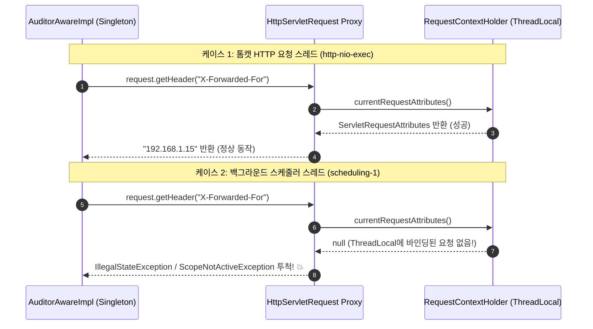

> Spring Data JPA의 감사(Auditing) 기능은 웹 요청뿐만 아니라 스케줄러, 비동기 작업, 배치 러너 등 다양한 스레드 환경에서 엔티티가 저장될 때도 호출됩니다. 웹 요청 전용 객체인 `HttpServletRequest` 프록시나 `SecurityContext`의 존재를 맹신하면 백그라운드 스레드에서 치명적인 런타임 예외가 발생합니다. 이 글에서는 `cotton-bat-server` 운영 중 겪었던 비동기 감사자 예외의 원인을 파헤치고, 컨텍스트 부재 상황에서도 안전하게 동작하는 `AuditorAware` 방어 전략을 정리합니다.

---

## 문제 상황: 웹에서는 잘 동작하던 배치가 새벽에 터지다

판결문 수집 및 AI 요약 서비스인 `cotton-bat-server`에서는 엔티티의 생성자(`@CreatedBy`)와 수정자(`@LastModifiedBy`), 생성 시각(`@CreatedDate`)을 자동으로 추적하기 위해 Spring Data JPA Auditing을 적용해 두었습니다.

일반적인 웹 API 요청(예: 관리자 콘솔을 통한 판결문 수동 등록, 태그 수정 등)에서는 로그인한 관리자의 계정 ID와 접속 IP(`X-Forwarded-For`)를 조합하여 다음과 같이 감사 필드에 깔끔하게 기록되었습니다:

- `cmsong111 (192.168.1.15)`

그런데 매일 새벽 정해진 시각에 외부 법원 시스템에서 신규 판례를 수집하는 백그라운드 스케줄러(`@Scheduled`)와 분산 배치 작업자가 동작할 때 예기치 못한 크래시가 발생했습니다.

수집된 판결문 데이터를 엔티티로 변환하여 `judgmentRepository.save(entity)`를 호출하는 순간, 스케줄러 스레드가 다음과 같은 에러를 뿜으며 즉시 중단되었습니다.


_그림 1. 스케줄러 스레드에서 엔티티 영속화 시 발생한 Scope 'request' is not active 스택트레이스._

```text
org.springframework.beans.factory.BeanCreationException: Error creating bean with name 'scopedTarget.request': 
Scope 'request' is not active for the current thread; consider defining a scoped proxy for this bean 
if you intend to refer to it from a singleton; 
nested exception is java.lang.IllegalStateException: No thread-bound request found: 
Are you referring to request attributes outside of an actual web request, 
or processing a request outside of the originally receiving thread?
    at org.springframework.web.context.request.RequestContextHolder.currentRequestAttributes(RequestContextHolder.java:131)
    at org.springframework.web.context.support.WebApplicationContextUtils$RequestObjectFactory.getObject(WebApplicationContextUtils.java:323)
    at org.springframework.aop.framework.JdkDynamicAopProxy.invoke(JdkDynamicAopProxy.java:163)
    at jdk.proxy2/jdk.proxy2.$Proxy118.getHeader(Unknown Source)
    at io.github.cmsong111.cotton_bat_server.common.AuditorAwareImpl.getClientIp(AuditorAwareImpl.kt:28)
    at io.github.cmsong111.cotton_bat_server.common.AuditorAwareImpl.getCurrentAuditor(AuditorAwareImpl.kt:19)
    at org.springframework.data.jpa.domain.support.AuditingEntityListener.touchForCreate(AuditingEntityListener.java:101)
```

웹 요청 밖에서 단순히 엔티티 하나를 저장하려 했을 뿐인데, 왜 감사 정보를 채우는 과정에서 요청 스코프 예외가 발생했을까요?

---

## 원인 분석: Request Scope 프록시와 ThreadLocal의 함정

문제가 발생한 초기 `AuditorAwareImpl` 코드를 살펴보면 원인이 명확히 드러납니다.

### 1. 문제가 된 기존 구현

```kotlin
// 수정 전: 위험한 AuditorAware 구현
@Component
class AuditorAwareImpl(
    private val request: HttpServletRequest // ⚠️ 싱글톤에 주입된 Request 스코프 프록시
) : AuditorAware<String> {

    override fun getCurrentAuditor(): Optional<String> {
        val authentication = SecurityContextHolder.getContext().authentication

        if (authentication == null || !authentication.isAuthenticated || authentication.name == "anonymousUser") {
            return Optional.of("SYSTEM (${getClientIp()})") // ⚠️ getClientIp() 내부에서 프록시 접근
        }

        return Optional.of("${authentication.name} (${getClientIp()})")
    }

    private fun getClientIp(): String {
        val xfHeader: String? = request.getHeader("X-Forwarded-For") // 💥 여기서 터진다!
        return if (xfHeader == null) {
            request.remoteAddr
        } else {
            xfHeader.split(",")[0]
        }
    }
}
```

### 2. Request 스코프 프록시의 동작 메커니즘

Spring에서 싱글톤 빈(`@Component`)에 `HttpServletRequest`를 생성자 주입받으면, 실제 HTTP 서블릿 요청 객체가 직접 들어오는 것이 아니라 스프링이 생성한 **동적 프록시 객체(`$Proxy...`)**가 주입됩니다.

이 프록시 객체는 메서드가 호출될 때마다 내부적으로 `RequestContextHolder.currentRequestAttributes()`를 조회하여, **현재 실행 중인 스레드의 `ThreadLocal`에 바인딩된 실제 요청 객체**로 작업을 위임합니다.



- **HTTP 요청 스레드 (`http-nio-exec`)**: `DispatcherServlet`을 거치며 `RequestContextHolder`에 요청 객체가 바인딩되므로 정상 작동합니다.
- **비동기 스레드 (`scheduling-1`, `@Async`, 배치 러너)**: HTTP 요청 파이프라인을 거치지 않고 독립 스레드 풀에서 실행되므로, `ThreadLocal`에 어떤 요청 속성도 존재하지 않습니다.
- 따라서 프록시 객체의 어떤 메서드(`getHeader`, `getRemoteAddr`)라도 건드리는 순간 `IllegalStateException: No thread-bound request found`가 발생합니다.

### 3. SecurityContext의 스레드 격리

`SecurityContextHolder` 역시 기본 저장 모드가 `MODE_THREADLOCAL`입니다.

웹 요청을 통해 들어온 인증 정보는 해당 서블릿 스레드에만 머무르며, 스케줄러나 별도 스레드 풀로 자동 전파되지 않습니다. 따라서 비동기 스레드에서는 `authentication`이 항상 `null`이 됩니다. 

이때 null 안전 처리를 제대로 하지 않거나, 인증이 없다고 판단하여 `SYSTEM` 계정으로 대체하면서 다시 `request` 프록시를 호출하면 같은 크래시가 반복됩니다.

---

## 해결 방법: 견고한 AuditorAware 안전화 전략

이 문제를 해결하기 위해서는 두 가지 원칙을 지켜야 합니다:

1. 싱글톤 빈에 `HttpServletRequest` 프록시를 직접 주입하지 않고, **`RequestContextHolder`를 통한 정적 안전 조회**로 전환할 것.
2. 웹 요청이 없거나(`request == null`) 인증 정보가 없는(`authentication == null`) 환경에서도 **단 하나의 예외 없이 기본 시스템 감사자로 Fallback**할 것.

### Step 1. null 안전한 RequestUtils 구현

스레드 로컬에 활성 요청이 있는지 안전하게 검사하고, 프록시가 없을 때는 안전하게 fallback 값을 반환하는 유틸리티 객체를 작성했습니다.

```kotlin
// src/main/kotlin/io/github/cmsong111/cotton_bat_server/utils/RequestUtils.kt
package io.github.cmsong111.cotton_bat_server.utils

import jakarta.servlet.http.HttpServletRequest
import org.springframework.web.context.request.RequestContextHolder
import org.springframework.web.context.request.ServletRequestAttributes

object RequestUtils {

    /**
     * 현재 스레드에 바인딩된 HttpServletRequest를 안전하게 반환합니다.
     * 비동기 스레드나 스케줄러 환경에서는 null을 반환합니다.
     */
    val currentRequest: HttpServletRequest?
        get() = (RequestContextHolder.getRequestAttributes() as? ServletRequestAttributes)?.request

    /**
     * 프록시 및 로드밸런서(NPM 등)를 고려한 클라이언트 실제 IP를 추출합니다.
     * 웹 요청 밖에서는 안전하게 "unknown"을 반환합니다.
     */
    fun getClientIp(request: HttpServletRequest? = currentRequest): String {
        if (request == null) return "unknown"

        val xfHeader = request.getHeader("X-Forwarded-For")
        return if (xfHeader.isNullOrBlank()) {
            request.remoteAddr ?: "unknown"
        } else {
            // 여러 프록시를 거쳤을 경우 첫 번째 IP가 실제 클라이언트 IP
            xfHeader.split(",")[0].trim()
        }
    }
}
```

`RequestContextHolder.getRequestAttributes()`를 `ServletRequestAttributes`로 안전한 타입 캐스팅(`as?`)을 거치도록 하여, 요청이 없을 때 스프링의 프록시 예외가 발생하지 않고 자연스럽게 `null`을 반환하도록 유도했습니다.

### Step 2. 방어적 AuditorAware 구현

수정된 `AuditorAwareImpl`은 생성자에서 `HttpServletRequest` 의존성을 완전히 제거하고, `RequestUtils`를 통해 웹 요청 유무를 유연하게 판별합니다.

```kotlin
// src/main/kotlin/io/github/cmsong111/cotton_bat_server/common/AuditorAwareImpl.kt
package io.github.cmsong111.cotton_bat_server.common

import io.github.cmsong111.cotton_bat_server.utils.RequestUtils
import java.util.Optional
import org.springframework.data.domain.AuditorAware
import org.springframework.security.core.context.SecurityContextHolder
import org.springframework.stereotype.Component

@Component
class AuditorAwareImpl : AuditorAware<String> {

    override fun getCurrentAuditor(): Optional<String> {
        val authentication = SecurityContextHolder.getContext()?.authentication
        // 웹 요청 밖(배치, 스케줄러, 초기화)에서는 currentRequest가 null이므로 "unknown" 반환
        val clientIp = RequestUtils.getClientIp()

        // 1. 미인증 사용자 또는 비동기/스케줄러 환경 fallback
        if (authentication == null || !authentication.isAuthenticated || authentication.name == "anonymousUser") {
            return Optional.of("SYSTEM ($clientIp)")
        }

        // 2. 인증된 웹 요청 사용자 (사용자 식별자 + IP 조합)
        return Optional.of("${authentication.name} ($clientIp)")
    }
}
```

> `AuditorAware`는 `Optional.empty()`를 반환할 수도 있지만, 엔티티의 `@CreatedBy` 컬럼에 `NOT NULL` 제약조건이 걸려 있는 경우 데이터베이스 제약조건 위반(`DataIntegrityViolationException`)이 발생할 수 있습니다. 따라서 백그라운드 환경에서는 `SYSTEM (unknown)`과 같이 명시적인 식별자를 채워주는 편이 안전합니다.
{: .prompt-info }

### Step 3. JPA Auditing 설정 및 공통 BaseEntity

감사 설정 빈(`JpaAuditConfig`)과 도메인 공통 부모 클래스(`BaseEntity`)의 전체 구성입니다.

```kotlin
// src/main/kotlin/io/github/cmsong111/cotton_bat_server/config/JpaAuditConfig.kt
package io.github.cmsong111.cotton_bat_server.config

import org.springframework.context.annotation.Configuration
import org.springframework.data.jpa.repository.config.EnableJpaAuditing

@Configuration
@EnableJpaAuditing(auditorAwareRef = "auditorAwareImpl")
class JpaAuditConfig
```

```kotlin
// src/main/kotlin/io/github/cmsong111/cotton_bat_server/common/BaseEntity.kt
package io.github.cmsong111.cotton_bat_server.common

import jakarta.persistence.Column
import jakarta.persistence.EntityListeners
import jakarta.persistence.MappedSuperclass
import jakarta.persistence.Version
import java.time.Instant
import org.hibernate.annotations.ColumnDefault
import org.springframework.data.annotation.CreatedBy
import org.springframework.data.annotation.CreatedDate
import org.springframework.data.annotation.LastModifiedBy
import org.springframework.data.annotation.LastModifiedDate
import org.springframework.data.jpa.domain.support.AuditingEntityListener

@MappedSuperclass
@EntityListeners(AuditingEntityListener::class)
abstract class BaseEntity(
    @CreatedDate
    @Column(updatable = false, nullable = false)
    var createdAt: Instant = Instant.now(),

    @LastModifiedDate
    @Column(nullable = false)
    var updatedAt: Instant = Instant.now(),

    @CreatedBy
    @Column(updatable = false, nullable = false, length = 100)
    var createdUser: String? = null,

    @LastModifiedBy
    @Column(nullable = false, length = 100)
    var updatedUser: String? = null,

    @Version
    @ColumnDefault("0")
    var version: Long = 0,
)
```

---

## 결과 확인: 스케줄러와 웹 요청의 안정적인 분기 검증

개선된 코드가 스케줄러 환경과 웹 요청 환경 모두에서 정상 동작하는지 테스트 코드를 통해 검증했습니다.

```kotlin
// src/test/kotlin/io/github/cmsong111/cotton_bat_server/common/AuditorAwareIntegrationTest.kt
@SpringBootTest
class AuditorAwareIntegrationTest @Autowired constructor(
    private val judgmentRepository: JudgmentRepository,
    private val auditorAware: AuditorAware<String>
) {

    @Test
    @DisplayName("웹 요청 밖(비동기 스레드)에서도 예외 없이 시스템 감사자로 안전하게 저장된다")
    fun persistOutsideWebRequest() {
        // Given: SecurityContext와 RequestContext가 비어 있는 비동기 스레드 모사
        SecurityContextHolder.clearContext()

        // When
        val auditor = auditorAware.currentAuditor
        val judgment = judgmentRepository.save(
            Judgment(caseNumber = "2026노1842", courtName = "서울고등법원")
        )

        // Then
        assertThat(auditor).contains("SYSTEM (unknown)")
        assertThat(judgment.createdUser).isEqualTo("SYSTEM (unknown)")
        assertThat(judgment.updatedUser).isEqualTo("SYSTEM (unknown)")
    }
}
```

### 1. 테스트 실행 로그


_그림 2. 개선 후 통합 테스트 실행 로그. 스케줄러 스레드(`scheduling-1`)에서는 SYSTEM (unknown)으로, 웹 서블릿 스레드(`http-nio-exec-1`)에서는 사용자 ID와 IP가 매핑되어 정상 영속화됩니다._

스택트레이스를 뿜으며 비정상 종료되던 이전과 달리, `RequestContextHolder`가 비어있음을 감지하고 곧바로 `SYSTEM (unknown)`으로 fallback 하여 엔티티가 단 한 번의 오류 없이 안전하게 저장되었습니다.

### 2. 데이터베이스 영속화 결과 확인

실제 PostgreSQL 데이터베이스의 `judgment` 테이블을 조회해 보면, 웹 관리자 요청과 새벽 수집 배치가 각자의 성격에 맞게 감사 컬럼을 안전하게 채워 넣었음을 확인할 수 있습니다.


_그림 3. DataGrip을 통해 확인한 judgment 테이블. 관리자 수동 등록 행은 IP가 포함된 계정명으로, 스케줄러 수집 행은 SYSTEM (unknown)으로 명확히 구분되어 기록됩니다._

---

## 마치며

스프링 프레임워크가 제공하는 강력한 편의 기능(Request Scope Proxy, SecurityContextHolder 등)은 대부분 **단일 HTTP 서블릿 요청-응답 라이프사이클**을 전제로 설계되어 있습니다.

하지만 현대 백엔드 애플리케이션은 웹 서버의 역할뿐만 아니라 비동기 이벤트 리스너, 스케줄러, 배치 워커 등 다양한 백그라운드 작업을 함께 수행합니다. 

이번 트러블슈팅을 통해 얻은 핵심 교훈은 다음과 같습니다:

1. **싱글톤 컴포넌트의 웹 종속성 경계**: `AuditorAware`처럼 애플리케이션 전역에서 호출될 수 있는 공통 컴포넌트는 절대 특정 요청 스코프 빈에 강하게 결합되어서는 안 됩니다.
2. **명시적인 Fallback 전략**: 컨텍스트가 주어지지 않는 비동기 환경에서도 NPE나 빈 생성 실패가 나지 않도록 `RequestUtils` 형태의 방어적 조회를 기본 구조로 설계해야 합니다.
3. **일관된 감사자 포맷**: 시스템 작업이라 하더라도 컬럼이 비어있지 않도록 `SYSTEM` 등의 대표 식별자를 남겨두면, 추후 장애 분석이나 데이터 이력 추적 시 작업 주체를 손쉽게 식별할 수 있습니다.

비동기 작업이나 스케줄러에서 엔티티를 다룰 때 원인을 알 수 없는 감사자 예외를 마주하셨다면, 현재의 `AuditorAware`가 웹 요청 바깥의 세계를 안전하게 품고 있는지 꼭 한 번 점검해 보시기 바랍니다.
