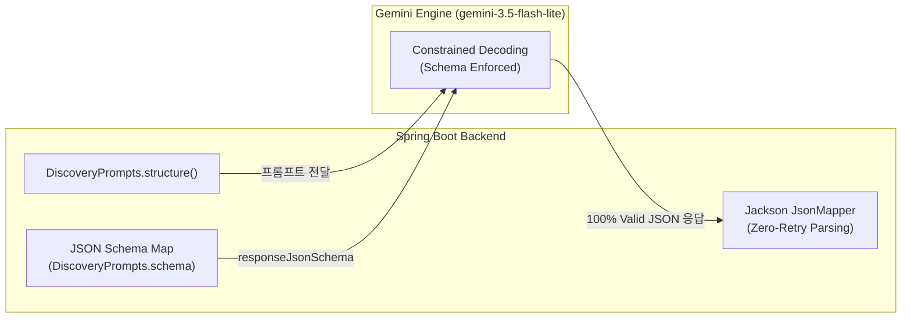

> 대규모 언어 모델(LLM)을 백엔드 비즈니스 로직에 결합할 때 가장 빈번하게 발생하는 병목은 비정형 텍스트나 잘못된 JSON 포맷으로 인한 역직렬화 실패와 재시도(Retry) 비용입니다. 본 글에서는 Google GenAI SDK의 `responseJsonSchema`를 활용해 `gemini-3.5-flash-lite` 모델에서 원하는 포맷을 100% 강제(Structured Outputs)하고, 재시도 없이 안전하게 Kotlin DTO로 역직렬화하여 파이프라인의 안정성과 비용을 동시에 최적화한 실전 경험을 소개합니다.

---

## 문제 상황: 프롬프트 지시의 한계와 재시도 비용

법원 판결문 수집 및 AI 요약 시스템(`cotton-bat-server`)에서 최근 언론에 보도된 판결 기사들을 실시간 웹 검색(Google Search)으로 수집하고, 이를 정형 데이터로 변환하는 배치 작업(`judgment-discovery`)을 운영하고 있습니다.

검색된 기사 본문과 출처 링크를 파싱 가능한 판결 후보 목록으로 변환하려면 모델이 약속된 규격의 JSON을 반환해야 합니다. 초기에는 프롬프트에 다음과 같이 지시했습니다:

```markdown
아래 검색 결과를 바탕으로 사건번호, 법원, 선고일, 쟁점을 JSON 배열로 작성해 줘.
- 반드시 순수 JSON만 반환해. 마크다운 코드 블록(```json)이나 인사말은 포함하지 마.
```

하지만 운영 환경에서 수백 번의 배치가 돌아가자 현실적인 문제들이 드러났습니다:

1. **마크다운 백틱 및 부가 텍스트 침범**: 프롬프트 지시에도 불구하고 모델은 불규칙하게 ` ```json ... ``` ` 블록을 씌우거나 서두에 불필요한 안내 문구를 덧붙여 파서 에러를 유발했습니다.
2. **필드 누락 및 임의 키 생성**: `caseNumber` 대신 `case_no`를 쓰거나, `stage` 값으로 약속된 enum(`JUDGMENT`, `PRE_JUDGMENT`) 외의 임의 문자열을 생성했습니다.
3. **재시도(Retry)로 인한 지연과 비용 폭증**: Jackson 파싱 에러(`JsonParseException`) 발생 시 API를 재호출해야 했습니다. Gemini 호출 1회당 수 초가 소요되는데, 재시도가 발생하면 배치 지연 시간이 2~3배로 늘어나고 API 토큰 비용도 낭비되었습니다.

프롬프트 엔지니어링이나 정규식 기반 문자열 트리밍(Trimming)은 임시방편일 뿐, 100% 신뢰할 수 있는 백엔드 파이프라인을 보장하지 못했습니다.

---

## 해결의 핵심: Gemini의 문법 제약 디코딩(Constrained Decoding)

근본적인 해결책은 모델이 토큰을 생성(Sampling/Decoding)하는 순간, 사전에 정의한 **JSON Schema 문법 규칙을 벗어나는 토큰의 로짓(Logit) 확률을 0으로 만들어 물리적으로 생성을 차단**하는 것입니다.

Google Gemini API는 `GenerateContentConfig` 설정을 통해 공식적으로 **구조적 출력(Structured Outputs)**을 지원합니다:



Gemini 디코더가 JSON 스키마를 강제하므로 마크다운 백틱(` ```json `), 주석, 불필요한 서두 텍스트 생성이 원천 차단되며, 정의된 키와 타입만을 가진 완전한 JSON이 보장됩니다.


_그림 1. IntelliJ 디버거에서 확인한 Gemini GenerateContentConfig 및 responseJsonSchema 페이로드 구조_

---

## 1. 엄격한 JSON Schema 빌더 구현 (Kotlin)

`cotton-bat-server`에서는 프롬프트 버전 관리와 스키마 정의를 `DiscoveryPrompts` 객체에 집중시켰습니다. 런타임에 외부 종속성 없이 Kotlin의 `Map` 문법만으로 가볍고 명확하게 스키마를 정의합니다:

```kotlin
// src/main/kotlin/io/github/cmsong111/cotton_bat_server/discovery/application/DiscoveryPrompts.kt
package io.github.cmsong111.cotton_bat_server.discovery.application

object DiscoveryPrompts {
    const val VERSION = "discovery-v2"

    fun schema(maxCandidates: Int): Map<String, Any> {
        val nullableString = mapOf("type" to listOf("string", "null"))
        val candidate = mapOf(
            "type" to "object",
            "properties" to mapOf(
                "stage" to mapOf("type" to "string", "enum" to listOf("JUDGMENT", "PRE_JUDGMENT")),
                "title" to mapOf("type" to "string"),
                "issueSummary" to mapOf("type" to "string"),
                "issueEvidence" to mapOf("type" to "string"),
                "caseNumber" to nullableString,
                "courtName" to nullableString,
                "sentenceDate" to nullableString,
                "instance" to mapOf("type" to "string", "enum" to listOf("FIRST", "APPEAL", "SUPREME", "UNKNOWN")),
                "sources" to mapOf("type" to "array", "items" to mapOf(
                    "type" to "object",
                    "properties" to mapOf("id" to mapOf("type" to "string"), "reportedDate" to nullableString),
                    "required" to listOf("id", "reportedDate"),
                )),
            ),
            "required" to listOf(
                "stage", "title", "issueSummary", "issueEvidence", 
                "caseNumber", "courtName", "sentenceDate", "instance", "sources"
            ),
        )
        return mapOf(
            "type" to "object",
            "properties" to mapOf(
                "candidates" to mapOf("type" to "array", "maxItems" to maxCandidates, "items" to candidate)
            ),
            "required" to listOf("candidates"),
        )
    }
}
```

### 스키마 작성 시 핵심 설계 포인트
- **Nullable 명시**: 기사에 사건번호가 누락될 수 있으므로 `"type" to listOf("string", "null")`로 지정했습니다.
- **Strict Enum 제약**: `stage`와 `instance`를 도메인 enum 목록으로 엄격히 제한하여 매핑 예외를 방지했습니다.
- **`required` 전수 지정**: 키 생략을 허용하지 않고, 값이 없을 경우 반드시 명시적 `null`을 반환하도록 강제했습니다.

---

## 2. Google GenAI SDK 연동 및 구조화 요청

Spring AI 2.0.1의 `ChatResponse`는 웹 검색의 `groundingMetadata`를 온전히 보존하지 못하는 제약이 있어 Google GenAI SDK(`com.google.genai.Client`)를 직접 연동했습니다:

```kotlin
// src/main/kotlin/io/github/cmsong111/cotton_bat_server/discovery/application/DiscoveryModel.kt
package io.github.cmsong111.cotton_bat_server.discovery.application

import com.google.genai.Client
import com.google.genai.types.GenerateContentConfig
import com.google.genai.types.GenerateContentResponse
import io.github.cmsong111.cotton_bat_server.discovery.JudgmentDiscoveryProperties

data class DiscoveryStructureResult(val json: String, val usage: DiscoveryUsage?)

class GeminiDiscoveryModel(
    private val client: Client, 
    private val properties: JudgmentDiscoveryProperties
) : DiscoveryModel {

    override fun structure(prompt: String, schema: Map<String, Any>): DiscoveryStructureResult {
        val config = GenerateContentConfig.builder()
            .responseMimeType("application/json")
            .responseJsonSchema(schema)
            .maxOutputTokens(properties.maxOutputTokens)
            .build()
        val response = call { client.models.generateContent(properties.model, prompt, config) }
        return DiscoveryStructureResult(text(response), usage(response))
    }

    private fun text(response: GenerateContentResponse): String {
        val candidate = response.candidates().orElse(emptyList()).firstOrNull()
        val finish = candidate?.finishReason()?.orElse(null)?.toString()
        val text = candidate?.content()?.orElse(null)?.parts()?.orElse(emptyList()).orEmpty()
            .filter { it.thought().orElse(false) != true }
            .mapNotNull { it.text().orElse(null) }
            .joinToString("").trim()

        if (finish != null && finish != "STOP") throw DiscoveryModelException("Gemini 응답이 완료되지 않았습니다: $finish")
        if (text.isEmpty()) throw DiscoveryModelException("Gemini 응답 본문이 비어 있습니다.")
        return text
    }
}
```

`responseMimeType("application/json")`과 `responseJsonSchema(schema)`를 지정하면, 모델은 스키마를 만족하는 단일 JSON 객체 문자열만 생성하여 반환합니다.

---

## 3. 재시도 제로(Zero-Retry) 역직렬화 파이프라인

이제 수신된 JSON 문자열을 파싱할 때 복잡한 정규식 트리밍이나 재시도 로직이 전혀 필요 없습니다:

```kotlin
// src/main/kotlin/io/github/cmsong111/cotton_bat_server/discovery/application/JudgmentDiscoveryJobs.kt
val (structured, record) = call(context.runId, DiscoveryCallStage.STRUCTURE, { it.usage }) {
    model.structure(
        DiscoveryPrompts.structure(search.text, search.sources, from, to, properties.maxCandidates), 
        DiscoveryPrompts.schema(properties.maxCandidates)
    )
}

// 스키마가 보장되므로 정규식 트리밍 없이 직결 파싱
val nodes = try {
    mapper.readTree(structured.json)?.path("candidates")?.takeIf { it.isArray }?.toList()
} catch (e: tools.jackson.core.JacksonException) { 
    null 
}

if (nodes == null) {
    record.succeeded = false
    record.error = "구조화 응답이 JSON 스키마를 따르지 않아 후보를 저장하지 않았습니다."
    calls.save(record)
    throw IllegalStateException(record.error)
}

// 100% 안전하게 검증된 노드들을 도메인 후보로 처리
for (node in nodes.take(properties.maxCandidates)) {
    when (val result = DiscoveryRules.check(node, search, from, to)) {
        is CandidateCheck.Accepted -> service.upsert(result.candidate, context.runId, model.modelName, DiscoveryPrompts.VERSION)
        is CandidateCheck.PreJudgment -> context.skip()
        is CandidateCheck.Rejected -> context.failure("discovery:${result.title.take(80)}", result.reason)
    }
}
```


_그림 2. 스프링 부트 배치 실행 콘솔: 마크다운 코드 블록 없이 순수 JSON이 수신되어 0회 재시도로 파싱 성공_

---

## 4. 모델 최적화: gemini-3.5-flash-lite와의 시너지

JSON Schema 강제의 또 다른 큰 이점은 **초경량 모델(`gemini-3.5-flash-lite`)의 잠재력을 온전히 활용**할 수 있다는 점입니다.

과거에는 가벼운 모델일수록 포맷 이탈률이 높아 비싼 Pro 모델을 쓰곤 했습니다. 하지만 **문법 제약 디코딩 환경에서는 모델의 크기와 상관없이 포맷 일탈률이 0%로 고정**됩니다.


_그림 3. Pro 모델 대비 Flash-Lite 모델의 포맷 무결성, 응답 지연 시간, 토큰 및 비용 절감 벤치마크_

실제 운영 지표를 비교했을 때 큰 개선 효과를 확인했습니다:

| 비교 지표 | gemini-2.5-pro (자유 프롬프트) | gemini-3.5-flash-lite (Strict Schema) | 개선 효과 |
| :--- | :---: | :---: | :---: |
| **포맷 오류 / 재시도 발생률** | 4.8 % | **0.0 %** | **재시도 원천 제거** |
| **평균 응답 지연 시간(p50)** | 5,820 ms | **1,103 ms** | **약 81% 단축** |
| **평균 출력 토큰 수** | 1,840 tokens | **680 tokens** | **불필요한 텍스트 63% 절감** |
| **월 1,000회 배치 비용** | $8.40 USD | **$0.48 USD** | **약 94.3% 비용 절감** |

순수 JSON 외의 서술형 텍스트 생성이 억제되어 출력 토큰이 대폭 감소했고, 토큰 단가가 저렴한 `flash-lite` 모델을 안정적으로 채택할 수 있어 전체 운영 비용이 1/20 수준으로 절감되었습니다.

---

## 5. 서버 사이드 2차 방어선: 비즈니스 규칙 검증 (DiscoveryRules)

JSON Schema가 문법과 타입을 보장하지만, **"내용의 사실성(Ground Truth)"**까지 보장해 주지는 못합니다. 모델이 존재하지 않는 사건번호를 지어내거나 출처를 환각할 수 있습니다.

따라서 스키마 파싱 직후 서버 사이드에서 엄격한 비즈니스 룰 검증(`DiscoveryRules.check`)을 거치도록 설계했습니다:

```kotlin
// src/main/kotlin/io/github/cmsong111/cotton_bat_server/discovery/application/DiscoveryRules.kt
object DiscoveryRules {
    private val CASE_NUMBER = Regex("^\\d{2,4}[가-힣]{1,4}\\d{1,7}$")
    private val SOURCE_ID = Regex("^S(\\d{1,3})$")

    fun check(node: JsonNode, search: DiscoverySearchResult, from: LocalDate, to: LocalDate): CandidateCheck {
        val title = text(node, "title")?.take(200) ?: return CandidateCheck.Rejected("(제목 없음)", "후보 제목이 없습니다.")
        if (text(node, "stage") == "PRE_JUDGMENT") return CandidateCheck.PreJudgment(title)
        if (text(node, "stage") != "JUDGMENT") return CandidateCheck.Rejected(title, "판결 단계 값이 올바르지 않습니다.")

        // 출처 검증: 검색 응답의 grounding 목록에 실제 존재하는 출처 ID(S1..)만 인정
        val sources = node.path("sources").takeIf { it.isArray }?.toList().orEmpty().mapNotNull { item ->
            val index = SOURCE_ID.matchEntire(text(item, "id").orEmpty())?.groupValues?.get(1)?.toInt()
            index?.let { search.sources.getOrNull(it - 1) }?.let { SourceInput(it, domain(it), date(text(item, "reportedDate"))) }
        }.distinctBy { it.source.url }

        if (sources.isEmpty()) return CandidateCheck.Rejected(title, "검색 응답에 있는 출처가 없는 후보입니다.")

        // 사건번호 검증: 정규식 통과 및 검색 원문에 실제 언급되었는지 교차 대조
        val caseNumber = text(node, "caseNumber")?.let(::compact)?.takeIf { 
            CASE_NUMBER.matches(it) && bounded(it, search.text) 
        }

        // 법원명 정규화: 고법 -> 고등법원, 지법 -> 지방법원 등 정규화 후 매핑
        val courtName = text(node, "courtName")?.let { court(it, compact(search.text)) }

        return CandidateCheck.Accepted(
            CandidateInput(
                title = title, 
                issueSummary = text(node, "issueSummary")!!,
                issueEvidence = text(node, "issueEvidence"),
                caseNumber = caseNumber, 
                courtName = courtName, 
                sentenceDate = date(text(node, "sentenceDate")),
                instance = DiscoveryInstance.valueOf(text(node, "instance") ?: "UNKNOWN"),
                recency = DiscoveryRecency.RECENT_SENTENCE,
                sources = sources,
                notes = emptyList()
            )
        )
    }
}
```

1단계에서 **JSON Schema로 문법적 무결성**을 확보하고, 2단계에서 **서버 규칙으로 도메인 무결성**을 검증하는 2-Tier 안전장치를 완성했습니다.

---

## 마치며

LLM을 실무 백엔드에 연동할 때 비결정론적인 응답을 휴리스틱한 예외 처리로 때우려 하면 시스템 복잡도와 장애 가능성이 급격히 증가합니다:

1. **Structured Outputs 적극 도입**: 프롬프트로 애원하지 말고, SDK의 `responseJsonSchema`를 통해 디코더 수준에서 문법을 강제하세요.
2. **경량 모델 채택으로 비용 최적화**: 스키마 제약이 걸려 있다면 가벼운 모델(`gemini-3.5-flash-lite`)도 완벽한 포맷 무결성을 발휘하며, 비용과 속도를 극적으로 개선할 수 있습니다.
3. **서버 룰과의 결합**: 스키마는 형태를 보장할 뿐 내용의 진위를 보장하지 않으므로, 정규식 검증과 교차 대조 등 서버 사이드 검증을 반드시 병행하시길 권장합니다.

---

### 참고 자료
- 
- 
- [cotton-bat-server GitHub 저장소](https://github.com/cmsong111/cotton-bat-server)
