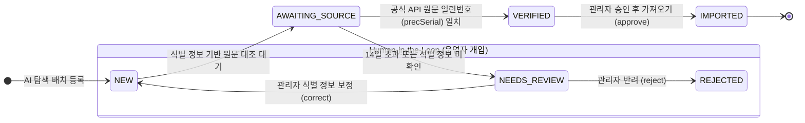

> LLM 기반 탐색 파이프라인이 수집한 미확정 후보 데이터를 운영자가 직접 검토하고, 누락되거나 왜곡된 식별 정보를 보정한 뒤 공식 수집 파이프라인으로 안전하게 편입시키는 휴먼 인 더 루프(Human-in-the-Loop, HITL) 아키텍처를 구현했습니다. 이 글에서는 외부 API 롱 트랜잭션 격리, 낙관적 락(Optimistic Lock)을 통한 배치 충돌 방지, 보정 플래그 기반의 멱등성 보호, 그리고 Spring Boot와 Thymeleaf 기반의 관리자 승인 파이프라인 설계 경험을 공유합니다.

---

## 배경: AI 자동화 파이프라인에 '사람의 개입'이 필요한 이유

최근 진행 중인 판결문 데이터 수집 및 분석 시스템(`cotton-bat-server`)에서는 최신 사회적 이슈가 된 주요 판결을 선제적으로 발굴하기 위해 **AI 탐색 배치(`judgment-discovery-job`)**를 운영하고 있습니다. Google Search 그라운딩(Grounding)과 LLM을 결합하여 당일 주요 뉴스 기사들을 분석하고, 판결 선고 보도가 나온 사건을 자동으로 추려내는 방식입니다.

하지만 실제 뉴스 보도를 기반으로 판례를 자동 수집하는 과정에는 치명적인 현실적 한계가 존재했습니다:

1. **언론 보도의 부정확성과 식별 정보 누락**: 기사에는 정확한 법원 사건번호(예: `2026고합518291`) 대신 "서울지법 형사합의부", "1심 재판부"처럼 축약된 명칭이 쓰이거나, 선고일이 "어제", "지난달 말" 등으로 모호하게 표기되는 경우가 많습니다.
2. **할루시네이션(환각) 및 데이터 오염 위험**: LLM이 기사 문맥을 바탕으로 그럴듯하게 추론해 낸 사건번호나 형량 수치를 검증 없이 정식 데이터베이스에 저장할 경우, 서비스 전체의 법적 신뢰성이 훼손됩니다.
3. **완전 자동화의 역설**: 저희 시스템의 대원칙은 **"뉴스는 발견 근거일 뿐이며, 정식 판례 데이터는 오직 국가법령정보센터의 공공 API 원문으로만 확정한다"**입니다. 하지만 사건번호가 한 글자만 틀려도 공공 API 대조에 실패하여 가치 있는 최신 판결이 영구 유실되는 문제가 발생했습니다.

```
[원칙] 뉴스는 발견 근거일 뿐이며, 판례는 공식 원문으로만 확정한다.
```

이를 해결하기 위해 AI의 역할은 '후보 발굴 및 쟁점 요약'으로 한정하고, **운영자가 관리자 콘솔에서 미확인 정보를 손쉽게 보정(Correction)하여 공식 API와 재대조한 뒤, 클릭 한 번으로 공식 수집 파이프라인에 안전하게 편입시키는 휴먼 인 더 루프(Human-in-the-Loop, HITL) 관리자 시스템**을 구축하기로 결정했습니다.


_그림 1. 완성된 관리자 판결 탐색 후보 대시보드 화면 (`/admin/judgment-discoveries`). 상태별 탭, 우선순위, 사건번호 식별 상태, 독립 출처 수가 한눈에 표시됩니다._

---

## HITL 후보 라이프사이클과 상태 머신 설계

후보 데이터는 AI의 최초 탐색부터 최종 판례 적재까지 아래와 같은 6단계 상태 머신(State Machine)을 따릅니다:



### 상태 정의 (`DiscoveryStatus`)

- **`NEW` (확인 대기)**: AI가 뉴스에서 새로 발굴했거나, 관리자가 보정한 직후의 상태입니다. 원문 대조 배치에 즉시 투입됩니다.
- **`AWAITING_SOURCE` (원문 대기)**: 판결 선고 직후 기사는 났으나, 대법원/국가법령정보센터 전산망에 판결문 전문이 등록되기까지 며칠간 시차가 발생할 때 재시도 대기하는 상태입니다.
- **`NEEDS_REVIEW` (검토 필요)**: 사건번호가 누락되었거나, 대기 기간(예: 14일)이 지나도록 원문 대조에 실패한 경우 운영자의 수동 개입을 요청하는 상태입니다.
- **`VERIFIED` (원문 확인)**: 국가법령정보센터 공식 판례 일련번호(`precSerial`)와 1:1 매칭이 완료되어, 승인 버튼만 누르면 즉시 가져올 수 있는 준비 완료 상태입니다.
- **`IMPORTED` (가져옴)**: 공식 수집 파이프라인을 거쳐 실제 `Judgment` 엔티티로 영구 저장 완료된 최종 상태입니다.
- **`REJECTED` (반려)**: 기사 확인 결과 이미 종결된 사건이거나 민형사 판결이 아닌 경우 운영자가 사유를 남기고 배제한 상태입니다.

---

## 도메인 엔티티: `JudgmentDiscovery`

후보 엔티티는 식별 정보 외에도 독립 매체 수, 우선순위 산정 근거, 모델 메타데이터, 그리고 관리자 보정 여부를 세밀하게 관리합니다.

```kotlin
// src/main/kotlin/io/github/cmsong111/cotton_bat_server/discovery/domain/JudgmentDiscovery.kt
package io.github.cmsong111.cotton_bat_server.discovery.domain

import io.github.cmsong111.cotton_bat_server.common.BaseEntity
import io.github.cmsong111.cotton_bat_server.common.BusinessException
import jakarta.persistence.*
import java.time.Instant
import java.time.LocalDate
import org.hibernate.Length
import org.hibernate.annotations.ColumnDefault

enum class DiscoveryStatus(val label: String) {
    NEW("확인 대기"),
    NEEDS_REVIEW("검토 필요"),
    AWAITING_SOURCE("원문 대기"),
    VERIFIED("원문 확인"),
    IMPORTED("가져옴"),
    REJECTED("반려"),
}

@Entity
@Table(
    name = "judgment_discoveries",
    uniqueConstraints = [UniqueConstraint(name = "uk_judgment_discovery_key", columnNames = ["dedup_key"])],
    indexes = [Index(name = "idx_judgment_discovery_status_next", columnList = "status,next_verify_at")]
)
class JudgmentDiscovery(
    @Id @GeneratedValue(strategy = GenerationType.IDENTITY)
    var id: Long = 0,
    @Column(name = "dedup_key", nullable = false) var dedupKey: String,
    @Column(nullable = false) var title: String,
    @Column(nullable = false, length = Length.LONG32) var issueSummary: String,
    @Column(length = Length.LONG32) var issueEvidence: String? = null,
    var caseNumber: String? = null,
    var courtName: String? = null,
    var sentenceDate: LocalDate? = null,
    @Enumerated(EnumType.STRING) @Column(nullable = false) var instance: DiscoveryInstance = DiscoveryInstance.UNKNOWN,
    @Enumerated(EnumType.STRING) @Column(nullable = false) var recency: DiscoveryRecency = DiscoveryRecency.UNKNOWN,
    @Enumerated(EnumType.STRING) @Column(nullable = false) var status: DiscoveryStatus = DiscoveryStatus.NEW,
    @Column(length = Length.LONG32) var statusReason: String? = null,
    @ColumnDefault("0") var priority: Int = 0,
    @Column(length = 500) var priorityReasons: String? = null,
    @ColumnDefault("0") var independentSourceCount: Int = 0,
    var precSerial: Long? = null,
    @Column(length = 100) var officialDataSourceName: String? = null,
    var judgmentId: Long? = null,
    @Column(nullable = false) var firstDiscoveredAt: Instant = Instant.now(),
    @Column(nullable = false) var lastDiscoveredAt: Instant = Instant.now(),
    @ColumnDefault("1") var discoveryCount: Int = 1,
    var lastRunId: Long? = null,
    @Column(nullable = false, length = 100) var modelName: String,
    @Column(nullable = false, length = 50) var promptVersion: String,
    @Column(name = "next_verify_at") var nextVerifyAt: Instant? = Instant.now(),
    @ColumnDefault("0") var verifyAttempts: Int = 0,
    var lastVerifiedAt: Instant? = null,
    /** 관리자가 식별 정보를 보정한 후보는 재발견 시 AI 추출값으로 덮어쓰지 않습니다. */
    @ColumnDefault("false") var corrected: Boolean = false,
    @ElementCollection
    @CollectionTable(name = "judgment_discovery_sources", joinColumns = [JoinColumn(name = "discovery_id")])
    @OrderColumn(name = "position")
    val sources: MutableList<DiscoverySource> = mutableListOf(),
) : BaseEntity() {

    val identified: Boolean get() = caseNumber != null && courtName != null && sentenceDate != null
    val open: Boolean get() = status in setOf(DiscoveryStatus.NEW, DiscoveryStatus.NEEDS_REVIEW, DiscoveryStatus.AWAITING_SOURCE)

    /** 운영자의 보정: 식별 정보를 수정한 뒤 기존 공식 매칭을 초기화하고 즉시 재확인 큐로 진입합니다. */
    fun correct(
        title: String,
        caseNumber: String?,
        courtName: String?,
        sentenceDate: LocalDate?,
        instance: DiscoveryInstance,
        recency: DiscoveryRecency
    ) {
        if (status == DiscoveryStatus.IMPORTED) throw BusinessException(DiscoveryErrorCode.ALREADY_IMPORTED)
        this.title = title
        this.caseNumber = caseNumber
        this.courtName = courtName
        this.sentenceDate = sentenceDate
        this.instance = instance
        this.recency = recency
        this.corrected = true
        requestVerification()
    }

    fun requestVerification(now: Instant = Instant.now()) {
        if (status == DiscoveryStatus.IMPORTED) throw BusinessException(DiscoveryErrorCode.ALREADY_IMPORTED)
        status = DiscoveryStatus.NEW
        statusReason = null
        precSerial = null
        officialDataSourceName = null
        judgmentId = null
        nextVerifyAt = now
    }
}
```

> `corrected = true` 플래그는 HITL 아키텍처의 핵심 안전장치입니다. 백그라운드 탐색 배치가 다음 날 동일 사건의 후속 기사를 읽고 `upsert`를 시도하더라도, 관리자가 이미 정확하게 보정해 둔 사건번호와 법원명을 AI의 불완전한 파싱 값으로 다시 덮어쓰지 못하도록 영구 방어합니다.
{: .prompt-info }

---

## 트랜잭션 격리와 동시성 제어: `AdminDiscoveryService`

관리자 작업(`reverify`, `approve`)을 구현할 때 가장 주의해야 할 점은 **외부 공공 API 호출의 네트워크 지연**입니다. 국가법령정보센터 API가 응답하는 데 1~3초가 걸릴 수 있는데, 이를 스프링의 `@Transactional` 범위 안에 묶어두면 DB 커넥션 풀(HikariCP)이 불필요하게 장시간 점유되어 서비스 전체의 가용성이 떨어집니다.

따라서 서비스 레이어에서는 **외부 통신을 트랜잭션 밖에서 수행하고, DB 변경만 짧은 트랜잭션으로 커밋하는 구조**를 채택했습니다.

```kotlin
// src/main/kotlin/io/github/cmsong111/cotton_bat_server/admin/application/AdminDiscoveryService.kt
package io.github.cmsong111.cotton_bat_server.admin.application

import io.github.cmsong111.cotton_bat_server.admin.dto.AdminDiscoveryDetail
import io.github.cmsong111.cotton_bat_server.admin.dto.AdminDiscoveryForm
import io.github.cmsong111.cotton_bat_server.admin.dto.AdminDiscoveryRow
import io.github.cmsong111.cotton_bat_server.common.BusinessException
import io.github.cmsong111.cotton_bat_server.discovery.application.DiscoveryVerifier
import io.github.cmsong111.cotton_bat_server.discovery.application.JudgmentDiscoveryService
import io.github.cmsong111.cotton_bat_server.discovery.domain.DiscoveryStatus
import io.github.cmsong111.cotton_bat_server.discovery.domain.JudgmentDiscoveryRepository
import io.github.cmsong111.cotton_bat_server.judgment.application.LawPrecedentClient
import org.springframework.data.domain.Page
import org.springframework.data.domain.Pageable
import org.springframework.data.repository.findByIdOrNull
import org.springframework.stereotype.Service
import org.springframework.transaction.annotation.Transactional

@Service
class AdminDiscoveryService(
    private val discoveries: JudgmentDiscoveryRepository,
    private val service: JudgmentDiscoveryService,
    private val verifier: DiscoveryVerifier,
    private val client: LawPrecedentClient,
    private val audits: AdminAuditService,
) {
    @Transactional(readOnly = true)
    fun page(status: DiscoveryStatus?, q: String?, pageable: Pageable): Page<AdminDiscoveryRow> =
        discoveries.search(status, q.orEmpty(), pageable).map(AdminDiscoveryRow::from)

    @Transactional(readOnly = true)
    fun detail(id: Long): AdminDiscoveryDetail {
        val d = find(id)
        return AdminDiscoveryDetail(
            row = AdminDiscoveryRow.from(d),
            issueSummary = d.issueSummary,
            issueEvidence = d.issueEvidence,
            precSerial = d.precSerial,
            judgmentId = d.judgmentId,
            firstDiscoveredAt = d.firstDiscoveredAt,
            modelName = d.modelName,
            promptVersion = d.promptVersion,
            verifyAttempts = d.verifyAttempts,
            nextVerifyAt = d.nextVerifyAt,
            lastVerifiedAt = d.lastVerifiedAt,
            corrected = d.corrected,
            sources = d.sources.map { AdminDiscoverySourceRow(it.url, it.domain, it.title, it.reportedDate, it.observedAt) },
            version = d.version,
            audit = audits.of(d)
        )
    }

    /** 1. 식별 정보 보정: 낙관적 락 버전 검증 및 비즈니스 룰 적용 */
    fun correct(id: Long, form: AdminDiscoveryForm) =
        service.correct(
            id = id,
            version = form.version,
            title = form.title.trim(),
            caseNumber = form.caseNumber.trim().ifEmpty { null },
            courtName = form.courtName.trim().ifEmpty { null },
            sentenceDate = form.sentenceDate,
            instance = form.instance
        )

    /** 2. 즉시 공식 목록과 대조: 외부 조회를 트랜잭션 밖에서 수행 */
    fun reverify(id: Long): DiscoveryStatus {
        val target = service.target(id)
        // [외부 API] 국가법령정보센터 목록 검색 (트랜잭션 외부)
        val outcome = verifier.verify(target)
        // [DB 트랜잭션] 판정 결과 반영
        service.applyVerification(id, outcome, reopen = true, expected = target)
        return find(id).status
    }

    /** 3. 승인 후 가져오기: 외부 본문 수신 후 공식 수집 파이프라인 호출 */
    fun approve(id: Long): String? {
        val target = service.importTarget(id)
        if (target.judgmentId != null) {
            // 이미 수집된 판례라면 외래키 연결만 기록
            service.link(id, target.precSerial)
            return null
        }
        // [외부 API] 국가법령정보센터 상세 본문 호출 (트랜잭션 외부)
        val detail = client.detail(target.precSerial)
        // [DB 트랜잭션] 공식 수집 파이프라인(원문 보존 -> 구조화 -> 판례 생성)으로 안전하게 적재
        return service.importRaw(id, target.precSerial, detail.rawJson)
    }

    private fun find(id: Long) =
        discoveries.findByIdOrNull(id) ?: throw BusinessException(DiscoveryErrorCode.NOT_FOUND)
}
```

### 낙관적 락(Optimistic Lock)을 통한 배치 레이스 컨디션 차단

관리자가 화면에서 보정 폼을 열어놓고 기사 본문을 찾아 사건번호를 입력하는 동안, 백그라운드 탐색 배치가 동일 후보에 새 기사 링크를 추가하거나 원문 대조 배치가 상태를 변경할 수 있습니다. 

이를 방어하기 위해 `BaseEntity`의 `@Version` 컬럼을 폼의 히든 필드(`form.version`)로 넘기고, 서비스의 `correct` 메서드에서 버전 일치 여부를 검증합니다:

```kotlin
// JudgmentDiscoveryService.kt
@Transactional
fun correct(id: Long, version: Long, title: String, caseNumber: String?, ...) {
    val discovery = find(id)
    if (discovery.version != version) {
        throw ObjectOptimisticLockingFailureException(JudgmentDiscovery::class.java, id)
    }
    // ...
}
```

만약 버전이 충돌하면 `OptimisticLockingFailureException`을 포착하여 `"다른 관리자나 백그라운드 작업이 후보를 먼저 변경했습니다. 새로고침해 주세요."`라는 안전한 피드백을 전달합니다.

---

## 관리자 컨트롤러 및 보정 UI 구현

Spring MVC 컨트롤러는 보정, 반려, 원문 재확인, 승인의 4가지 라이프사이클 액션을 매핑하고, 사용자 친화적인 Flash 메시지를 처리합니다.

```kotlin
// src/main/kotlin/io/github/cmsong111/cotton_bat_server/admin/presentation/AdminDiscoveryController.kt
package io.github.cmsong111.cotton_bat_server.admin.presentation

import io.github.cmsong111.cotton_bat_server.admin.application.AdminDiscoveryService
import io.github.cmsong111.cotton_bat_server.admin.dto.AdminDiscoveryForm
import io.github.cmsong111.cotton_bat_server.admin.dto.AdminDiscoveryRejectForm
import io.github.cmsong111.cotton_bat_server.common.BusinessException
import jakarta.validation.Valid
import org.springframework.dao.OptimisticLockingFailureException
import org.springframework.stereotype.Controller
import org.springframework.ui.Model
import org.springframework.validation.BindingResult
import org.springframework.web.bind.annotation.*
import org.springframework.web.servlet.mvc.support.RedirectAttributes

@Controller
@RequestMapping("/admin/judgment-discoveries")
class AdminDiscoveryController(private val discoveries: AdminDiscoveryService) {

    @GetMapping("/{id}")
    fun detail(@PathVariable id: Long, model: Model): String {
        if (!model.containsAttribute("form")) model.addAttribute("form", discoveries.form(id))
        if (!model.containsAttribute("rejectForm")) model.addAttribute("rejectForm", AdminDiscoveryRejectForm())
        model.addAttribute("detail", discoveries.detail(id))
        return "admin/judgment-discovery-detail"
    }

    @PostMapping("/{id}")
    fun correct(
        @PathVariable id: Long,
        @Valid @ModelAttribute("form") form: AdminDiscoveryForm,
        binding: BindingResult,
        model: Model,
        redirect: RedirectAttributes
    ): String {
        if (!binding.hasErrors()) {
            try {
                discoveries.correct(id, form)
                redirect.addFlashAttribute("message", "식별 정보를 보정했습니다. 공식 원문과 즉시 재대조합니다.")
                return "redirect:/admin/judgment-discoveries/$id"
            } catch (e: BusinessException) {
                binding.reject(e.errorCode.code, e.errorCode.message)
            } catch (e: OptimisticLockingFailureException) {
                binding.reject("version", "다른 관리자나 백그라운드 작업이 후보를 먼저 변경했습니다. 새로고침해 주세요.")
            }
        }
        return detail(id, model)
    }

    @PostMapping("/{id}/approve")
    fun approve(@PathVariable id: Long, redirect: RedirectAttributes): String = operation(id, redirect) {
        discoveries.approve(id)?.let { throw ImportHeld(it) }
        "공식 원문을 판례로 성공적으로 가져왔습니다."
    }

    @PostMapping("/{id}/reverify")
    fun reverify(@PathVariable id: Long, redirect: RedirectAttributes): String = operation(id, redirect) {
        "공식 원문과 다시 대조했습니다: ${discoveries.reverify(id).label}"
    }

    private fun operation(id: Long, redirect: RedirectAttributes, action: () -> String): String {
        try {
            redirect.addFlashAttribute("message", action())
        } catch (e: BusinessException) {
            redirect.addFlashAttribute("error", e.errorCode.message)
        } catch (e: ImportHeld) {
            redirect.addFlashAttribute("error", "원문은 보존했지만 판례 적용을 보류했습니다: ${e.message}")
        } catch (e: OptimisticLockingFailureException) {
            redirect.addFlashAttribute("error", "다른 작업이 후보를 먼저 변경했습니다. 다시 시도해 주세요.")
        }
        return "redirect:/admin/judgment-discoveries/$id"
    }

    private class ImportHeld(message: String) : RuntimeException(message)
}
```


_그림 2. 탐색 후보 상세 및 식별 정보 보정 폼 (`/admin/judgment-discoveries/103`). 좌측에는 AI 모델의 요약 쟁점과 출처가 표시되며, 우측에서 누락된 사건번호(`2026구합4812`)를 입력하고 즉시 재대조를 실행할 수 있습니다._

---

## 공식 수집 파이프라인의 재사용과 승인 편입

새로운 데이터 소스가 추가되었다고 해서 '판례 생성' 로직을 새롭게 작성하는 것은 대표적인 안티패턴입니다. 기사에서 온 후보든, 기존 정기 크롤러에서 온 판례든 시스템 내의 모든 판례는 동일한 무결성 검증을 거쳐야 합니다.

따라서 저희는 기존에 운영되던 `JudgmentImportService.collect()` 파이프라인을 그대로 재사용했습니다:

```kotlin
// JudgmentDiscoveryService.kt
@Transactional
fun importRaw(id: Long, precSerial: Long, rawJson: String): String? {
    val discovery = verifiedFor(id, precSerial)
    
    // 공식 목록 검색 시점의 메타데이터와 대조 정보 생성
    val listing = JudgmentListing(
        precSerial = precSerial,
        caseNumber = discovery.caseNumber,
        courtName = discovery.courtName,
        sentenceDate = discovery.sentenceDate?.format(DateTimeFormatter.ofPattern("yyyy.MM.dd"))
    )

    // 기존 공식 수집 파이프라인 위임 (원문 보존 -> 본문 구조화/파싱 -> Judgment 엔티티 저장)
    val result = importer.collect(
        precSerial = precSerial,
        rawJson = rawJson,
        listing = listing,
        dataSourceName = discovery.officialDataSourceName
    )

    // 구조화 파싱 실패 시에도 원문은 남겨두고 관리자 재검토로 전환
    if (result.error != null || result.judgmentId == null) {
        discovery.needsReview("가져오기 보류: ${result.error}. 수집 원문 화면에서 사유를 확인해 주세요.")
        return result.error
    }

    // 최종 가져오기 완료 및 연계 판례 ID 연결
    discovery.imported(result.judgmentId)
    return null
}
```

### 안전망: 구조화 보류 시의 Fallback 처리

만약 공공 API의 본문 포맷이 예외적이어서 주문, 이유, 판시사항 등의 파싱이 실패하더라도 수집을 통째로 롤백하지 않습니다. **공식 원문(Raw JSON)은 데이터베이스에 안전하게 보존**하고, 후보 상태를 `NEEDS_REVIEW`로 전환하여 운영자가 판례 편집기에서 수동 구조화를 진행할 수 있도록 설계했습니다.


_그림 3. 관리자 승인 후 공식 수집 파이프라인 편입 완료 화면. 공식 일련번호(249811)와 정식 판례 ID(#2841)가 연결되었으며, 우측 감사 로그에 전체 트랜지션 이력이 투명하게 기록됩니다._

---

## 마치며: 프로덕션 AI 파이프라인의 핵심은 '통제권'

LLM과 웹 검색 그라운딩을 활용한 데이터 수집은 기존 키워드 크롤러가 찾지 못하던 가치 있는 최신 정보를 놀라운 속도로 발굴해 줍니다. 

하지만 엔터프라이즈 환경이나 데이터 신뢰성이 생명인 도메인에서 **"AI가 가져왔으니 알아서 DB에 넣겠지"**라는 접근은 반드시 장애나 데이터 오염으로 이어집니다.

이번 휴먼 인 더 루프(HITL) 관리자 시스템을 구축하면서 얻은 핵심 교훈은 다음과 같습니다:

1. **AI는 발굴(Discovery)에 집중하고, 확정(Verification)은 공식 시스템에 맡긴다**: 뉴스는 단지 '이런 판결이 선고되었다'는 알림일 뿐, 데이터베이스의 원천은 신뢰할 수 있는 공식 기관 API여야 합니다.
2. **사람의 개입 지점은 극도로 간결해야 한다**: 식별 정보의 일치 여부 판정, 원문 재대조, 수집 승인까지 전 과정을 버튼 클릭 몇 번으로 끝낼 수 있어야 운영 부하가 생기지 않습니다.
3. **낙관적 락과 트랜잭션 분리는 필수적이다**: 백그라운드 AI 배치와 사람의 웹 인터랙션이 교차하는 지점에서는 데이터 충돌 방지와 DB 커넥션 풀 보호가 시스템의 안정성을 좌우합니다.

AI의 강력한 탐색 능력과 사람의 정교한 검증이 결합된 아키텍처를 고민하시는 분들께 도움이 되기를 바랍니다.
