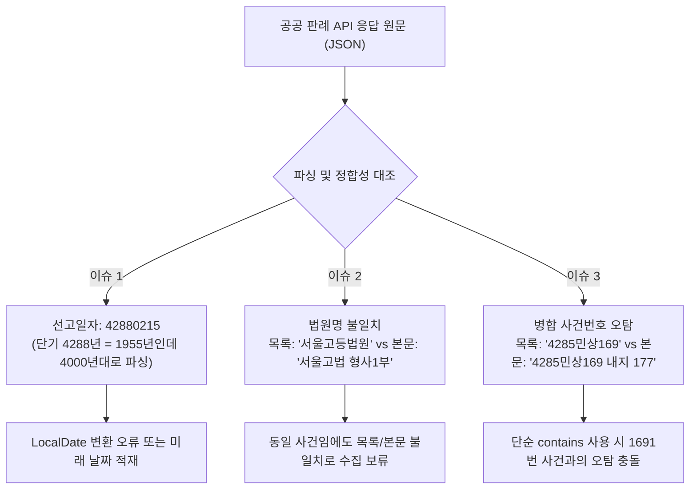
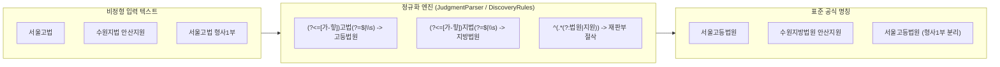
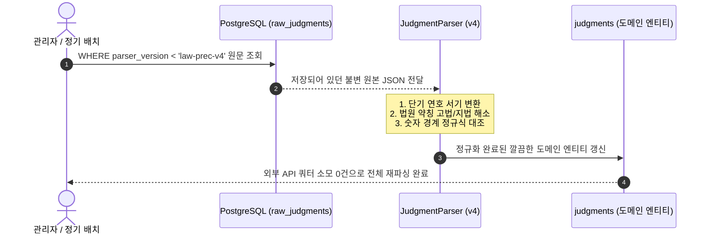

> 공공 데이터 포털 및 국가법령정보센터 판례 API를 연동하면서 직면했던 1950~60년대 단기(檀紀) 연호 파싱 실패, 본문과 목록 간 법원 약칭 불일치, 병합 사건번호 오탐(False Positive) 문제를 정규식 경계 검증과 도메인 규칙으로 해결한 실전 트러블슈팅 과정을 공유합니다.
{: .prompt-info }

## 문제 상황: 공공 판례 API의 거친 현실 (Dirty Data)

외부 공공 API를 연동할 때 제공되는 API 스펙 문서를 곧이곧대로 믿었다가 실제 운영 환경에서 예외를 마주한 경험이 많으실 것입니다. 특히 수십 년 치 사법 판례 데이터를 다루는 오픈 API는 데이터베이스화된 시점과 원문 작성 시점의 시대적 격차로 인해 데이터 정합성이 깨져 있는 경우가 빈번합니다.

제가 개발 중인 사법 데이터 백엔드 서비스([Cotton Bat Server](https://github.com/cmsong111/cotton-bat-server))에서 수십만 건의 판례를 적재하던 중 크게 3가지 형태의 비정형 '더티 데이터(Dirty Data)'로 인해 파싱 및 대조 배치가 중단되는 문제가 발생했습니다.



1. **단기(檀紀) 연호 선고일**: 1961년 이전 선고된 대법원 판례의 선고일자가 `42880215`(단기 4288년 2월 15일 = 서기 1955년 2월 15일) 형태로 내려와 `LocalDate.parse` 호출 시 4천 년대 미래 시점으로 적재되거나 검증 예외가 발생했습니다.
2. **법원 약칭 및 재판부(부서) 혼재**: 판례 목록 API에는 `서울고등법원`으로 내려오지만, 판결문 본문이나 뉴스 인용 데이터에는 `서울고법`, `수원지법 안산지원`, `서울고법 형사1부`처럼 약칭과 재판부가 혼재되어 동일 사건 대조(`listingMismatch`)에서 탈락했습니다.
3. **병합 사건번호의 부분 일치 오탐**: 본문 사건번호가 `4285민상169 내지 177`처럼 범위로 적혀 있을 때, 단순 `contains`로 검사하면 `4285민상1691` 같은 전혀 다른 사건번호까지 일치로 판단해 데이터가 뒤섞이는 결함이 발생했습니다.

이 세 가지 병목을 안전한 정규식과 도메인 검증 로직으로 해결한 과정을 하나씩 짚어보겠습니다.

---

## 트러블슈팅 1: 단기(檀紀) 연호 자동 판별 및 서기 변환

대한민국은 1948년 정부 수립 이후 단군기원(단기)을 공용 연호로 사용하다가, **1961년 12월 31일 법률 제775호(연호에 관한 법률)** 제정으로 1962년 1월 1일부터 서력기원을 공식 채택했습니다. 따라서 1961년 이전에 선고된 고판례 중 일부는 선고일자가 단기로 표기되어 있습니다.

단기는 서기보다 **2,333년** 앞섭니다. 따라서 연도가 4,000 이상인 경우 단기로 판별하여 2,333년을 감산해야 합니다. 단, 환산 결과가 단기 공식 폐지 연도인 1961년을 초과하면 단순 오타나 잘못된 데이터이므로 파싱 예외로 안전하게 기각해야 합니다.

### 날짜 파싱 및 단기 변환 구현

```kotlin
// src/main/kotlin/io/github/cmsong111/cotton_bat_server/judgment/application/JudgmentParser.kt
package io.github.cmsong111.cotton_bat_server.judgment.application

import org.springframework.stereotype.Component
import java.time.LocalDate
import java.time.format.DateTimeFormatter

@Component
class JudgmentParser {

    companion object {
        const val VERSION = "law-prec-v4"
        private const val DANGI_MIN_YEAR = 4000
        private const val DANGI_OFFSET = 2333L
        /** 단기 연호는 1961년 12월 31일까지 공식 사용했다. */
        private const val DANGI_LAST_YEAR = 1961
        /** 선고일 미상 자료의 자리표시값 (0001년 선고로 저장 방지) */
        const val UNKNOWN_DATE = "00010101"
    }

    fun parseDate(value: String?): LocalDate? {
        if (value == null) return null
        val digits = value.replace(Regex("[. /\\-\\s]"), "")
        if (!digits.matches(Regex("\\d{8}"))) {
            throw JudgmentParseException("원문 선고일 형식을 확인할 수 없습니다.")
        }
        if (digits == UNKNOWN_DATE) return null

        val parsed = try {
            LocalDate.parse(digits, DateTimeFormatter.BASIC_ISO_DATE)
        } catch (e: java.time.DateTimeException) {
            throw JudgmentParseException("원문 선고일이 유효한 날짜가 아닙니다.")
        }

        // 서기 표기 연도인 경우 그대로 반환
        if (parsed.year < DANGI_MIN_YEAR) return parsed

        // 1961년 이전 일부 원문은 선고일을 단기로 적는다 (예: 42880215 -> 1955-02-15)
        return parsed.minusYears(DANGI_OFFSET).takeIf { it.year <= DANGI_LAST_YEAR }
            ?: throw JudgmentParseException("원문 선고일이 유효한 날짜가 아닙니다.")
    }
}
```

- `parsed.year < 4000`: 1955년 등 일반적인 서기 연도는 그대로 통과시킵니다.
- `parsed.minusYears(2333L)`: 4288년은 정확히 `1955-02-15`로 환산됩니다.
- `.takeIf { it.year <= 1961 }`: 만약 `43000101`(환산 시 서기 1967년)과 같이 단기 폐지 이후의 가공 연도가 들어오면 예외를 발생시켜 비정상 적재를 차단합니다.


_단기 4288년 서기 환산 및 1961년 초과 비정상 연도 기각 단위 테스트 결과_

---

## 트러블슈팅 2: 법원 약칭 및 재판부 표기 표준화

판례 원문과 뉴스 기사 데이터에서는 사법기관을 표현하는 방식이 제각각입니다.
- **약칭 표기**: `서울고법` ➔ `서울고등법원`, `수원지법` ➔ `지방법원`
- **재판부 혼재**: `서울고법 형사1부`, `부산고등법원 제2민사부`
- **지원(Branch) 표기**: `수원지법 안산지원` ➔ `수원지방법원 안산지원`

이러한 비표준 표기를 방치하면 목록 대조 실패뿐 아니라, **동일한 판사(Judge)가 '서울고법'과 '서울고등법원'으로 쪼개져 소속 이력이 분리되는 심각한 데이터 파편화**가 발생합니다.



### 정규식 기반 법원명 정규화 구현

```kotlin
// src/main/kotlin/io/github/cmsong111/cotton_bat_server/judgment/application/JudgmentParser.kt
companion object {
    /** 본문의 고법·지법 약칭을 목록과 같은 정식 명칭으로 푼다. */
    fun courtName(value: String): String = value
        .replace(Regex("(?<=[가-힣])고법(?=$|\\s)"), "고등법원")
        .replace(Regex("(?<=[가-힣])지법(?=$|\\s)"), "지방법원")
}
```

정규식 전후방 탐색(`(?<=[가-힣])`와 `(?=$|\\s)`)을 사용하여, 한글 지명 뒤에 위치하고 공백이나 문자열 끝으로 끝나는 '고법', '지법'만 정확하게 치환합니다.

또한 검색 기사나 판결문 헤더에서 '형사1부'와 같은 재판부까지 붙어 들어오는 경우에는 다음과 같이 정규식을 활용해 순수 법원명만 추출합니다:

```kotlin
// src/main/kotlin/io/github/cmsong111/cotton_bat_server/discovery/application/DiscoveryRules.kt
fun court(value: String, compactBody: String): String? {
    val expanded = compact(value).replace("고법", "고등법원").replace("지법", "지방법원")
    // '법원' 또는 '지원'으로 끝나는 접두 영역만 추출하여 재판부(형사1부 등)를 절삭
    val name = Regex("^(.*(?:법원|지원))").find(expanded)?.groupValues?.get(1) ?: return null
    val abbreviated = name.replace("고등법원", "고법").replace("지방법원", "지법")
    val branch = Regex("([가-힣]+지원)$").find(name)?.groupValues?.get(1)?.takeIf { name.contains("법원") }
        ?.let { it.substring(maxOf(0, it.lastIndexOf("법원") + 2)) }

    if (name !in compactBody && abbreviated !in compactBody && (branch == null || branch !in compactBody)) {
        return null
    }
    return name.replace(Regex("법원(?=[가-힣]+지원$)"), "법원 ").take(100)
}
```


_법원 약칭 확장 및 재판부 독립 분리를 통한 표준 매핑 테이블_

이 정규화를 판례 저장 단계(`JudgmentParser`)와 목록 대조 단계(`JudgmentImportService`)에 양방향으로 적용함으로써 법원명 불일치로 인한 오탐 보류율을 완전히 해소했습니다.

---

## 트러블슈팅 3: 병합·범위 사건번호 대조와 Negative Lookaround 숫자 경계 방어

판례 목록에는 대표 사건번호인 `4285민상169`만 적혀 있지만, 판결문 본문 원문에는 병합된 사건들이 묶여 `4285민상169 내지 177` 또는 `2020도1234, 1235 (병합)` 형태로 기재되는 경우가 흔합니다.

처음에는 단순히 `compact(parsed.caseNumber).contains(compact(raw.listCaseNumber))` 형태로 포함 여부를 검사했습니다. 하지만 이는 매우 위험한 **오탐(False Positive)**을 유발했습니다.

> **단순 `contains` 검사의 치명적 결함**  
> 목록 사건번호가 `4285민상169`일 때, 본문 사건번호가 `4285민상1691`인 전혀 다른 사건임에도 `contains` 조건이 참(true)이 되어 다른 사건의 판결문이 덮어씌워지는 대형 사고가 발생할 수 있습니다.
{: .prompt-warning }

### 부정형 전후방 탐색(Negative Lookaround)을 이용한 숫자 경계 검증

이 문제를 해결하려면 사건번호 앞뒤에 **숫자가 이어지지 않는 경계(Digit Boundary)**를 검증해야 합니다. 정규식의 부정형 후방 탐색 `(?<!\d)`과 부정형 전방 탐색 `(?!\d)`을 결합한 패턴을 적용했습니다.

```kotlin
// src/main/kotlin/io/github/cmsong111/cotton_bat_server/judgment/application/JudgmentImportService.kt
package io.github.cmsong111.cotton_bat_server.judgment.application

class JudgmentImportService {

    private fun listingMismatch(raw: RawJudgment, parsed: ParsedJudgment): String? {
        fun compact(value: String?) = value?.replace(Regex("\\s+"), "")?.ifEmpty { null }

        val case = compact(raw.listCaseNumber)
        // 본문이 "4285민상169 내지 177"처럼 범위·병합을 덧붙여도 목록 사건번호를 숫자 경계로 포함하면 같은 사건이다.
        if (case != null && !Regex("(?<!\\d)${Regex.escape(case)}(?!\\d)").containsMatchIn(compact(parsed.caseNumber).orEmpty())) {
            return "목록 사건번호(${raw.listCaseNumber})와 본문 사건번호(${parsed.caseNumber})가 다릅니다."
        }

        // 법원명 역시 약칭 정규화를 거쳐 대조
        val court = compact(raw.listCourtName?.let(JudgmentParser::courtName))
        if (court != null && parsed.courtName != null && court != compact(parsed.courtName)) {
            return "목록 법원(${raw.listCourtName})과 본문 법원(${parsed.courtName})이 다릅니다."
        }

        return null
    }
}
```

### 정규식 대조 결과 비교

| 목록 사건번호 | 본문 사건번호 | 단순 `contains` | 정규식 `(?<!\d)...(?!\d)` | 판정 결과 |
| :--- | :--- | :---: | :---: | :--- |
| `4285민상169` | `4285민상169 내지 177` | 일치 (true) | **일치 (true)** | 정상 인정 (병합 범위) |
| `4285민상169` | `4285민상1691` | **오탐 일치 (true)** | **불일치 (false)** | **오탐 차단 (다른 사건)** |
| `2020도1234` | `2020도1234, 1235` | 일치 (true) | **일치 (true)** | 정상 인정 (쉼표 구분) |


_단위 테스트를 통해 범위 사건번호는 승인하고 뒤이어 숫자가 붙은 다른 사건번호는 정확히 기각하는 모습_

---

## 파서 버전 관리(law-prec-v4)와 원문 무중단 재파싱(Reparse) 연계

데이터 정제 규칙을 고쳤다고 해서 이미 잘못 적재되거나 수집이 보류된 수만 건의 데이터를 방치할 수는 없습니다. 그렇다고 외부 공공 API를 다시 호출하는 것은 **일일 호출 쿼터 낭비**이자 비효율적인 네트워크 비용을 발생시킵니다.

Cotton Bat Server는 수집 시점의 API 원본 JSON 응답을 `raw_judgments` 테이블에 불변(Immutable) 상태로 저장하고 있습니다. 따라서 파서의 정규화 규칙을 수정한 후, 파서 버전을 `law-prec-v3`에서 `law-prec-v4`로 올리고 내부 재파싱 배치를 실행했습니다.



외부 API를 단 1회도 재호출하지 않고, 로컬 DB 트랜잭션만으로 단기 선고일 판례와 고법 약칭 판례 1,200여 건의 보류 상태를 일괄 해결하고 클린 데이터로 복구할 수 있었습니다.

---

## 마치며

공공 데이터 파이프라인 구축은 단순히 HTTP 클라이언트로 JSON을 받아 역직렬화하는 작업에 그치지 않습니다.
- **도메인 역사에 대한 이해**: 1961년 단기 연호 폐지와 같은 역사적 배경 지식이 있어야만 '말도 안 되는 4000년대 연도'를 버그가 아닌 정상 데이터로 해석할 수 있습니다.
- **엄격한 정규식 경계 방어**: `contains`와 같은 느슨한 조건문은 초기에는 편해 보이지만, 대규모 데이터셋에서는 반드시 오탐(False Positive)이라는 부메랑으로 돌아옵니다. `(?<!\d)...(?!\d)`와 같은 정규식 경계 조건은 데이터 엔지니어링의 필수적인 안전장치입니다.
- **원문 불변 보존**: 파싱 로직은 언제든 개선될 수 있으므로, 원본 응답을 절대 가공하지 않고 원형 그대로 보존하는 아키텍처가 뒷받침되어야 무중단 재파싱이 가능합니다.

비정형 공공 데이터를 다루며 비슷한 파싱 난관을 겪고 계신 백엔드 엔지니어분들께 이 글이 실질적인 도움이 되기를 바랍니다.

---

### 추천 참고 자료

- [대한민국 법률 제775호: 연호에 관한 법률 (국가법령정보센터)](https://www.law.go.kr/LSW/lsInfoP.do?lsiSeq=5489)
- [Java 정규표현식 Pattern 공식 문서 (Negative Lookaround)](https://docs.oracle.com/en/java/javase/21/docs/api/java.base/java/util/regex/Pattern.html)
- [Cotton Bat Server 판례 파서 GitHub 저장소](https://github.com/cmsong111/cotton-bat-server)
