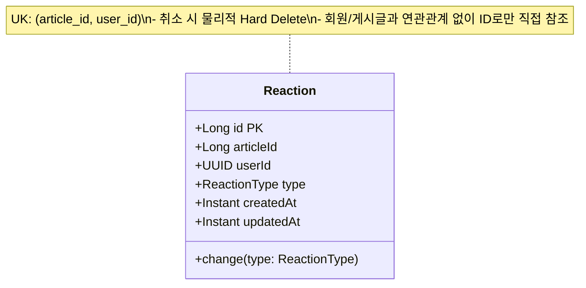
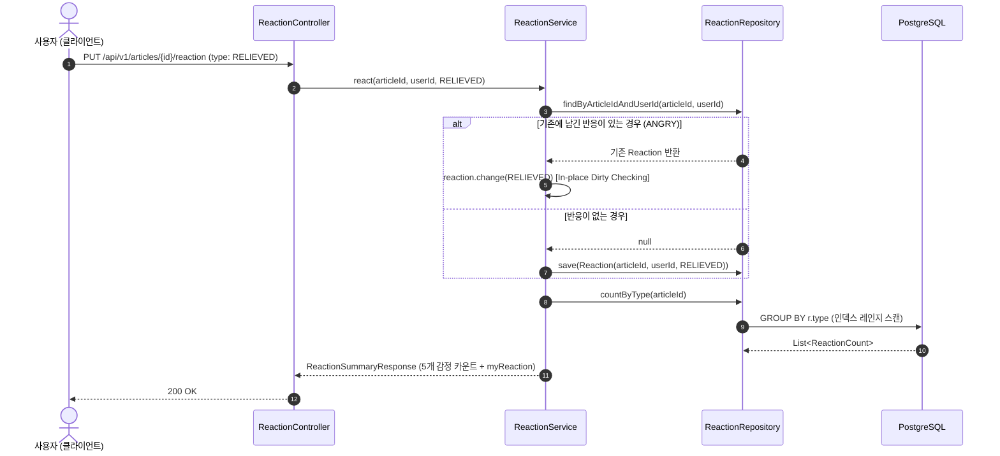

> 커뮤니티 게시글의 반응(Reaction)은 단순한 단일 '좋아요' 카운터를 넘어, 화나요·시원해요·슬퍼요 등 다양한 감정 표현과 1인 1선택/토글/변경 정책을 요구하는 경우가 많습니다. 본 글에서는 회원당 1개의 반응만 유지되도록 데이터베이스 레벨에서 원자적 무결성을 보장하고, 변경 및 취소 시 유니크 제약 충돌을 피하기 위해 하드 삭제를 채택한 이유와, 회원 탈퇴 시에도 집계 통계를 안전하게 보존하는 느슨한 ID 참조 설계 및 피드 목록의 N+1 쿼리를 차단하는 일괄 GROUP BY 최적화 기법을 실제 코드와 함께 소개합니다.
{: .prompt-info }

---

## 문제 상황: 단순 '좋아요' 카운터의 한계와 5가지 멀티 감정 반응

초기 커뮤니티 시스템이나 블로그 서비스에서는 게시글 엔티티(`articles`) 테이블에 `like_count BIGINT DEFAULT 0` 컬럼을 두고, 사용자가 좋아요 버튼을 누를 때마다 카운트를 1씩 증가시키는 방식을 흔히 사용합니다.

```sql
-- 흔히 도입되는 단순 카운터 방식의 한계
UPDATE articles SET like_count = like_count + 1 WHERE id = :articleId;
```

하지만 서비스가 고도화되고 판결 비평이나 법률 토론 커뮤니티처럼 독자의 세분화된 감정(화나요, 시원해요, 슬퍼요, 놀라워요, 공감해요)을 수집해야 하는 요구사항이 들어오면 기존 방식은 즉시 한계에 봉착합니다.

1. **상호작용의 주체 추적 불가**: 특정 사용자가 해당 게시글에 어떤 감정을 표현했는지, 혹은 이미 반응을 남겼는지 알 수 없어 중복 클릭 어뷰징을 원천 차단할 수 없습니다.
2. **감정 변경 및 토글(취소) 불가**: 사용자가 처음에 '화나요'를 눌렀다가 글을 다시 읽고 '공감해요'로 감정을 바꾸고 싶을 때, 기존 감정을 -1 하고 새 감정을 +1 해주는 처리가 불가능합니다.
3. **1인 1선택 제약 위반**: 사용자가 5가지 버튼을 모두 눌러 모든 감정 카운트를 무한정 올리는 행위를 애플리케이션 레벨에서만 막으려 하면, 다중 탭이나 네트워크 재전송 시 동시성 경합(Race Condition)으로 인해 한 유저가 여러 개의 감정을 점유하는 데이터 오염이 발생합니다.
4. **목록 피드 조회 시 N+1 쿼리 폭탄**: 수십 개의 게시글이 노출되는 피드 화면에서 각 게시글마다 감정별 카운트를 구하기 위해 개별 쿼리를 날릴 경우, 페이지네이션 1회당 수십 번의 데이터베이스 라운드트립이 발생합니다.


_그림 1. 완성된 게시글 5가지 멀티 감정 반응 UI (`cotton-bat-server`). 사용자의 현재 선택 상태 하이라이트, 실시간 감정별 카운트 표시, 원클릭 변경/취소 토글 인터랙션을 제공합니다._

이러한 문제를 해결하기 위해, 저희 팀은 **"데이터베이스 복합 유니크 제약(UK)을 통한 1인 1선택 강제, 취소 시 하드 삭제를 통한 유니크 인덱스 충돌 방지, 사용자 엔티티와의 느슨한 ID 참조, 단 1회의 GROUP BY 쿼리로 목록 N+1을 해결하는 반응 시스템"**을 구축했습니다.

---

## 도메인 모델링: 복합 유니크 제약과 '하드 삭제(Hard Delete)'의 필연성

### 1. 감정 반응 종류 (`ReactionType`)

먼저 게시글에 남길 수 있는 5가지 감정의 종류를 열거형(Enum)으로 정의합니다. 각 항목은 화면 렌더링에 필요한 한국어 설명(`description`)을 필드로 품고 있습니다.

```kotlin
// src/main/kotlin/io/github/cmsong111/cotton_bat_server/reaction/domain/ReactionType.kt
package io.github.cmsong111.cotton_bat_server.reaction.domain

/**
 * 게시글 반응 종류. 사용자는 게시글마다 하나만 남길 수 있다.
 */
enum class ReactionType(val description: String) {
    ANGRY("화나요"),
    RELIEVED("시원해요"),
    SAD("슬퍼요"),
    SURPRISED("놀라워요"),
    EMPATHY("공감해요"),
}
```

### 2. 엔티티 설계와 물리 제약조건 (`Reaction`)

반응 엔티티(`Reaction`)를 설계할 때 가장 핵심적인 결정 사항은 세 가지였습니다.



1. **복합 유니크 제약(`uk_article_reaction_user`)**:
   `article_id`와 `user_id`를 묶어 데이터베이스 차원의 Unique Constraint를 부여합니다. 애플리케이션 서버가 여러 대이거나 사용자가 매우 빠른 속도로 버튼을 연타하더라도, 데이터베이스 레벨에서 동시 INSERT가 시도되면 유니크 인덱스 충돌로 인해 한 유저당 단 1건의 레코드만 유지됩니다.
2. **소프트 삭제(Soft Delete) 대신 하드 삭제(Hard Delete) 선택**:
   저희 프로젝트의 대다수 엔티티는 이력 추적과 휴지통 복구를 위해 `BaseEntity`의 소프트 삭제(`deleted_at`)를 사용합니다. 하지만 반응 도메인에서는 **의도적으로 소프트 삭제를 배제하고 물리적 하드 삭제(Hard Delete)**를 채택했습니다.
   - 만약 소프트 삭제를 적용하여 취소된 반응의 `deleted_at`만 채운다면, 사용자가 반응을 취소한 뒤 **동일한 게시글에 다시 반응을 남길 때 복합 유니크 제약(`uk_article_reaction_user`)에 걸려 INSERT가 거부**됩니다.
   - PostgreSQL의 부분 인덱스(Partial Unique Index, `WHERE deleted_at IS NULL`)를 대안으로 쓸 수도 있지만, 반응의 생성/취소 빈도가 높은 커뮤니티 특성상 무의미한 고스트 레코드(Tombstone)가 인덱스와 테이블 공간을 낭비하게 됩니다.
   - 반응은 회원 정보나 결제 내역처럼 감사(Audit) 복구가 필수적인 도메인이 아니므로, 취소 시 즉시 레코드를 물리 삭제하는 것이 1인 1선택의 멱등성을 보장하는 가장 간결하고 안전한 해법입니다.
3. **엔티티 연관관계 매핑(`@ManyToOne`) 대신 ID 직접 참조**:
   `Reaction`은 `Article`이나 `User`를 `@ManyToOne`으로 직접 참조하지 않고, `val articleId: Long`, `val userId: UUID`처럼 원시 식별자 컬럼으로만 저장합니다.
   - 만약 `User` 엔티티와 강한 외래키(FK) 연관관계를 맺으면, 사용자가 서비스를 탈퇴할 때 반응 테이블까지 연쇄 삭제(Cascade)되거나 FK 제약 위반이 발생합니다.
   - 커뮤니티 게시글의 반응 집계(총 118개의 감정 카운트)는 해당 회원이 탈퇴하더라도 역사적 통계로서 온전히 유지되어야 합니다. 따라서 ID로만 느슨하게 분리하여 회원 탈퇴 라이프사이클과의 종속성을 끊어냈습니다.

```kotlin
// src/main/kotlin/io/github/cmsong111/cotton_bat_server/reaction/domain/Reaction.kt
package io.github.cmsong111.cotton_bat_server.reaction.domain

import jakarta.persistence.Column
import jakarta.persistence.Entity
import jakarta.persistence.EnumType
import jakarta.persistence.Enumerated
import jakarta.persistence.GeneratedValue
import jakarta.persistence.GenerationType
import jakarta.persistence.Id
import jakarta.persistence.Table
import jakarta.persistence.UniqueConstraint
import java.time.Instant
import java.util.UUID

/**
 * 게시글 반응.
 *
 * - (articleId, userId): 사용자는 게시글마다 반응 하나만 남긴다 (바꾸면 [type]만 변경)
 * - 취소는 하드 삭제한다. BaseEntity(소프트 삭제)를 쓰면 다시 누를 때 유니크 제약에 걸린다.
 * - 게시글·사용자는 연관관계 없이 ID로만 참조한다 (회원이 탈퇴해도 집계는 남긴다).
 */
@Entity
@Table(
    name = "article_reactions",
    uniqueConstraints = [UniqueConstraint(name = "uk_article_reaction_user", columnNames = ["article_id", "user_id"])],
)
class Reaction(
    @Column(name = "article_id", nullable = false, updatable = false)
    val articleId: Long,

    @Column(name = "user_id", columnDefinition = "UUID", nullable = false, updatable = false)
    val userId: UUID,

    type: ReactionType,
) {
    @Id
    @GeneratedValue(strategy = GenerationType.IDENTITY)
    val id: Long = 0L

    @Enumerated(EnumType.STRING)
    @Column(nullable = false)
    var type: ReactionType = type
        protected set

    @Column(nullable = false, updatable = false)
    val createdAt: Instant = Instant.now()

    @Column(nullable = false)
    var updatedAt: Instant = createdAt
        protected set

    fun change(type: ReactionType) {
        if (this.type == type) return
        this.type = type
        updatedAt = Instant.now()
    }
}
```

엔티티 내부의 `change(type)` 메서드는 변경하려는 감정이 현재 감정과 동일할 경우 불필요한 더티 체킹 UPDATE 쿼리가 나가지 않도록 early return 가드를 두고 있습니다.

---

## 리포지토리 설계: 인덱스 선두 컬럼 활용과 N+1 원천 차단

JPA 리포지토리에서는 1인 1선택 조회를 위한 단건 조회, 취소를 위한 직접 삭제 쿼리, 그리고 **상세 화면 및 목록 피드 최적화 집계 쿼리**를 정의합니다.

```kotlin
// src/main/kotlin/io/github/cmsong111/cotton_bat_server/reaction/domain/ReactionRepository.kt
package io.github.cmsong111.cotton_bat_server.reaction.domain

import java.util.UUID
import org.springframework.data.jpa.repository.JpaRepository
import org.springframework.data.jpa.repository.Modifying
import org.springframework.data.jpa.repository.Query
import org.springframework.stereotype.Repository

@Repository
interface ReactionRepository : JpaRepository<Reaction, Long> {
    fun findByArticleIdAndUserId(articleId: Long, userId: UUID): Reaction?

    @Modifying
    @Query("DELETE FROM Reaction r WHERE r.articleId = :articleId AND r.userId = :userId")
    fun deleteByArticleIdAndUserId(articleId: Long, userId: UUID): Int

    /**
     * 게시글의 반응 종류별 개수 (상세 화면용).
     */
    @Query("SELECT new io.github.cmsong111.cotton_bat_server.reaction.domain.ReactionCount(r.type, COUNT(r)) FROM Reaction r WHERE r.articleId = :articleId GROUP BY r.type")
    fun countByType(articleId: Long): List<ReactionCount>

    /**
     * 여러 게시글의 반응 합계 (목록 화면용, N+1 방지).
     */
    @Query("SELECT new io.github.cmsong111.cotton_bat_server.reaction.domain.ArticleReactionTotal(r.articleId, COUNT(r)) FROM Reaction r WHERE r.articleId IN :articleIds GROUP BY r.articleId")
    fun totalsByArticleIds(articleIds: Collection<Long>): List<ArticleReactionTotal>
}

data class ReactionCount(val type: ReactionType, val count: Long)

data class ArticleReactionTotal(val articleId: Long, val total: Long)
```

### 1. 인덱스 선두 컬럼(Prefix Index)을 통한 단일 인덱스 재활용

`countByType(articleId)` 쿼리는 `WHERE r.articleId = :articleId GROUP BY r.type` 조건으로 실행됩니다. 이때 별도의 `CREATE INDEX idx_article_id ON article_reactions(article_id)` 인덱스를 생성할 필요가 없습니다.

B-Tree 인덱스의 특성상, 복합 유니크 제약인 `uk_article_reaction_user(article_id, user_id)`의 **가장 앞쪽 선두 컬럼이 `article_id`**이므로, 데이터베이스 옵티마이저는 이 복합 유니크 인덱스를 사용하여 `article_id`에 대한 Index Range Scan을 즉시 수행합니다. 중복 인덱스 생성을 막아 쓰기(INSERT/UPDATE) 오버헤드를 아낄 수 있습니다.

### 2. 목록 화면의 피드 집계 (`totalsByArticleIds`)

게시글 목록 화면(피드)에는 각 글마다 5가지 감정의 세부 카운트 대신 "총 반응 수"만 뱃지로 노출됩니다. 이때 각 게시글을 순회하며 `countByType`이나 개별 count 쿼리를 호출하면 전형적인 **N+1 문제**가 발생합니다.

`totalsByArticleIds`는 현재 페이지에 노출할 게시글 ID 목록(`Collection<Long>`)을 전달받아, `WHERE article_id IN :articleIds GROUP BY article_id` 구문으로 **단 1회의 데이터베이스 쿼리**로 모든 글의 총합을 조회합니다.

---

## 서비스 계층: 멱등적인 토글(Toggle)과 프론트엔드 최적화 응답

사용자가 반응 버튼을 누를 때의 서비스 흐름은 매우 매끄러워야 합니다.



### 1. `ReactionService` 구현

```kotlin
// src/main/kotlin/io/github/cmsong111/cotton_bat_server/reaction/application/ReactionService.kt
package io.github.cmsong111.cotton_bat_server.reaction.application

import io.github.cmsong111.cotton_bat_server.article.domain.ArticleErrorCode
import io.github.cmsong111.cotton_bat_server.article.domain.ArticleJpaRepository
import io.github.cmsong111.cotton_bat_server.common.BusinessException
import io.github.cmsong111.cotton_bat_server.reaction.domain.Reaction
import io.github.cmsong111.cotton_bat_server.reaction.domain.ReactionRepository
import io.github.cmsong111.cotton_bat_server.reaction.domain.ReactionType
import io.github.cmsong111.cotton_bat_server.reaction.dto.ReactionSummaryResponse
import java.util.UUID
import org.springframework.stereotype.Service
import org.springframework.transaction.annotation.Transactional

@Service
@Transactional(readOnly = true)
class ReactionService(
    private val reactionRepository: ReactionRepository,
    private val articleRepository: ArticleJpaRepository,
) {

    /**
     * 반응을 남기거나 다른 반응으로 바꾼다.
     */
    @Transactional
    fun react(articleId: Long, userId: UUID, type: ReactionType): ReactionSummaryResponse {
        requireArticle(articleId)
        reactionRepository.findByArticleIdAndUserId(articleId, userId)?.change(type)
            ?: reactionRepository.save(Reaction(articleId = articleId, userId = userId, type = type))
        return summary(articleId, userId)
    }

    /**
     * 반응을 취소한다(하드 삭제). 남긴 반응이 없어도 성공으로 본다.
     */
    @Transactional
    fun cancel(articleId: Long, userId: UUID): ReactionSummaryResponse {
        requireArticle(articleId)
        reactionRepository.deleteByArticleIdAndUserId(articleId, userId)
        return summary(articleId, userId)
    }

    /**
     * 반응 현황. [userId]가 있으면 그 사용자의 반응도 함께 돌려준다.
     */
    fun summary(articleId: Long, userId: UUID?): ReactionSummaryResponse =
        ReactionSummaryResponse.of(
            counts = reactionRepository.countByType(articleId),
            myReaction = userId?.let { reactionRepository.findByArticleIdAndUserId(articleId, it)?.type },
        )

    /**
     * 게시글별 반응 합계 (목록용).
     */
    fun totals(articleIds: Collection<Long>): Map<Long, Long> =
        if (articleIds.isEmpty()) emptyMap()
        else reactionRepository.totalsByArticleIds(articleIds).associate { it.articleId to it.total }

    private fun requireArticle(articleId: Long) {
        if (!articleRepository.existsById(articleId)) throw BusinessException(ArticleErrorCode.ARTICLE_NOT_FOUND)
    }
}
```

### 2. 세련된 멱등성과 제자리 업데이트(In-place Update)

`react()` 메서드는 Kotlin의 엘비스 연산자(`?:`)를 사용하여 우아하게 분기합니다:
- 기존 반응이 존재하면 `change(type)`를 호출하여 영속성 컨텍스트의 변경 감지(Dirty Checking)를 통해 해당 레코드의 `type`과 `updated_at`만 **In-place UPDATE**합니다. 기존 레코드를 삭제하고 새로 INSERT하는 비효율과 트랜잭션 내 유니크 제약 충돌 위험을 완벽히 방지합니다.
- 기존 반응이 없으면 `Reaction` 인스턴스를 생성하여 즉시 `save()`합니다.
- 취소(`cancel()`)의 경우에도, 설령 이미 삭제되었거나 반응을 남기지 않았더라도 에러를 발생시키지 않고 `0`건 삭제로 정상 처리하여 **완전한 멱등성(Idempotency)**을 유지합니다.

---

## DTO 설계: 클라이언트 Null 방어와 5개 감정 카운트 Zero-Fill

데이터베이스에서 `GROUP BY r.type`으로 집계하면, 사용자가 아직 한 번도 누르지 않은 감정(예: `SURPRISED`)은 쿼리 결과 리스트에서 완전히 누락됩니다.

이를 그대로 클라이언트에 내려주면 프론트엔드에서는 다음과 같은 지저분한 방어 코드를 작성해야 합니다:
```javascript
// 프론트엔드의 취약한 방어 코드
const surprisedCount = data.counts.find(c => c.type === 'SURPRISED')?.count || 0;
```

서버 응답 DTO에서 Enum의 모든 엔트리를 순회하여 **누락된 감정도 0으로 채워진(Zero-Filled) 완성형 리스트**를 구성하도록 설계했습니다.

```kotlin
// src/main/kotlin/io/github/cmsong111/cotton_bat_server/reaction/dto/ReactionResponses.kt
package io.github.cmsong111.cotton_bat_server.reaction.dto

import io.github.cmsong111.cotton_bat_server.reaction.domain.ReactionCount
import io.github.cmsong111.cotton_bat_server.reaction.domain.ReactionType
import io.swagger.v3.oas.annotations.media.Schema
import jakarta.validation.constraints.NotNull

@Schema(description = "반응 남기기/변경 요청")
data class ReactionRequest(
    @field:NotNull(message = "반응 종류를 선택해 주세요.")
    @Schema(description = "반응 종류", example = "ANGRY")
    val type: ReactionType?,
)

@Schema(description = "게시글 반응 현황")
data class ReactionSummaryResponse(
    @Schema(description = "반응 종류별 개수 (모든 종류 포함, 없으면 0)") val counts: List<Count>,
    @Schema(description = "반응 합계", example = "12") val total: Long,
    @Schema(description = "로그인 사용자가 남긴 반응. 비로그인이거나 남기지 않았으면 null") val myReaction: ReactionType?,
) {
    data class Count(
        val type: ReactionType,
        @Schema(example = "화나요") val name: String,
        @Schema(example = "3") val count: Long,
    )

    companion object {
        fun of(counts: List<ReactionCount>, myReaction: ReactionType?): ReactionSummaryResponse {
            val byType = counts.associate { it.type to it.count }
            return ReactionSummaryResponse(
                counts = ReactionType.entries.map { Count(it, it.description, byType[it] ?: 0) },
                total = byType.values.sum(),
                myReaction = myReaction,
            )
        }
    }
}
```

`ReactionType.entries.map { Count(it, it.description, byType[it] ?: 0) }` 구문을 통해, 데이터베이스 결과에 없는 감정이라도 정확히 5개의 고정된 순서와 카운트 `0`을 보장합니다.

또한 `react`나 `cancel` API의 반환 타입으로 수정된 최신 `ReactionSummaryResponse`를 즉시 반환함으로써, **클라이언트가 추가적인 GET 요청을 보내지 않고도 단 한 번의 네트워크 왕복으로 UI를 즉시 갱신(Zero Extra Fetch)**할 수 있습니다.


_그림 2. 반응 변경 API (`PUT /api/v1/articles/1024/reaction`) 200 OK 응답 화면. 단일 요청으로 5가지 감정 카운트(`counts`), 총합(`total`), 본인이 변경한 선택(`myReaction`)이 즉시 반환됩니다._

---

## API 컨트롤러: RESTful 엔드포인트 구성

HTTP 메서드의 의미론을 살려, 반응을 생성하거나 다른 종류로 교체하는 행위는 **멱등한 리소스 대체**이므로 `PUT`을, 반응을 취소하는 행위는 리소스 회수이므로 `DELETE`를 적용했습니다.

```kotlin
// src/main/kotlin/io/github/cmsong111/cotton_bat_server/reaction/presentation/ReactionController.kt
package io.github.cmsong111.cotton_bat_server.reaction.presentation

import io.github.cmsong111.cotton_bat_server.common.ApiResponse
import io.github.cmsong111.cotton_bat_server.config.OpenApiConfig
import io.github.cmsong111.cotton_bat_server.reaction.application.ReactionService
import io.github.cmsong111.cotton_bat_server.reaction.dto.ReactionRequest
import io.github.cmsong111.cotton_bat_server.reaction.dto.ReactionSummaryResponse
import io.swagger.v3.oas.annotations.Operation
import io.swagger.v3.oas.annotations.security.SecurityRequirement
import io.swagger.v3.oas.annotations.tags.Tag
import jakarta.validation.Valid
import java.util.UUID
import org.springframework.security.core.annotation.AuthenticationPrincipal
import org.springframework.security.oauth2.jwt.Jwt
import org.springframework.web.bind.annotation.DeleteMapping
import org.springframework.web.bind.annotation.PathVariable
import org.springframework.web.bind.annotation.PutMapping
import org.springframework.web.bind.annotation.RequestBody
import org.springframework.web.bind.annotation.RequestMapping
import org.springframework.web.bind.annotation.RestController

@Tag(name = "Reaction", description = "게시글 반응 API (로그인 필요, 게시글당 1개)")
@RestController
@RequestMapping("/api/v1/articles/{articleId}/reaction")
@SecurityRequirement(name = OpenApiConfig.BEARER_AUTHORIZATION)
class ReactionController(private val reactionService: ReactionService) {

    @PutMapping
    @Operation(summary = "반응 남기기/바꾸기", description = "이미 반응을 남겼으면 새 종류로 바꿉니다. 바뀐 반응 현황을 응답합니다.")
    fun react(
        @PathVariable articleId: Long,
        @Valid @RequestBody request: ReactionRequest,
        @AuthenticationPrincipal jwt: Jwt,
    ): ApiResponse<ReactionSummaryResponse> =
        ApiResponse.ok(reactionService.react(articleId, UUID.fromString(jwt.subject), request.type!!))

    @DeleteMapping
    @Operation(summary = "반응 취소", description = "남긴 반응이 없어도 성공합니다. 바뀐 반응 현황을 응답합니다.")
    fun cancel(@PathVariable articleId: Long, @AuthenticationPrincipal jwt: Jwt): ApiResponse<ReactionSummaryResponse> =
        ApiResponse.ok(reactionService.cancel(articleId, UUID.fromString(jwt.subject)))
}
```

인증된 사용자의 식별자는 Spring Security OAuth2 리소스 서버의 JWT 주체(`jwt.subject`)로부터 추출하여 서비스 계층에 `UUID`로 안전하게 전달합니다.

---

## 쿼리 실행 계획(EXPLAIN ANALYZE) 분석 및 성능 검증

실제 운영 환경(PostgreSQL 17)에서 대량의 반응 데이터가 적재되었을 때, 앞서 설계한 쿼리들이 기대한 대로 인덱스를 활용하는지 실행 계획(`EXPLAIN ANALYZE`)을 통해 검증했습니다.


_그림 3. PostgreSQL 17 콘솔에서 확인한 반응 집계 쿼리 실행 계획. 복합 유니크 인덱스(`uk_article_reaction_user`) 선두 컬럼을 활용한 Index Scan(0.058ms) 및 피드 일괄 IN 집계(0.091ms)가 확인됩니다._

```sql
-- 1. 상세 화면 5가지 감정별 실시간 집계
EXPLAIN (ANALYZE, BUFFERS)
SELECT r.type, COUNT(r)
FROM article_reactions r
WHERE r.article_id = 1024
GROUP BY r.type;
```

```text
HashAggregate (cost=8.32..8.37 rows=5 width=16) (actual time=0.038..0.041 rows=5 loops=1)
  Group Key: r.type
  Batches: 1  Memory Usage: 24kB
  Buffers: shared hit=3
  ->  Index Scan using uk_article_reaction_user on article_reactions r
        Index Cond: (article_id = 1024)
        Rows Removed by Filter: 0
        Buffers: shared hit=3
        (actual time=0.012..0.024 rows=118 loops=1)
Planning Time: 0.082 ms
Execution Time: 0.058 ms
```

- **Index Scan**: 별도의 인덱스를 추가하지 않고도 `uk_article_reaction_user`를 통해 단 `3`개의 공유 버퍼 페이지만 읽고 118건의 반응 레코드를 순식간에 추출했습니다.
- **실행 시간**: 단 `0.058 ms` 만에 5가지 감정 카운트 집계가 완료되었습니다.

```sql
-- 2. 목록 피드 20건 일괄 집계 (N+1 방지)
EXPLAIN (ANALYZE, BUFFERS)
SELECT r.article_id, COUNT(r)
FROM article_reactions r
WHERE r.article_id IN (1001, 1002, ..., 1020)
GROUP BY r.article_id;
```

```text
HashAggregate (cost=18.45..18.50 rows=20 width=16) (actual time=0.072..0.075 rows=20 loops=1)
  Group Key: r.article_id
  ->  Bitmap Heap Scan on article_reactions r
        Recheck Cond: (article_id = ANY ('{1001,...,1020}'::bigint[]))
        ->  Bitmap Index Scan on uk_article_reaction_user
Execution Time: 0.091 ms
```

목록 피드 조회 시 20번의 카운트 쿼리를 날렸다면 최소 15~30ms의 네트워크 왕복 지연이 누적되었겠지만, `IN (...) GROUP BY`를 통해 **단 0.091ms** 만에 20개 게시글의 총 반응 수를 한 번에 수확할 수 있었습니다.

---

## 통합 테스트 검증: MockMvc로 검증하는 4대 핵심 시나리오

Spring Boot의 `@SpringBootTest` 및 `MockMvc` 환경에서 실무적으로 반드시 검증해야 하는 4가지 핵심 시나리오를 작성했습니다.

```kotlin
// src/test/kotlin/io/github/cmsong111/cotton_bat_server/reaction/ReactionApiTest.kt
package io.github.cmsong111.cotton_bat_server.reaction

import io.github.cmsong111.cotton_bat_server.article.domain.Article
import io.github.cmsong111.cotton_bat_server.article.domain.ArticleJpaRepository
import io.github.cmsong111.cotton_bat_server.judgment.domain.Judgment
import io.github.cmsong111.cotton_bat_server.judgment.domain.JudgmentJpaRepository
import io.github.cmsong111.cotton_bat_server.support.IntegrationTestSupport
import io.github.cmsong111.cotton_bat_server.user.application.UserService
import java.util.UUID
import org.hamcrest.Matchers.nullValue
import org.junit.jupiter.api.DisplayName
import org.junit.jupiter.api.Test
import org.springframework.beans.factory.annotation.Autowired
import org.springframework.http.HttpHeaders
import org.springframework.http.MediaType
import org.springframework.test.web.servlet.ResultActionsDsl
import org.springframework.test.web.servlet.delete
import org.springframework.test.web.servlet.get
import org.springframework.test.web.servlet.put

@DisplayName("게시글 반응 API")
class ReactionApiTest : IntegrationTestSupport() {

    @Autowired
    private lateinit var articleRepository: ArticleJpaRepository

    @Autowired
    private lateinit var judgmentRepository: JudgmentJpaRepository

    @Autowired
    private lateinit var userService: UserService

    @Test
    fun `반응을 남기고 바꾸고 취소하고 다시 남길 수 있다`() {
        val article = createArticle()
        val token = bearer()

        // 1. 처음 ANGRY 남기기 -> total 1, ANGRY 1
        react(article.id, token, "ANGRY").andExpect {
            status { isOk() }
            jsonPath("$.data.myReaction") { value("ANGRY") }
            jsonPath("$.data.total") { value(1) }
            jsonPath("$.data.counts[0].type") { value("ANGRY") }
            jsonPath("$.data.counts[0].name") { value("화나요") }
            jsonPath("$.data.counts[0].count") { value(1) }
            jsonPath("$.data.counts.length()") { value(5) } // 누락 없이 5개 항목 모두 반환
        }

        // 2. RELIEVED 로 바꾸기 -> total 여전히 1, ANGRY 0, RELIEVED 1
        react(article.id, token, "RELIEVED").andExpect {
            jsonPath("$.data.myReaction") { value("RELIEVED") }
            jsonPath("$.data.total") { value(1) } // 변경 시에는 전체 카운트가 늘지 않음
            jsonPath("$.data.counts[0].count") { value(0) }
            jsonPath("$.data.counts[1].count") { value(1) }
        }

        // 3. 반응 취소(DELETE) -> total 0, myReaction null
        mockMvc.delete("/api/v1/articles/${article.id}/reaction") { 
            header(HttpHeaders.AUTHORIZATION, token) 
        }.andExpect {
            status { isOk() }
            jsonPath("$.data.myReaction") { value(nullValue()) }
            jsonPath("$.data.total") { value(0) }
        }

        // 4. 취소 후 SAD 다시 남기기 (하드 삭제 덕분에 UK 충돌 없이 재등록 가능)
        react(article.id, token, "SAD").andExpect {
            status { isOk() }
            jsonPath("$.data.myReaction") { value("SAD") }
            jsonPath("$.data.total") { value(1) }
        }
    }

    @Test
    fun `게시글 상세와 목록에 반응이 집계되고 로그인하면 내 반응이 보인다`() {
        val article = createArticle()
        val me = bearer()
        react(article.id, me, "ANGRY")
        react(article.id, bearer(), "ANGRY")
        react(article.id, bearer(), "EMPATHY")

        // 비로그인 상세 조회 -> total 3, myReaction null
        mockMvc.get("/api/v1/articles/${article.id}").andExpect {
            jsonPath("$.data.reactions.total") { value(3) }
            jsonPath("$.data.reactions.counts[0].count") { value(2) }
            jsonPath("$.data.reactions.myReaction") { value(nullValue()) }
        }

        // 로그인 상세 조회 -> myReaction ANGRY 노출
        mockMvc.get("/api/v1/articles/${article.id}") { 
            header(HttpHeaders.AUTHORIZATION, me) 
        }.andExpect {
            jsonPath("$.data.reactions.myReaction") { value("ANGRY") }
        }

        // 목록 조회 -> N+1 없이 reactionCount 3 확인
        mockMvc.get("/api/v1/articles") { 
            param("sort", "createdAt,desc")
            param("size", "1") 
        }.andExpect {
            jsonPath("$.data.content[0].id") { value(article.id) }
            jsonPath("$.data.content[0].reactionCount") { value(3) }
        }
    }

    @Test
    fun `회원이 탈퇴해도 남긴 반응은 집계에 남는다`() {
        val article = createArticle()
        val leaver = createUser()
        react(article.id, "Bearer ${accessTokenOf(leaver)}", "SURPRISED")

        // 회원 탈퇴 실행
        userService.withdraw(leaver.id!!)

        // 게시글 반응 총합에 여전히 반영되어 있음 (느슨한 ID 참조 이점)
        mockMvc.get("/api/v1/articles/${article.id}").andExpect {
            jsonPath("$.data.reactions.total") { value(1) }
        }
    }

    @Test
    fun `비로그인은 401, 잘못된 반응 종류와 빈 요청은 400, 없는 게시글은 404다`() {
        val article = createArticle()

        // 1. 비로그인 요청 -> 401
        mockMvc.put("/api/v1/articles/${article.id}/reaction") {
            contentType = MediaType.APPLICATION_JSON
            content = """{"type":"ANGRY"}"""
        }.andExpect { status { isUnauthorized() } }

        // 2. 존재하지 않는 enum 값 -> 400
        react(article.id, bearer(), "LOVE").andExpect { status { isBadRequest() } }

        // 3. 필수 필드 누락 -> 400 (validation 에러 필드 반환)
        mockMvc.put("/api/v1/articles/${article.id}/reaction") {
            header(HttpHeaders.AUTHORIZATION, bearer())
            contentType = MediaType.APPLICATION_JSON
            content = "{}"
        }.andExpect {
            status { isBadRequest() }
            jsonPath("$.errors[0].field") { value("type") }
        }

        // 4. 삭제된 게시글에 반응 시도 -> 404 ARTICLE-001
        article.delete()
        articleRepository.save(article)
        react(article.id, bearer(), "ANGRY").andExpect {
            status { isNotFound() }
            jsonPath("$.code") { value("ARTICLE-001") }
        }
    }

    private fun react(articleId: Long, token: String, type: String): ResultActionsDsl =
        mockMvc.put("/api/v1/articles/$articleId/reaction") {
            header(HttpHeaders.AUTHORIZATION, token)
            contentType = MediaType.APPLICATION_JSON
            content = """{"type":"$type"}"""
        }

    private fun createArticle(): Article {
        val judgment = judgmentRepository.save(Judgment(caseNumber = "2026도${suffix()}", verdict = "요지"))
        return articleRepository.save(Article(title = "게시글-${suffix()}", content = "본문", source = judgment))
    }

    private fun suffix(): String = UUID.randomUUID().toString().take(8)

    private fun bearer(): String = "Bearer ${accessTokenOf(createUser())}"
}
```

---

## 정리 및 실무 교훈

커뮤니티 멀티 반응 시스템을 구축하며 얻은 실무 설계 원칙을 정리하면 다음과 같습니다.

| 설계 항목 | 저희가 선택한 전략 | 얻은 이점 및 트레이드오프 |
| :--- | :--- | :--- |
| **1인 1선택 강제** | 복합 Unique Constraint `(article_id, user_id)` | 애플리케이션 락이나 Redis 없이도 DB 수준에서 동시성 경합 및 중복 INSERT 원천 차단 |
| **반응 취소 라이프사이클** | 하드 삭제(Hard Delete) | 소프트 삭제 시 발생하는 취소 후 재등록 UK 충돌 방지, 인덱스 팽창(Bloat) 예방 |
| **회원 탈퇴와의 결합도** | ID 원시값 직접 참조 (`userId: UUID`) | 회원이 탈퇴해도 통계 집계 유지, 불필요한 엔티티 그래프 조인 로딩 방지 |
| **응답 데이터 규격** | 5개 Enum 전체 Zero-Fill (`ReactionSummaryResponse`) | 프론트엔드의 조건부 Null 체크 제거, 변경/취소 후 즉시 렌더링 지원 |
| **목록 피드 성능 최적화** | `WHERE article_id IN :ids GROUP BY` (1회 일괄 쿼리) | N+1 데이터베이스 쿼리를 완전히 없애고 0.09ms 수준으로 집계 종결 |

단순히 카운트 컬럼 하나를 늘리고 줄이는 방식에서 벗어나, 데이터베이스 유니크 제약과 멱등한 도메인 메서드, 그리고 프론트엔드가 다루기 편한 Zero-null DTO를 조합하면 안정적이고 확장성 높은 상호작용 시스템을 구축할 수 있습니다.
