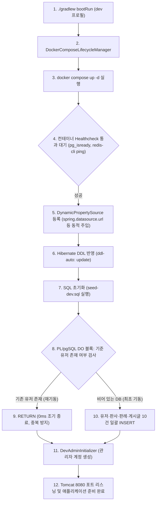

> 신규 팀원이 프로젝트를 클론받거나 새 개발 장비에서 애플리케이션을 구동할 때, 별도의 수동 인프라 셋업 없이 `./gradlew bootRun` 명령어 한 줄로 PostgreSQL과 Redis가 자동 기동되고 초기 테스트 데이터까지 완벽하게 적재되는 개발 환경을 구축했습니다. Spring Boot 3.1+의 Docker Compose 통합 기능과 PostgreSQL의 PL/pgSQL `DO` 블록을 활용하여, `ddl-auto: update` 환경에서도 수집 데이터를 보존하면서 멱등성(Idempotency)을 보장하는 로컬 개발 환경(DX) 구축기를 정리합니다.

---

## 1. 배경: 로컬 개발 환경(DX)에서 마주한 피로와 딜레마

백엔드 애플리케이션을 개발하다 보면 로컬 인프라 환경 구축과 테스트 데이터 관리에서 적지 않은 마찰(Friction)이 발생합니다. 실제 판결문 수집 및 AI 요약 서비스인 `cotton-bat-server` 프로젝트를 진행하면서도 초기 로컬 개발 환경에서 다음과 같은 현실적인 문제들을 겪었습니다.

### 1.1 "DB 띄우셨나요?" — 분리된 인프라 라이프사이클의 번거로움

프로젝트를 구동하려면 관계형 데이터베이스인 **PostgreSQL 17**과 분산 락 및 세션 캐시용 **Redis 7**이 필수적으로 동작하고 있어야 합니다.
이전에는 다음과 같은 과정을 거쳐야 했습니다:

1. 별도 터미널 탭을 열어 `docker compose up -d` 명령어를 수동으로 실행한다.
2. PC를 재부팅하거나 브랜치를 전환했을 때 컨테이너가 꺼져 있으면 `Connection refused` 예외를 마주하고 나서야 도커 상태를 확인한다.
3. 로컬 포트 충돌(5432, 6379)이나 환경 변수 불일치로 인해 개발자마다 서로 다른 접속 설정 때문에 삽질하는 시간이 발생한다.

### 1.2 `ddl-auto`와 초기 데이터 사이의 진퇴양난

더 치명적인 문제는 **"테스트 데이터의 보존"**과 **"초기 예제 데이터(Seed)의 적재"** 사이에서 발생하는 충돌이었습니다.

- **방안 A: `ddl-auto: create` (또는 `create-drop`)**
  - **장점**: 서버가 뜰 때마다 테이블을 완전히 새로 만들므로, `data.sql`이나 시드 스크립트를 매번 깔끔하게 밀어 넣을 수 있습니다.
  - **치명적 단점**: 로컬에서 수집 배치 작업(`judgment-collection-job`)을 돌려 힘들게 쌓아둔 수백 건의 실제 판례 데이터나, 테스트용으로 직접 작성한 게시글·댓글이 **서버 재시작 한 번에 모조리 증발**합니다.
- **방안 B: `ddl-auto: update`**
  - **장점**: 서버를 재시작해도 테이블 스키마와 기존에 적재한 판례 데이터가 안전하게 유지됩니다.
  - **문제점**: Spring Boot의 SQL 초기화 기능(`spring.sql.init.mode: always`)이 활성화되어 있으면, 서버가 뜰 때마다 `INSERT` 문이 다시 실행되어 `duplicate key value violates unique constraint` (기본키 충돌 에러)로 애플리케이션 기동이 중단됩니다. 그렇다고 `mode: never`로 꺼버리면, 처음 DB 볼륨을 생성한 신규 환경에서는 로그인할 테스트 유저조차 없는 빈 껍데기 DB가 됩니다.

이러한 문제를 해결하기 위해 제가 세운 목표는 명확했습니다:

> **"개발자는 오직 `./gradlew bootRun`만 실행한다. 컨테이너는 스프링 부트가 알아서 띄우고, DB가 비어 있을 때만 단 1회 예제 데이터를 안전하게 넣으며, 서버를 100번 재시작해도 수집 데이터는 보존되고 에러는 일절 발생하지 않아야 한다."**


_그림 1. `./gradlew bootRun` 실행 시 Docker Compose를 자동 감지하여 PostgreSQL과 Redis를 기동하고 헬스체크 완료 후 동적 프로퍼티를 주입하는 콘솔 로그_

---

## 2. 전체 아키텍처 및 기동 라이프사이클

스프링 부트 기동부터 데이터베이스 컨테이너 준비, DDL 업데이트, 멱등 시드 적재까지의 전체 동작 흐름은 다음과 같습니다.



핵심은 **Docker Compose 모듈이 컨테이너의 헬스체크 통과 시점까지 애플리케이션 초기화를 안전하게 지연**시키고, **PostgreSQL의 PL/pgSQL 블록이 멱등성 검사를 전담**하는 구조입니다.

---

## 3. 1단계: Spring Boot Docker Compose 모듈 연동

Spring Boot 3.1부터 추가된 `spring-boot-docker-compose` 모듈을 사용하면, 로컬 개발 시 별도의 스크립트 없이도 스프링 부트 수명 주기에 맞춰 도커 컨테이너를 관리할 수 있습니다.

### 3.1 의존성 추가 (`build.gradle.kts`)

애플리케이션의 `build.gradle.kts`에 `developmentOnly` 스코프로 의존성을 선언합니다. 운영 배포 jar에는 포함되지 않고 로컬 실행 시에만 활성화됩니다.

```kotlin
// build.gradle.kts
dependencies {
    // Spring Boot 핵심 스타터
    implementation("org.springframework.boot:spring-boot-starter-data-jpa")
    implementation("org.springframework.boot:spring-boot-starter-data-redis")
    implementation("org.springframework.boot:spring-boot-starter-webmvc")

    // 로컬 개발 생산성(DX) 전용 모듈
    developmentOnly("org.springframework.boot:spring-boot-devtools")
    developmentOnly("org.springframework.boot:spring-boot-docker-compose")

    // 런타임 드라이버
    runtimeOnly("org.postgresql:postgresql")
}
```

### 3.2 `docker-compose.yaml` 작성과 헬스체크 설정

프로젝트 루트 경로에 `docker-compose.yaml`을 생성합니다. 여기서 가장 중요한 포인트는 **각 서비스의 `healthcheck` 블록**입니다. 헬스체크가 없으면 컨테이너 프로세스는 떴지만 데이터베이스 엔진이 내부 초기화 중일 때 스프링 부트가 커넥션을 맺으려다 실패할 수 있습니다.

```yaml
# docker-compose.yaml
services:
  postgres:
    image: 'postgres:17'
    environment:
      - 'POSTGRES_DB=cotton_bat_dev'
      - 'POSTGRES_USER=myuser'
      - 'POSTGRES_PASSWORD=secret'
    ports:
      - '5432:5432'
    volumes:
      - postgres-data:/var/lib/postgresql/data
    healthcheck:
      test: [ "CMD-SHELL", "pg_isready -U myuser -d cotton_bat_dev" ]
      interval: 10s
      timeout: 5s
      retries: 5

  redis:
    image: 'redis:7'
    command: [ "redis-server" ]
    ports:
      - '6379:6379'
    volumes:
      - redis-data:/data
    healthcheck:
      test: [ "CMD", "redis-cli", "-a", "secret", "ping" ]
      interval: 10s
      timeout: 5s
      retries: 5

volumes:
  postgres-data:
  redis-data:
```

### 3.3 자동 연결의 마법: `ConnectionDetails`

스프링 부트의 Docker Compose 모듈은 컨테이너가 뜨면 `PostgresDockerComposeConnectionDetailsFactory` 및 `RedisDockerComposeConnectionDetailsFactory`를 통해 컨테이너의 포트 매핑과 계정 정보를 읽어와 내부 `DynamicPropertySource`로 주입합니다.

즉, `application.yaml`에 `localhost:5432`나 패스워드를 적지 않아도 자동으로 도커 컨테이너와 연결됩니다.

```yaml
# src/main/resources/application.yaml
spring:
  application:
    name: cotton-bat-server

  # 기본 호스트 정보 (Docker Compose가 뜰 경우 동적으로 자동 오버라이드됨)
  data:
    redis:
      host: ${REDIS_HOST:localhost}
      port: ${REDIS_PORT:6379}
      database: ${REDIS_DATABASE:0}
```


_그림 2. Spring Boot 기동과 동시에 Docker Desktop에 생성 및 구동된 cotton-bat-server 컨테이너 그룹 (PostgreSQL 17, Redis 7)_

> Spring Boot 프로세스가 종료되어도 기본적으로 도커 컨테이너는 내려가지 않고 유지됩니다(`lifecycle-management: start-only`). 따라서 코드를 수정하고 다시 실행할 때 컨테이너 재시작 대기 시간 없이 1~2초 만에 초고속 재기동이 가능합니다.
{: .prompt-info }

---

## 4. 2단계: `ddl-auto: update` 환경과 멱등 시드 데이터 세팅

컨테이너가 자동으로 뜨는 환경을 갖추었다면, 이제 **"서버를 재시작해도 기존 수집 판례를 유지하면서, 신규 환경에서는 초기 예제 데이터를 자동으로 적재하는 멱등성(Idempotency)"**을 확보해야 합니다.

### 4.1 `application-dev.yaml` 환경 설정

```yaml
# src/main/resources/application-dev.yaml
spring:
  datasource:
    driver-class-name: org.postgresql.Driver
    url: ${SPRING_DATASOURCE_URL:jdbc:postgresql://localhost:5432/cotton_bat_dev}
    username: ${SPRING_DATASOURCE_USERNAME:myuser}
    password: ${SPRING_DATASOURCE_PASSWORD:secret}

  jpa:
    hibernate:
      # 재시작해도 적재한 판례를 유지한다.
      ddl-auto: update
    show-sql: true
    properties:
      hibernate:
        format_sql: true
        dialect: org.hibernate.dialect.PostgreSQLDialect
    # Hibernate가 DDL(update)을 마친 뒤 SQL 스크립트가 실행되도록 지연한다
    defer-datasource-initialization: true

  sql:
    init:
      mode: always
      # 기본 data.sql 대신 dev 전용 시드를 지정한다 (prod/테스트에서 오동작 방지)
      data-locations: classpath:db/seed-dev.sql
      # PL/pgSQL DO 블록 전체를 단일 문장으로 실행하기 위한 EOF 구분자
      separator: ^^^ END OF SCRIPT ^^^
```

이 설정에는 두 가지 매우 중요한 엔지니어링 포인트가 숨겨져 있습니다.

#### ① `defer-datasource-initialization: true`
Spring Boot 2.5부터 `DataSource` 초기화 순서가 변경되어 기본적으로 JPA(`EntityManagerFactory`) 생성 전에 `schema.sql`이나 `data.sql`이 먼저 실행됩니다. 하지만 우리는 `ddl-auto: update`로 Hibernate가 테이블을 먼저 생성하거나 컬럼을 보정한 뒤 시드 데이터를 넣어야 하므로, 반드시 `defer-datasource-initialization: true`를 지정해야 합니다.

#### ② `separator: ^^^ END OF SCRIPT ^^^`의 비밀
Spring Boot의 내부 스크립트 실행기인 `ScriptUtils`는 기본적으로 세미콜론(`;`)을 기준으로 SQL 파일을 잘라 하나씩 실행합니다.
하지만 우리가 작성할 멱등 시드 스크립트는 PostgreSQL의 `DO $seed$ BEGIN ... END $seed$;` 익명 코드 블록입니다. 블록 내부에는 수십 개의 SQL 세미콜론이 포함되어 있습니다.
기본 구분자를 유지하면 `ScriptUtils`가 `BEGIN` 내부의 첫 번째 세미콜론에서 문장을 잘라버려 아래와 같은 문법 에러가 발생합니다:

```text
org.springframework.jdbc.datasource.init.ScriptStatementFailedException:
Failed to execute SQL script statement: DO $seed$ BEGIN IF EXISTS (SELECT 1 FROM users WHERE id = '...');
[PSQLException: ERROR: syntax error at end of input]
```

이를 방지하기 위해 파일 본문에는 절대 등장하지 않는 특수 문자열인 `^^^ END OF SCRIPT ^^^`를 구분자로 등록하여, **파일 전체를 단 하나의 완전한 PL/pgSQL 문장으로 데이터베이스에 전달**하도록 설정합니다.

### 4.2 멱등성을 보장하는 `seed-dev.sql` 작성

이제 `src/main/resources/db/seed-dev.sql`을 작성합니다. 맨 앞에 검사 로직을 두고 기준 데이터가 존재하면 즉시 함수 실행을 끝내도록 설계합니다.

```sql
-- src/main/resources/db/seed-dev.sql
-- dev 프로필 예제 데이터 (application-dev.yaml의 spring.sql.init.data-locations)
-- dev는 ddl-auto: update라 기동할 때마다 실행되므로, 예제 유저가 이미 있으면 전체를 건너뜁니다.
-- 전체를 PL/pgSQL 블록 하나로 실행합니다(separator: ^^^ END OF SCRIPT ^^^).

DO $seed$
BEGIN
    -- 1. 멱등성 검사: 시드 기준 유저가 이미 존재하면 아무 작업도 하지 않고 즉시 리턴
    IF EXISTS (SELECT 1 FROM users WHERE id = '0192f000-0000-7000-8000-000000000001') THEN
        RETURN;
    END IF;

    -- ---------- 2. 테스트 유저 10명 적재 ----------
    INSERT INTO users (id, email, password, nickname, profile_image_url, created_at, updated_at, created_user, updated_user)
    VALUES ('0192f000-0000-7000-8000-000000000001', 'minjun@example.com', '$2a$10$fQOlprBgjTx7auQ/j0wc1eE5yR9qyi4Rsn89uvhSqknzB9q4kKplq', '민준',   'https://api.dicebear.com/7.x/lorelei/svg?seed=minjun@example.com', now() - interval '30 days', now() - interval '2 days',  'SYSTEM (seed)', 'SYSTEM (seed)'),
           ('0192f000-0000-7000-8000-000000000002', 'seoyeon@example.com', '$2a$10$fQOlprBgjTx7auQ/j0wc1eE5yR9qyi4Rsn89uvhSqknzB9q4kKplq', '서연',  'https://api.dicebear.com/7.x/lorelei/svg?seed=seoyeon@example.com', now() - interval '28 days', now() - interval '28 days', 'SYSTEM (seed)', 'SYSTEM (seed)'),
           ('0192f000-0000-7000-8000-000000000003', 'jiho@gmail.com', NULL, '지호', 'https://api.dicebear.com/7.x/lorelei/svg?seed=jiho@gmail.com', now() - interval '25 days', now() - interval '25 days', 'SYSTEM (seed)', 'SYSTEM (seed)');

    -- ---------- 3. 판사 및 판례 데이터 적재 ----------
    INSERT INTO judges (name, court, profile_image_url, created_at, updated_at, created_user, updated_user)
    VALUES ('김도윤', '대법원', 'https://api.dicebear.com/7.x/lorelei/svg?seed=김도윤', now() - interval '40 days', now() - interval '40 days', 'SYSTEM (seed)', 'SYSTEM (seed)'),
           ('최민서', '서울고등법원', 'https://api.dicebear.com/7.x/lorelei/svg?seed=최민서', now() - interval '35 days', now() - interval '35 days', 'SYSTEM (seed)', 'SYSTEM (seed)');

    -- ---------- 4. 자연키(사건번호) 매핑을 통한 댓글 적재 (시퀀스 충돌 방지) ----------
    INSERT INTO article_comments (article_id, author_id, content, created_at, updated_at, created_user, updated_user)
    SELECT a.id, v.author_id::uuid, v.content, now() - (v.hours_ago || ' hours')::interval, now() - (v.hours_ago || ' hours')::interval, 'SYSTEM (seed)', 'SYSTEM (seed)'
    FROM (VALUES ('2024도10234', '0192f000-0000-7000-8000-000000000001', '처음부터 보낼 생각이 없었는지가 핵심이군요.', 400),
                 ('2023다21345', '0192f000-0000-7000-8000-000000000003', '통상의 손모 기준이 궁금합니다. 몇 년 살면 인정되나요?', 300)
         ) AS v(case_number, author_id, content, hours_ago)
             JOIN judgments j ON j.case_number = v.case_number
             JOIN articles a ON a.judgment_id = j.id;

END
$seed$;
```

### 4.3 IDENTITY 시퀀스 오염 방지 전략

시드 데이터를 넣을 때 흔히 저지르는 실수가 `id = 1, 2, 3`처럼 `BIGSERIAL` / `IDENTITY` 기본키를 하드코딩해서 넣는 것입니다.
이렇게 하면 데이터베이스 내부의 `seq` 카운터가 증가하지 않아, 이후 애플리케이션에서 신규 엔티티를 `save()`할 때 시퀀스가 1을 채번하면서 `Unique index or primary key violation` 에러가 터지게 됩니다.

따라서 위의 SQL처럼:
- 기본키가 UUIDv7인 경우 고정된 식별자를 명시합니다.
- 자동 증가 ID를 갖는 연관 테이블(`articles`, `judgments`)을 참조할 때는 `JOIN` 절을 통해 사건번호(`case_number`) 같은 **도메인 자연키로 조회하여 동적 주입**함으로써 시퀀스 충돌을 원천 차단했습니다.

---

## 5. 3단계: 관리자 계정 초기화의 분리 (`DevAdminInitializer`)

일반 예제 데이터는 SQL 스크립트로 밀어 넣지만, **비밀번호 해시화(BCrypt)와 도메인 규칙이 필요한 관리자 계정**은 SQL 파일에 하드코딩하지 않고 스프링 컴포넌트로 분리했습니다.

Spring Security의 `PasswordEncoder` 빈을 주입받아 애플리케이션 시작 시점에 안전하게 초기화합니다.

```kotlin
// src/main/kotlin/io/github/cmsong111/cotton_bat_server/config/DevAdminInitializer.kt
package io.github.cmsong111.cotton_bat_server.config

import io.github.cmsong111.cotton_bat_server.user.domain.User
import io.github.cmsong111.cotton_bat_server.user.domain.UserRepository
import io.github.cmsong111.cotton_bat_server.user.domain.UserRole
import org.slf4j.LoggerFactory
import org.springframework.beans.factory.annotation.Value
import org.springframework.boot.ApplicationArguments
import org.springframework.boot.ApplicationRunner
import org.springframework.context.annotation.Profile
import org.springframework.security.crypto.password.PasswordEncoder
import org.springframework.stereotype.Component
import org.springframework.transaction.annotation.Transactional

/**
 * dev 프로필에서 관리자 로그인을 시험할 수 있도록 관리자 계정을 안전하게 생성합니다.
 */
@Component
@Profile("dev")
class DevAdminInitializer(
    private val userRepository: UserRepository,
    private val passwordEncoder: PasswordEncoder,
    @Value("\${app.dev-admin.email:admin@cottonbat.dev}") private val email: String,
    @Value("\${app.dev-admin.password:admin1234!}") private val password: String,
) : ApplicationRunner {

    private val log = LoggerFactory.getLogger(javaClass)

    @Transactional
    override fun run(args: ApplicationArguments) {
        // 이미 관리자 계정이 존재하면 건너뜀 (멱등성 보장)
        if (userRepository.existsByEmail(email)) {
            return
        }

        userRepository.save(
            User(
                email = email,
                password = passwordEncoder.encode(password),
                nickname = "관리자",
                roles = mutableSetOf(UserRole.ADMIN, UserRole.USER),
            )
        )
        log.info("dev 관리자 계정을 생성했습니다: {}", email)
    }
}
```

이 방식의 장점:
1. 비밀번호가 평문으로 SQL에 노출되거나 솔트(Salt) 불일치로 로그인이 실패하는 문제를 방지합니다.
2. `existsByEmail(email)` 체크 덕분에 애플리케이션이 재시작되어도 멱등하게 작동합니다.

---

## 6. 검증 및 결과 확인

모든 설정을 완료한 후, 터미널과 데이터베이스 콘솔에서 동작을 검증해 보았습니다.

### 6.1 최초 기동 vs 재기동 동작 비교

1. **최초 기동 시 (`docker compose down -v` 이후)**:
   - Docker Compose 모듈이 Postgres, Redis 컨테이너를 기동하고 헬스체크를 통과합니다.
   - Hibernate가 테이블을 생성합니다.
   - `seed-dev.sql`이 실행되어 10명의 유저, 판례, 게시글, 댓글이 DB에 정상 적재됩니다.
   - `DevAdminInitializer`가 `admin@cottonbat.dev` 계정을 생성합니다.
2. **재기동 시 (애플리케이션 재시작)**:
   - 컨테이너가 이미 건강한 상태(`healthy`)이므로 즉시 연결됩니다.
   - `seed-dev.sql`이 호출되지만, `IF EXISTS (...) THEN RETURN;` 조건문에 의해 **단 3ms 만에 조기 종료**됩니다.
   - 중복 키 에러(DuplicateKeyException)가 전혀 발생하지 않고 2초 대에 스프링 부트가 완전히 구동됩니다.


_그림 3. 재기동 시 멱등 조건문으로 3ms 만에 통과하는 초기화 로그와 psql 상에서 정확히 각 10건씩 유지되고 있는 집계 결과_

### 6.2 DB를 완전 초기 상태로 되돌리고 싶을 때

개발 도중 스키마를 대폭 수정했거나 테스트 데이터를 완전히 처음 상태로 리셋하고 싶을 때는 단 한 줄의 명령어로 원복할 수 있습니다:

```bash
# 도커 볼륨을 완전히 삭제하고 컨테이너 정리
docker compose down -v
```

이후 다시 `./gradlew bootRun --args='--spring.profiles.active=dev'`를 실행하면, 3초 안에 깨끗한 컨테이너 생성부터 시드 적재까지 모든 과정이 자동으로 복구됩니다.

---

## 7. 정리 및 배운 점

로컬 개발 환경에서의 개발자 경험(DX)은 단순히 "편하다"는 감상을 넘어 팀의 전체적인 생산성과 코드 품질에 직결됩니다.

| 구분 | 도입 전 | 도입 후 |
| :--- | :--- | :--- |
| **인프라 기동** | 터미널 별도 분리 후 수동 `docker compose up` | `./gradlew bootRun` 시 100% 자동 기동 및 헬스체크 대기 |
| **환경 변수 관리** | 포트, DB URL, 레디스 비밀번호 수동 주입 | Spring Boot `ConnectionDetails` 동적 주입 |
| **데이터 보존** | `ddl-auto: create`로 재시작 시 수집 데이터 유실 | `ddl-auto: update`로 수집된 판례 데이터 안전 유지 |
| **예제 데이터 적재** | PK 충돌 오류 또는 빈 데이터베이스 수동 적재 | PL/pgSQL `DO` 블록으로 멱등 단 1회 안전 적재 |
| **초기화 비용** | 복잡한 수동 스크립트 실행 | `docker compose down -v` 한 줄로 클린 복구 |

특히 **"PostgreSQL의 `DO` 블록과 `ScriptUtils`의 커스텀 구분자(`^^^ END OF SCRIPT ^^^`) 조합"**은 별도의 마이그레이션 도구(Flyway/Liquibase)를 도입하기 전 단계의 초기 프로토타입이나 개발 단계에서 매우 가볍고 우아하게 멱등성을 확보할 수 있는 실용적인 패턴이었습니다.

로컬 환경 설정에 매번 시간을 빼앗기거나 DB 재시작 때마다 테스트 데이터가 날아가 스트레스를 받고 계셨다면, Spring Boot Docker Compose와 PL/pgSQL 멱등 시드 패턴을 적용해 보시길 추천합니다.

---

## 참고 자료

- [Spring Boot Official Docs - Docker Compose Support](https://docs.spring.io/spring-boot/reference/features/dev-services.html#features.dev-services.docker-compose)
- [PostgreSQL Documentation - DO Statement](https://www.postgresql.org/docs/current/sql-do.html)
- [PostgreSQL Documentation - PL/pgSQL Structure](https://www.postgresql.org/docs/current/plpgsql-structure.html)
- [Cotton Bat Server Repository](https://github.com/cmsong111/cotton-bat-server)
