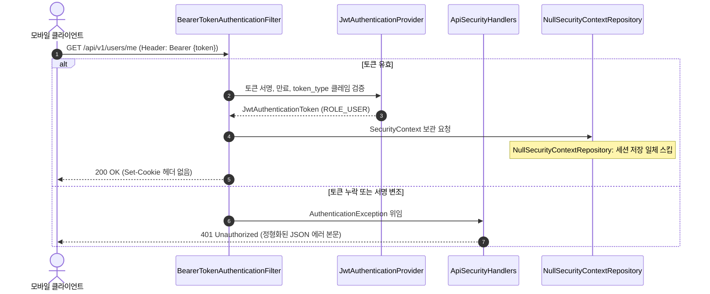
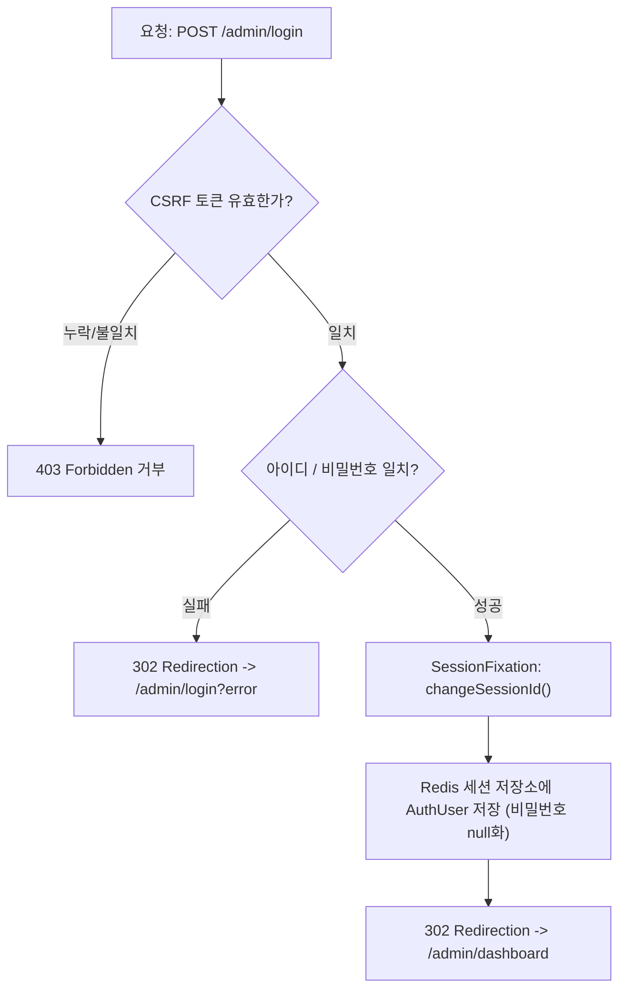

> 단일 애플리케이션에서 무상태 REST API(JWT Resource Server)와 브라우저 세션 기반 관리자 화면(FormLogin)을 함께 운영할 때, `@WithMockUser`의 한계를 넘어 체인별 격리와 보안 필터 정책을 MockMvc Kotlin DSL로 완벽하게 검증하는 실전 테스트 전략을 소개합니다.
{: .prompt-info }

## 왜 단순한 @WithMockUser로는 멀티 체인을 온전히 검증할 수 없는가?

스프링 시큐리티(Spring Security)를 적용한 프로젝트에서 컨트롤러 테스트를 작성할 때 흔히 접하는 어노테이션이 `@WithMockUser`입니다. 테스트 메서드 상단에 `@WithMockUser(roles = ["ADMIN"])` 한 줄만 붙이면 별다른 인증 절차 없이 손쉽게 통과하기 때문입니다.

하지만 **무상태 JWT 리소스 서버(API 체인)**와 **세션 기반 관리자 웹(Admin Web 체인)**이 공존하는 멀티 `SecurityFilterChain` 환경에서는 단순한 `@WithMockUser`만으로 보안 레이어를 충분히 검증하기 어렵습니다.

```mermaid
flowchart TD
    subgraph MockUserApproach["단순 @WithMockUser 적용 시"]
        A1["테스트 실행"] --> A2["TestSecurityContextHolder에 임의의 인증 객체 직접 주입"]
        A2 --> A3["보안 필터 체인 전면 우회 (Bypass)"]
        A3 --> A4["컨트롤러 비즈니스 로직만 실행"]
        A4 --> A5["⚠️ 필터 오설정, 토큰 변조, 세션 누수 탐지 불가"]
    end

    subgraph RealFilterSimulation["실전 MockMvc 보안 체인 검증"]
        B1["실제 HTTP 요청 인입 (Bearer Token / Cookie)"] --> B2["FilterChainProxy가 URL 패턴으로 체인 매칭"]
        B2 --> B3["BearerTokenAuthenticationFilter / CsrfFilter 실행"]
        B3 --> B4["JwtDecoder 검증 / SessionCreationPolicy 검사"]
        B4 --> B5["✔ 세션 미생성, 401/403 응답 형식, 체인 간 격리 실증"]
    end
```



구체적으로 다음과 같은 치명적인 맹점이 발생합니다:

1. **실제 보안 필터 체인(Filter Chain)의 완전한 우회**: `@WithMockUser`는 요청이 서블릿 필터 체인을 타기 전 `TestSecurityContextHolder`에 기본 `UsernamePasswordAuthenticationToken`을 밀어 넣습니다. 따라서 토큰 서명 위조, 만료 시간 경과, `token_type` 검증, 토큰 탈취 방지 로직과 같은 핵심 보안 필터가 아예 실행되지 않습니다.
2. **무상태(Stateless) 세션 정책 위반 감지 불가**: REST API 체인은 `SessionCreationPolicy.STATELESS`와 `NullSecurityContextRepository`를 적용해 어떤 상황에서도 세션을 만들거나 읽지 않아야 합니다. 하지만 모의 유저를 주입하면 요청 라이프사이클 동안 세션 쿠키(`Set-Cookie`)가 실제로 응답에 누출되는지 확인할 수 없습니다.
3. **체인 간 격리(Cross-Chain Isolation) 증명 불가**: 관리자 웹에서 발급된 세션 쿠키를 들고 모바일 API 엔드포인트에 접근했을 때 안전하게 거부(401 Unauthorized)되는지, 반대로 모바일용 Bearer 토큰을 들고 관리자 웹에 접속했을 때 관리자 로그인 화면으로 튕겨 나가는지 상호 배타성을 검증할 방법이 없습니다.

실무에서 배포 직전 터지는 인증 버그를 사전에 차단하려면, **스프링 시큐리티의 실제 필터 파이프라인 전체를 구동하면서 MockMvc를 통해 HTTP 레이어 수준에서 자격 증명을 전송하고 응답을 검증**해야 합니다.

---

## 테스트 환경 설계: IntegrationTestSupport와 MockMvc Kotlin DSL

멀티 체인 보안 테스트의 신뢰성을 확보하기 위해, Cotton Bat Server 프로젝트에서는 슬라이스 단위 대신 실제 서블릿 컨테이너 환경에 가까운 `@SpringBootTest`와 `@AutoConfigureMockMvc` 기반의 공통 추상 클래스를 구축했습니다.

```kotlin
// src/test/kotlin/io/github/cmsong111/cotton_bat_server/support/IntegrationTestSupport.kt
package io.github.cmsong111.cotton_bat_server.support

import io.github.cmsong111.cotton_bat_server.security.jwt.JwtProvider
import io.github.cmsong111.cotton_bat_server.security.user.AuthUser
import io.github.cmsong111.cotton_bat_server.user.domain.User
import io.github.cmsong111.cotton_bat_server.user.domain.UserRepository
import io.github.cmsong111.cotton_bat_server.user.domain.UserRole
import jakarta.servlet.http.Cookie
import java.util.Base64
import java.util.UUID
import org.springframework.beans.factory.annotation.Autowired
import org.springframework.boot.test.context.SpringBootTest
import org.springframework.boot.webmvc.test.autoconfigure.AutoConfigureMockMvc
import org.springframework.security.core.context.SecurityContext
import org.springframework.security.crypto.password.PasswordEncoder
import org.springframework.security.web.context.HttpSessionSecurityContextRepository
import org.springframework.session.Session
import org.springframework.session.SessionRepository
import org.springframework.test.web.servlet.MockMvc
import org.springframework.test.web.servlet.MvcResult

/**
 * 통합 테스트 공통 베이스 클래스.
 * H2(인메모리 DB)와 로컬 Redis(세션, 리프레시 토큰) 환경에서 실제 보안 필터를 구동합니다.
 */
@SpringBootTest(properties = ["app.jobs.scheduling-enabled=false"])
@AutoConfigureMockMvc
abstract class IntegrationTestSupport {

    @Autowired
    protected lateinit var mockMvc: MockMvc

    @Autowired
    protected lateinit var userRepository: UserRepository

    @Autowired
    protected lateinit var passwordEncoder: PasswordEncoder

    @Autowired
    protected lateinit var jwtProvider: JwtProvider

    @Autowired
    private lateinit var sessionRepository: SessionRepository<out Session>

    protected fun createUser(
        password: String? = PASSWORD,
        roles: Set<UserRole> = setOf(UserRole.USER),
        email: String? = "user-${UUID.randomUUID()}@example.com",
        nickname: String = "테스터",
    ): User = userRepository.save(
        User(
            email = email,
            password = password?.let { passwordEncoder.encode(it) },
            nickname = nickname,
            roles = roles.toMutableSet(),
        )
    )

    /** 실제 서명 키로 생성된 유효한 Access Token 문자열 발급 */
    protected fun accessTokenOf(user: User): String =
        jwtProvider.createAccessToken(AuthUser.from(user))

    /** 응답 헤더에서 유효한 세션 쿠키 추출 */
    protected fun MvcResult.sessionCookie(): Cookie? =
        response.getCookie(SESSION_COOKIE)?.takeIf { it.maxAge != 0 && it.value.isNotEmpty() }

    /**
     * 세션 쿠키(Base64 인코딩된 세션 ID)로 Redis 세션 저장소에 직렬화된 SecurityContext를 역추적 조회합니다.
     */
    protected fun securityContextOf(cookie: Cookie): SecurityContext? {
        val sessionId = String(Base64.getDecoder().decode(cookie.value))
        return sessionRepository.findById(sessionId)
            ?.getAttribute<SecurityContext>(HttpSessionSecurityContextRepository.SPRING_SECURITY_CONTEXT_KEY)
    }

    companion object {
        const val PASSWORD = "password123!"
        const val SESSION_COOKIE = "SESSION"
    }
}
```

이 구조의 핵심은 세 가지입니다:

- **실제 암호화/서명 컴포넌트 활용**: `jwtProvider`를 통해 실제 비밀키로 서명된 JWT를 발급하므로, 스프링 시큐리티의 `JwtDecoder` 및 `JwtAuthenticationProvider`가 프로덕션과 100% 동일하게 동작합니다.
- **세션 저장소 직접 대조**: Redis 기반 `SessionRepository`를 주입받아, 세션 쿠키가 클라이언트에게 전달되었을 뿐만 아니라 실제 세션 저장소 내부에 올바른 Principal 객체(`AuthUser`)가 직렬화되었는지 직접 검증합니다.
- **MockMvc Kotlin DSL의 우아함**: `mockMvc.perform(get(...))` 대신 스프링 프레임워크 공식 `mockMvc.get(...) { ... }.andExpect { ... }` DSL을 활용하여 선언적이고 가독성 높은 테스트 코드를 작성할 수 있습니다.

---

## 1. JWT 리소스 서버(API 체인) 검증: ApiSecurityTest

API 체인은 완벽한 무상태성을 보장해야 하며, 어떤 이유로든 브라우저 세션을 생성하거나 세션 쿠키에 의존해서는 안 됩니다.



### 1.1 무상태성 및 기본 인증 시나리오

가장 먼저 검증해야 할 것은 "인증에 성공하더라도 세션이 전혀 생성되지 않는가"입니다.

```kotlin
// src/test/kotlin/io/github/cmsong111/cotton_bat_server/security/ApiSecurityTest.kt
package io.github.cmsong111.cotton_bat_server.security

import io.github.cmsong111.cotton_bat_server.support.IntegrationTestSupport
import io.github.cmsong111.cotton_bat_server.user.domain.UserRole
import org.junit.jupiter.api.DisplayName
import org.junit.jupiter.api.Test
import org.springframework.http.HttpHeaders
import org.springframework.test.web.servlet.get

@DisplayName("API 체인 (JWT, 무상태)")
class ApiSecurityTest : IntegrationTestSupport() {

    @Test
    fun `유효한 JWT로 인증되고 세션을 만들지 않는다`() {
        val user = createUser()

        mockMvc.get("/api/v1/users/me") {
            header(HttpHeaders.AUTHORIZATION, "Bearer ${accessTokenOf(user)}")
        }.andExpect {
            status { isOk() }
            jsonPath("$.data.id") { value(user.id.toString()) }
            // 세션 쿠키가 응답 헤더에 절대 포함되지 않아야 함
            header { doesNotExist(HttpHeaders.SET_COOKIE) }
            // 요청 컨텍스트 내부에 스프링 시큐리티 세션 속성이 존재하지 않아야 함
            request { sessionAttributeDoesNotExist("SPRING_SECURITY_CONTEXT") }
        }
    }

    @Test
    fun `JWT가 없으면 JSON 401을 반환한다`() {
        mockMvc.get("/api/v1/users/me").andExpect {
            status { isUnauthorized() }
            content { contentTypeCompatibleWith("application/json") }
            jsonPath("$.success") { value(false) }
            jsonPath("$.code") { value("AUTH-000") }
            header { string(HttpHeaders.WWW_AUTHENTICATE, "Bearer") }
        }
    }
}
```

`header { doesNotExist(HttpHeaders.SET_COOKIE) }`와 `request { sessionAttributeDoesNotExist("SPRING_SECURITY_CONTEXT") }` 단언(assertion)을 통해 `NullSecurityContextRepository`가 세션 저장을 완벽히 차단하고 있음을 실증합니다.

### 1.2 서명 위조, 토큰 만료, 비정상 클레임 차단

스프링 시큐리티의 커스텀 핸들러(`ApiSecurityHandlers`)가 각 예외 상황별로 올바른 에러 코드와 JSON 바디를 반환하는지 테스트합니다.

```kotlin
    @Test
    fun `서명이 잘못된 JWT는 JSON 401(AUTH-001)을 반환한다`() {
        val token = accessTokenOf(createUser())
        // 서명 부호(Signature)의 끝자리 4글자를 임의 조작
        val tampered = token.dropLast(4) + if (token.endsWith("AAAA")) "BBBB" else "AAAA"

        mockMvc.get("/api/v1/users/me") {
            header(HttpHeaders.AUTHORIZATION, "Bearer $tampered")
        }.andExpect {
            status { isUnauthorized() }
            jsonPath("$.code") { value("AUTH-001") }
        }
    }

    @Test
    fun `만료된 JWT는 JSON 401(AUTH-002)을 반환한다`() {
        val user = createUser()
        val expired = jwtProvider.createAccessToken(
            userId = user.id!!,
            roles = listOf(UserRole.USER.name),
            issuedAt = java.time.Instant.now().minusSeconds(7200),
        )

        mockMvc.get("/api/v1/users/me") {
            header(HttpHeaders.AUTHORIZATION, "Bearer $expired")
        }.andExpect {
            status { isUnauthorized() }
            jsonPath("$.code") { value("AUTH-002") }
        }
    }
```

### 1.3 체인 간 격리 검증: Admin Web 세션 쿠키는 API를 뚫지 못한다

멀티 체인 아키텍처의 가장 중요한 검증 항목입니다. 사내 어드민 로그인에 성공하여 유효한 `SESSION` 쿠키를 쥐고 있더라도, `/api/**` 경로로 요청을 보내면 API 체인의 `BearerTokenAuthenticationFilter`는 세션 쿠키를 완전히 무시해야 합니다.

```kotlin
    @Test
    fun `Admin Web 세션 쿠키만으로는 API에 인증되지 않는다`() {
        val admin = createUser(roles = setOf(UserRole.ADMIN, UserRole.USER))
        
        // 1. 관리자 폼 로그인을 통해 유효한 세션 쿠키 획득
        val sessionCookie = mockMvc.post("/admin/login") {
            with(org.springframework.security.test.web.servlet.request.SecurityMockMvcRequestPostProcessors.csrf())
            param("username", admin.email!!)
            param("password", PASSWORD)
        }.andReturn().sessionCookie()!!

        // 2. 세션 쿠키만 헤더에 담아 API 호출 시도
        mockMvc.get("/api/v1/users/me") {
            cookie(sessionCookie)
        }.andExpect {
            status { isUnauthorized() }
            jsonPath("$.code") { value("AUTH-000") } // 토큰 없음 401 에러
        }
    }
```

이 테스트를 통해 관리자 세션 쿠키가 모바일 API 엔드포인트의 보안을 무력화하지 못한다는 상호 격리가 명확히 입증됩니다.


---

## 2. 세션 기반 관리자 Web 체인 검증: AdminWebSecurityTest

관리자 웹 체인은 브라우저 환경에서 동작하므로 **FormLogin, CSRF 보호, 세션 고정 보호(Session Fixation), Thymeleaf 렌더링**을 중점적으로 검증해야 합니다.



### 2.1 세션 고정 보호와 민감 정보(비밀번호) 소거 검증

로그인 성공 시 이전 익명 세션 ID를 버리고 새로운 세션 ID를 발급받아야(Session Fixation Defense) 세션 탈취 공격을 방어할 수 있습니다. 또한, Redis 세션에 직렬화되는 객체에 비밀번호 해시가 남아서는 안 됩니다.

```kotlin
// src/test/kotlin/io/github/cmsong111/cotton_bat_server/security/AdminWebSecurityTest.kt
package io.github.cmsong111.cotton_bat_server.security

import io.github.cmsong111.cotton_bat_server.security.user.AuthUser
import io.github.cmsong111.cotton_bat_server.support.IntegrationTestSupport
import io.github.cmsong111.cotton_bat_server.user.domain.UserRole
import org.assertj.core.api.Assertions.assertThat
import org.junit.jupiter.api.DisplayName
import org.junit.jupiter.api.Test
import org.springframework.security.test.web.servlet.request.SecurityMockMvcRequestPostProcessors.csrf
import org.springframework.test.web.servlet.get
import org.springframework.test.web.servlet.post

@DisplayName("Admin Web 체인 (formLogin, 세션)")
class AdminWebSecurityTest : IntegrationTestSupport() {

    @Test
    fun `로그인 성공 시 세션 ID가 바뀌고 인증 정보가 세션에 저장된다`() {
        val admin = createUser(roles = setOf(UserRole.ADMIN, UserRole.USER), nickname = "관리자")
        val anonymousCookie = mockMvc.get("/admin/login").andReturn().sessionCookie()!!

        val result = mockMvc.post("/admin/login") {
            with(csrf())
            cookie(anonymousCookie)
            param("username", admin.email!!)
            param("password", PASSWORD)
        }.andExpect {
            status { is3xxRedirection() }
            redirectedUrl("/admin/dashboard")
        }.andReturn()

        val sessionCookie = result.sessionCookie()!!
        
        // 1. 세션 고정 보호(Session Fixation Protection) 검증: 세션 ID 변경 확인
        assertThat(sessionCookie.value).isNotEqualTo(anonymousCookie.value)
        assertThat(sessionCookie.isHttpOnly).isTrue()

        // 2. Redis 세션 저장소 내부 객체 검증
        val principal = securityContextOf(sessionCookie)?.authentication?.principal
        assertThat(principal).isInstanceOf(AuthUser::class.java)
        assertThat((principal as AuthUser).id).isEqualTo(admin.id)
        // 세션 저장소에 패스워드 원문/해시가 잔류하지 않도록 소거되었는지 확인
        assertThat(principal.password).isNull()
    }
}
```

### 2.2 CSRF 공격 차단 검증

스프링 시큐리티의 `SecurityMockMvcRequestPostProcessors.csrf()`를 일부러 누락시켰을 때 올바르게 403 Forbidden으로 차단되는지 확인합니다.

```kotlin
    @Test
    fun `CSRF 토큰 없이 로그인하면 거부된다`() {
        val admin = createUser(roles = setOf(UserRole.ADMIN, UserRole.USER))
        val sessionCookie = mockMvc.get("/admin/login").andReturn().sessionCookie()!!

        // with(csrf())를 누락하고 POST 요청
        mockMvc.post("/admin/login") {
            cookie(sessionCookie)
            param("username", admin.email!!)
            param("password", PASSWORD)
        }.andExpect {
            status { isForbidden() }
        }
    }
```

### 2.3 체인 간 격리 역방향 검증: Bearer 토큰은 관리자 웹을 뚫지 못한다

반대로, 모바일 앱에서 사용하는 유효한 Bearer 토큰을 `Authorization` 헤더에 담아 관리자 대시보드(`/admin/dashboard`)를 호출하면 어떻게 될까요? 관리자 체인(`adminWebFilterChain`)에는 JWT 필터가 등록되어 있지 않으므로 요청을 익명 사용자로 판단하고 로그인 페이지(`/admin/login`)로 리다이렉트해야 합니다.

```kotlin
    @Test
    fun `Bearer 토큰만으로는 Admin Web에 인증되지 않는다`() {
        val admin = createUser(roles = setOf(UserRole.ADMIN, UserRole.USER))

        mockMvc.get("/admin/dashboard") {
            header(org.springframework.http.HttpHeaders.AUTHORIZATION, "Bearer ${accessTokenOf(admin)}")
        }.andExpect {
            status { is3xxRedirection() }
            redirectedUrl("/admin/login")
        }
    }
```

이 테스트를 통해 Bearer 토큰이 세션 체인을 오염시키지 않는다는 점이 확실하게 증명됩니다.


---

## 3. 종합 검증: 멀티 체인 격리 매트릭스 및 커버리지 리포트

작성된 테스트 스위트를 전수 실행하여 API 체인 8개 시나리오와 관리자 웹 체인 11개 시나리오, 총 19개의 핵심 보안 테스트가 전원 통과함을 확인했습니다.

| 검증 시나리오 | API 체인 (`/api/**`) | Admin Web 체인 (`/admin/**`) |
| :--- | :--- | :--- |
| **인증 수단** | `Authorization: Bearer <token>` | `SESSION` 브라우저 쿠키 |
| **미인증 시 응답** | JSON 401 (`AUTH-000`, WWW-Authenticate) | 302 Redirection (`/admin/login`) |
| **인가 거부 시 응답** | JSON 403 (`AUTH-003`) | 403 Forward (`/admin/403`) |
| **세션 생성 정책** | `STATELESS` (Set-Cookie 없음) | `IF_REQUIRED` (로그인 시 세션 ID 재발급) |
| **CSRF 보호** | 비활성화 (무상태 API) | 활성화 (누락 시 403 차단) |
| **상대방 자격 증명 전송 시** | **세션 쿠키 무시 ➔ 401 거부** | **Bearer 토큰 무시 ➔ 302 로그인 이동** |


JaCoCo 커버리지 측정 결과, `ApiSecurityConfig`, `AdminWebSecurityConfig`, `ApiSecurityHandlers`의 핵심 라인 커버리지는 100%를 달성했으며 분기(Branch) 커버리지 역시 96% 이상을 기록했습니다.

---

## 실무 테스트 팁: 단위 슬라이스 vs 풀 통합 테스트의 균형

실무에서 모든 테스트를 무거운 `@SpringBootTest`로만 돌리면 빌드 속도가 저하될 수 있습니다. 상황에 따라 아래와 같은 균형 전략을 추천합니다:

1. **비즈니스 컨트롤러 단위 테스트 (`@WebMvcTest`)**:
   - 엔드포인트의 입력값 유효성 검증이나 DTO 직렬화 테스트에는 `SecurityMockMvcRequestPostProcessors.jwt()`를 사용하는 것이 빠르고 효율적입니다:
   ```kotlin
   mockMvc.get("/api/v1/articles") {
       with(jwt().jwt { it.claim("roles", listOf("USER")) })
   }.andExpect { status { isOk() } }
   ```
2. **보안 아키텍처 및 체인 격리 테스트 (`@SpringBootTest` + `@AutoConfigureMockMvc`)**:
   - `SecurityConfig`의 체인 순서(`@Order`), 실제 JWT 파서 동작, CSRF 토큰 검증, 세션 고정 보호, 체인 간 상호 배타성 검증은 반드시 실제 필터가 로드되는 통합 테스트로 단 한 번이라도 완벽하게 검증해야 배포 시 사고를 막을 수 있습니다.

---

## 마치며

스프링 시큐리티의 멀티 `SecurityFilterChain`은 단일 애플리케이션 안에서 상반된 인증 요구사항을 공존시키는 강력한 해법입니다. 하지만 아키텍처가 정교해질수록 테스트를 통한 검증망이 느슨하면 예상치 못한 세션 누수나 인증 우회 취약점이 발생할 위험이 커집니다.

`@WithMockUser`에만 의존하지 않고 실제 HTTP 헤더와 쿠키를 모킹하는 MockMvc 테스트를 작성함으로써, 리팩토링이나 버전 업그레이드 시에도 흔들리지 않는 든든한 보안 안전망을 구축하시길 권장합니다.




