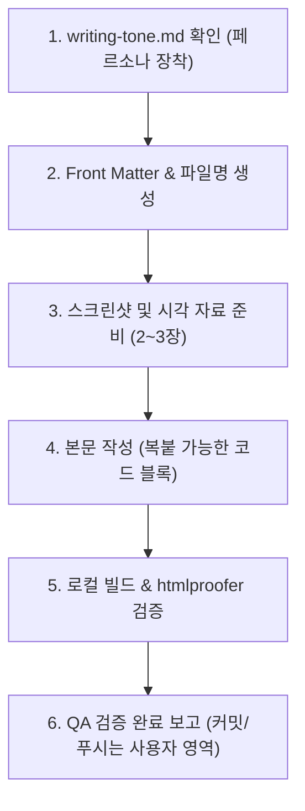

# AI 에이전트 지침서 (agent.md)

이 문서는 AI 어시스턴트(Antigravity, Claude, Copilot 등)가 **남주의 커밋로그([https://namju.kim](https://namju.kim))** 저장소에서 작업할 때 준수해야 하는 **아키텍처 규칙, 글 작성 프로세스, 품질 검증 절차**를 정의합니다.

> ⚠️ **필수 확인 사항**
> 블로그 포스트를 작성하거나 수정할 때는 반드시 [writing-tone.md](file:///Users/kimnamju/Documents/GitHub/blog/writing-tone.md)를 먼저 확인하고 작성자(김남주)의 페르소나와 톤앤매너를 100% 준수해야 합니다.

---

## 1. 블로그 아키텍처 개요

- **엔진**: Jekyll v4.3.x + `jekyll-theme-chirpy` v7.6.0 (Gem 기반 배포)
- **런타임**: Ruby 3.4 (GitHub Actions 및 Dev Container 표준)
- **배포 환경**: GitHub Pages (`.github/workflows/pages-deploy.yml`)
- **개발 환경**: VS Code Dev Container (`.devcontainer/devcontainer.json`)

### 주요 디렉토리 및 확장 구조

| 경로 | 용도 및 주의사항 |
| :--- | :--- |
| `_posts/` | 블로그 포스트 마크다운 파일 (`YYYY-MM-DD-title.md`) |
| `assets/images/YYYY-MM-DD/` | 각 포스트에 사용되는 스크린샷 및 이미지 자산 저장소 |
| `_includes/metadata-hook.html` | **Chirpy 공식 확장 훅** (네이버 서치어드바이저, 애드센스 등 커스텀 태그 주입용). **절대 `_includes/head.html`을 통째로 덮어쓰지 말 것!** |
| `_includes/linkpreview.html` | `jekyll-linkpreview` OG 지원 사이트용 미리보기 카드 템플릿 |
| `_includes/linkpreview_nog.html` | OpenGraph가 없는 사이트용 fallback 템플릿 (프로토콜 상대 URL 에러 방지 필수) |
| `_data/tags/*.yaml` | 카테고리 뷰어의 태그별 배너 썸네일, 설명, 공식 링크 메타데이터 |
| `_plugins/posts-lastmod-hook.rb` | Git 커밋 히스토리 기반 `last_modified_at` 자동 주입 훅 |

---

## 2. 블로그 포스트 작성 워크플로우

AI 에이전트가 새 글을 작성할 때는 아래 순서를 엄격히 따릅니다.



### Step 1. 파일명 및 Front Matter 규격
- **파일명**: `_posts/YYYY-MM-DD-kebab-case-title.md` (반드시 영문 소문자 케밥케이스 권장)
- **발행 날짜 규칙**: 시리즈 연재 시 이전 글로부터 **매주 1개씩(7일 간격)** 날짜(`date:`)를 설정하여 꾸준한 포스팅 흐름을 구현합니다.
- **분량 기준**: 1개 포스트는 **5분 읽기 분량 (1,500 ~ 2,500자 내외)**으로, 문제/이유 ➔ 설정/코드 ➔ 검증의 완결성을 갖춥니다.
- **공식 문서 기반**: 추측성 작성 금지. 해당 기술(Chirpy Wiki, Jekyll docs, Google/Naver Console, GitHub Docs)의 **공식 페이지 내용을 철저히 확인**하고 반영합니다.
- **Front Matter 필수 형식**:
  ```yaml
  ---
  title: 글 제목 (직관적이고 명확한 기술 키워드 포함)
  description: 검색엔진 및 SNS 카드용 1~2문장 요약
  date: YYYY-MM-DD HH:MM:SS +0900
  categories: [Blog, GitHub-Pages]
  tags: [태그1, 태그2, 태그3]
  mermaid: true # 다이어그램 사용 시 true
  image:
    path: https://... 또는 /assets/images/YYYY-MM-DD/thumbnail.png
    alt: 대표 썸네일 설명
  ---
  ```
  > 💡 `image:` 속성은 **홈 화면 목록의 썸네일 카드**와 **SNS 공유(OpenGraph `og:image`)** 용도로 계속 사용됩니다. 게시글 본문 상단에 거대하게 노출되던 커버 이미지는 `jekyll-theme-chirpy.scss`를 통해 자동 숨김 처리되어 있으므로 안심하고 지정하시면 됩니다.

### Step 2. 이미지 및 스크린샷 배치 (필수 2~3장)
- 시각적 증거(브라우저 렌더링 화면, 콘솔 관리자 대시보드, 모바일 반응형 뷰 등)를 **반드시 2~3장 이상** 배치합니다.
- **✂️ 불필요한 여백 제거 및 타이트 크롭 (Tight Crop 원칙)**:
  - 전체 브라우저 창이나 사이드바, 무의미한 빈 배경 여백을 그대로 캡처하지 않습니다.
  - 독자가 모바일이나 태블릿에서도 확대 없이 내용을 선명하게 읽을 수 있도록, **핵심 정보가 담긴 특정 UI 카드, 테이블, 입력 폼 영역만 여백 없이 타이트하게 크롭**하여 첨부합니다.
- **🚫 코드 캡처 절대 금지 (No Code Screenshots)**:
  - 에디터 화면(VS Code 등)이나 코드/설정 텍스트를 이미지로 캡처하여 첨부하는 행위를 엄격히 금지합니다.
  - 모든 코드, YAML, JSON, 쉘 명령어는 독자가 손쉽게 복사/붙여넣기할 수 있도록 **반드시 마크다운 백틱(```) 코드 블록**으로 작성해야 합니다.
  - 이미지는 텍스트 복사가 불가능하므로 코드 설명용 이미지 대신, **브라우저 실제 실행 결과**나 **UI 대시보드**만 캡처하여 첨부합니다.
- 이미지는 `assets/images/YYYY-MM-DD/` 경로에 저장하고 마크다운에 상대/절대경로로 링크합니다.
- **Aside 브라우저를 통한 자동 스크린샷 캡처 팁**:
  - 로컬 또는 외부 웹사이트 화면을 고화질로 캡처할 때 Aside REPL을 활용할 수 있습니다:
    ```bash
    aside repl "const page = await openTab('http://localhost:4000/posts/.../'); const buf = await page.screenshot(); await fs.writeFile('screenshot.png', buf);"
    ```
- 외부 링크는 노션 스타일 북마크인 `` 문법을 적극 사용합니다.

### Step 3. 본문 작성 (2대 표준 스타일 준수)
- [writing-tone.md](file:///Users/kimnamju/Documents/GitHub/blog/writing-tone.md)에 정의된 **스타일 1 (문제 해결/트러블슈팅형)** 또는 **스타일 2 (Quick Start/튜토리얼형)** 구조를 따릅니다.
- 코드는 독자가 그대로 복사/붙여넣기하여 실행할 수 있도록 의존성, 어노테이션, 파일 경로 주석을 명시합니다.
- 말투는 단정한 **경어체(~합니다/~습니다)**, 1인칭은 **'저'** 또는 주어 생략을 유지합니다.

---

## 3. 품질 및 빌드 검증 (Quality Assurance)

글 작성이 끝나면 커밋 전 반드시 컨테이너 안에서 빌드와 유효성 검사를 수행해야 합니다.

```bash
# 1. 사이트 빌드 검증
bundle exec jekyll build -d /tmp/_site

# 2. 내부 링크, 이미지 깨짐, 프로토콜 검사 (htmlproofer)
bundle exec htmlproofer /tmp/_site \
  --disable-external \
  --ignore-urls "/^http:\/\/127.0.0.1/,/^http:\/\/0.0.0.0/,/^http:\/\/localhost/"
```
- `HTML-Proofer finished successfully (0 failures)` 결과를 확인한 후에만 보고를 진행합니다.

---

## 4. Git 및 작업 수칙

- **작업 브랜치**: 사용자의 요청에 따라 별도의 feature 브랜치 없이 **`main` 브랜치에서 직접 작업**합니다.
- **⚠️ 커밋(Commit) 및 업로드(Push) 권한 원칙**:
  - **AI 에이전트는 절대 직접 `git commit` 또는 `git push`를 실행하지 않습니다.**
  - 코드/글 작성 및 QA 검증 완료 후, 변경 사항을 최종 커밋하고 원격 저장소에 푸시하는 것은 **전적으로 사용자(김남주)의 고유 권한 영역**입니다.
  - AI 에이전트는 작업이 끝나면 변경된 파일 내역을 투명하게 안내하고, 사용자가 직접 복사해서 실행할 수 있는 추천 커밋 명령어만 텍스트로 제시해야 합니다:
    ```bash
    git add -A
    git commit -m "문서: [작업 요약]"
    git push origin main
    ```
- **커밋 메시지 추천 원칙 (100% 한글 작성)**:
  - 사용자의 요청에 따라, 추천 커밋 메시지는 영문 접두사(`docs:`, `fix:`, `feat:` 등) 대신 **순수 한글로만 작성**하여 추천합니다.
  - 예시:
    - `"글 작성: Chirpy 테마 깃허브 페이지스 시작하기"` (새 글 작성)
    - `"수정: 목차 접힘 현상 SCSS 오버라이드로 해결"` (버그 또는 스타일 수정)
    - `"문서: 깃허브 페이지스 1~4편 포스트 리팩토링 및 중복 제거"` (문서 개정)
    - `"기능: 노션 스타일 링크 미리보기 카드 및 커스텀 템플릿 추가"` (기능 추가)

