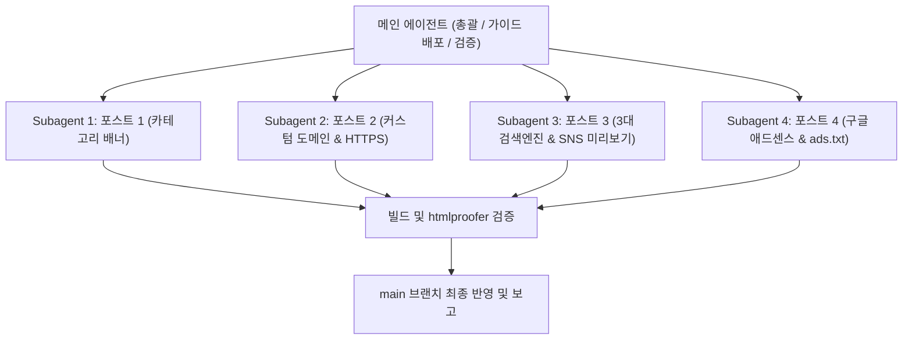

# 📝 Jekyll 블로그 4대 튜토리얼 연재 계획서 (plan.md)

이 문서는 **남주의 커밋로그([https://namju.kim](https://namju.kim))**의 기존 지킬 세팅기 4편에 이어, 실제 블로그에 구축된 실전 기능들을 다루는 **4개의 심화 튜토리얼 포스트**를 작성하기 위한 구체적인 실행 계획서입니다.

---

## 1. 연재 포스팅 개요 및 발행 일정

- **공통 카테고리**: `[Blog, GitHub-Pages]`
- **공통 태그**: `[Chirpy, Jekyll, GitHub-Pages]` (+ 주제별 특화 태그)
- **발행 날짜 규칙**: 기존 지킬 4편의 마지막 발행일(`2025-03-04`)로부터 **매주 1개씩(7일 간격)** 순차 발행
- **분량**: 포스트당 **약 5분 읽기 분량 (1,500 ~ 2,500자)**
- **시각 자료**: 포스트당 **실제 스크린샷 최소 2~3장 필수 배치** (`assets/images/YYYY-MM-DD/`)
- **지침 준수**: [`writing-tone.md`](file:///Users/kimnamju/Documents/GitHub/blog/writing-tone.md)의 스타일 2(튜토리얼형) 및 [`agent.md`](file:///Users/kimnamju/Documents/GitHub/blog/agent.md) 수칙 엄격 준수

---

## 2. 4대 포스트별 상세 기획

### 📄 포스트 1: 카테고리 페이지에 시리즈 배너와 설명 달기
- **파일명**: `_posts/2025-03-11-chirpy-category-banner-customize.md`
- **발행일**: `2025-03-11 12:00:00 +0900`
- **제목**: `Chirpy 카테고리 페이지에 시리즈 배너와 설명 박스 추가하기`
- **태그**: `[Chirpy, Jekyll, GitHub-Pages, Customization, Layout]`
- **이미지 폴더**: `assets/images/2025-03-11/`
- **필수 스크린샷 (2~3장)**:
  1. 카테고리 페이지 상단 썸네일과 설명 박스 렌더링 화면
  2. `_data/tags/*.yaml` 메타데이터 파일 구조 화면
  3. 모바일 뷰 반응형 렌더링 화면
- **공식 레퍼런스**: Jekyll Data Files & Layouts 공식 매뉴얼
- **목차 구성**:
  1. 서두: 단순 글 목록을 넘어 주제별 허브로 카테고리 확장하기
  2. 아이디어: `_data/tags/`에 카테고리별 썸네일/설명 메타데이터 정의
  3. YAML 데이터 파일 구조 설계 (`name`, `link`, `thumbnail`, `description`)
  4. `_layouts/category.html` 템플릿 커스터마이징 (Liquid 문법)
  5. 스타일링 및 렌더링 결과 확인 (스크린샷)
  6. 정리 및 유의사항

---

### 📄 포스트 2: GitHub Pages에 커스텀 도메인(namju.kim) 연결 & HTTPS 적용
- **파일명**: `_posts/2025-03-18-github-pages-custom-domain-https.md`
- **발행일**: `2025-03-18 12:00:00 +0900`
- **제목**: `github.io 대신 나만의 커스텀 도메인(namju.kim) 연결하고 HTTPS 적용하기`
- **태그**: `[GitHub-Pages, Domain, DNS, HTTPS, SSL]`
- **이미지 폴더**: `assets/images/2025-03-18/`
- **필수 스크린샷 (2~3장)**:
  1. DNS 제공업체(A 레코드 및 CNAME) 레코드 등록 설정 화면
  2. GitHub Repository Settings > Pages의 Custom domain 및 Enforce HTTPS 체크 화면
  3. 브라우저 주소창에서 `namju.kim` HTTPS 자물쇠 정상 인증 화면
- **공식 레퍼런스**: GitHub Pages 공식 문서 (Managing a custom domain)
- **목차 구성**:
  1. 서두: 왜 기본 github.io 대신 독립 도메인을 연결하는가?
  2. 도메인 구매 및 DNS 레코드 구성 (GitHub A 레코드 4개 IP, www CNAME)
  3. GitHub Pages 설정에서 Custom Domain 등록 및 `CNAME` 파일의 역할
  4. Let's Encrypt 기반 무료 SSL 인증서와 Enforce HTTPS 활성화
  5. `_config.yml`의 `url` 설정 동기화
  6. 접속 확인 및 리다이렉트 검증 (스크린샷)

---

### 📄 포스트 3: 구글부터 네이버/Bing까지: 3대 검색엔진 SEO & SNS 썸네일 카드 완성
- **파일명**: `_posts/2025-03-25-jekyll-seo-search-consoles-social-preview.md`
- **발행일**: `2025-03-25 12:00:00 +0900`
- **제목**: `기술 블로그 검색 노출 100% 공략: 네이버·구글·Bing 3대 포털 등록과 SNS 공유 카드 세팅`
- **태그**: `[SEO, Google-Search-Console, Naver-Search-Advisor, OpenGraph, Sitemap]`
- **이미지 폴더**: `assets/images/2025-03-25/`
- **필수 스크린샷 (2~3장)**:
  1. 네이버 서치어드바이저 및 구글 서치 콘솔 소유권 확인 완료 화면
  2. `sitemap.xml` 및 `robots.txt` 수집 상태 화면
  3. 카카오톡/슬랙/페이스북 링크 공유 시 대형 썸네일(`og:image`) 정상 출력 카드 화면
- **공식 레퍼런스**: Google Search Central, 네이버 서치어드바이저 가이드, OpenGraph 프로토콜
- **목차 구성**:
  1. 서두: 열심히 쓴 개발 글, 검색 포털에 100% 노출시키기
  2. 구글 서치 콘솔 & Bing 웹마스터 도구 등록 (`_config.yml`)
  3. 네이버 서치어드바이저 등록과 `_includes/metadata-hook.html` 클린 주입법
  4. 사이트맵(`sitemap.xml`)과 `robots.txt` 충돌 없이 세팅하기
  5. 카카오톡/슬랙 링크 공유 시 썸네일이 안 나오는 문제 해결: `social_preview_image`
  6. 실제 검색 엔진 수집 및 소셜 미리보기 검증 (스크린샷)

---

### 📄 포스트 4: Chirpy 블로그에 구글 애드센스 연동 및 ads.txt 세팅 가이드
- **파일명**: `_posts/2025-04-01-jekyll-chirpy-google-adsense-setup.md`
- **발행일**: `2025-04-01 12:00:00 +0900`
- **제목**: `개발자 정적 블로그에 구글 애드센스 승인받고 ads.txt 깔끔하게 연동하기`
- **태그**: `[Google-AdSense, AdSense, Monetization, ads.txt]`
- **이미지 폴더**: `assets/images/2025-04-01/`
- **필수 스크린샷 (2~3장)**:
  1. 구글 애드센스 사이트 관리 화면에서 '준비됨/승인' 상태 화면
  2. 브라우저에서 `https://namju.kim/ads.txt` 접근 시 정상 노출 화면
  3. `metadata-hook.html`에 삽입된 스크립트 코드 및 광고 렌더링 화면
- **공식 레퍼런스**: Google AdSense 공식 고객센터 (ads.txt 가이드)
- **목차 구성**:
  1. 서두: 정적 블로그 운영의 작은 동기부여, 구글 애드센스
  2. 애드센스 심사 신청 및 스크립트 발급
  3. Chirpy 테마 코어를 해치지 않는 `_includes/metadata-hook.html` 스크립트 주입
  4. 루트 경로 `ads.txt` 생성과 배포 설정 (크롤링 경고 사전 차단)
  5. 승인 심사 통과를 위한 팁 (콘텐츠 품질, 카테고리 구성 등)
  6. 최종 광고 게재 및 동작 검증 (스크린샷)

---

## 3. 서브에이전트 병렬 작업 분업 계획

작업의 효율성과 속도를 극대화하기 위해, 4개 포스트를 서브에이전트에게 각각 1편씩 전담시켜 동시 병렬 작성합니다.

### 각 서브에이전트 행동 수칙
1. 담당하는 포스트 마크다운 파일 1개만 생성하여 충돌 방지
2. 필요한 이미지 파일들을 `assets/images/YYYY-MM-DD/`에 생성 및 배치
3. `writing-tone.md`와 `agent.md`의 문체, 분량(1,500~2,500자), 복붙 가능한 코드, 스크린샷 2~3장 규칙을 완벽 준수
4. 완료 후 메인 에이전트에게 결과 보고
