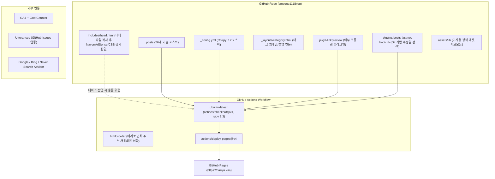
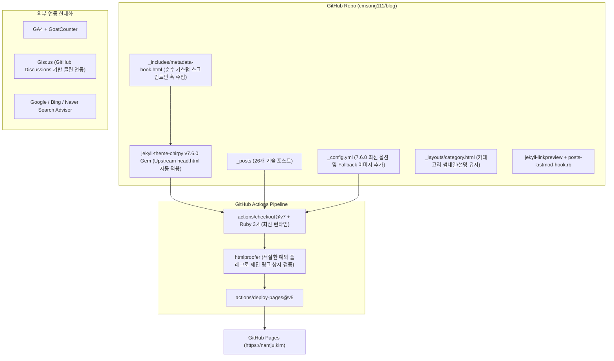

# 남주의 커밋로그 블로그 아키텍처 진단 및 1년 주기 유지보수 업데이트 계획서

- **작성일**: 2026-10-04
- **대상 레포지토리**: [cmsong111/blog](https://github.com/cmsong111/blog)
- **현재 기반 버전**: Jekyll 4.3.x + `jekyll-theme-chirpy` v7.2.4 + Ruby 3.3
- **목표 기반 버전**: Jekyll 4.3.x + `jekyll-theme-chirpy` v7.6.0 + Ruby 3.4

---

## 1. 개요 및 아키텍처 진단 결과

해당 블로그는 2025년 상반기 `chirpy-starter`를 기반으로 구축된 이후 약 1년여 동안 안정적으로 운영되어 왔습니다. 현재까지 총 26개의 기술 포스트가 발행되었으며, OpenGraph 링크 미리보기(`jekyll-linkpreview`), 네이버/구글 서치 콘솔 연동, 애드센스, Utterances 댓글 시스템, GoatCounter 및 GA4 통계 수집 등이 적용되어 있습니다.

그러나 1년 동안 상위 upstream 테마 및 GitHub Actions 생태계가 지속적으로 업데이트되면서 다음과 같은 기술 부채 및 개선 과제가 확인되었습니다.

### 주요 진단 내용 요약

| 점검 영역 | 현재 상태 (As-Is) | 개선 목표 (To-Be) | 심각도 |
| :--- | :--- | :--- | :---: |
| **테마 버전** | `jekyll-theme-chirpy` v7.2.4 | 최신 v7.6.0 업그레이드 | **높음** |
| **템플릿 결합도** | `_includes/head.html` 전체 파일 오버라이드 | 테마 공식 확장점인 `_includes/metadata-hook.html`로 전환 및 `head.html` 제거 | **높음** |
| **CI/CD 파이프라인** | Actions v3/v4 사용, `htmlproofer` 테스트 주석 처리됨 | 최신 Actions (checkout@v7, pages@v6 등), Ruby 3.4, `htmlproofer` 안전 플래그 복구 | **중간** |
| **불필요한 서브모듈** | `.gitmodules`에 미사용 `assets/lib` 등록됨 | 미사용 submodule 및 빈 디렉토리 정리 | **낮음** |
| **SEO & 메타데이터** | 기본 `social_preview_image` 부재, Twitter 핸들에 실명 등록 | 기본 SNS 공유 대표 이미지 설정, Twitter 메타데이터 정정 | **중간** |
| **댓글 시스템** | Utterances (GitHub Issue 방식) | Giscus (GitHub Discussions 방식) 전환 검토 | **낮음** |
| **정적 자산 최적화** | 수백 KB~MB 단위 원본 PNG 이미지 다수 존재 | WebP 포맷 전환 및 이미지 용량 최적화 가이드 수립 | **중간** |
| **개발 환경 (Dev Container)** | `jekyll:2-bullseye` 이미지(Debian 11 LTS 종료), Ruby 버전이 CI와 다를 수 있음, `bundle install` 자동화 없음 | `2-bookworm` 이미지, Ruby 3.4 고정(CI와 일치), `post-create.sh`에 `bundle install` 추가 | **중간** |

---

## 2. 아키텍처 구조 비교

### 2.1 현재 아키텍처 (As-Is)



### 2.2 개선 목표 아키텍처 (To-Be)



---

## 3. 핵심 개선 영역별 상세 가이드

### 영역 1: 템플릿 디커플링 (핵심 아키텍처 개선)

#### 문제점
현재 [`_includes/head.html`](file:///Users/kimnamju/Documents/GitHub/blog/_includes/head.html)이 로컬에 복사되어 있습니다. 이 안에 네이버 사이트 검증 메타태그, 구글 애드센스 스크립트, `linkpreview.css`가 하드코딩되어 있습니다. Chirpy 테마가 v7.2에서 v7.6으로 올라가면서 Head 내부의 스타일 로딩 방식, 프리로드 힌트, Favicon 스펙 등이 업데이트되었으나, 로컬 `head.html`이 상위 테마를 완전히 가려버려(Shadowing) 최신 기능이 누락되고 잠재적 버그를 유발합니다.

#### 해결 방안
Chirpy 테마는 기본적으로 `<head>` 태그 닫히기 직전에 ``를 호출하도록 설계되어 있습니다.
1. [`_includes/metadata-hook.html`](file:///Users/kimnamju/Documents/GitHub/blog/_includes/metadata-hook.html) 파일을 새로 생성하고 커스텀 태그들만 모아 넣습니다.
2. 로컬의 [`_includes/head.html`](file:///Users/kimnamju/Documents/GitHub/blog/_includes/head.html)을 삭제하여 Chirpy 최신 코어를 그대로 상속받도록 복원합니다.

**새로 생성할 `_includes/metadata-hook.html` 내용 예시:**
```html
<!-- Custom Metadata & Integrations -->
<meta name="naver-site-verification" content="858f23c87778195f1b40e45846a75a7f99cb6371">
<link rel="stylesheet" href="{{ '/assets/css/linkpreview.css' | relative_url }}">

<!-- Google AdSense -->
<script
  async
  src="https://pagead2.googlesyndication.com/pagead/js/adsbygoogle.js?client=ca-pub-9883771255224638"
  crossorigin="anonymous"
></script>
```

---

### 영역 2: 의존성 및 젬(Gem) 업그레이드

#### 주요 변경 대상
1. [`Gemfile`](file:///Users/kimnamju/Documents/GitHub/blog/Gemfile):
   - `gem "jekyll-theme-chirpy", "~> 7.2", ">= 7.2.4"` ➔ `gem "jekyll-theme-chirpy", "~> 7.6"`
   - 플랫폼 선언부 최신화 (`platforms :windows, :jruby do ...`)
2. `jekyll-linkpreview` 호환성:
   - Ruby 3.4 환경에서도 정상 구동 확인

**수정될 `Gemfile` 제안:**
```ruby
# frozen_string_literal: true

source "https://rubygems.org"

gem "jekyll-theme-chirpy", "~> 7.6"

gem "html-proofer", "~> 5.0", group: :test

platforms :windows, :jruby do
  gem "tzinfo", ">= 1", "< 3"
  gem "tzinfo-data"
end

gem "wdm", "~> 0.2.0", :platforms => [:windows]

group :jekyll_plugins do
  gem "jekyll-linkpreview"
end
```

---

### 영역 3: CI/CD 배포 파이프라인 현대화

#### 문제점
1. [`.github/workflows/pages-deploy.yml`](file:///Users/kimnamju/Documents/GitHub/blog/.github/workflows/pages-deploy.yml)에서 구버전 액션들(`checkout@v4`, `configure-pages@v4`, `upload-pages-artifact@v3`, `deploy-pages@v4`)이 사용되고 있습니다.
2. Ruby 버전이 `3.3`에 머물러 있습니다.
3. 2025년 3월에 `htmlproofer` 실행 중 빌드 실패가 발생하여 테스트 스텝 전체가 주석 처리되어 있습니다. 이로 인해 마크다운 내의 깨진 이미지 경로, 잘못된 상대 경로 링크가 사전 감지되지 않고 배포되는 위험이 있습니다.

#### 해결 방안
1. GitHub Actions 및 Ruby 최신화:
   - `actions/checkout@v7`
   - `actions/configure-pages@v6`
   - `ruby-version: 3.4`
   - `actions/upload-pages-artifact@v5`
   - `actions/deploy-pages@v5`
2. `htmlproofer` 재활성화 및 안정화 플래그 지정:
   - 외부 링크 검사 비활성화 (`--disable-external`)
   - 로컬 테스트 및 내부 특수 URL 예외 처리
   - 필요 시 프루퍼 검증 옵션을 정교하게 조정하여 빌드 안정성 확보

**수정될 `.github/workflows/pages-deploy.yml` 제안:**
```yaml
name: "Build and Deploy"
on:
  push:
    branches:
      - main
      - master
    paths-ignore:
      - .gitignore
      - README.md
      - LICENSE
      - plan.md

  workflow_dispatch:

permissions:
  contents: read
  pages: write
  id-token: write

concurrency:
  group: "pages"
  cancel-in-progress: true

jobs:
  build:
    runs-on: ubuntu-latest

    steps:
      - name: Checkout
        uses: actions/checkout@v7
        with:
          fetch-depth: 0

      - name: Setup Pages
        id: pages
        uses: actions/configure-pages@v6

      - name: Setup Ruby
        uses: ruby/setup-ruby@v1
        with:
          ruby-version: 3.4
          bundler-cache: true

      - name: Build site
        run: bundle exec jekyll b -d "_site${{ steps.pages.outputs.base_path }}"
        env:
          JEKYLL_ENV: "production"

      - name: Test site
        run: |
          bundle exec htmlproofer _site \
            --disable-external \
            --ignore-urls "/^http:\/\/127.0.0.1/,/^http:\/\/0.0.0.0/,/^http:\/\/localhost/"

      - name: Upload site artifact
        uses: actions/upload-pages-artifact@v5
        with:
          path: "_site${{ steps.pages.outputs.base_path }}"

  deploy:
    environment:
      name: github-pages
      url: ${{ steps.deployment.outputs.page_url }}
    runs-on: ubuntu-latest
    needs: build
    steps:
      - name: Deploy to GitHub Pages
        id: deployment
        uses: actions/deploy-pages@v5
```

---

### 영역 4: 사이트 설정(`_config.yml`) 동기화 및 SEO 고도화

#### 점검 사항
1. **SNS 공유 기본 대표 썸네일 (`social_preview_image`)**:
   - 현재 값이 비어 있어 개별 포스트에 `image:` front matter가 없으면 SNS(카카오톡, 슬랙, 페이스북 등) 공유 시 텍스트만 노출됩니다.
   - 사이트 대표 썸네일(예: 로고 또는 브랜딩 이미지)을 등록하는 것을 권장합니다.
2. **Twitter 메타태그 정정**:
   - `twitter: username: 김남주` ➔ 실명이 아닌 실제 Twitter/X 계정 핸들이거나, 미사용 시 비워두어야 트위터 카드 파서의 오류를 방지할 수 있습니다.
3. **Chirpy v7.6 신규 설정 옵션 추가**:
   - `actions.edit_post` 설정 (깃허브 웹에서 바로 포스트를 수정할 수 있는 링크 버튼 옵션)
   - `social.fediverse_handle` 필드
   - `exclude` 패턴 개선 (`rollup.config.js` ➔ `"*.config.js"`)
4. **댓글 시스템 현대화 (Utterances ➔ Giscus 권장)**:
   - Utterances는 GitHub Issues 탭을 댓글 저장소로 쓰기 때문에 프로젝트 이슈 관리가 번잡해집니다.
   - Giscus는 GitHub Discussions를 사용하므로 카테고리 분리, 스레드형 답글, 다양한 이모지 리액션이 지원됩니다. Chirpy는 `comments.provider: giscus`로 즉시 전환할 수 있습니다.

---

### 영역 5: 미사용 더미 자산 및 파일 정리

#### 점검 사항
1. [`.gitmodules`](file:///Users/kimnamju/Documents/GitHub/blog/.gitmodules) 및 [`assets/lib`](file:///Users/kimnamju/Documents/GitHub/blog/assets/lib):
   - Chirpy는 CDN 모드(`assets.self_host.enabled: false`)를 기본으로 사용하고 있으며, 워크플로우에서도 submodule checkout이 주석 처리되어 있습니다.
   - 따라서 실제로는 아무 기능도 하지 않는 `assets/lib` 서브모듈을 제거하여 저장소 구조를 간결하게 유지합니다.

---

### 영역 6: 정적 자산(이미지) 용량 및 웹 성능 최적화

#### 점검 사항
- [`assets/images/`](file:///Users/kimnamju/Documents/GitHub/blog/assets/images/) 폴더 내에 700~800KB 이상의 무압축 PNG 스크린샷들이 존재합니다.
- 정적 사이트 특성상 이미지 용량이 클수록 초기 LCP(Largest Contentful Paint) 성능 점수와 모바일 네트워크 사용자 경험에 악영향을 미칩니다.
- **개선 권장안**:
  - 기존 대용량 스크린샷들을 `tinypng`, `squoosh` 또는 CLI 도구를 통해 WebP 포맷 또는 압축 PNG로 최적화.
  - 향후 작성 포스트에는 150KB 이하 권장 가이드라인 적용.

---

### 영역 7: 개발 환경(Dev Container) 현대화

> [!NOTE]
> 개발은 Dev Container에서만 진행하므로 호스트(macOS) Ruby 버전(시스템 기본 2.6)은 신경 쓰지 않습니다. **`.devcontainer/` 파일만 수정**합니다.

#### 점검 사항
- [`.devcontainer/devcontainer.json`](file:///Users/kimnamju/Documents/GitHub/blog/.devcontainer/devcontainer.json)의 기반 이미지가 `mcr.microsoft.com/devcontainers/jekyll:2-bullseye`입니다.
  - Debian 11(Bullseye)은 LTS 지원이 2026년 8월에 끝났습니다. 보안 패치를 받으려면 `bookworm`으로 올리는 게 좋습니다.
  - 이미지에 들어 있는 Ruby 버전이 CI(Ruby 3.4)와 다를 수 있습니다. 그러면 로컬에서는 빌드가 되는데 CI에서는 실패하는 일이 생길 수 있습니다.
- [`.devcontainer/post-create.sh`](file:///Users/kimnamju/Documents/GitHub/blog/.devcontainer/post-create.sh)는 `package.json`이 없는데도 npm 분기를 남겨두고 있고, `bundle install`을 하지 않습니다. 그래서 컨테이너를 만든 뒤 매번 직접 설치해야 합니다.

#### 수정안

**`.devcontainer/devcontainer.json`**
```jsonc
{
  "name": "Jekyll",
  "image": "mcr.microsoft.com/devcontainers/jekyll:2-bookworm",
  "features": {
    // CI(pages-deploy.yml)와 같은 Ruby 버전으로 고정
    "ghcr.io/devcontainers/features/ruby:1": { "version": "3.4" }
  },
  "forwardPorts": [4000, 35729],
  "onCreateCommand": "git config --global --add safe.directory ${containerWorkspaceFolder}",
  "postCreateCommand": "bash .devcontainer/post-create.sh",
  "customizations": {
    "vscode": {
      "settings": {
        "terminal.integrated.defaultProfile.linux": "zsh"
      },
      "extensions": [
        // (기존 확장 목록 유지)
      ]
    }
  }
}
```

**`.devcontainer/post-create.sh`** (추가할 부분)
```bash
# Install gems so `bash tools/run.sh` works right after container creation
bundle install
```

#### 검증
- 컨테이너를 다시 빌드한 뒤(`Dev Containers: Rebuild Container`) `ruby -v`가 3.4.x인지 확인합니다.
- `bash tools/run.sh`로 `http://127.0.0.1:4000` 미리보기와 라이브 리로드가 되는지 확인합니다.

> [!WARNING]
> `jekyll:2-bookworm` 태그와 ruby feature 3.4가 서로 잘 맞는지는 아직 직접 확인하지 않았습니다. 적용할 때 컨테이너를 다시 빌드해서 확인해야 합니다. 이미지에 이미 Ruby 3.4가 들어 있다면 `features` 블록은 빼도 됩니다.

---

## 4. 단계별 실행 로드맵 (Action Items)


### Phase 1: 구조 정리 및 템플릿 디커플링
- [ ] `_includes/metadata-hook.html` 생성 (Naver Verification, Google AdSense, LinkPreview CSS 배치)
- [ ] `_includes/head.html` 파일 삭제 (Chirpy 코어 복원)
- [ ] 더미 서브모듈 `assets/lib` 및 `.gitmodules` 정리
- [ ] `plan.md`를 `_config.yml`의 `exclude` 목록에 추가

### Phase 2: 의존성 및 사이트 설정 업데이트
- [ ] `Gemfile` 내 `jekyll-theme-chirpy`를 `~> 7.6`으로 업데이트
- [ ] `_config.yml` 최신 항목 동기화 (`actions.edit_post`, `exclude`, `twitter.username` 정정)
- [ ] 대표 소셜 미리보기 이미지(`social_preview_image`) 지정

### Phase 3: CI/CD 파이프라인 & 개발 환경 현대화
- [ ] `.github/workflows/pages-deploy.yml` 액션 버전 및 Ruby 3.4 업데이트
- [ ] `htmlproofer` 검증 단계 재활성화 및 예외 URL 플래그 점검
- [ ] `.devcontainer/devcontainer.json` 이미지를 `2-bookworm`으로 변경 + Ruby 3.4 고정 + 포트 포워딩 추가
- [ ] `.devcontainer/post-create.sh`에 `bundle install` 추가

### Phase 4: 테스트 검증 및 배포
- [ ] Dev Container 재빌드 후 컨테이너 안에서 `ruby -v`(3.4.x) 확인, `bundle exec jekyll build` 및 `bash tools/run.sh` 테스트
- [ ] GitHub 푸시 후 GitHub Actions 배포 상태 확인
- [ ] 실제 사이트([https://namju.kim](https://namju.kim)) UI, 네이버 서치어드바이저 태그, 구글 애드센스, 링크 미리보기 정상 동작 검증

---

## 5. 검증 및 롤백(Rollback) 대책

1. **사전 브랜치 작업**:
   - 모든 업데이트 작업은 `maintenance/2026-upgrade` 별도 브랜치를 생성하여 진행하고, GitHub Actions 테스트가 완벽히 통과한 후 `main`에 병합합니다.
2. **롤백 계획**:
   - 문제 발생 시 `main` 브랜치의 이전 커밋(`34a46725cb5` - 2025-11-03)으로 언제든지 `git revert` 가능하도록 커밋 단위를 기능별로 분리하여 커밋합니다.
3. **핵심 확인 항목**:
   - [ ] 블로그 메인 화면 및 다크/라이트 모드 토글
   - [ ] 각 포스트별 링크 미리보기(Notion-like bookmark) 정상 렌더링
   - [ ] 우측 TOC 네비게이션이 접히지 않고 계속 노출되는지 여부
   - [ ] 카테고리 탭에서 커스텀 태그 배너 및 포스트 목록 노출 여부
   - [ ] Google Search Console / Naver Search Advisor 소유권 확인 태그 유지 여부
